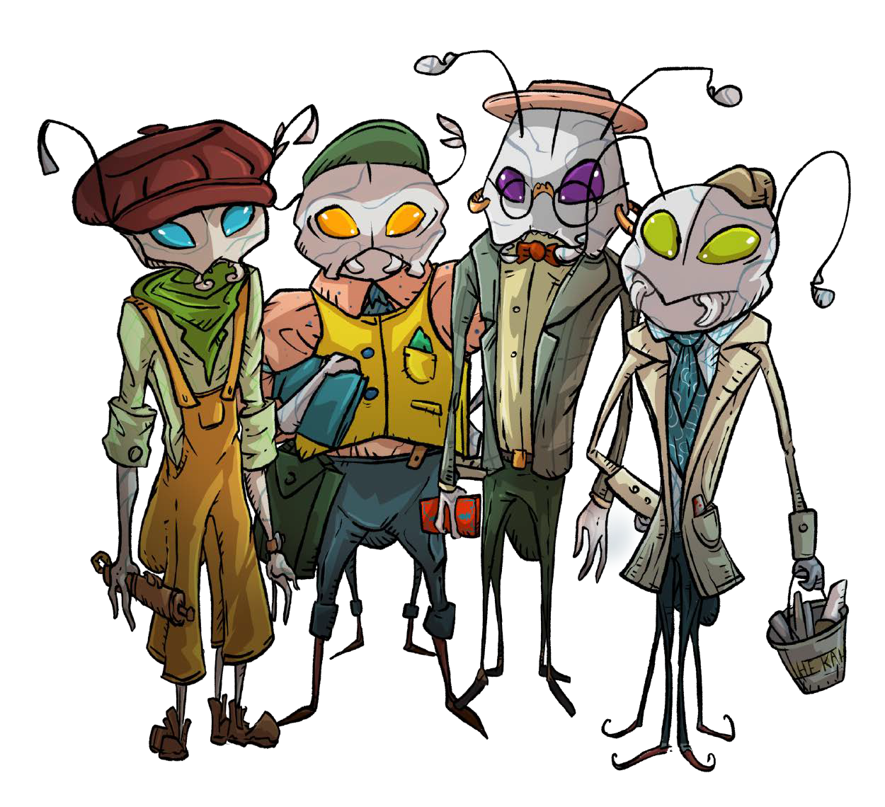

## 

## Море

*По людским меркам эти сладковатые и беспросветно фиалковые воды были всегда. Ещё до того, как народ хумт начал строить свои костяные башни и абсолютные зиккураты, до того, как титаны-асбы породили первых ва'ро, до того, как пал последний шедж и был утрачен Хатум, до Совета Четырёх, до расцвета Багряной Империи и её распада – море уже было здесь и пело свои бесконечные песни.*

*И в наши вахты оно почти такое же, как прежде. Несмотря на коросту гиблых вод и зловещие остовы ржавых кладбищ, несмотря на разрушение Шпиля, несмотря на орды искажённых порождений плодилищ, море всё ещё с нами и всё так же поёт нам во тьме. – А. О., личные записки, ок. 2 пп.*

Укрытое море или Веа Туароа, как оно называется на общем торговом наречии, Базе – это лишённый какого-либо естественного света и наполненный текучей, плотной, тяжёлой, опалесцирующей, то ли дымкой, то ли жижицей бассейн. Который становится плотнее, пурпурней и горячее там, в глубинах. И который, согласно легендам был некогда укрыт от конца мира внутри тела умирающей гигантихи, жертвенной и благородной возлюбленной моря – Веа Туатахи.

Пределы Веа Туароа неведомы никому, так как ещё никто, пытавшийся плыть вдаль от населённых земель, не видел там, во Внешней мгле, чего-либо кроме бесконечных туманных просторов.

Странствующие по волнам этого моря не знают привычных нам севера, юга, востока и запада, в силу чего вынуждены передвигаться на основе огней маячной трассы, чудных приборов и формул народа Ольм, указующих идольцев народа Кансе или экстраординарного чутья лоцманок из народа ва'ро.

## Люди

Известные области Моря населены тремя различающимися народами:

- белёсыми и испещрёнными сеткой прожилок олъмцами – приземлёнными искателями выгод и союзов, мастерами механизмов;

- тёмными, как смоль, и красноглазыми ва'ро – союзниками и соседями олъмцев, только-только задумавшимися про отход от родоплеменного строя;

- смуглыми и синеглазыми кансе – фанатичными завоевателями, недавно проигравшими великую войну и усомнившимися в своих сверкающих богах.

При этом социографически просторы Веа Туароа можно поделить на несколько разнородных частей.

- Хорошо обжитый регион Олъмского союза – Олъм Нде и примыкающие к нему Территории Ва'ро Рохе.

- Пять крупных государственных образований – Кансе Ткути, возникших на месте распавшегося единого Великого Кераджа народа кансе.

- Обширные, слабо картографированные и обезлюдевшие во время Войны, просторы между первыми двумя областями, так называемый Внутренний фронтир, скрывающий множество руин укреплений, брошенных и вновь оживающих колоний, убежищ изгоев и извергов, следов древних царств и подобного.

- И, наконец, Внешняя мгла – полные стелющегося тумана и мало кому известные места, на которые можно наткнуться, если плыть от обжитых земель и торных маршрутов наружу, в бесконечную тьму.

Основным, повсеместно известным торговым языком в первом регионе служит упрощённое и обобщенное наречие ва'ро – т.н. баз – с вкраплениями оборотов и терминов, позаимствованных из олъмского.

Кансе ткути, при этом, единоязыко – синеглазый народ, в массе своей, не считает нужным осваивать чуждые наречия. Однако немало торговцев тех вод всё же владеют основами база, пусть и вынужденно.

Ну а во Внутреннем фронтире и Внешней мгле, там, где их населяет хоть кто-нибудь, говорят на всех языках одновременно, активно формируя пучки пиджинов при каждом удобном случае.

### Олъм

Олъмцы, или же «мраморные», названные так за свои странно бледные и узорчатые тела, пришли на бессолнечные берега четыре сотни приливов назад. Деловитые, приземлённые и практичные, они быстро прославились как мастера переговоров, а также особым подходом к жизни под названием «хокке» – своей философией и религией одновременно.

Они взрослеют и становятся полноправными членами общества к 17‒20, а их средний срок жизни составляет от 63 до 80 приливов.

Населённые ими десятки островов составляют федеративный Олъмский союз (Олъм Нде), опекаемый достопочтенной царствующей бренхи. Под её же патронажем олъмцы принесли на просторы моря доселе невиданные способы преобразования материи – промышленную алхимию, в которой за прошедшие приливы достигли величайшего мастерства.

> По звучанию олъмское наречие похоже на уэлш, а их повседневная культура больше всего напоминает идеализированную версию Альбиона начала XX столетия. Узнать больше об олъмцах вы можете на стр. XX.

### Ва'ро

Темнолицые и красноглазые ва'ро, которых олъмцы часто называют «базальтовыми», относят себя к самому древнему из ныне живущих разумных обитателей Веа Туароа. Некогда широко распространённые по всему морскому пространству, в текущий период базальтовые скучились на своих территориях, которые считают священными землями, защищёнными от синеглазых захватчиков древними конату-тапу – ритуальными камнями, требующими регулярных кровавых подношений. Возможно, ритуалы и камни действительно работают, а возможно кансе не взяли оставшиеся земли ва'ро только потому, что эти испещрённые гейзерами, расселинами и пульсирующими натёками осколки, по большей части бесплодного, камня были слишком далеко. Однако даже сильно сократившиеся в численности, ва'ро сильно влияют на культуру соседей-олъмцев, а через них и на современную культуру кансе.

Женщины ва'ро достигают формальной самостоятельности к 15, а немногочисленные и тщательно оберегаемые мужчины – к 25. Средний срок жизни и тех, и других составляет от 50 до 55 приливов. И только их главы родов, плодящие «матроны», способны прожить в пять раз больше своих соотечественниц и соотечественников.

> Создавая ва'ро, мы брали за основу культуры людей Полинезии и народа маори, однако таких маори, которые здесь в недавнем прошлом смогли создать собственную (островную) империю, подобную Римской, и только по случайности не остались центральной движущей силой исторического процесса. Узнать больше о ва'ро вы можете на стр. XX.

### Кансе

Самые молодые по меркам Веа Туароа – и самые пышущие жизнью из всех. Всего девяносто два <u>прилива</u> назад они спустились по ныне разрушенному титаническому Костяному шпилю к тёмным просторам у его подножия. Кансе (так же кое-где называемые «бронзовыми») принесли на острова и архипелаги моря веру во всегда юных и бесконечно прекрасных металлических богов, эмиссаром, наследником и возлюбленным дитя которых считает себя почти каждый из кансе. И вера эта была безжалостна к иным народам, так как согласно священным скрижалям-кандам, инородцы могут быть лишь скотом для истинных детей божеских.

Оказавшись здесь, внизу, кансейцы немедленно приступили к неторопливой вооружённой экспансии. Затем была Война (см. стр. XX), победоносная в начале, изматывающая впоследствии, а затем внезапно уничтожившая их столицу вместе со множеством священных реликвий, пошатнувшая их веру в себя, приведшая к краху, безвластию, бунту и гражданской войне. Сейчас их конфедерация раскинулась на пяти осколках былого величия – пяти т.н. вилаях разной степени развитости и благополучия, формально демократических, но управляемых, де-факто, союзом нескольких сверхбогатых семейств.

Кансе достигают зрелости к 15-му приливу своей жизни и угасают в 30-35, что делает их самым интенсивно живущим из всех народов моря, за исключением разве-что пролов (см. далее).

> Культура кансе была написана и развивается нами как гремучая смесь дизельпанковых Великих Моголов и средневековой Индонезии на стероидах. Узнать больше о кансе вы можете на стр. XX.

### Пролы

Пролов, вообще говоря, не принято называть отдельным народом, хотя и их популяция многочисленна. Возможно, пролов в Олъм Нде и Ва'ро Рохе даже больше, чем их ближайших родственников – олъмцев, у которых эти крохи выполняют роль приживал и низкоквалифицированных работников, а также очень исполнительных матросов торгового и военного флота.

Пролы плодятся во множестве и живут очень недолго – мало кто из них способен разменять более семи приливов. Будучи «вечными детьми», пролы словно самой природой обречены на эксплуатацию. Они внушаемы и забывчивы, добродушны и игривы, покорны и исполнительны. Сами по себе они не жестоки, но малая самостоятельность и внушаемость позволяют им бездумно следовать даже самым безжалостным приказам.

> На создание пролов нас вдохновили хатифнатты из творчества Туве Янсон, миньоны из мультфильма «Гадкий Я» и, конечно же, домовые эльфы из саги о Гарри Поттере. Узнать больше о пролах вы можете на стр. XX.

## Война

Одни говорят, что начало войны стало неожиданностью для всех её участников. Другие – что она была неизбежна и предсказуема. И только одно можно сказать наверняка: Великая Война при всей стремительности первых схваток не стала быстротечной.

Двадцать два прилива флоты Олъма и Кераджа снова и снова рвали друг друга на усеянных обломками от предыдущих сражений волнах. История этой войны знала и кровавую радость внезапных набегов, и расстрел бегущих в спину, и одновременную гибель множества людей в уходящих на дно гробах корабельных корпусов, и многомесячные, сводящие с ума дежурства в огромных плавучих цитаделях. В ней каждая из сражающихся сторон проявила чудеса отваги и предательства, выдающееся милосердие и предельную жестокость, непреодолимый страх смерти и стремление любой ценой увековечить себя в подвигах.

Когда-нибудь, когда мы наконец сможем отпустить погибших и наша память станет только памятью, а не мучительным зазубренным осколком под сердцем, кто-нибудь напишет правдивую историю того, как эта Война началась и чем продолжилась. Пока что всё это вызывает слишком много вопросов. Но одно о Войне мы знаем точно: мы знаем, что положило ей конец.

Однажды, через двадцать два прилива, двести семьдесят пять вахт и три склянки после первого сражения, над просторами Веа Туароа разнёсся грохот такой силы, что его смогли услышать даже Адепты безмолвия в своих глубинных альковах. Вспышка нестерпимо яркого света на мгновение осветила гладь вод, а затем, для кого-то раньше, а для кого-то позже, на острова и архипелаги пришла опустошительная Волна.

Как нам говорили потом ольмские газеты, *то было необходимо*. Нужно было закончить Войну раз и навсегда. Закончить её максимально эффективно и жёстко, чтобы предотвратить любые последующие войны. Чтобы она стала последней войной, после которой не будет никаких других войн. Что ж, обрушение Костяного шпиля, а вместе с тем и уничтожение кансейской столицы действительно остановило войну. В бездну вод канули и большая часть непобедимого Сияющего флота, и половина всех кансе, и неисчислимое множество других жертв Волны, ещё долго гулявшей по тому, что мы сейчас называем Внутренним фронтиром. На этом война закончилась, а все те, что чудом избежали уничтожения, продолжили жить.

## Послевоенные реалии

Актуальный для ваших героев момент – так называемая Эпоха Благословенного прилива, когда народы моря наконец выкарабкались из послевоенных экономических трудностей. Для большинства из выживших Благословенный прилив как минимум на страницах газет выглядит светлым проблеском оптимистичного будущего. Технологии развиваются и улучшают повседневность. Торговля крепит международные связи. Прогрессивные методы сельского хозяйства и промышленности способны обеспечить достатком всё большее количество людей. Налажена надёжная транспортная и телеграфная связь между всеми тремя столицами – Олъмом, Н'те Поа и Салайфом. Морской бандитизм по большей части обуздан и изолирован в глубинах Внутреннего фронтира. Повторно заселяются и оживают опустошённые войной острова. Однако даже в это оптимистичное время неоновых ламп и жёлтого света вольфрамовых спиралей, модных радиоспектаклей, звукового синематографа и джезз-бэндов есть вещи, на которые многим пережившим Войну хочется закрыть глаза.

Здоровье морских экосистем подорвано, и ситуация ухудшается с каждым приливом. Борьба за безопасные маршруты и пригодные для плодотворной эксплуатации участки суши грозится приобрести более острые формы уже в ближайшее время. Демография народов моря только-только начинает выправляться. На 8/10 уничтоженные войной ва'ро в кулуарах обсуждают проблему «поколения потерянных дочерей» – вернувшихся с войны соотечественниц, не желающих учитывать интересы общества и предающихся гедонизму. Аналогичные процессы можно наблюдать и у менее пострадавших олъмцев, где многие ветераны затаили обиду на государственные институты и часто склонны к асоциальному образу жизни.

Многие неформальные объединения достигли той точки, где начинают претендовать на государственность и вес на международной арене. Как, например, либертарные пираты и контрабандисты порта Костегрыз (стр. XX) или ветераны Великой войны в «раю изгнанников» – Сурга Луар (стр. XX). Уставшие от войны и скученности городов люди расселяются по Внутреннему фронтиру, повторно колонизируя ранее опустошённые острова и образуя союзы, в том числе внегосударственные. Но и там, зачастую, находят только изнурительный труд, полуголодное существование и постоянный страх оказаться мишенью каких-нибудь бандитов.

Наконец, даже основа оптимистичной послевоенной реальности – рынок товаров и услуг – нельзя назвать такой уж надёжной вещью. Его колебания непредсказуемы, а динамика и тенденции неочевидны даже для опытных торговцев. Пытаясь объяснить происходящее, люди придумывают байки одну чуднее другой. Большинство их, впрочем, сводится к заговорам различных тайных сил, якобы управляющих вообще всем, что происходит вокруг.
