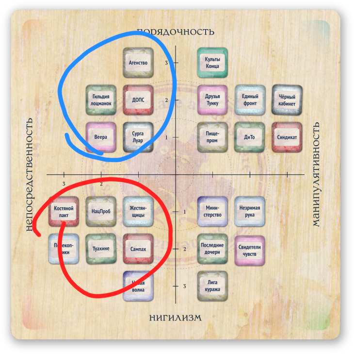

*Этот раздел во многом основан на статье «Драмафабрикаты, ч.1: заданный конфликт» \<https://pnprpg.ru/2024/01/dramapreps-p1/\> от Алисы Раченко, честь ей и (произносится на сърпский манер) хвала.*

Судя по отзывам, некоторые ведущие испытывают сложности при использовании «заданных конфликтов» наших портов и гаваней. Так что мы решили дать здесь несложную процедуру их развёртывания в драматическое полотно на случай, если таковая процедура тебе вообще нужна.

Для примера предлагаем взглянуть на конфликт п. Костегрыз (см. стр. XX).

\[ВООБЩЕ ВОТ ЭТОТ БЛОК ЛУЧШЕ СДЕЛАТЬ ИЛЛЮСТРАЦИЕЙ-ВЫРЕЗКОЙ СООТВЕТСТВУЮЩЕЙ СТРАНИЦЫ\]

**Суть:** тлеющая война уличных банд, грозящая перерасти в конфликт регионального масштаба.

**Штраф:** <u>+4 осложнения</u>.

**Приз:** силовая поддержка от выигравшей стороны для ваших операций на Фронтире.

А теперь давай попробуем это развернуть и наполнить жизнью.

### Ключевые вопросы

Для начала стоит углубить и детализировать карту конфликта, придумав ответы на вот эти, обязательные и не очень, вопросы:

- Кто здесь стороны локального конфликта?

- Чего именно они хотят добиться?

- Почему они вообще этого хотят?

- Какие методы используют?

- Что будет, если они это получат?

- Что будет, если они этого не получат?

- Как на всё это могут повлиять протагонисты?

- Что изменит конфликт в плане экономики?

- (опц.) Кто стоит во главе конфликтующих сторон?

- (опц.) В каких отношениях эти стороны с глобальными (см. стр. XX) <u>коалициями</u>?

- (опц.) Какие именные <u>персоналии</u> (стр. XX) вовлечены в этот конфликт?

- (опц.) Как будет развиваться конфликт без вмешательства протагонистов?

- (опц.) К каким известным историческим и календарным (см. стр. XX и XX) событиям этот конфликт имеет отношение?

### Примеры ответов

Нам уже известно, что в Костегрызе идёт война банд. Раз так, то нам потребуется как минимум две банды. Одной из них, что логично, будут люди хорошо известной по всему морю Расуры Цитанг (см. стр. XX).

#### Кто они?

«Рейдеры Расуры» – хорошо вооружённые прагматики, которые поняли, что шансов на успех больше, когда изгои Фронтира держатся вместе и умеют договариваться.

Вторую банду мы, к примеру, назовём «Красные ушаки». Не будем усложнять – пусть эти «Ушаки» будут разгильдяями, впечатляющими своей жестокостью даже по местным либертарным меркам.

#### Чего они хотят?

Обе банды желают быть ведущей силой Костегрыза, гегемоном в местном обороте товаров и денежных средств.

Пиратки Расуры также хотят сокращать бардак и усобицы: издать и внедрить первый «Кодекс либертарианца» – свод законов, который сделает Костегрыз более понятным и дружелюбным в глазах потенциальных инвесторов. «Ушаки» же более консервативны и предпочтут продолжать бессистемный (сиречь – свободный) грабёж кого ни попадя.

#### Почему?

Мотивация «Ушаков» en masse заключается в ресентименте, в бушующих гормонах молодых прекрасных тел и в ощущении политической угрозы, тени будущего авторитаризма со стороны своих «слишком порядочных» противников.

«Рейдеры» считают, что застарелые традиции хаотичной пиратской вольницы и фетишизация «права сильного» не должны мешать эволюции сообщества. Эти старички и старушки – давние соратники Расуры – попросту побаиваются молодёжи, и потому планируют затянуть гайки парой-тройкой «либертарных» законов.

#### У кого какие методы?

«Ушаки» любят запугивать, глумиться, мучить и показательно, эффектно убивать всех, кто им не нравится. При этом обычно они оправдывают свои перверсии и кинки древними традициями и суевериями: «Чтоб нам не помстили, надоть хорошенько разделать и развесить», «Туманы просят крови» и т.д. и т.п.

«Рейдеры» предпочитают шантаж, торг, индоктринацию, похищения, пропаганду, избирательные, не публичные убийства. Они верят в силу страха, подкреплённые достаточным стимулом обязательства и некую «вежливость промеж своих», что и отражают в собственном modus operandi.

#### Что будет, если они это получат?

> Тут важно описать не только будущее фракции и то, как оно в перспективе меняет окружающий мир, но и то, что это может значить для вашего экипажа.

Став гегемоном в результате кровопролитной гражданской войны, показательные защитники морских свобод – «Ушаки» – постараются вырезать или изгнать всех доживших до этого момента друзей своих противников. На смену олигархической демократии былого «Костяного пакта» придёт диктатура и тирания бывших революционеров. Если протагонисты поддерживали победителей, то никто из местных больше не посмеет тронуть персонажей и пальцем; их враги вблизи от Костяного лабиринта будут исчезать при невыясненных обстоятельствах, а при надобности «Ушаки» помогут и своими рейдерскими отрядами (в пределах Фронтира, конечно). При этом вашему экипажу ещё долго будут сниться буквально утопающие в крови улицы Костегрыза. И, вероятно, ваш список заслуг (см. стр. XX) пополнится несколькими омерзительными, сочащимися ПТСР пунктами.

В противном случае избавившиеся от конкурентов-отморозков «Рейдеры» проведут показательные суды и гуманные казни над зачинщиками бучи, издадут по этому поводу «Кодекс», отстегнут денег международным журналистам на правильное освещение событий и отправят отличившихся в подавлении бунта официальными ~~шпионами~~ дипломатическими представителями в различные торговые порты. Персонажи, решившие им помочь, получат всё ту же силовую поддержку и связи в очень неожиданных местах по всему морю. Возможно, ваш экипаж и заимеет пару-тройку неприятных воспоминаний, но то будут только их воспоминания, ведь «Рейдеры» предпочитают обтяпывать свой мрачный криминал без шуму и пыли.

#### Результаты проигрышей?

Даже в случае провала «Ушаки» не откажутся от борьбы – их недобитые ватаги отступят на просторы Фронтира (возможно, закрепившись на Бэттне, Апарае, Орайе, Кайта-Токоре или Таке-Таке, стр. XX, XX, XX, XX и XX соответственно) и будут копить силы для мести, параллельно устраивая цугундер локальному населению. А ещё это сильно увеличит частоту морских грабежей в регионе (что может стать поводом для доработки таблиц происшествий со стр. XX).

Поверженные «Рейдеры» предпочтут бежать и не оглядываться. Их дворцы будут захвачены, гражданские инициативы вымараны из истории, а спонсируемые Расурой лаборатории (см. «Малок Айюб» на стр. XX) разгромлены. Прихватив накопленные богатства, остатки побеждённых инкогнито осядут в более (но не слишком) цивилизованных краях – портах Сурга Луар, Светличного пути и Кольца Такоры.

#### Игровая интерактивность?

Строго говоря, в качестве варианта по умолчанию придумывание способов участия экипажа в конфликте не является твоей задачей, это полагается делать самим игрокам. Однако если они не будут богаты на идеи, то и ты можешь накидать тут что-нибудь.

Скажем, для решительной и быстрой победы «Ушакам» может понадобиться что-нибудь специальное. Например, живущий в глуши алхимик (см. стр. XX), по определению, способный отправить к праматерям огромное количество людей разом. Например, произведя безвкусный пищевой яд, усиливающий нажористость спиртных напитков и срабатывающий для всех употребивших одновременно, в определённый календарный момент. И «Ушаки», имея вот такой план по массовому потравлению всех, кроме себя, попросят протагонистов о нелегальной доставке группы извлечения «туда и обратно». Ну а в процессе такой доставки ценного (и связанного?) специалиста может случиться, конечно же, всякое.

Менее неразборчивые «Рейдеры», вероятно, предложат розыск компромата на глав «Ушаков», однозначно доказывающего их связь (и, к слову, связь всего плана «борьбы за пиратские свободы») с ~~ЦИПСО~~ охранкой «Союза». А розыск в итоге может обернуться плаванием до Пьятаты (см. стр. XX).

### Экономические подвижки?

Если «Ушаки» придут к власти, то бизнес-контекст Костегрыза наверняка станет ~~ещё более либертарианским~~ менее человечным – подешевеют (и резко упадут в качестве) психоактивные вещества, в публично доступном ассортименте появятся рабы на любой вкус и карман.

«Рейдеры» же улучшат ситуацию с пищей, наладив мирные связи с другими островами, а вот рабовладельцам и наркоторговцам постепенно, в процессе серии реформ, придётся либо уйти на дно, либо легализоваться – повысить качество продукции, перейти от рабовладения к договорному, полноценно капиталистическому закабалению трудящихся.

### Опциональное

- Кто стоит во главе конфликтующих сторон?

- В каких отношениях эти стороны с глобальными (см. стр. XX) <u>коалициями</u>?

- Какие именные <u>персоналии</u> (стр. XX) вовлечены в этот конфликт?

- К каким известным историческим и календарным (см. стр. XX и XX) событиям всё это имеет отношение?

Ответ на первый вопрос добавит противостоянию фактуры – даст ему лицо, вернее, как минимум два лица.

Проработка второго и третьего вопросов сделает весь мир кампании более живым и динамичным – «Ушаки» и «Рейдеры» не пробавляются в вакууме, у них есть какие-то внешние, не всегда вовлечённые в непосредственную бучу союзники и противники. А у самого конфликта, вне зависимости от его развития и исхода, наверняка найдутся вполне конкретные глобальные бенефициары.

Четвёртый же набор ответов подсветит совсем глобальные связи – покажет игрокам как следы исторических процессов, так и структуру информационных полей, усилив интерес группы к календарю и летописи нашей вымышленной Ойкумены.

#### Лица конфликта

Представительница «Рейдеров Расуры» в данном случае очевидна – это сама Расура Цитанг (см. стр. XX). Что же до «Ушаков», то мы тут не будем делать двойную работу и просто перелицуем случайного злодея из замечательных Masks: 1000 Memorable NPCs \<[<u>https://www.drivethrurpg.com/en/product/93319/masks-1-000-memorable-npcs-for-any-roleplaying-game</u>](https://www.drivethrurpg.com/en/product/93319/masks-1-000-memorable-npcs-for-any-roleplaying-game)\>. Скажем, это будет Renato Gomes (Masks, стр. 222):

\[ЭТОТ БЛОК, ВЕРОЯТНО, СТОИТ ОФОРМИТЬ ИЛЛЮСТРАЦИЕЙ В ВИДЕ СТРАНИЦЫ ИЗ БЛОКНОТА ИЛИ POST-IT\]

**Чёрный ~~Плащ~~ Ужас (Ратата Наауа), жестокая мастерица боевых искусств**

*«Говорят, она изувечила собственное горло, дабы не иметь возможности выдать себя вскриком. Внимание к деталям – основа мастерства!»*

**Внешность:** она всегда движется плавно, словно ныряльщица на глубине. Носит только чёрное. Увешана оружием и частями тел своих жертв. Никто и никогда не видел её лица без маски.

**Специфика общения:** Чёрны Ужас мало говорит и передаёт приказы подчинённым шёпотом, склонившись к уху. Редко отвечает на вопросы иначе чем молчанием, кивком, уходом в тень, ударом или отстраняющим жестом.

**Персональные качества:** она полевой командир и военный лидер – специалистка по партизанской и контрпартизанской деятельности. Ратата всегда отстранённая, безэмоциональная и действует в интересах дела. Однако вопреки этому амплуа внутри она таит множество страстей и мстительна до одержимости.

**Мотивация:** Ратата была тайно нанята, как она думает, «Чёрным кабинетом» (см. стр. XX) на роль легендарной пиратки для подрыва складывающейся государственности Костегрыза. Такая масштабная задача пришлась ей по вкусу, отвечая стремлению к испытанию себя «невозможными» вызовами.

**Профессиональный багаж:** вопреки собственной легенде Ратата вовсе не ва’ро, не женщина, не увечила себя, не обучалась в Туахине (см. стр. XX) и не умеет превращаться в туман. Её настоящее имя совсем другое, она из очень богатой семьи и не нуждаются в тех деньгах, что получает за «невыполнимые» миссии. Источник навыков Рататы – персональные тренеры, сверхдорогие гаджеты и с десяток приливов непрерывных тренировок на частной оперативной базе. Тщательно поддерживаемая аура таинственности позволяет ей менять личности как перчатки и увеличивает стоимость услуг (что она воспринимает как отдельное спортивное достижение).

**Метки:** криминал, заговоры, притворство, убийства.

#### Коалиционные связи

Чтобы быстро уяснить общую картину связей сторон конфликта с глобальными силами, удобно будет воспользоваться нашей системой <u>приверженностей</u> (см. стр. XX).

\[ИЛЛЮСТРАЦИЯ – КВАДРАТ ПРИВЕРЖЕННОСТЕЙ С ПОМЕТКАМИ\]

Обе банды в данном случае весьма <u>непосредственны</u>, однако «Рейдеры» явно более тяготеют к <u>порядочности</u>, а «Ушаки» – к <u>нигилизму</u>. Предположим для простоты, что изначально обе они входят в «Коcтяной пакт» – победа той или иной стороны определит, отправится ли «Пакт» далее в глубины нигилизма или перешагнёт черту в сторону порядочной, пусть и своеобразной организации.

Таким образом возможные союзники «Рейдеров» это «Танцующие Веера», «Гильдия лоцманок и певчих», «ДОПС», «Сыскное агентство» и «Сурга Луар». «ДОПС» и «Сыскное агентство» стоит отсеять сразу – первые мало заинтересованы в происходящем за пределами Союза, а вторые слишком респектабельны для прямых контактов с обитательницами Костегрыза. «Гильдия лоцманок» предпочитает блюсти нейтралитет в подобных вопросах. Остаются «Танцующие Веера» и «Сурга Луар».

При достаточной дипломатичности (которую, судя по вышеописанному, стоит ожидать) Расура и «Рейдеры» действительно могут привлечь агентурную сеть, тайные фонды и PR-мощности «Вееров» к участию в своей авантюре.

И даже несмотря на взаимные территориальные притязания Костегрыза и Сурги, боевые отряды «Тукул Сурга» точно имеют возможность оказать силовую поддержку – например, в быстром устранении тех или иных заблаговременно слитых союзных «Ушакам» полевых командиров.

Вопрос для обоих случаев будет только в том, что именно придётся отдать Расуре в обмен на все эти услуги. Но это, впрочем, совсем другая история…

Что же касается «Ушаков», то они в обширной и тёплой компании: не дать «Костегрызу» растерять свой нигилизм – перестать быть беззаконной гаванью, убежищем для тех, кого ищут власти, перевалочным пунктом контрабанды и подобное – захотят и призрачные «Туахине», и боевики «НацПроба», и склонные к эстетизированному насилию поэты-анархисты «Сампаха». «Новая волна» наверняка воспоёт «истинно свободный дух» противников Расуры в своих песнях (вы уже слышите тут нотки «Bella Ciao»?), снимет пару остросюжетных фильмов и поставит хотя бы один бьющий рекорды одновременного прослушивания радиоспектакль. Союзные «Кайханга» неофициально предложат обкатать на фронтах этой быстротечной гражданской войны свои новейшие уничтожительные машинки. От системного вмешательства откажутся разве что «Фартовые копники» – их интересы лежат в стороне от происходящего и они в любом случае предпочтут быть на стороне победителей.

#### Именные персоналии

Подобранные выше на уровне <u>коалиций</u> связи легко ответят на вопрос «а кто конкретно за них впишется?»Просто возьмите все <u>персоналии</u> (стр. XX), относящиеся к соответствующим фракциям, а потом так или иначе вовлеките их в конфликт. Пусть публично выскажутся (см. «Жизнь других»), отправят гуманитарную помощь жертвам, предоставят кредит одной из сторон, выпустят пропагандистские наклейки для лобового стекла, соберут демонстрацию, запишутся добровольцами, наконец. Пусть действуют и активно проявляются себя в вашей кампании. ~~Ад пожирает праздных.~~ Ведь для этого они и предназначены.

#### На самотёк

Что будет, если игроки не вмешаются? Самый короткий и точный ответ – рано или поздно, но во вполне обозримом будущем, произойдёт разрешение конфликта в наиболее логичном и наиболее последовательном виде.

В случае Костегрыза вялотекущая война однажды полыхнёт на полную. Начнутся бои. К противостоянию присоединятся те или иные <u>коалиции</u> и <u>персоналии</u>. Вероятно, об это напишут в газетах. Потом кто-нибудь победит.

Как быстро начнутся бои? Скажем, через 4d6 окт от начала кампании. Сколько протянется конфликт? Скажем, 10d6 окт. Кто победит? Просто брось монетку, чтобы узнать это.

Как будет проходить этот конфликт и на какие этапы будет разбит? О, вот это уже вопрос поинтересней. Однозначного ответа мы не дадим – на наш взгляд, куда лучше будет, чтобы (при интересе к подобному) ты самостоятельно собрала его, ориентируясь на примеры из наших ключевых рейсов (стр. XX‒XX) и новейшую историю – летописи Рифской, Греко-турецкой, Чакской, Итало-абиссинской, Испанской Гражданской войн и других «специальных военных операций» нашего с вами Интербеллума.

#### Жернова истории

Достоверно выглядящее вымышленное окружение всегда живёт не только настоящим, но и прошлым и даже немножко будущим. Но как мы можем привлечь связь времён к описываемому нами сейчас конфликту?

Удобнее всего подобное делать через историю места действия – региона, где разворачивается вся катавасия. Посмотрев в «Хронологию» (стр. XX), мы легко можем понять, что основными значимыми событиями Костяного лабиринта были: а) приход кансе и основание столицы, а также б) подрыв этой столицы и засеивание обломками окружающего пространства.

Второе событие явно больше перекликается с нашей маленькой войнушкой, так что мы берём его и… распускаем в газетах слухи, что одна из воюющих сторон нашла убербомбу и готовится второй раз взорвать всё вот это, повторив общеизвестную катастрофу – опустошительную Волну (см. стр. XX). Буря, фурор, безумие, всеморные шумиха и обсуждение соответствующего исторического момента обеспечены.

Что же до конкретных датированных событий (стр. XX), то, учитывая насильственный характер описываемого конфликта и широкий круг задействованных в нём групп, любой захват, похищение и прочее описанное в календаре наверняка может быть завязанным на наш конфликт политическим манифестом, отвлекающим манёвром или чем-то подобным. Скажем, «Вахта 244. Пропажа адмирала Секета» легко превращается в «похитители прислали в редакцию палец Секета и требуют публикации их манифеста «В защиту персональных свобод!», содержащего ряд высказываний относительно известных вам событий…»

### Концептуальные моменты

В подобных случаях очень важно не переборщить – не задавить игроков экспозицией (фотографы, молчать!) Так что начать прописывать детали стоит с тех, которые игроки уже знают или, что важнее, хотят узнать. Отношение группы к происходящему, её взгляды и позиция – главное, на что тебе имеет смысл опираться в сочиняемых ответах.

Маша любит общаться со встречными-поперечными? Начни с харизматичных dramatis personae. Гена интересуется историей мира? Сделай летописную и календарную привязку. Айгуль любит быть частью клубка интриг? Задействуй закулисную коалицию. Вася опять решил… А впрочем, достаточно.

\*\*\*

Как мы и говорили в начале раздела, это лишь один из многих способов накрыть поляну для игроков. Честно говоря, ответы, предложенные выше, местами слишком подробны для средней кампании и средних ведущих, а у тебя наверняка уже есть свой подход.

Однако есть три вещи, мимо которых мы не рекомендуем проходить вне зависимости от используемого метода развёртки конфликта – каким бы он ни был, в итоге тебе стоит иметь в раскладе: а) понимание желаний игроков применительно к конфликту, б) мотивацию сторон, участвующих в конфликте, и в) курс действий для этих конфликтующих.

Первое лучше всего узнавать у группы напрямую. Просто спроси их, заинтересованы ли они, хотят ли вписываться в обрисованный тобой через газетные заголовки, уличные листовки, базарные слухи и кабацкие шепотки блудняк?

Остальное наверняка подскажет ваш собственный опыт. А все эти инсинуации выше… Как и знаменитый «Пиратский кодекс», они скорее рекомендации и принципы, чем непререкаемые уложения.
