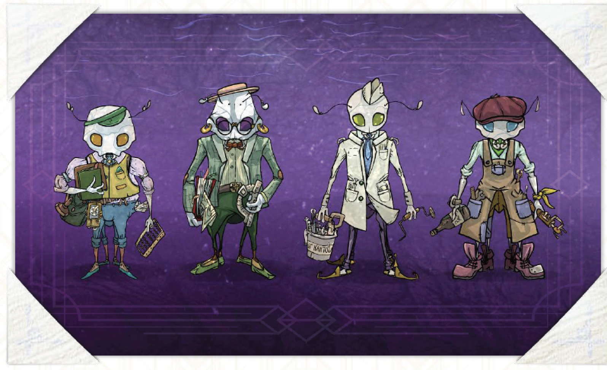

# Ваш герой, экипаж и судно

## (Не)герой

### 0. Народ

По умолчанию ваш герой принадлежит к народу олъм. Обсудите с группой, способны ли вы это изменить – позволяет ли ваше общее понимание мира игры, особенностей других народов, их истории, культуры, сильных и слабых сторон, преимуществ и ограничений полноценно воплотить такой замысел в пространстве кампании. Если у вас есть хоть какие-то сомнения по данному вопросу, то мы рекомендуем всё-же остановиться на персонаже-олъмце.

### 1. Имя и фамилия

|     |              |                 |
|:----|:-------------|:----------------|
|     | **4d6 имён** | **4d6 фамилий** |
| 4   | Абгейл       | Глоф            |
| 5   | Апстам       | Глох            |
| 6   | Крун         | Нинбррн         |
| 7   | Рргина       | Эйк             |
| 8   | Уррн         | Манч            |
| 9   | Алррн        | Хим             |
| 10  | Диллс        | Акром           |
| 11  | Кнни         | Соррк           |
| 12  | Пллис        | Йббни           |
| 13  | Пттр         | Инвтн           |
| 14  | Гйдрр        | Лигор           |
| 15  | Кэдок        | Пьерс           |
| 16  | Флетт        | Йлл             |
| 17  | Рртис        | Матон           |
| 18  | Афн          | Бррлин          |

### 2. Специальности

Выберите одну из четырёх специальностей для своего офицера вольного торгового флота: завхоза, навигатора, медика или механика (в пределах экипажа специальность повторять нельзя).

#### Завхоз

Завхоз ведает судовой казной и контролирует закупку и расход путевых припасов. Именно завхоз обязан подписывать все официальные контракты и делать приёмку-сдачу перевозимых товаров. Наконец, в каждом торговом порту завхоз легко найдёт особую, оборотную чайную (см. стр. XX), полную своих коллег и слухов о том чем живут местные рынки.

Эта специальность хорошо подойдёт тем, кто любит торговать и торговаться, жонглировать бюджетами и выжимать скидки.

##### Спецход: Неучтёночка!

Один раз за окту (см. стр. XX) игрового времени завхоз может вытащить из каких-то своих закромов до сотни стаунтов абсолютно любого груза первой или второй категории (стр. XX), который обойдёся экипажу или в один полом (стр. XX) судна, или в почётное место в чёрном списке таможни последнего посещённого порта.

#### Навигатор

Навигатор работает с картой и читает «Cправочник» (см. стр. XX), общается с мотыльками-разведчиками (стр. XX), посещает Навигационный кружок, разгадывает шифры и высчитывает точки приложения усилий, а также уверенно травит байки о местах, в которых никогда раньше не был.

Эта специальность хорошо подойдёт тем, кто любит вести подсчёты, сочинять байки, гордиться своей элитностью и незаменимостью.

##### Спецход: Согласно подсчётам…

Один раз за игровую встречу, при недостатке информации, навигатор может применить свои навыки математического моделирования для того, чтобы в общем и минимально необходимом размере, без подробностей, «угадать» эту информацию – получить её в качестве ответа на прямой вопрос у ведущей или, если группа считает это допустимым, попросту придумать.

#### Медик

Медик профессионально лечит, воодушевляет, разговаривает с безумцами, разбирается в ядах и дружен с персоналом Аптечных двориков (см. стр XX). Он незаменим для борьбы с непрерывно нарастающей смутой (см. стр XX), профилактики стресса среди команды и тонких поручений, требующих вмешательства специалиста по вопросам жизни и смерти.

Эта специальность подойдёт вдумчивым игрокам, которые понимают толк в интригах и манипуляциях.

##### Спецход: Всех – на терапию!

Каждую чётную вахту медик может организовать для всех не занятых матросов судна терапевтическое собрание, чтобы сбить уровень стресса через мотивирующие беседы, групповые психопрактики, психодраму и подобное. Всё перечисленное сопровождается специфической, лишённой рисков проверкой – броском 4d6 со всеми полагающимися модификаторами. В случае полного успеха этой проверки смута (см. стр. XX). снизится на d6 единиц, в случае частичного – на d6/2.

#### Механик

Наконец, Механик просто знает, как тут всё работает, умеет перебрать движок, подлатать котлы и отрегулировать освещение. Помимо того он вхож в Ассоциации механиков (см. стр XX) и может извлечь из этого немалую пользу.

Вам будет интересно играть механиком в том случае, если вы любите возиться с железками, собирать вундервафли, разбираться с техно-артефактами и исправлять то, что наломали остальные.

##### Спецход: Из желудей и спичек

Один раз за игровую встречу механик может в течение полной вахты собрать что-либо (устройство или инженерный объект) небольшое или среднего размера из имеющихся в его распоряжении запчастей. При этом, если подходящих (с точки зрения игровой группы) запчастей у механика нет, он может разобрать на них что-то другое: нанести один полом судну, уничтожить в процессе какое-либо спец. оборудование (стр. XX) или разобрать какой-либо крупный технический объект (например, чей-нибудь автомобиль). Само собой, всё разобранное впоследствии восстановлению уже не подлежит.

> Конечно, каждый из героев что-то слышал о профессиональных умениях остальных, но управляться с чужими обязанностями совершенно не умеет, в силу чего любая более-менее сложная ситуация, относящаяся к чужой профессиональной области, для него будет провальна. И только положившись на удачу, а также приняв на себя значимые риски (см. стр. XX), он будет иметь какие-то шансы на успех. И даже в таком случае несоответствие профессии станет осложняющим обстоятельством. Другими словами, не медик правильно наложит шину на сломанную конечность, только если сильно повезёт, а не механик поправит барахлящий дроссель, не устроив пожара,только чудом.

#### Эксперт

Тёмная лошадка и пятый (шестой, седьмой, восьмой и т.п.) внеранговый специалист-протагонист на борту может быть действительным и активно работающим по своей вовсе уж не флотской специальности человеком-швейцарским ножом.

Его позиция здесь вводится нами в качестве официального (на случай, если оно вам нужно) разрешения создавать свои «классы» персонажей – профессиональных археологов, геологов, зоологов, болтологов и других подобных граждан, в широком ассортименте встречающихся на прострах Веа Туароа. Такой эксперт не обязан быть частью торгового кооператива (см. стр. XX), а может формально быть просто постоянным пассажиром (стр. XX) вашего судна и заодно подменным персонажем (стр. XX) кого-либо из игроков.

##### Четыре экспертных правила:

- профессиональные навыки эксперта не должны пересекаться с рабочей областью ни одной из базовых флотских специальностей (завхоза, навигатора, медика и механика);

- эксперт должен быть узко специализированным умельцем и знатоком, а не мастером на все руки;

- эксперт должен иметь хотя бы один «специальный ход», сделанный по аналогии с ходами остальных четырёх проф. классов;

- включённый в игру эксперт должен устраивать всю игровую группу.

### Недостаток

> В пику авторам, здесь вы можете заметить, что некоторые из перечисленных далее недостатков в ряде ситуаций очень даже могут быть достоинствами, но здесь мы предлагаем провести черту между этими двумя абстракциями по очень простой и понятной грани – недостатки во многом управляют жизнью вашего персонажа, а не наоборот. Они похожи на проклятие. Они проявляются, когда сами того захотят. Ваш герой (в отличие от вашей ведущей) далеко не в полной мере их контролирует и вовсе им не хозяин. Тогда как достоинства могут быть использованы своевольно, без всякой непредсказуемости.

Ваш персонаж наверняка имеет целый букет неудобных личных качеств, которые так или иначе мешали и мешают ему жить. Однако среди этих относительно мелких причуд и странностей есть один по-настоящему значимый недостаток с большой буквы «Н». Про него нельзя просто забыть, его не получается игнорировать, а его влияние на поведение вашего протагониста регулярно, хоть и по мелочам, видно невооружённым взглядом. И особенно оно заметно в напряжённых, рискованных ситуациях (см. стр. XX). Возьмите этот недостаток из приведённых далее 3d6 вариантов или придумайте свой, не менее тяжкий. Запишите выбранный вариант на лист персонажа и обсудите с другими игроками, как он проявляется в вашем герое.

#### 3. Химическая зависимость

Вы не представляете себе жизни без меняющей восприятие химии: алкоголь, экзотические специи или алхимические соли – всё идёт в дело, когда на сцене появляетесь вы! «Ни вахты без дурмана» – вот ваш девиз! Сопротивляться влечению? Незачем, пустое! Ведь вы и так всегда можете остановить этот волнующий спуск по нисходящей спирали многоцветного водоворота химического удовольствия. Но вы просто не хотите. Наверняка же просто не хотите, да-да.

#### 4. Патологическая жестокость

Ваша кровь буквально закипает от желания отвесить кому-нибудь затрещину. Старые, молодые, олъмцы, ва’ро или кансе, мужчины, женщины, дети и прочие твари не остановят вас ни мольбами, ни скулежом. Любой, кто встанет у вас на пути, едва ли сможет рассчитывать на отсутствие травм средней тяжести. Почему вы до сих пор на свободе? Не иначе как по счастливой случайности и благодаря немалым усилиям воли, которые вам приходится прилагать постоянно.

#### 5. Хроническая апатия

Все вокруг такие активные, куда-то торопятся, договариваются, торгуют. А вам до них нет никакого дела, всё, чего вы хотите – чтобы вас, наконец, оставили в покое. Даже в разгар какой-нибудь катавасии вам непросто взяться за штурвал или инструмент. Как вы вообще оказались в этом трудовом и работящем экипаже? Наверняка поняли, что без средств ваше существование обрастёт куда большим количеством проблем, на которые придётся потом реагировать.

#### 6. Запущенная шизофрения

Эти, которые вокруг, просто не понимают, с кем имеют дело. Голоса и галлюцинации – лишь малая часть того, с чем вам приходится сталкиваться. Но вы вполне привыкли к собственной «расширенной реальности» и даже готовы вступить с ней в контакт – протяжно подпеть пучеглазке, пройти в невидимую дверь или провести переговоры о сотрудничестве со стайкой долмаров. И горе тому, кто помешает вам соскользнуть в этот причудливый психотический мир, в котором так хорошо и уютно.

#### 7. Всепроникающая паранойя

Вы заметили, как недобро смотрят на вас все эти? За время плавания они явно подумали о вас лишнего, и только то, что вы в одной упряжке, мешает им выбросить вас за борт. Сбежать бы в ближайшем порту, да только там ещё больше опасностей – воры, аферисты, спецслужбы, заразные попрошайки, отравленный воздух… Страхи постоянно одолевают вас и на суше, и в море. Особенно в море, где и гиблые воды, и студенцы, и работорговцы, и клоуны, и острые рифы – всё настроено против вас.

#### 8. Ненасытная жадность

Денег никогда не бывает достаточно: провиант портится, корабли изнашиваются, а качественный товар всегда в дефиците. Как прекрасно было бы нажить столько добра, чтоб не бояться издержек и потерь… Но для этого важно беречь каждую огневицу, каждый паёк, каждую пуговицу! Прежде чем дать кому-нибудь деньги, мыло или провиант, вы по десять раз задумываетесь, насколько убыточна для вас эта затея. Так ведь можно и не разбогатеть, если со всеми делиться.

#### 9. Зудящий сексоголизм

Вам тяжело сдерживать возбуждение, когда вы с товарищем склоняетесь над картой, соприкасаясь головами. Экипаж уже устал от ваших томных взглядов, постоянного флирта и чувственных вздохов. Но как иначе, когда единственное, что может снять ваше нервное напряжение хотя бы на время, это секс, секс и ещё больше секса? Вместо торга вы заигрываете, во время сделки маструбируете под столом, вместо рукопожатия – норовите облапать собеседника. Это ужасно надоедает. Но эти маленькие похотливые тики сильнее вас. Зачастую вы просто не можете остановиться.

#### 10. Тотальная рассеянность

Обычное дело для вас – надеть пиджак наизнанку, подпоясать его обрывком каната и даже не заметить этого. Ваша рассеянность нередко приносит экипажу проблемы, а вам – дополнительные расходы. Вы почти привыкли путать дату отплытия, обнаруживать в кобуре грибную булку вместо корринджера, оправдываться, извиняться… Ваших намерений стать ответственнее хватает ровно до того момента, пока вы снова не обнаружите себя начерпывающим похлёбку в чей-то ботинок.

#### 11. Агрессивная самоуверенность

«Вижу цель – не вижу препятствий» – это про вас. Если уж вы решили действовать, то окружающим понадобятся немалые усилия, чтобы вас остановить. Подчиняться приказам, до последней точки соблюдать законы или искать компромиссы вам часто не позволяет твёрдое убеждение, что ваши действия оправданы, даже если другие убеждены в безумстве затеи. А несогласные, рискнувшие помешать вам или хотя бы упомянуть о не очевидных рисках, наверняка получат как минимум гневную отповедь и предложение довериться профессионалу.

#### 12. Подорванное здоровье

Война, несчастный случай, недавняя эпидемия или детская хворь – что-то в прошлом безнадёжно подточило ваше здоровье. А до ухода на покой вам ещё далеко, вот и приходится ходить по морю не в самом лучшем состоянии. Вы посещаете каюту доктора чуть ли не чаще, чем свою. Любые перенапряжение, ушиб или бессонная склянка угрожают вам куда более серьёзными последствиями, чем более здоровым товарищам. А на решительные действия может банально не хватить сил, особенно если вы пропустили приём пищи или лекарств.

#### 13. Неприятная травма

Отсутствие глаза или части черепа, клацающий протез ноги или внушительный горб – ваша старая травма очевидна всем, неприятна на вид и ощутимо мешает жить. Когда-то доктора сделали всё возможное, чтобы спасти вам жизнь, но, увы, не смогли избавить вас от социальной стигмы. Общение с незнакомцами часто сопровождается особым, брезгливым и опасливым тоном с их стороны. Поэтому рассчитывать на выгодный исход торга вам приходится реже, чем более целым конкурентам. Кроме того, зачастую вы справляетесь с опасными ситуациями хуже других.

#### 14. Регулярная забывчивость

Контракт заключён, деньги уплачены, а товар так и не погрузили на корабль – вы заметите это только после отплытия. И ваш кошелёк куда-то запропастился… Наверное, выпал из прорехи в кармане. Оу, кажется накладной карман и вовсе отвалился от пиджака, а вы не можете вспомнить, как и когда это случилось. Память вас настолько часто подводит, что товарищи не спешат доверять вам важную работу. А вы привычно огорчаетесь и в очередной раз отправляетесь к матросу-прачке просить ещё одну смену белья. Ведь ваше куда-то опять задевалось.

#### 15. Вопиющая нечуткость

Пушечный залп вы опознаете по глухой вибрации и покачиванию палубы. Крики, треск, гомон и плеск недоступны вашему слуху – он не работает ни в каком виде. Дурные запахи и приятные ароматы обходят ваше восприятие стороной. А вашим товарищам нередко приходится общаться с вами на языке жестов и по десять раз объяснять, что вот эта ваша шутка была очень обидной. Вы давно забыли звук чужих голосов и вкус морского чая, а разговаривать пытаетесь механически, по старой привычке. Судя по лицам экипажа, иногда ваши слова даже к месту. Но, как говорят специалисты, потеря коммуникативных навыков в подобных случаях клинической утомлённости чувств – дело почти неизбежное.

#### 16. Фатальная нерешительность

Когда от вас требуются быстрые действия, вы впадаете в ступор. Неожиданный поворот событий способен парализовать вашу волю. Решительно прыгнуть с горящего борта в гребку – проблема, а тонущий товарищ – повод глубоко задуматься. Прежде, чем заломить цену на востребованный товар, вы взвесите всё дважды. И трижды. И ещё двадцать семь раз, пока возможность не отпадёт сама собой. Нерешительность уже не раз вставала на вашем (и экипажа) пути к успеху. Не исключено, что однажды она просто-напросто убьёт вас.

#### 17. Бессознательная клептомания

Откуда в ваших раздутых карманах столько бус, конвертов с пеплосолью, портсигаров, запонок, самопишущих перьев, обувных щёток и скомканных контрактов с незнакомыми именами? Вы не вполне уверены. Ведь вы даже не заметили, как машинально стянули эти предметы где-то по пути. Заглянув в вашу каюту, товарищи по экипажу могли бы найти множество потерянных ими безделиц, а также пресс-бюваров всевозможных форм и размеров, ценных и не очень украшений, шкатулок, раковин, кружек, ведёрок из-под масла и даже небольшой якорь под койкой.

#### 18. Нежелательная известность

Вас узнают даже на самых отдалённых островах. Праведный гнев за ваши или даже приписываемые вам чужие деяния, порыв вернуть вас именитым родителям или оголтелый фанатизм со стороны местных – вам изрядно досаждает собственная известность. Вы с огромным удовольствием поменяли бы лицо, изменили манеру речи или походку, чтобы за вами не увязывались и не спрашивали о прошлом. Но что-то в вашем облике часто оказывается узнаваемым и неприятным для многих. И вам это постоянно мешает.

### Достоинство

Помимо легко заметного недостатка у вашего персонажа есть и компенсирующее огрехи крупное достоинство. Возьмите это достоинство из приведённого далее 3d6-перечня или придумайте своё, не менее значимое. Запишите выбранный вариант на лист персонажа и все вместе обдумайте, как он проявляется в вашем герое.

#### 3. Высокая стрессоустойчивость

Сложные и выматывающие ситуации для вас – не больше чем спортивный вызов. Благодаря врождённым качествам, тренировкам или опыту вы действуете перед лицом опасности так, словно находитесь на отдыхе в санатории. Вы не поддаётесь эмоциям, когда экипаж охвачен паникой, а люди мечутся, забыв о долге. Тот, кто попытается сломить ваше уверенное спокойствие, скорее уж сломается сам.

#### 4. Выдающаяся эрудиция

Сложно найти область, в которой вы не обладаете хотя бы теоретическими знаниями, будь то устройство судовых корпусов, спаривание молочных слизней, этикет элит ва’ро или биографии героев Войны. Товарищи по экипажу высоко ценят ваш интеллект и часто обращаются за советом. Может, ваши знания и не системны, но зачастую их хватает, чтобы улучшить ситуацию.

#### 5. Подкупающая харизма

Ваша обаятельная улыбка, честные глаза и учтивые речи располагают к себе самых неподкупных судей, прожжённых дельцов, суровых лоцманок и нервных пролов. Вы, наверное, способны найти подход к любому обитателю Веа Туароа. Вы умеете нравиться. Вам моментально удаётся завладеть вниманием собеседника и обернуть разговор в свою пользу. В общем, как ни крути, это весьма полезное свойство.

#### 6. Обширные связи

В любом, даже самом отдалённом порту у вас может найтись кто-то, готовый поделиться информацией или необходимыми товарами по вкусной цене. Ну или кто-нибудь, чтобы замолвить за вас словечко перед кем надо. И вам не всегда потребуется оплачивать услуги – этот рынок во многом живёт взаимными одолжениями и долговременными негласными обязательствами.

#### 7. Заслуженная известность

Ваше доброе имя узнают во многих уголках Веа Туароа, а ваша репутация часто даёт вам немалые бенефиты. Благодаря общепризнанным (реальным или вымышленным) заслугам, вы часто можете получить помощь или скидку за толику внимания и автограф. Более того – одна весть о том, что вы прибыли в порт, может открыть для вашего экипажа немало запертых дверей.

#### 8. Сверхъестественная ловкость

Вам не составит труда поймать на лету выпавшие из рук товарища коробки с ценным товаром. Вознамерившийся вас ударить хам даже не заметит, как вы окажетесь за его спиной, у выхода. А уж если б вы решились заняться щипачеством – берегитесь, чужие кошельки! Высокая ловкость уже не раз позволяла вам выходить сухим из воды, иногда даже буквально.

#### 9. Невероятная сила

Едва ли кто-то сравнится с вами в погрузке товаров – даже самые тяжёлые ящики вы поднимаете, словно пушинку. Если потребует ситуация, вы играючи сможете метать тяжёлые предметы на дальние дистанции, быстро открутить проржавевший вентиль или голыми руками вытащить со дна судовой якорь. Неудивительно, что товарищи по экипажу часто просят вас показательно поднять что-нибудь (включая себя), на что вы иногда благодушно соглашаетесь.

#### 10. Безупречный вкус

Вы – утончённый эстет, и это заметно. Ваш костюм недорог, но настолько изящен, что приковывает взгляды и делает вас ходячей рекламой хорошего вкуса. Разборчивость и чутьё могут подсказать вам, какие произведения искусства заслуживают самой высокой цены. Ваш товар всегда тщательнейшим образом отобран, оформлен и показан с выгодной стороны, а покупатель остаётся доволен не только им, но и вашими полезными советами в области стиля.

#### 11. Галантные манеры

На закрытой вечеринке высшего света вы легко сойдёте за своего благодаря чёткому соблюдению этикета и безупречным манерам. В вашей повседневной речи едва ли проскользнёт крепкое словцо, базарная ругань или торговый сленг. Для вас процесс заключения сделки – это изысканная беседа, выгодная и благозвучная для всех сторон. Конечно, в более профанных кругах из-за такого могут недоуменно пожать плечами, но соблюдение время от времени протокола – немалое преимущество

#### 12. Торговая хватка

Благодаря этому качеству, многие ваши сделки проходят более чем успешно. В мире торговли вы словно рыба в воде – легко курсируете по невидимым течениям личных выгод и вовремя закрываете контакты, которые вот-вот станут убыточными. Даже самым прожжённым дельцам сложно обвести вас вокруг пальца, а желающим всучить сомнительную сделку с двойным дном лучше и вовсе с вами не связываться.

#### 13. Чрезвычайная запасливость

Зачастую при вас можно найти что-нибудь, необходимое в текущей ситуации, ведь вы привыкли заботиться о возможных рисках заранее. А то, чего нет в карманах, наверняка упаковано в ваш чемодан или ящик под койкой. Набор отмычек, фляжка с горючим, отрезок каната, кусачки, ломтик жира тепелли в засаленной бумажке – любая безделица может пригодиться в дальнейшем. Так что мораль тут очень простая – запас карман не тянет.

#### 14. Положительная плавучесть

Падение за борт не грозит вам быстрой гибелью, если только на вашу зависшую, словно поплавок, тушку не позарится голодный обитатель глубин. Неважно, как долго вам придётся бултыхаться в морском киселе – в отличие от обычных людей, вы не утонете, пока не нагрузите себя чем-либо увесистым. И, вопреки распространённой ассоциации, однозначно положительная плавучесть совсем не мешает вам состоять из плоти и крови, быть надежным товарищем и прекрасным профессионалом.

#### 15. Инстинктивная скрытность

Быть незаметным, затеряться в толпе, пропасть из поля зрения, ускользнуть от внимания, притвориться ветошью – ваше всё. В кафе вы традиционно садитесь в самом тёмном углу, проходя мимо стражей порядка, автоматически делаете расслабленное лицо, а в тёмных проулках гетто ступаете мягко, как охотящаяся медведка. Вероятно, в детстве вы были частым победителем игры в прятки, а теперь вам не кажется сложным незаметно проскользнуть на чужое судно или подслушать приватный разговор в задней комнате паба.

#### 16. Выдающаяся выносливость

Природа или тренировки наградили вас недюжинным запасом здоровья. Скудный рацион едва ли повлияет на вашу работоспособность, несколько вахт без сна не ослабят вашего внимания, а на сырость, перегрев и сквозняки вы просто не обращаете внимания. Яд и болезнь на вас могут не подействовать или подействовать куда слабее, чем на остальных.

#### 17. Развитая интуиция

Сюрпризы судьбы почти не властны над вами, ведь многие из них вы способны предугадать заранее. Острейшая интуиция может подсказать вам, где скрываются смертоносные рифы, злонамеренные дикари или, наоборот, самые выгодные сделки и востребованные товары. Вероятно, ваш экипаж старается прислушиваться к таким инстинктивным прогнозам, ведь те имеют немалые шансы на реализацию.

#### 18. Отточенная эмпатия

Вы привыкли полагаться на своё понимание чувств, эмоций и сиюминутных мотиваций окружающих, будь то торговый контрагент, разбушевавшийся бойцовый слизень или угрюмая, насупленная толпа. Это, бесспорно, облегчает жизнь и давно стало для вас проверенным рабочим инструментом. Конечно, иногда и это чутьё даёт сбои, но всё же оно способно склонить фортуну на вашу сторону во множестве сложных и неочевидных ситуаций.

### Значимое прошлое

Ваши персонажи не приходят в игру из ниоткуда. До того, как появиться на полотне повествования, и даже до того, как начать карьеру в торговом флоте, они жили, совершали ошибки молодости, попадали в передряги и заводили разнообразные знакомства. У ваших персонажей есть значимое прошлое – жизненный багаж, который может как значительно помочь, так и существенно помешать им в процессе кампании. Вот вам 3d6 развёрнутых примеров подобного багажа. Выберите один из них или придумайте свой.

#### 3. Ветеран

Эхо Войны до сих пор отдаётся в вас, заставляя старые шрамы ныть при одном её упоминании. Когда-то вы, полный амбиций юнец, отправились воевать к далёким берегам и неоднократно бросались в самое пекло сражений. Прилив за приливом вы терпели лишения ради защиты всего человечного и доброго на просторах моря. В низком звании, без особых почестей и выдающихся наград, через целую декаду после начала военной карьеры вы завершили свою Войну и обнаружили, что пенсиона хватает только на самые базовые вещи. Так что пришлось идти в торговлю и конкурировать с молодёжью, не нюхавшей пороху.

**Плюсы:** помимо очевидных выгод – умений профессионально обращаться с оружием, убивать и вовремя нырять в укрытие, – вы обладаете целой сетью социальных связей среди бывших сослуживцев. При частично выигранной коллизии (см. стр. XX) вы можете найти бывшего однополчанина в любом новом для вас порту крупнее рыбацкой деревни, а при однозначном успехе – и в любом захолустье тоже. Ну а уж однополчане всегда будут готовы помочь полезными, без фальши, сведениями о местном раскладе общественных сил. В крупных портах, опираясь на союзы фронтовиков, они могут оказать и более существенную поддержку – силовую и вооружённую.

**Минусы:** с тем же успехом (вероятностью 1/6) найденные боевые товарищи могут попросить о поддержке в каком-нибудь важном для них деле. И, само собой, такое дело всегда сулит неприятности. Конечно, вы вольны им отказать. Но подобное недостойное фронтовика поведение однозначно подорвёт вашу репутацию и даже может вызвать что-нибудь буквально подрывное – в отместку.

##### Брось d6 и определи, чем будет являться это «дело фронтовой чести»:

1.  Крайне плохо организованный и реализованный грабёж военного объекта.

2.  Лихая уличная драка с идейными конкурентами, сильно превосходящими вас числом.

3.  Посещение выступления дружественного полит. агитатора в качестве массовки.

4.  Посещение выступления какого-то ещё полит. агитатора с целью провокации.

5.  Присутствие на бракосочетании в качестве почётного гостя и близкого друга.

6.  Толково спланированная экспроприация содержимого банковского хранилища.

#### 4. Ищущий

Вечный студент, аспирант-недоучка, регулярно мелькающий в научных кругах, вы всегда готовы блеснуть познаниями об окружающем мире и пойти на самые смелые эксперименты. Вы мечтаете стать своим в учёном сообществе, но ваше имя там мелькает разве что в анекдотах. Каждый раз вам не хватает усердия, везения или денег, чтобы наконец-то получить законченное образование и степень. Но может именно в статусе вольного торговца вы заработаете достаточно или обнаружите бесценные материалы для изучения, что позволит вам впоследствии выходить в море только в исследовательских целях.

**Плюсы:** знакомства в научных кругах – эксперты по очень узким и сложным темам, доступ в закрытые библиотеки, информация о контрактах и распродажах/аукционах в области истории/антропологии/археологии.

**Минусы:** завистники, которые время от времени (как только вы справляетесь с предыдущей подставой) строят козни и через третьи руки…

- … подсовывают дорогущий краденый антиквариат;

- … подсовывают очень качественную антикварную подделку;

- … профессионально рекомендуют опасному самодуру;

- … оформляют дело о проникновении в частный архив;

- … публикуют газетную статью с обвинением в мошенничестве;

- … приглашают задорого поработать на частный музей.

#### 5. Колонист

Сразу после Войны мечты об оседлой жизни и госпрограмма «Возрождение» привели ваших родителей на вымерший остров, почва которого казалась удивительно плодородной. Все семейные сбережения были брошены на создание фермы, которая окупилась из рук вон плохо. Долгое время вы тягостно сводили концы с концами и платили работникам натуральными продуктами. Вас добил всего один, но совершенно неурожайный прилив. Сезонные вложения загнали семью в убытки, а землю пришлось продать какому-то нуворишу. И пока ваши родители батрачат на том же наделе, который им ранее принадлежал, вы решили сменить поле деятельности и надолго забыть об оседлости.

**Плюсы:** знакомства с реалиями сельскохозяйственных и рыбоводческих рынков, 1/6 вероятности покупки припасов вдвое дешевле рыночной стоимости на каждой сделке, способность при некоторой удаче (по 2d6 единиц припасов на каждый успех/пункт успеха в коллизии) один раз за вахту добывать пищу прямо посреди моря.

**Минусы:** вы не особенно культурны и образованны за пределами своих профессиональных сфер, грубоваты и слабо разбираетесь в городской жизни. Поэтому вы время от времени при посещении любого среднего или крупного населённого пункта, но не чаще раза за игровую встречу, влипаете в мелкие неприятности. Например:

- ненароком оскорбляете важного и мстительного человека;

- незаметно для себя теряетесь в плотной городской застройке;

- покупаете не те товары, которые собирались приобрести;

- подписываете бумаги, которые не стоило бы подписывать;

- привлекаетесь местными органами правопорядка в качестве свидетеля;

- привлекаетесь ими же в качестве подозреваемого.

#### 6. Обделённый

Фамилия у вас слишком известная, чтобы вы называли её кому-то, кроме товарищей по экипажу. Ваш род славится как один из богатейших в Олъм Нде, да вот беда – наследников у него слишком много. Вам не посчастливилось родиться младшим, да ещё и в побочной семейной ветви. И пока более старшие родственники делят фабричные активы, вы в качестве наследства довольствуетесь фамильной честью, любимым портсигаром и несколькими дорогими безделушками. Как бы не пришлось пустить с молотка и их тоже, если следующая партия товара не окупится…

**Плюсы:** обширные знакомства среди торговой аристократии, пятикратный бюджет стартовых средств.

**Минусы:** пренебрежение, презрение или жалость со стороны всех былых однокашников и знакомых из высшего общества. А также две весьма мешающие жить неприятности из списка:

- малохольность – уже две раны, а не три, как у остальных, приводят к смерти;

- вендетта – регулярные, с вероятностью 1/6 на игровую встречу, покушения на жизнь;

- лёгкая мишень – регулярные, 1/6 на игровую встречу, попытки похищения с целью выкупа;

- знаменитость – регулярные, 1/6 на игровую встречу, попытки окружающих использовать вас и вашу громкую фамилию в какой-нибудь грязной афере;

- привередливость – регулярные, 1/6 на игровую встречу, приступы различных аллергий;

- нарколепсия – приступы сложного в прерывании и долговременного, не менее склянки, забытья при провалах коллизий.

#### 7. Дикарь

У вас за плечами длительный опыт выживания вдали от людей, на всеми позабытом островке. Добрый десяток приливов туда не добиралось ни одно судно, и вы пребывали в полном одиночестве, которое вас вначале измотало, а затем закалило. Чудом вернувшись в лоно цивилизации, вы с трудом адаптируетесь к толпам людей вокруг и вспоминаете правила приличия, которые быстро уступают место дикарским привычкам при малейшем стрессе.

**Плюсы:** знаете повадки разнообразной не одомашненной фауны и свойства дикорастущей флоры. Способны добывать припасы на диких островах (по 2d6 единиц провианта на каждый успех/пункт успеха в коллизии, не чаще одного раза за вахту). На практике знакомы с неортодоксальной полевой медициной и гомеопатией. Не получаете вычетов за импровизированное вооружение в рукопашной драке. Получаете +2 ситуационных преимущества (стр. XX) при охоте.

**Минусы:** вы дики и необузданны, наивны, часто попадаете в глупые социальные ситуации, имеете сильные проблемы с самоконтролем, слабо знакомы с техникой, логикой и арифметикой, в силу чего…

- …наверняка не можете быть механиком, завхозом и навигатором;

- …не скупитесь на крепкое словцо – непременно оскорбляете собеседников при разногласиях;

- …всегда имеете 2 осложнения при проверках удачи, связанных с социальными взаимодействиями;

- …в каждое посещение населённого пункта имеете 1/6 вероятности непроизвольно нарушить правила поведения – съесть что-то с лотка торговца, отвесить пинка несимпатичному прохожему или отпустить сальный комплимент в адрес супруга начальника порта.

#### 8. Перекроенный

Десятки приливов строгого режима и каторжный труд – таким было ваше наказание за совершённые преступления. Вы были уверены, что никогда больше не увидите свободы, учитывая рецидивы и нарушения правил. Однако экспериментальная хирургия сотворила чудо – ваше социально-девиантное поведение было откорректировано умелыми докторами, и вы получили условно-досрочное освобождение. Азы профессии пригодились в морской торговле – здесь никто не интересуется вашим прошлым, а тюремные метки легко можно скрыть под форменным кителем.

**Плюсы:** профильные знания в самых разных областях юриспруденции, преимущество при попытках кого-либо убедить или обмануть с опасностью для себя, чёткое понимание, где в любом городе можно найти нелегальных или просто мутных перекупщиков, половинная скидка при посещении дурманных притонов и бойцовых ям, глубокое знание криминальных арго и этикета.

**Минусы:** из-за проведённой на мозге операции мучаетесь частыми головными болями и всегда либо подчиняетесь прямым приказам облечённых в мундир представителей власти, либо теряете сознание при попытке сопротивления. В каждом порту вы имеете 1/6 вероятности спровоцировать внеплановую проверку со стороны таможни, а также 1/6 вероятности встретить бывшего подельника, который обязательно попробует втянуть вас в…

- … совершенно незаконную, чрезвычайно выгодную и в целом безопасную операцию типа «постоять на стрёме», «пошофёрить», «передать что надо кому надо» и подобное;

- … похищение и вымогательство на позицию временного сторожа «передержки»;

- … поджог частного дома вместе с предварительно обездвиженными жильцами;

- … плохо организованный саботаж с воровством промышленных товаров;

- … защиту марша трудовой солидарности от профсоюзных провокаторов;

- … массовую драку с бастующими рабочими.

Отказ (как до, так и в процессе) от участия в подобных мероприятиях будет принят с видимым неудовольствием и обязательно приведёт к отложенной мести в виде обчищенных карманов, удара ножом в толпе, порченного сахаром топлива или пропавших товаров примерно 2d6 вахт спустя.

#### 9. Останец

Последний из своего поселения или рода, вы чудом уцелели во время какой-то чудовищной катастрофы. На ваших руках умирали близкие, и вы хорошо знакомы с ощущением обречённости. Вы не разделили судьбу остальных и остались в живых. Покинув места, бередящие сердце воспоминаниями, вы начали жизнь с чистого листа, и на этот раз надеетесь обойтись без трагедий. Возможно, злой рок не станет преследовать вас, а море на этот раз проявит большую благосклонность. Или нет.

**Плюсы:** самодостаточны, психологически устойчивы, имеете запас удачи 3.

**Минусы:** в силу перенесённых некогда переживаний вы нелюдимы и тяготитесь как бесцельным общением, так и близкими отношениями с людьми. Также вы обладаете странной и тревожащей аурой, из-за чего…

- …смута на корабле с вами растёт вдвое быстрее;

- …все социальные коллизии с вашим участием имеют штраф в +осложнение;

- …вам доступны только личные знакомства (см. далее) типов «таинственный наблюдатель» и «чудовищный поклонник»;

- …каждое посещение порта чревато происходящими вокруг вас несчастными случаями с участием совершенно посторонних людей.

##### Брось d6 и узнай, свидетелем чего на этот раз стал останец:

1.  Ожесточённая драка без какого-либо внятного повода.

2.  Чьё-то ничем не спровоцированное падение с большой выcоты.

3.  Сильная травма конечности, попавшей в работающий механизм.

4.  Особо жестокое публичное убийство.

5.  Обрушение здания, сопровождаемое множеством жертв.

6.  Кровопролитная автомобильная авария.

#### 10. Авгур

Ваша молодость прошла за дверями оккультного кружка, где вас посвятили в детали кровавых и мрачных таинств. Когда не стало ваших родителей, а унаследованные средства исчерпали себя, вам пришлось уйти в торговлю. Но вы отнюдь не забыли прелестное искусство проявления плоти и крови. Исход плаванья или сделки вы часто пытаетесь предсказать, разложив чьи-нибудь потроха на гадательном столике. Вероятно, менее просвещённые товарищи по экипажу не разделяют ваших «суеверий», но, судя по всему, находят их приемлемыми.

**Плюсы:** в силу знакомства (или, скорее, уверенности в знакомстве) с мистической изнанкой мира, вы…

- … получаете +преимущество, когда вам необходимо кого-либо в чём-либо убедить;

- … имеете шансы в общих чертах, смутно, намёками и образами угадать что-либо, известное только ведущей, через коллизию, сопровождаемую кровавым и вычурным ритуалом гадания на внутренностях агонизирующей жертвы;

- … можете получать дополнительные успехи на проверке удачи не только через собственные раны, но и через спонтанное нанесение ран другим членам экипажа, а также любым доверяющим вам личностям – матросам, последователям, подчинённым и т.п.

**Минусы:** из-за специфических привычек, прошлого и явного диссоциального расстройства вы получаете:

- нулевой запас меток удачи и невозможность их получить;

- +осложнение в коллизиях, связанных с тем, чтобы не нанести кому-либо вред;

- двойную скорость накопления смуты как во время плавания, так и во время различных инцидентов.

#### 11. Игрок

Ведомый не только азартом, но и хищным расчётом, вы много приливов посвятили изучению тонкостей игровых правил и оттачиванию навыков блефа. Вашим хлебом стали выигрыши – крупные и не очень: вы досконально изучили все нюансы спортивных шашек, боёв слизней и морского кардо. Но один трагический случай заставил вас оставить игорный бизнес и турнирную карьеру ради – ха-ха! – куда более честного и предсказуемого дела – вольной торговли.

**Плюсы:** профессионально и качественно разбираетесь во множестве видов азартных игр – от спортивных шашек и до спортивного кардо, от ставок на гонки катеров и до пород бойцовых слизней. Имеете +преимущество, когда нужно откуда-нибудь быстро сбежать, и в проверках, связанных с азартными играми. Одеваетесь с щегольской небрежностью и умеете себя подать.

**Минусы:** в силу как наследия прошлого, так и профессиональных суеверий, вы…

- … полагаетесь на бросок кости (с вероятностью ½), чтобы принять решение, участвовать ли в азартном предприятии или пари;

- … никогда не отказываетесь от заключённых пари или сделанных ставок;

- … бездумно и безответственно влезаете в долги, если нет денег на что-либо;

- … обязательно посещаете хотя бы одно (если их несколько, то самое лучшее) злачное заведение в каждом порту;

- … имеете 1/6 вероятности в каждом из таких заведений повстречать как минимум одного старого кредитора или должника.

> **Бросьте d6 и определите детали такой встречи:**

1.  Должник, готовый прямо сейчас отдать d6 × 100 своих последних огневиц (и немедленно, без предупреждения, застрелиться).

2.  Должник, готовый прямо сейчас расплатиться (ворованной) ювелиркой на сумму d6 × 1 000 огневиц.

3.  Кредитор, требующий немедленной уплаты d6 × 100 огневиц и угрожающий жалобой представителям правопорядка.

4.  Кредитор, требующий немедленной уплаты d6 × 1 000 огневиц и подкрепляющий своё требование кивком в сторону 2d6 опасно выглядящих громил.

5.  Это сразу двое – кредитор и должник. Первый готов выплатить 4d6 × 1 000 огневиц, а второй требует уплаты 4d6 × 1 000 огневиц долга.

6.  Брось ещё два раза и объедини результаты.

#### 12. Чемпион

С юных лет близкие и друзья пророчили вам крупные успехи в спорте, и вы полностью оправдали их ожидания. На вашем счету многочисленные победы в многоборье под восторженные крики толпы, набившейся вокруг трека. Однако каждое соревнование, каждый раунд неумолимо подтачивали ваше здоровье, и со временем вы основательно сдали. Так что в какой-то момент пришлось дать дорогу молодым, уступить им своих бывших поклонников, награды и семизвёздочного менеджера, купившего уже пятую виллу. А затем найти себе новый источник пропитания – выйти в море.

**Плюсы:** в силу славного прошлого и былых заслуг вы имеете шансы в половине случаев взять +2d6 на проверках, связанных с переговорами и необходимостью произвести положительное впечатление. Практически в каждом порту вы получаете как минимум одно приглашение на званую трапезу или закрытое спортивное мероприятие от представителей местных элит.

**Минусы:** в силу старых профессиональных травм и выдающихся общеизвестных достижений, вы вынуждены теперь жить…

- … с необходимостью посещать специальные массажные студии (есть только в крупных портах и, с вероятностью ½, на именных островах) как минимум раз в 5 вахт. Без подобных процедур вы получаете +осложнение в любых коллизиях, пока не вернётесь к режиму;

- … с вероятностью 1/6 на всех званых мероприятиях получить спортивный вызов от кого-либо из присутствующих:

<!-- -->

- в случае успеха коллизии и победы в соревновании зарабатываете +1 рану;

- в случае провала или отказа от вызова о вас начинают ходить нелицеприятные слухи и появляется осуждающая статья в местной газете (при наличии у местных газет);

<!-- -->

- … с вероятностью 1/6 на всех званых мероприятиях получить навязчивый флирт со стороны кого-то из старых поклонников:

  - при подыгрывании в ½ случаев произойдёт публичный скандал и вам запретят посещать порт в течение ближайшего прилива, а в оставшейся ½ случаев преподнесут ценный подарок стоимостью в d6 × 1 000 ог.;

  - в случае отказа гарантированно заимеете заклятого врага, который будет портить вам жизнь всем, чем только может (начиная с саботажа сделок).

#### 13. Щелкопёр

Ваш профессиональный путь начался с любительского расследования, детали которого вы изложили в объёмной книге. А та неожиданно разошлась огромным тиражом, и в течение целого прилива её можно было найти в каждой книжной лавке Олъм Нде. Опьянённый успехом, вы быстро промотали гонорар и в дальнейшем перебивались газетными подработками – вас взяли в третьеразрядную газетёнку, где вы едва сводили концы с концами, пока не решились уйти в мелкое предпринимательство.

**Плюсы:** в силу профессиональных привычек и личных склонностей, изначально и приведших в мир большой публицистики, вы отлично умеете выведывать чужие тайны – получаете +2 преимущества в коллизиях, завязанных на слежку, скрытое проникновение и сбор сведений (конечно же, включая копание в чужом белье). А также +2 преимущества в коллизиях, требующих что-либо убедительно написать.

**Минусы:** опять же, в силу привычек и былых успехов на профессиональном поприще, вы неплохо известны в некоторых кругах, нелюбимы власть имущими и поэтому…

- в каждом порту имеете ½ шанса получить внеплановую таможенную или санитарную проверку своего судна;

- после посещения танцевального салона, дурманного притона, бойцовых ям, массажной студии или вечеринки с вероятностью 1/6 рискуете оказаться…

<!-- -->

- … в канаве без ценных вещей, с шишкой на голове и краткосрочной амнезией;

- … в камере районной караулки в компании нескольких интересных личностей;

- … в похмелье, в мусорном контейнере, в обнимку с чьей-то отрезанной головой;

- … в фуникулёре канатной дороги, застрявшем на большой высоте;

- … в горячечном бреду в грязи и нечистотах загона с надойными слизнями;

- … в маске в машине с бандитами, прямо перед началом крупного ограбления.

#### 14. Артист

Вы с юности презентовали себя как творческого человека. Ваши художества, вирши и выступления действительно производили впечатление на какую-то часть публики, открыв дорогу в богему. Вращаясь в кругах полусвета, вы прогуливали семейное наследство и приобщались к изысканым способам саморазрушения. А плоды ваших трудов всё никак не приносили популярности и вы всё глубже вязли в зависимостях, которые однажды чуть было вас не сгубили. После длительной реабилитации вы решили взяться за ум, а творческую жилку приберечь до выхода на пенсию.

**Плюсы:** в связи с непростым прошлым и запутанной сеткой связей, ваш артист получает +преимущество в любом социальном конфликте, где пытается уладить дело миром, а также имеет 1/6 вероятности один раз за сцену обнаружить своим давним поклонником и добровольным союзником любого выбранного игроком образованного олъмца или ва’ро. Вдобавок, просто обронив пару знакомых имён, артист наверняка найдёт общий язык с другими артистами и будет тепло принят в соответствующих местах – от галерей изящных искусств до съёмочных площадок какой-нибудь киностудии.

**Минусы:** разгульная жизнь богемы может принести с собой множество проблем и закрыть множество путей, что и произошло с вами в итоге, а значит…

- … ваши возможные неблизкие связи ограничены тремя вариантами – былой любовью, знаменитым сиблингом и чудовищным поклонником;

- … ваш запас здоровья ограничен всего двумя ранами;

- … в любом порту крупнее деревни найдётся как минимум один активный противник ваших работ и с вероятностью 1/6 он будет обладать достаточной властью, чтобы строить козни;

- … вероятность найти недоброжелателя в любых местах, посвящённых искусству, подскочит до 1/3.

#### 15. Трудяга

Не разгибая спины и не покладая рук вы долго работали на фабрике, предпочитая рутинную стабильность превратностям более вольных профессий. Но за добрых полжизни вместо средств к существованию вам удалось скопить в основном пару хронических болячек и неизбывную усталость. Пересчитав скромные сбережения, вы поняли, что их не хватит ни на лечение, ни на длительный отпуск. И вот тогда вы решили изменить всё, начать заново и стать вольным торговцем.

**Плюсы:** в силу множества приливов, проведённых за тяжёлой муторной и однообразной работой, сдобренной необходимостью в подчинении, вы получаете +2d6 в любых конфликтах, где пытаетесь без какого-либо гонора договориться с вышестоящим или полагающим себя таковым лицом. Вы крепки, как водорослевый кап, крайне живучи и умираете, только получив четвёртую рану.

**Минусы:** фабричная жизнь ограничивает в развитии множество навыков, поэтому вы…

- …можете быть только механиком или навигатором;

- …получаете +осложнение в любых конфликтах, где пытаетесь проявить настойчивость, остроумие или развитый интеллект, а также конфликтах, связанных с юриспруденцией и финансами;

- …никогда не получаете скидок при оплате каких-либо товаров и услуг.

#### 16. Спящий

Вы ничем не примечательный добропорядочный гражданин, легко теряющийся в толпе тысяч таких же. У вас нет ни ярких воспоминаний, ни примечательных черт. В торговле вы не проявляете ни внушительных успехов, ни серьёзных ошибок. Так продолжается до тех пор, пока ваша тайная личность не получает особый, неизвестный даже вам, сигнал. С этого момента в вас пробуждается хорошо обученный спецагент, натасканный на определённую задачу. И как только она будет выполнена, вы снова «засыпаете», становясь рядовым гражданином.

**Плюсы:** в силу \[ДАННЫЕ УДАЛЕНЫ\] и \[СОВЕРШЕННО СЕКРЕТНО\] вы не имеете каких-либо заметных плюсов до тех пор, пока в опасной для себя или близких вам людей ситуации не получаете рану. После этого, по желанию и до окончания сцены, вы можете добавить +20 преимуществ на одну коллизию или несколько непродолжительных (занимающих не более вахты) коллизий, после окончания которых получите ещё одну рану.

**Минусы:** редкий, таинственный и специфичный, спящий имеет сразу (cм. далее) ряд ограничений.

- Ваш экипаж может иметь в составе только одного спящего;

- доступные вам связи (см. далее) ограничены прежним наставником и верным однокашником по уже не существующему учебному заведению;

- в каждом порту именного острова (см. стр. XX) вы имеете 1/6 вероятности без каких-либо комментариев незаметно для всех уйти и раствориться в толпе сразу после прибытия;

- каждое такое отсутствие продолжается до конца одной или двух игровых встреч (на ваш выбор), и в течение всего этого времени персонаж для игры недоступен;

- если ваше судно выходит из порта до его возвращения, спящий навсегда теряется из виду, а этот вариант прошлого становится недоступным в течение последующей кампании всей группе при создании персонажей;

- вернувшись, вы не имеете каких-либо воспоминаний о своём отсутствии, но задержавшись в порту ещё немного, экипаж может заметить, что в этом месте что-нибудь изменилось, к примеру:

  - в рамках какого-нибудь мероприятия произошла массовая драка;

  - на рейде неподалёку от берега взорвалось и затонуло судно;

  - власти обнаружили следы кровавой бойни, но не нашли тел;

  - совершено дерзкое и масштабное ограбление;

  - внезапно скончалась местная знаменитость;

  - в черте города случился крупный пожар.

#### 17. Дефект

Когда-то вас готовили в офицеры флота. Ваша семья вложила кругленькую сумму, чтобы пристроить вас в учебный корпус, где вы оттачивали воинские навыки и показывали себя только с лучших сторон. Ну, до тех пор, пока на старшем курсе не попали в неприятную историю. Говорить о ней вы не любите даже с товарищами по экипажу. Им достаточно знать только то, что вас подставили и отчислили без шансов на восстановление. А также, что от вас отвернулась семья и для многих офицеров своего поколения вы ассоциируетесь со словом «роковая ошибка».

**Плюсы:** как и любой прошедший через программу подготовки офицеров, вы обладаете множеством теоретических знаний о современном военном деле. Более того, вы знаете людей, которые знают людей, которые работают на самых разных уровнях военной машины Олъм Нде и Ва’ро Рохе. В силу этого, вы…

- …всегда получаете +преимущество в любых коллизиях, связанных с отрядной тактикой или специальным военным оборудованием;

- …имеете 1/3 вероятности встретить какого-нибудь давнего знакомого или приятеля на любом военном объекте Олъм Нде, включая суда патрулирования и станции наблюдения.

**Минусы:** отчисление и опала не прошли для вас даром, а среди вашихо былых знакомцев попадаются весьма сомнительные с точки зрения личных качеств особи. Каждая из них имеет 1/6 вероятности припомнить вам старый долг или обещание, в обмен на погашение которых предложит дурно пахнущую сделку. Например…

- …перевозку крупного объёма «списанных» боеприпасов из одной точки в другую;

- …участие в полевых стрельбах на роли командира условного противника вместе с «волонтёрами» из каторжного контингента;

- …подставную продажу секретных документов агентам чьей-то разведки;

- …допрос несговорчивых и незаконно удерживаемых пленников;

- …силовое «решение вопроса» с поселением «повстанцев»;

- …место напарника в тайной групповой и незаконной офицерской дуэли.

Конечно, все подобные услуги в случае вашего выживания и успешного исполнения будут так или иначе оплачены. И, возможно, даже станут началом крепкой и неафишируемой дружбы. Ну и/или основой для интереса со стороны военной прокуратуры.

Отказ от предложения приведёт к потере дружеского расположения данного социального контакта, а также в половине случаев повлечёт за собой…

- …арест или «случайную» порчу части имущества экипажа в процессе дежурного обыска;

- …серьёзные неполадки в подводной ходовой части судна через 2d6 вахт после отказа;

- …инцидент с немотивированным нападением на экипаж участников союза ветеранов на d6-м от момента отказа посещении какого-либо порта;

- …незаметное появление на борту совершенно бесполезных и запрещённых к экспорту-импорту вещей;

- …пришедшую по почте квитанцию для уплаты штрафа в размере d6 × 100 огневиц за злостное создание помех манёврам военного флота;

- …публичный вызов на дуэль профессиональным бретёром по надуманному поводу.

#### 18. Невольник

Ужасы пребывания в рабстве вам знакомы не понаслышке – вы провели в оковах большую часть жизни. Морские налётчики похитили вас совсем юным, оценив ваше телосложение как пригодное для тяжёлой работы. Вы никогда не думали о себе, как о полноправном человеке, и даже не мечтали об освобождении. Однако по счастливой случайности вас освободили, выдали новые документы и пристроили в Вольный Торговый Флот. Но вряд ли вы когда-нибудь перестанете видеть сны о неволе…

**Плюсы:** плюсов у такого жизненного багажа очень немного, однако они всё-таки есть. Вы отлично угадываете намерения встреченных людей, умеете не привлекать к себе внимание, быстро понимаете иерархию в незнакомой группе, обладаете талантом к маскировке и тайному проносу различных мелких предметов, а также получаете +2 преимущества на конфликты, включающие всё перечисленное.

**Минусы:** вашу предыдущую жизнь никак нельзя назвать ни лёгкой, ни безопасной. Вы прошли через многое, а многое, что нам кажется естественным, вас миновало. Вот почему вы…

- …получаете +2 осложнения в любых коллизиях, связанных с демонстрацией силы и уверенности;

- …боитесь ответственности и не способны на роль капитана;

- …начинаете игру без каких-либо денежных сбережений.

### Большая мечта

У каждого из ваших персонажей есть та или иная мечта. Она может быть вполне конкретной или совершенно непрактичной. В любом случае она влияет на поведение и мотивацию – даёт +4 преимущества в коллизиях, направленных на её достижение. И именно на эту мечту (если она ещё не будет достигнута) ваши протагонисты хотят потрать свои накопления после того, как их пенсионный счёт достигнет финальной отметки.

Далее представлено 2d6 вариантов большой мечты для вашего героя. Выберите один из них или придумайте свой. Расскажите о выбранной мечте другим игрокам, все вместе обсудите её детали и запишите их на лист персонажа.

- Выпить по бокалу вина в лучшем заведении каждого из 6d6 портов (см. стр. XX);

- купить уютный пансионат в тихом пригороде столицы;

- победить в Большой регате;

- летать над морем, как мотылёк;

- найти и похоронить останки пропавшей в море сестры;

- найти потерянную столицу Ва'ро Рохе;

- дожить до окончательного примирения народов моря;

- свергнуть прогнивший режим Её Величества;

- восстановить напрочь забытые детали своего детства;

- написать великую книгу о море, людях и всём прочем.

### История найма

Что сказал или сделал ваш персонаж, когда сидел в переговорной комнатке биржи труда перед будущими коллегами – остальными членами экипажа – и всеми силами стремился получить именно эту работу, попасть именно на этот корабль? Чем запомнился? Как проявил свои несомненные и впечатляющие достоинства?

Выберите и разверните в короткий рассказ один из представленных далее вариантов или придумайте свой. Обсудите выбранное с другими игроками, добавьте красочных деталей, а затем запишите его на лист персонажа.

#### Итак, на собеседовании ваш герой…

- … вскочил на стол и станцевал джигу – экипаж вдвое экономит на танцевальных салонах (см. стр. XX);

- … рассказал чудовищную (во всех смыслах) байку со спецэффектами – раз в три игровые встречи получает продажную историю (стр. XX) стоимостью в d6 × 1 000 огневиц;

- … уговорил всех пойти в гнуснейший из местных баров – в отличие от большинства не имеет похмелья и штрафов от посещения дурманных притонов (стр. XX);

- … достал шашки и сыграл на свой контракт – имеет +1 кость в азартных играх;

- … выглядел настолько жалко, что ему просто не смогли отказать – раз в две игровые встречи и в крупном порту, выманивает d6 × 500 огневиц у какого-нибудь благотворительного фонда;

- … предоставил толстую стопку рекомендательных писем – профессионально подделывает чужой почерк и официальные печати;

- … пригрозил окружающим самодельной бомбой – всегда имеет +преимущество, когда блефует;

- … был единственным, кто не опоздал по каким-то дурацким причинам – имеет +преимущество, на организацию подстав и неприятностей окружающим.

- … показал всем толстую и симпатичную керветку (стр. XX) – имеет толстую, симпатичную и совершенно ручную керветку благородных кровей, уву;

- … на спор съел пресс-папье и запил стекломоем – яды действуют на него только в половине случаев, а несъедобных вещей для него попросту не существует;

- … был неотразим. Почему-то никто не помнит, как так вышло, что контракт был подписан, но всем было весело – профессионально рассказывает шутки и, если повезёт, гипнотизирует людей.

### Запас удачи

Каждый из ваших героев в начале игры имеет небольшой запас личного фатума – одну метку удачи (за игровым столом вы можете изобразить её цветным камешком, раковиной, покерной фишкой или чем-то подобным).

Во время проверок (не)удачи (см. стр. XX) вы можете потратить одну или несколько таких меток, чтобы призвать на свою сторону какое-нибудь драматическое обстоятельство (густой туман, грохот канонады, попутное течение, духоту, нервную обстановку, сутолоку и т.п.), добавив – досочинив – его в канву общей истории. А затем прибавить к результату своего броска по одному гарантированному успеху за каждую потраченную метку. А ещё вы можете списывать эти метки, чтобы не получать раны (см. далее).

Потраченная удача регулярно восполняется – в конце каждой игровой встречи ведущая выдаёт группе одну метку, а игроки сами решают, кому эта метка достанется. В этот же момент ещё одну метку получает владелец персонажа-капитана (см. стр. XX). Максимальное количество хранимых игроком меток и частота их применения ничем не ограничены.

Игроки также могут докупать метки удачи для своих персонажей за игровую валюту, по курсу 1 метка к 5 000 огневиц, помноженных на количество достоинств и недостатков соответствующего персонажа.

### Личные вещи и сбережения

Каждый протагонист начинает игру с как минимум 4d6 × 10 огневиц в личном бюджете, а также набором персональных мелочей, инструментов и одежды, определяемых его специальностью и жизненным багажом.

Все эти личные предметы при необходимости умещаются в небольшой дорожный саквояж, а их суммарная продажная стоимость (если их вообще кто-то захочет купить) не превышает 200 огневиц. Другими словами, на момент начала игры ваш персонаж откровенно небогат, хотя и не бедствует.

Мы не считаем необходимым приводить здесь точный состав этих немногих персональных пожитков, так как по большому счёту подобная скрупулёзность совсем не в духе нашей игры. При желании вы справитесь с таким уточнением и самостоятельно. Вы можете дотошно указать их все на листе описания персонажа, ограничиться только наиболее важными или вообще не писать ничего, извлекая всякое-разное из карманов по мере необходимости. Мы предполагаем, что основным ограничением по составу, объёму, весу и подобным деталям здесь вам послужит мнение и чутьё остальных игроков.

> **Про ремесленные ресурсы:** находясь на своём судне, ваш герой имеет доступ к базовым инструментам своего ремесла. Навигатор – к своим картам, логарифмическим линейкам и путевым документам. Механик – к его верстаку, чулану запчастей и ящику с инструментами. Медик – к шкафчику с лекарствами и саквояжу с хирургическим набором. Завхоз – к бухгалтерским записям, измерительным инструментам и справочникам нормативов. Ну и капитан (см. стр. XX) – к судовому журналу и команде, готовой выполнять приказы.
>
> Мы не считаем, что для выбранного нами жанра игры есть необходимость в тщательной детализации всех этих наборов для повседневной активности. Ну а для случаев, когда игроки сомневаются в наличии какого-нибудь инструмента или запчасти, мы предлагаем делать проверку (не)удачи (см. стр. XX) со ставкой «искомые ресурсы найдены» и риском «искомых ресурсов нет ни в каком виде». Как нам кажется, этого вполне достаточно.
>
> На старте игры качество и количество всех этих запасов среднее и достаточное для выполнения типовых профессиональных задач. И, конечно же, вы всегда можете что-то из них вынести с корабля, например, для авантюрных береговых похождений. Однако учтите, что всё утерянное останется утерянным и потребует повторного приобретения.

### Пенсионный счёт

У каждого из ваших персонажей есть особый банковский счёт. Во время посещения Олъма, Н’те Поа или Салайфа вы можете пополнить этот счёт на любую сумму. Однако изъять средства с этого счёта будет нельзя – деньги на нём принадлежат одновременно и вам, и Государственному банку Олъм Нде. Сам этот счёт, открытый для вас в момент подписания контракта вольного торговца, служит гарантией и мерилом успешности – накопив на нём 30, 60, 90, 120, 150 и так далее тысяч огневиц, вы приобретаете право на длительный отпуск за гос счёт (см. далее). А накопив 240 тысяч, можете, наконец, разорвать контракт, выйти из-под действия опостылевшего Акта (стр. XX) и заняться чем-нибудь более респектабельным, чем мелкооптовая торговля, – основать секту или бордель, купить загородный пансион или завести трест по перепродаже ценных бумаг.

> Таким образом, огневицы, копящиеся на этом счету в УкМ, являются полным аналогом условных единиц опыта из других игр. А заполнение счёта до отметки в 240 тысяч – окончанием торгово-разъездных приключений для того или иного персонажа.

### Развитие

Механическое развитие персонажа напрямую связано с его пенсионным счётом (см. выше) – за каждые 30 тысяч накопленных огневиц (30/60/90/120/150/180/210/240 тыс. ог. соответственно) вы можете (это не является необходимостью) отправить своего персонажа в плановый отпуск, чтобы на отдыхе от морских приключений он потратил время на интенсивное саморазвитие.

Каждый такой отпуск занимает 16 окт (128 вахт) и позволяет приобрести то или иное новое достоинство. На время отпуска персонажу предоставляются бесплатное проживание и питание в сети государственных санаториев, а также абонементы на общественный транспорт, посещение музеев, спортивных комплексов и библиотек как в Олъме, так и в его окрестностях.

Вы можете существенно сэкономить время, уходя в отпуск всей командой и приобретая достоинства синхронно, период за периодом. В качестве альтернативы вы также можете оставлять «отдыхающих» персонажей в порту и, на время их занятости, продолжать приключения уже другими (см. стр. XX), подменными героями.

Конечно же вы можете накопить сумму, достаточную для нескольких отпусков, сделать перерыв на прилив-другой, обзавестись сразу несколькими достоинствами… Однако учитывайте, что каждое третье достоинство непременно приходит в компании с каким-либо недостатком.

Наконец, за те же деньги и время вместо приобретения достоинства вы можете избавить вашего персонажа от того или иного недостатка, если ваша игровая группа сочтёт это намерение реализуемым.

### Самый главный ответ на самый главный вопрос

Теперь, когда вы представили своего персонажа более или менее объёмно, примерно знаете, через что он прошёл и с кем повстречался на жизненном пути, о чём мечтает и чем ограничен, вы наверняка можете ответить на вопрос, определяющий весь текущий этап его существования. И этот вопрос звучит так: «Почему вы решили всё бросить и начать сначала? Другими словами, почему вы решили стать вольным торговцем?»

Ответ может быть для вас уже очевиден, а может потребовать некоторых размышлений. Не спешите, подумайте над ним хотя бы пару такков. И когда он вызреет в вашем мозгу, когда он наполнится силой, решимостью и чувством, укажите его где-нибудь на листе персонажа, проводя черту и подводя итог в создании своего героя-мореплавателя. Озвучивать этот ответ группе не обязательно. Ведь он ваш и только ваш, по определению.

## Ваш экипаж

### Ваш капитан

Капитан – это не профессия, это ~~гендер~~ переходящая социальная роль. Ни одно судно не отправляется в плавание без капитана. Именно капитана в первую очередь слушают ваши матросы. Именно с капитаном ведут официальные переговоры портовые чиновники и другие представители власти. Именно капитан стоит у штурвала и совершает опасные манёвры. Поэтому вам тоже необходимо иметь кого-нибудь на этой должности.

Выберите одного из ваших персонажей и торжественно вручите ему (или ей) капитанскую фуражку. Теперь этот персонаж – ваш капитан или капитанка. В дальнейшем в рамках коллективного сговора вы эту фуражку можете и отобрать, а потом назначить нового капитана. Впрочем, подобные перестановки возможны не чаще одного раза за игровую встречу.

### Ваша репутация

Ваш экипаж начинает игру не с пустого места. И речь даже не про материальные ценности – у вас после пары-тройки рейсов уже есть та или иная рыночная репутация, основанная на удачно совпавших персональных качествах коллектива. Этот незримый флёр сопровождает вас как во время групповых действий, так и в моменты сольных предприятий.

Ниже вы можете видет шесть вариантов такой командной репутации. Выберите один из них и внесите его в ваш лист описания экипажа и корабля.

Изменить уже сложившуюся, выбранную репутацию в процессе кампании сложно, но возможно. Цена такого изменения должна быть немалой, а её точное определение – дело всей вашей игровой группы, так что выбирайте эту стартовую репутацию неспешно и с умом.

#### Рвачи

Ваша команда известна в основном тем, что никогда не упускает возможности набить себе цену, а также тем, что не отказывается даже от весьма сомнительных сделок, если за них хорошо, очень хорошо платят.

- Вы получаете +преимущество в ситуациях торга за стоимость выполнения какой-либо задачи;

- вы получаете +осложнение, пытаясь добиться чего-либо от законников, чистоплюев и моралистов;

- ваши заказчики всегда и без спора выплачивают половину оговоренной суммы вперёд.

#### Охотники

Вы всегда находите то, за чем вас послали. Неважно, сколько времени или сколько усилий отнимает охота, и кто или что ей препятствует. Вы не отступаетесь, вы пробуете новые подходы и рано или поздно настигаете свою цель, даже если вам, случайным участникам и заказчику это обходится несколько дороже, чем изначально предполагалось.

- Вы получаете +преимущество в коллизиях, связанных с поиском, выслеживанием и преследованием;

- вы получаете +успех при попытках отступить или уменьшить ущерб;

- ваши заказчики всегда назначают штраф за невыполнение поставленной задачи.

#### Чистоплюи

У вас безупречная с точки зрения морали и законов репутация. Вас знают как людей деликатных, заслуживающих доверия, следующих высоким профессиональным стандартам и никогда не опускающимся до различных низостей, как то: обман, нарушение общественных правил, срезание углов и прочая деловая нечистоплотность.

- Вы получаете +преимущество, пытаясь добиться чего-либо от законников и других порядочных граждан;

- вы получаете +осложнение, пытаясь достигнуть взаимовыгодного соглашения с негодяями;

- любой добропорядочный заказчик готов дать вам второй шанс даже в случае провала.

#### Умники

Вы расчётливы, это точно. Вы не работаете при недостатке информации. Вы не спешите. Вы разбираетесь в непростых вещах. Вы известны за свою экспертность и способность разобраться там, где сломают головы и отчаются все остальные. Как минимум все остальные из вашей целевой категории, что особенно удобно, ведь в качестве оплаты вы предпочитаете далеко не деньги.

- Вы получаете +преимущество, действуя осторожно, сложно и хитроумно;

- вы получаете +осложнение там, где нужно действовать быстро, грубо и решительно;

- ваши заказчики всегда выплачивают половину гонорара редкими безделушками, ценными бумагами, чужими долгами и информацией.

#### Сорвиголовы

Вы делаете то, на что не решаются другие. Ваши методы ведения дел экстравагантны, поступки не всегда предсказуемы для окружающих, а мотивы часто туманны и противоречивы. Но одно про вас известно точно: вы готовы браться и доводить до конца заказы с совершенно немыслимыми ставками и уровнем риска, требуя за них далеко не самую стандартную плату.

- Каждую игровую встречу вы получаете две общих для всего экипажа метки удачи;

- вы получаете +осложнение, пытаясь действовать осторожно, расчётливо и рассудительно;

- среди ваших заказчиков постоянно попадаются люди отчаявшиеся и не в своём уме, а каждый заказ имеет 1/6 вероятности в итоге не быть оплаченным или быть оплаченным чем-нибудь странным.

#### Заурядности

Основное ваше отличие от конкурентов, которое исправно работает на вас в глазах пусть и специфической, но крепко прикипевшей к вам аудитории, – вы не выпендриваетесь и не пытаетесь непременно выудить золотого укря из глубины. Вы просто делаете своё дело. Средне. Надёжно. Не влипая в неприятности. За умеренную цену. Без скидок и торгов.

- Вы получаете +преимущество, действуя правильно, шаблонно и в рамках того, что от вас ожидает общество;

- вы получаете +осложнение при попытках импровизировать и действовать нестандартно;

- ваши заказчики всегда платят по средней стоимости, но каждый выполненный заказ сразу после завершения приводит к вам ещё один того же типа.

### Общие воспоминания

Ещё одним компонентом вашей командной спайки служит специфическая, вызывающая у вас неоднозначные эмоции история, в которую вы влипли буквально во время прошлого рейса.

Далее представлены шесть категорий таких историй. Выберите какую-нибудь из них и запишите её на лист корабля и экипажа. После этого всей группой сочините ответы на вопросы, приписанные к выбранной категории, и на их основании сформируйте какую-нибудь общую историю.

Конечно же при недостатке вдохновения вы можете использовать любые оракулы – Таро, кофейную гущу, веточки тысячелистника, комментарии под видео канала «Поводильник» [https://www.youtube.com/channel/UCNTp9pR-nrDfqAjWBWEmIEA](https://www.youtube.com/channel/UCNTp9pR-nrDfqAjWBWEmIEA), Двач или ChatGPT. Это ОК.

> **Примечание для ведущей:** этот параметр не создаёт каких-либо непременных игромеханических последствий. Он направлен исключительно на увеличение командной спайки экипажа и обогащения повествования – проработку фундамента вашей кампании.

#### Чудесное спасение

Вы все вместе подверглись смертельной опасности и уже прощались с жизнями, когда произошло совершенно немыслимое и невероятное – внезапно появилось нечто могущественное и буквально вырвало вас из челюстей смерти.

Теперь вы в глубоком, почти неоплатном долгу и одновременно заглянули за подкладку мироздания – видели то, чего вам, вероятно, видеть не полагалось. Теперь вы знаете больше.

##### Вопросы:

- Кем, предположительно, были ваши могущественные спасители?

- Что такого они прямо или косвенно сообщили или продемонстрировали, что теперь вы с дрожью ожидаете момента уплаты долга?

- Как произошедшее отразилось на вашей внешности и облике вашего судна?

- Кто ещё погиб тогда, в отличие от вас не получив избавления? И почему вам не всё равно?

- Кто ещё кроме вас и того, кто вас спас (или что вас спасло), знает детали этой истории? И почему это может превратиться в угрозу?

- Кто или что именно вам угрожало тогда? И почему оно всё ещё незримо рыщет вокруг, ожидая момента для второго удара?

#### Упущенная выгода

Вы все вместе поучаствовали в сделке, с которой имели шансы разом перескочить через несколько ступенек социальной лестницы. Это был «золотой билет», шанс на миллион и однозначная, неоспоримая, чрезвычайно редкая удача. Однако легко доставшиеся ценности были так же легко и бессмысленно потеряны, не принеся прямой и материальной пользы. Оставив у вас только воспоминания. И, вероятно, не только у вас.

**Вопросы:**

- Кто из именных фракций (см. стр. XX) был источником ваших так и не случившихся прибылей?

- Почему эти могущественные контрагенты выбрали подрядчиками именно вас?

- Было ли выполнение этого бесплодного для вас контракта столь же бесплодным для них?

- Какого рода неприятности эти бывшие контрагенты теперь вам чинят от случая к случаю?

- На развитие какого социально значимого проекта в итоге были случайно потрачены ваши барыши?

- В каком из четырёх регионов (Олъм Нде, Ва’ро Рохе, Кансе Ткути, Внутренний фронтир, см. стр. XX) этот проект был реализован, принеся вам славу альтруистов и филантропов?

#### Публичный скандал

Во время того недавнего рейса, ещё не успев толком начать карьеру, вы умудрились оказаться в самом центре громкого публичного скандала. О вас писали в газетах, говорили по радио, вас порицали в салонных беседах и обсуждали на кухнях. В этом, по большому счёту, не было вашей вины – вы просто оказались не в то время и не в том месте, а также в компании не тех людей.

**Вопросы:**

- Кто из именных персон (см. стр. XX) был спусковой скобой и центром скандала вместе с вами?

- Повредил ли скандал этой персоне или наоборот упрочил её позиции?

- Какой значимый для многих объект или план был тогда публично уничтожен в результате ваших непреднамеренных действий?

- Какой из общественных институтов одного из регионов (стр. XX) или именных коалиций (см. стр. XX) с тех пор затаил на вас обиду?

- Какого рода заказчиков и заказы теперь время от времени привлекает к вам полученная репутация?

- Каким громким прозвищем теперь вас обозначают, вспоминая об этой истории?

#### Ужасная тайна

У вашего экипажа есть тайна. Она настолько ужасна, что, будучи раскрытой, наверняка сделает вас изгоями и последним отребьем в глазах общества. Как минимум в масштабах вашей родины – Олъм Нде. Возможно, в таком случае на вас даже объявят охоту если не власти, то какие-нибудь народные мстители. Возможно, такая ситуация вас гнетёт, а может быть вы просто принимаете её как данность. Как бы то ни было, покуда тайна не покидает пределов вашего коллектива, она вам не угрожает. Или нет?

**Вопросы:**

- Кто из именных персон (см. стр. XX) в тайне от всех погиб в ту вахту, пытаясь предотвратить запущенную вами катастрофу?

- Как вы считаете, кто теперь из известных коалиций (см. стр. XX) подменил эту персону, заняв её место с наверняка довольно мрачными целями, и не остановится ни перед чем, чтобы заставить вас замолчать?

- Как именно эта зловещая организация может ненароком узнать о вашем участии в катастрофе?

- Как много островов уже вымерло и как много ценностей было уничтожено в результате запущенного вами процесса? И как много ещё будет уничтожено, если его не остановить?

- Как именно вы можете поспособствовать его остановке, при этом не раскрыв себя?

- Кто ваши вольные или невольные союзники в сокрытии этой тайны? Как их зовут? Какое положение в обществе они занимают? Почему они вам содействуют?

#### Пять токков славы

Вы определённо баловни судьбы. Уже в самом начале карьеры вам повезло получить известность и удостоиться общественного признания. В честь вас даже хотят назвать какой-то скверик в перспективном районе Олъма. Принесло ли вам это материальные выгоды? В незначительном объёме. Подняло ли вас это вверх по социальной лестнице? Увы, нет. Было ли это вашей заслугой? Во всех интервью вы говорили именно так. Будет ли это иметь последствия? Вполне возможно. А пока вас просто частенько узнают в толпе, хотя чем дальше, тем реже.

**Вопросы:**

- В какой области вы удостоились внимания – театр, кинематограф или популярная политика?

- Благодаря кому из именных персон (стр. XX‒XX) вам досталась эта слава?

- Почему впоследствии эта персона к вам охладела и всячески избегает говорить о тех временах?

- Кого вы обошли на пути к славе и к чьему прозябанию в безвестности она привела?

- Какими пятью наиболее ценными, хотя и дальними знакомствами вас обогатила эта история? Как их зовут и чем они занимаются?

- Какими пятью влиятельными недоброжелателями и завистниками вы обзавелись в результате этой истории? Как их зовут и чем они занимаются?

#### Кровь и смерть

Вы стали невольными участниками отвратительной бойни, заставившей многих её свидетелей потерять веру в людей и – зачастую – пошатнуться рассудком. Это событие определённо повлияло на вас, хотя и не самым однозначным образом. Как минимум, теперь про вас при случае могут со смешанными эмоциями сказать «а, одни из этих». Возможно, теперь вы смотрите на мир иначе. А возможно, сам ваш мир теперь стал иным.

**Вопросы:**

- Какую из именных коалиций (см. стр. XX) вы подозреваете виновной в пережитом вами кошмаре?

- Из-за какой случайной и глупой мелочи, связанной с тем, что вы сказали или сделали, вы тогда так и не пополнили ряды изуродованных мертвецов? Почему именно исполнители этого зверства выбрали вас в числе прочих своими глашатаями?

- Каким совершенно формальным и бессмысленным поощрением для вас, выживших, отделалось общество в попытке хоть как-то замять массовое недовольство?

- Какие детали окружающего мира с тех пор вызывают у вас болезненные воспоминания и непроизвольные судорожные реакции?

- Почему и как именно со временем восприятие общества вас как жертв сместилось в сторону чуть ли не обвинений в соучастии?

- Какие сцены с тех пор преследуют вас в недолгие моменты забытья?

## Ваши ассистенты

Иногда, если у вас недостаточно игроков, чтобы заполнить все четыре роли, вам может понадобиться несколько героев второго плана – ассистентов. Они необходимы для того, чтобы ваш кораблик плыл, а история двигалась дальше. Например, если живой игрок у вас только один, а выйти из порта хочется уже сейчас, без ещё одного раунда кадровых поисков, вы можете просто дополнить экипаж четырьмя ассистентами.

В целом ассистенты устроены чуть проще основных персонажей игроков и имеют отдельный бланк описания (см. стр. XX). Учитывайте, что ассистенты не имеют собственного запаса удачи и не добавят вам преимуществ в разрешении коллизий (см. стр. XX), если окажутся под контролем ведущей (см. далее).

### Имя

Выберите имя ассистента согласно общим правилам. Список возможных имён и фамилий вы можете найти на стр.XX.

### Недостаток

Сделайте бросок проверки удачи и действуйте согласно результату:

- ни одной шестёрки или одна шестёрка – ведущая выбирает недостаток в тайне от вас;

- две или три шестёрки – ведущая выбирает недостаток в открытую;

- четыре шестёрки – вы сами выбираете недостаток для ассистента*.*

### Достоинство

Сделайте бросок проверки удачи и действуйте согласно результату:

- ни одной шестёрки – у вашего ассистента нет достоинств;

- одна шестёрка – ведущая выбирает достоинство;

- две шестёрки – вы сами выбираете достоинство;

- три или четыре шестёрки – вы можете выбрать достоинство или избавить ассистента от его недостатка (если таковой имеется).

### Игра за ассистентов

В отличие от привычных нам всем персонажей ведущей, играть за которых рядовым игрокам не полагается, ассистенты принадлежат всей игровой группе, причём рядовым игрокам – в первую очередь. Однако ассистент не является ничьим личным персонажем и вся группа может действовать от его лица по очереди или по договорённости.

Ведущая может действовать от лица ассистента только тогда, когда в деле замешан известный или неизвестный вам недостаток ассистента. В такие моменты она может перехватить контроль и до конца условной сцены, понимаемой здесь как единство места и времени, использовать этого вашего «второстепенного персонажа» на своё усмотрение.

## Ваше судно

Вашей команде, как торговому кооперативу, принадлежит небольшое гражданское судно начального – т.н. нулевого, согласно олъмской судовой классификации – класса, рассчитанное на 4 офицеров и 10 матросов. Оно укомплектовано моторизованной шлюпкой, оборудовано жилыми помещениями для офицеров и матросов, двумя гальюнами, одной гигиенической кабинкой, а также грузовым трюмом объёмом в 1 600 стаунтов.

Запас прочности этого судна составляет 3 т.н. полома, т.е. оно может поглотить за раз или в несколько приёмов три единицы урона от столкновений, взрывов, покусаний крупной морской жутью и т.п. Обычно урон, который может нанести тот или иной источник при провале одного броска, в пределах одной коллизии строго лимитирован и указан напрямую в описании такого источника (см. стр. XX). Что даёт вам как минимум длительную передышку «на подумать», даже если ваш обидчик начал преследование.

В случае необходимости определить количество поломов случайным образом, мы рекомендуем использовать результат броска одного или двух d6, без остатка поделенный на 3 или 2 в зависимости от величины, характера и драматичности угрозы.

Помимо того, на палубе судна размещены две станины для палубного оборудования – погрузочных кранов, промысловых снастей, метательных приспособлений и подобного. Одна из этих станин уже занята пневматическим, плюющимся брикетами перегретого шлака, орудием гражданской модели. Оно, конечно, не способно нанести сколько-нибудь серьёзного ущерба чему-то прочнее дощатой перегородки, однако часто применяется для разгона стай голодных текелли, чересчур наглых корр (см. стр. XX) и подобных забав.

Это орудие, как и двигатель всего судна, использует для работы так называемую температурно-прекурсорную возгонку – алхимическую процедуру, разработанную самой Бренхи около 200 пл. назад, – черпая энергию прямо из морской влаги и небольшого количества твёрдого порошкового топлива. В народе двигатели такого типа называют «тепловыми», а орудия (во многом, за их сомнительную эффективность) – «шлакомётами».

В качестве стартового груза у вас в трюме хранятся 10 стаунтов топлива и 10 мер провианта, а в корабельной казне болтаются 150 огневиц на оперативные расходы.

> Заполненный бланк готового к использованию судна вы можете найти в конце этого документа или скачать на странице игры по адресу укрытоеморе.рф \<укрытоеморе.рф\>

### 1. Имя

Вместе с другими игроками выберите имя вашего судна: «Капля», «Тропкий», «Светляк», «Ползун», «Бррон Пммпа», «Тагатовый докуч», «Клупкий стррчок», «Жажда наживы», «Весёлая керветка», «Пъхтун», «Работяга», «Вечный трудень», «Сожаление», «Скромный ковчег», «Слепая надежда», «Стреляная плипка», «Гарцующий долмар», «Който вълптус», «Крадущийся маклак», «Сумарочник», «Морской надойник», «(По)Беда», «Седьмая дочь», «Шестая вахта», «Морской ёж», «Судьба окаянных», «Шальной бродяга», «Тихий крен», «Изобилие», «Изподкиль», «(Не)потопляемый», «Чёткая отчётность», «Плановый отказ», «Согласованность», «Вольная тяжба», «Пока плывём», «Но без гарантий», «Сильная утруска», «В матчий дом», «Дымчатый свидетель», «Завал борта», «Вахта за вахтой», «Мутный фарватер», «Мелкий долг», «Джейловый осадок», «Обратная тяга», «Вежливый абсурд», «Первичный капитал», «Дежурная легенда», «Твёрдая память», «Липкая справочка», «Дырчатый восторг», «Полная комиссия», «Долгий черёд», «Передовой свисток», «Чужая вахта», «Прогрессивный тариф», «Ласковый разгром», «Твёрдый наказ», «Мягкий инцидент», «Тихий избыток».

### 2. Достоинства и недостатки

Коллективно бросьте 4d6 и выберите:

- столько достоинств судна, сколько на вашем броске выпало значений «5» и «6»;

- столько недостатков судна, сколько на вашем броске выпало значений «1» и «2».

Каждое достоинство и недостаток из ниже приведённого списка выбираются только один раз, повторять одни и те же варианты нельзя.

#### Достоинства

1.  Вместительный трюм – тайники, двойное или даже тройное дно (+d6 × 100 стаунтов вместимости).

2.  Непримечательность – с вероятностью ½ судно не будет опознано случайными свидетелями.

3.  Шумоизоляция – даёт +преимущество (см. стр. XX) при попытках остаться незамеченными.

4.  Низкий профиль – даёт +преимущество при попытках избежать дистанционной атаки.

5.  Прочный корпус – позволяет выдержать на два полома (см. стр. XX) больше.

6.  Ходкость – даёт +преимущество при уходе от погони или преследовании.

#### Недостатки

1.  Неповоротливость – создаёт +осложнение (см. стр. XX) в любых ситуациях, требующих манёвренности.

2.  Проклятие – на судне бесчинствуют блазни (см. стр. XX) и ваши матросы от этого не в восторге, а смута (см. стр. ХХ) никогда не опускается ниже пяти единиц.

3.  Изношенный корпус – наверняка даст течь и будет работать как +осложнение при первом же поломе.

4.  Изношенное двигло – оно работало слишком долго и не способно работать в форсированном (см. стр. XX) режиме.

5.  Судно ворованное и его прежний владелец очень хочет вернуть своё имущество.

6.  Паразиты на борту – надоедливы, вредоносны, и, возможно, разумны.

### 3. Прочность

1.  Каждая достигшая успеха чужая атака или неудачное для вас столкновение (когда ваши оппоненты, см. стр. XX, в лице людей, мегафауны или стихии имеют своей целью нанесение урона) приводят к получению вашим судном как минимум одного полома.

2.  Получение трёх поломов для судна начального (нулевого) класса означает взрыв двигателя, гибель команды и затопление.

3.  Повреждения от полученного урона всегда можно восстановить в любом порту из расчёта 1 полом = 300 огневиц (см. стр. XX).

### 4. Команда

Рядовой состав команды – ваши пролы (стр. XX) – необходимы для длительных путешествий: все современные олъмские суда построены с расчётом на постоянное обслуживание пролами, которые ползают по маломерным техническим тоннелям, по команде откручивают и закручивают различные вентили, переключают труднодоступные рычаги и тому подобное. Движение вашего судна без пролов на дистанцию более одного сектора (см. стр. XX) совершенно невозможно.

В начале плавания команда укомплектована 10-ю матросами-пролами. Их количество и качество в процессе кампании может изменяться по тем или иным причинам. Вы всегда можете восполнить запас матросов в Олъме (10 ог. за штуку), Салайфе (30 ог. и +1 единица смуты за штуку), Н’те Поа (50 ог. за штуку) или Костегрызе (бесплатно, +5 единиц смуты за штуку). Вы также можете увольнять матросов в любом порту без каких-либо компенсаций. Когда количество доступных вам прольских матросов опускается до нуля, плавание окончено, а ваше судно впадает в дрейф (см. стр. XX).

### 5. Спец. оборудование

Кроме уже описанных выше компонентов корабля вы можете установить на него широкий спектр различного специального оборудования. Часть его потребует свободной станины, а часть – существенно сократить вместительность трюма. Но, в зависимости задач, которые вы поставите перед протагонистами в рамках кампании, такие жертвы могут отбиться сторицей.

Как правило, всё описанное далее оборудование стоит недёшево. Актуальные цены на него вы можете найти в сводной таблице товаров на стр. ХХ. Также на старте вы можете взять любой из этих элементов оборудования в обмен на +1 недостаток судна.

- Пассажирский отсек – занимает 12 гранкилдов (420 стаунтов) трюма, состоит из 4 кают по 4 чел., позволяет с базовым комфортом перевозить ваших пассажиров;

- пассажирский отсек премиум-класса – занимает 15 гранкилдов (525 стаунтов) в трюме, вмещает 4 двухспальные каюты со всеми удобствами для наиболее взыскательных гостей вашего судна.

- погружной отсек – так же заменяет 800 стаунтов грузового трюма, позволяет опускать на глубину до 5 водолазов со всем необходимым снаряжением и оборудованием;

- шлакомёт – плюётся шарами из спёкшейся окалины, используется для самозащиты от различной морской жути (см. стр. XX), не нуждается в боеприпасах и работает до тех пор, пока у вашего двигателя есть топливо;

- гарпунная пушка – стреляет зазубренными гарпунами (покупаются отдельно);

- водомёт – позволяет оперативно залить мощной струёй что-нибудь или кого-либо;

- моторная лебёдка – позволяет притянуть что-либо к вашему судну, сочетается с гарпунной пушкой*;*

- пескоходы – приспособления, позволяющие судну самостоятельно сниматься с морских отмелей;

- буксировочная оснастка – позволяет надёжно закреплять и тащить за собой по морю различные не габаритные объекты, например, цепочки грузовых контейнеров (см. стр. XX).

### 6. Улучшения

1.  За каждые 5 000 огневиц вы можете приобрести одно достоинство или выкупить один изъян.

2.  За 7 000 огневиц вы можете повысить класс судна с нулевого до первого, что позволит установить +1 станину для палубного оборудования, вдвое расширить трюм, нанять на 5 матросов больше и выдерживать на один полом больше.

3.  Каждое последующее повышение класса стоит вдвое больше, чем предыдущее.

4.  Один раз за каждые два класса потребление топлива возрастает вдвое.

5.  Потребление провианта увеличивается на единицу за каждых 10 матросов на борту.

6.  Класс торгового судна можно повышать не более пяти раз.

|  |  |  |  |  |  |  |  |
|----|----|----|----|----|----|----|----|
| **Класс** | **Стоимость** | **Запас прочности** | **Станины** | **Матросы** | **Расход провианта** | **Расход топлива** | **Трюм** |
| 0 | – | 3 | 2 | 10 | 1 | 1 | 1 600 ст. |
| 1 | 7 000 | 4 | 3 | 15 | 1 | 2 | 3 200 ст. |
| 2 | 14 000 | 5 | 4 | 20 | 2 | 2 | 6 400 ст. |
| 3 | 28 000 | 6 | 5 | 25 | 2 | 4 | 12 800 ст. |
| 4 | 56 000 | 7 | 6 | 30 | 3 | 4 | 25 200 ст. |
| 5 | 112 000 | 8 | 7 | 35 | 3 | 8 | 50 400 ст. |
| 6 | 240000 | 9 | 8 | 50 | 5 | 10 | 100000 ст. |

## Краткая памятка по созданию персонажей и корабля

### Ваш персонаж

Выберите народ \> Выберите имя \> Выберите специальность \>

Выберите недостаток \> Выберите достоинство \> Выберите прошлое \>

Выберите мечту \> Запаситесь удачей \> Подсчитайте карманные деньги \>

Соберите саквояж \> Определитесь с мотивацией

#### Ваши ассистенты

Выберите народ \> Выберите имя \> Выберите специальность \>

Выберите недостаток \> Выберите достоинство

#### Ваше cудно

Выберите имя \>

Выберите недостаток \> Выберите достоинство \>

Выберите спец. снаряжение
