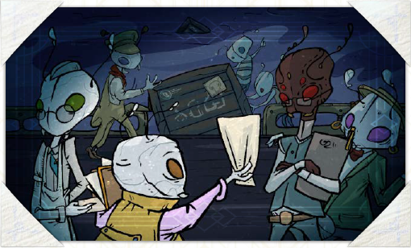
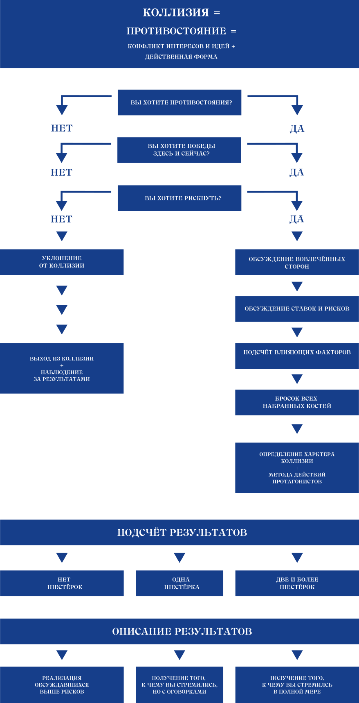
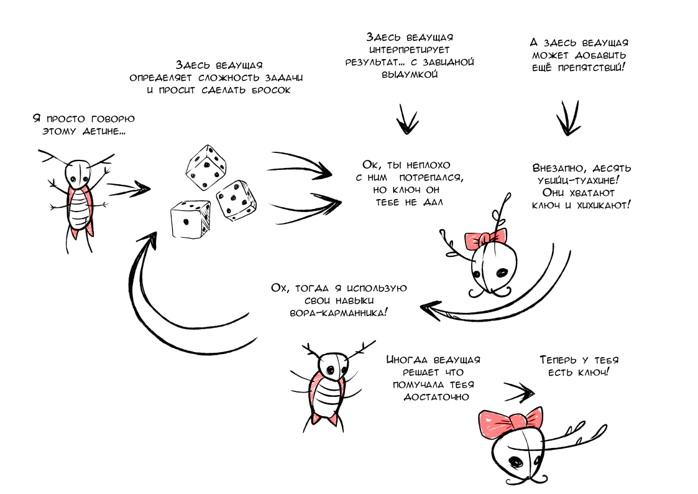
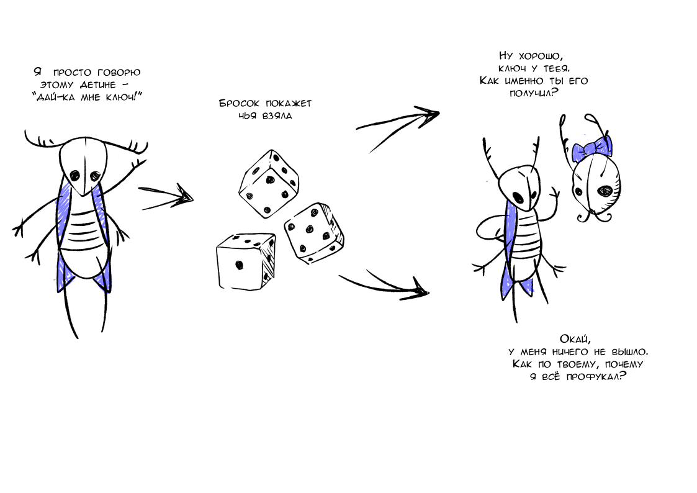

# Спорные случаи

Наше УкМ нарочито спроектировано и выполнено так, чтобы уменьшать количество ненужных, проходных, мелких и малозначимых для истории вашего экипажа элементов механики. Именно поэтому, например, здесь нет оцифрованных «физических атрибутов», «навыков» и «кинь что-нибудь», а описанная далее проверка удачи – бросок нескольких игральных костей – не является непременно центральным инструментом взаимодействия ваших персонажей с миром. Более того, с точки зрения самих персонажей, любая такая проверка попросту опасна, в силу чего нежелательна.

На просторах Веа Туароа к удаче стараются обращаться только тогда, когда речь идёт о жизни, смерти, одержимости победой и так далее. Другими словами, только в случаях по-настоящему крупных ставок и значимых коллизий, а не «если игрок слишком долго разговаривает с NPC».

Более подробный разбор нашей позиции по данному вопросу вы можете найти чуть далее, на страницах для ведущей, а пока вот вам несколько простых принципов:

- не беритесь за кости по мелочам, проходное и малозначимое куда лучше решается деньгами (см. далее), большим количеством попыток или взаимными уступками;

- если берётесь за кости, продумайте и явно проговорите, что за большой куш – крупную сделку, целиком выигранную схватку, уход от преследования – вы хотите вырвать из когтей безжалостной удачи;

- не забывайте, что проигрыш будет сопоставимого масштаба – провалив всего один бросок, вы легко можете приобрести увечье, крупный долг или нежелательную репутацию, которые надолго осложнят жизнь ваших персонажей;

- нелишне будет спросить у ведущей об этих возможных последствиях ещё до броска и, уже исходя из комплексного видения ситуации, решать, хотите ли вы довериться удаче;

- в общем, не рискуйте без нужды, не доверяйте костям и картам, используйте свои метки удачи и пожертвования Морю почаще.

## Драматический торг или четыре шага к непременной победе

Ещё до того, как вы в ситуации с не очевидным исходом (далее – коллизии) возьмётесь поверять свою (не)удачу игральными кубиками (см. стр. XX), задумайтесь – так ли это нужно? Ведь куда безопасней (и надёжней) вы можете достичь успеха… просто купив его. И, более того, в УкМ у вас есть *неотъемлемое* право так сделать, всего за четыре простых шага.

### Шаг 1: оформите коллизию (обсудите это)

Самостоятельно или с помощью ведущей сформулируйте границы, масштаб, ставки, риски и другие параметры драматической коллизии, как это описано на стр. XX‒XX.

### Шаг 2: определите цену (тут всё просто)

Безоговорочная победа обойдётся вам в два условных пункта успеха. Частичная, оговорками, в формате «да, но…» – всего в один. Эти пункты можно выкупить, жертвуя теми или иными ресурсами из списка ниже. Каждое осложнение (см. стр. XX) поднимает цену победы на два пункта. Каждые четыре преимущества (стр. XX) снимают одно осложнение. И все выкупленные, сверх необходимых двух, пункты сгорят сразу после коллизии.

### Шаг 3: выберите плату (можно сочетать)

**Превосходством** – каждая дюжина (12 штук) преимуществ принесёт вам один пункт успеха.

**Временем** – каждая окта подготовки к разрешению коллизии (когда вообще есть возможность тянуть время) также даст вам пункт успеха. Не забудьте учесть затраты на питание и постой.

**Покоем** – в таком случае пункт успеха прибавит 8 единиц к счётчику морской смуты (см. стр. XX). Не забудьте учесть последствия и то, что такую смуту нельзя сбросить до окончания коллизии.

**Деньгами или товарами** – тут каждый пункт обойдётся в 3 000 ог. (или в какие-нибудь товары той же стоимости), помноженных на сумму достоинств и недостатков персонажа, служащего вашим представителем (формальным или неформальным лидером в текущей коллизии).

**Давним займом** – опишите долг, который ваш экипаж уже продолжительное время не возвращает. Придумайте тех, кому вы должны, поселите их на одном из 30-ти описанных нами сбытовых островов (УкМ, стр. XX‒XX), дайте им власть – силовую, законодательную или иную – и желание, достаточные, чтобы взыскать с вас этот долг (но не обязательно деньгами), когда вы посетите означенный остров. Запишите детали ваших взаимоотношений с этими кредиторами в бортовой журнал. Каждые 5 000 ог. займа, помноженных на сумму достоинств и недостатков вашего капитана, позволят вам выкупить один пункт успеха. Запишите детали ваших взаимоотношений с этими кредиторами в бортовой журнал. Каждые 5 000 ог., помноженных на сумму достоинств и недостатков вашего капитана, позволят вам выкупить один пункт успеха.

**Новым злопыхателем** – придумайте человека, обладающего достаточными связями, ресурсами или навыками, чтобы вам навредить. Придумайте свой поступок, из-за которого этот человек затаил на ваш экипаж глубокую, невыносимо зудящую обиду. Запишите детали взаимоотношений с этим новым недругом в бортовой журнал. Назначьте дату – примерно через d6 окт этот ваш злопыхатель тем или иным способом постарается нанести вам ущерб. А потом будет пытаться делать это снова и снова. Такое регулярное неудобство принесёт вам три пункта успеха

**Старыми друзьями** – предложите группе одного из ваших ценных, приобретённых в течение кампании, друзей и союзников, которого вы лишитесь в обмен на сразу четыре пункта успеха. Если группа согласна с достаточной ценностью этого персонажа, опишите свой отвратительный поступок, внезапно обнаруженный вашим (уже бывшим) другом, который поставил однозначный крест на вашем добром знакомстве.

### Шаг 4а: оплатите и наслаждайтесь

Чем бы вы ни пожертвовали, победа за вами. И теперь вы можете двигаться дальше, к новым свершениям.

### Шаг 4б: пострадайте и компенсируйте

Если ни один из видов оплаты вас не прельщает, а участие в коллизии видится неизбежным… Например, потому, что кто-то очень-очень этого хочет… Или потому, что так диктует «безжалостная логика повествования»©™… То вы можете просто принять риски. Дать им реализоваться, сбыться и нанести ущерб. А затем, в обмен на ~~подобный мазохизм~~ такое вот смирение, получить по одной метке удачи (см. стр. XX) на каждого пострадавшего протагониста.

### Шаг 4в: упорствуйте и рискуйте

Если предыдущие два варианта вам почему-то не подходят, перелистните несколько страниц и переходите к заигрываниям с чудовищно низкими шансами понравиться тётке Фортуне.

## Примеры драматического торга

### Пример торга: про санкции

Бравый экипаж судна «Бежетка» причаливает к порту острова Кррвин. Трюмы ломятся от засоленных скальных плипок, которые команда очень выгодно приобрела ранее у фермеров о. Похуту. Полный надежд на барыши капитан (он же медик) спешит к будке таможенного брокера с предложением обеспечить работяг Кррвина вкусной нямкой на много окт вперёд. Однако реальность рушит планы – в связи с тем, что экипаж устроил ранее на Похуту, теперь все пищевые предприятия этого оставшегося далеко позади острова находятся под санитарными санкциями. И, к несчастью для экипажа, на Кррвине об этом уже прекрасно известно. Что определённо означает конфликт желаний игроков со стихиями экономических и политических процессов местного рынка.

Капитан сообщает ведущей, что намерена бороться за Кррвинский рынок сбыта – всеми силами убеждать брокера. Кричать, трясти перед чинушей сертификатами… может быть, даже сорить огневицами. И всё для того, чтобы задекларировать дорогостоящий подсанкционный груз любым возможным способом. Ведущая говорит, что сводить здесь всю коллизию только к одному разговору с рядовым чиновником – мелковато, и определяет противостоящую экипажу сторону как «весь бюрократический аппарат порта вплоть до Старшего Экспортно-Импортного Инспектора, секретариат которого как раз вызвонила брокер».

Группа согласовывает исходы, ставки и риски – в случае успеха протагонистов, плипки всё-же будут допущены к продаже, при провале этого не произойдёт и, к тому же, местные власти (на выбор игроков) или арестуют весь этот груз, или запретят «Бежетке» посещение Кррвина на срок до одного прилива. Частичный успех позволит распространить плипок на локальном рынке, *но* спрос и продажная цена будут заведомо низкими, так как санитарная история с Похуту получит огласку в местных газетах.

Ведущая говорит, что обычно в мелком бюрократическом противостоянии такого рода для утверждения своей позиции игрокам понадобились бы два пункта успеха, но в данном случае есть одно осложнение – у портовых служб имеется присланная по факсу копия запретительной резолюций Министерства, которую местные чиновники уже подписали и нарушать попросту боятся.

Посовещавшись, команда нивелирует осложнение всеми тремя применимыми здесь преимуществами – торговой хваткой капитана, устоявшейся порядочной репутацией экипажа и всячески помогающим капитану в переговорах завхозом. Затем команда выкупает один из оставшихся двух пунктов за 8 единиц смуты (так как матросы нервничают от регулярной ругани капитана с чиновниками в трюме), а второй – за 6 000 (1 дост. + 1 нед. капитана = 2 × 3 000), ушедших на ценные подарки и прочую организацию поддержки со стороны местного охочего до плипок населения.

Ведущая резюмирует: после нескольких склянок беготни и треволнений чиновники признают резолюцию Министерства «вызывающей вопросы» и отправляют её обратно, а портовый брокер ставит на декларации с полновесными полутора тысячами стаунтов консервированных плипок печать: «Ввоз и продажа разрешены».

### Пример торга: про цирковые странности

Команда «Бежетки» встречает в море беспомощно дрейфующий цирк, с капитально испорченной ходовой частью, только что потушенным пожаром и окончательно приунывшей труппой. Всё указывает на то, что цепочка неудач цирка не случайна, и на борту есть какой-то тайный злодей.

Экипаж решает выручить циркачей – не только отбуксировать их до расположенного неподалёку о. Улфур (что совершенно несложно, хотя и уменьшит скорость «Бежетки» вдвое), но и починить двигатели цирка, а заодно разобраться, кто ж это тут нагадил. Последнее – дополнительную цель – ведущая считает явным осложнением, так как заниматься двумя сложными делами одновременно не очень полезно для каждого из них. И это без учёта второго осложнения – искомый злодей, в отличие от протагонистов, хорошо знаком со всеми закоулками циркового судна и социума. Выслушав такие соображения, группа отказывается от починки двигателя и концентрируется только на поисках саботажника, параллельно катаясь на цирковых аттракционах, играя в морское кардо с фокусником и пытаясь устроить попойку с человеком-долмаром.

Ведущая предлагает риски: в случае безуспешности саботажник так и не будет найден, а члены экипажа совокупно получат по d6 ран, каждую из которых нужно будет или распределить среди протагонистов, или обменять на смерть одного из циркачей. При частичном успехе злодей будет найден и схвачен, а тех же ран будет d6/2 (с округлением в меньшую сторону). Такие условия группу устраивают.

Своим представителем в коллизии группа назначает командного медика, так как он владеет навыками гипноза, симпатичный и не имеет недостатков социального плана. Игрок-за-медика, ухватив бразды правления, говорит «а я никуда и не тороплюсь», покупает один пункт успеха за окту времени и, параллельно с занимающим два часа театрализованным охмурением примерно всех приглянувшихся участников труппы, выводит на чистую воду «заговор пяти клоунов», которые настолько эмоционально выгорели, что нашли утешение на поле агрессивной мизантропии, непрерывного прослушивания какофонического джеза и членства в подпольной организации «КС/ВП».

Пойманные в клетку из-под рака-старьёвщика клоуны вопят что-то про своего далёкого могущественного союзника по кличке «Бэгги», который всем ещё отомстит (Бэгги – это новый злопыхатель, которого игрок-за-медика придумал, чтобы выгадать плюс два пункта успеха). Труппа благодарит героев и пускает жидкие салюты. «Бежетка» с прицепом (наконец-то!) прибывает в Улфур. Директорка цирка, томно вздыхая, выписывает экипажу рекомендательное письмо для какого-то влиятельного властителя дум, и приключения продолжаются.

### Пример торга: про каменистую дорогу

Отчаянно пытаясь уйти от неотступно висящей на хвосте ватаги пиратских «кусак» капитана Бллда (с которым у партийного инженера долгие и сложные отношения), экипаж решает провести «Бежетку» сквозь сектор карты занятый рифами. Ведущая извещает команду, что это очень смелый ход и он наверняка позволит избавиться от преследования. Но что это же ход и почти самоубийственный – правила движения сквозь рифы подразумевают, что «Бежетка» получит существенное, вплоть до шести поломов (см. стр. XX), количество повреждений. И что это количество напрямую зависит от пунктов успеха, которые группа готова вложить в данную коллизию. То есть буквально от того, сколько этих гипотетических повреждений группа заранее выкупит. Дополнительно осложнение здесь даёт то, что у «Бежетки» есть подходящий к ситуации недостаток – хлипкий корпус, увеличивающий диапазон предлагаемых к выкупу повреждений до семи. При этом вся игровая группа понимает, что многострадальное судёнышко, вообще говоря, потонет уже на третьем.

Посовещавшись, экипаж решает, что избавление механика от непременного свидания с пиратским капитаном всё же того стоит, и начинает собирать выкуп: два пункта успеха за шестнадцать единиц смуты (плыть сквозь рифы – это очень нервное занятие), три пункта за сброшенные за борт товары общей стоимостью в 18 000 огневиц и ещё два – за 20 000 долга какой-то свежепридуманной и очень криминальной госпоже Хотаре на последнем островке, который команда мельком посетила. После минутной скорби капитан описывает, как существенно полегчавшая «Бежетка» в его умелых руках целую вахту ловко лавирует между торчащих из моря каменных клыков и обломков их предыдущих жертв, оставляя далеко позади безуспешно мечущиеся по волнам пиратские прожекторы.

### Пример торга: про очень плохой расклад

Весь экипаж, за исключением механика, стоит на коленях посреди освещённого факелами каменного пятачка. Вокруг расположилась свора разномастных головорезов – один другого поганее. Двое вожаков своры – громила с размалёванной рожей Бэгги и пышноусый хлыщ с офицерской выправкой Бллд – громко спорят, расхаживая туда-сюда и бросая злобные взгляды на стоящую неподалёку золочёную клетку, где восседает механик экипажа – Хэнки. Суть спора сводится к тому, что либо надо пришить всех протагонистов прямо сейчас, либо что надо продать всех, кроме Хэнки, в рабство. А Хэнки в рабство не продавать, потому что он симпатичный. На этом месте игроки решают, что обе перспективы им не по нраву, и тем самым вступают в конфликт со своими пленителями. В случае успеха они хотят убраться куда подальше, угнав один из пиратских кораблей и подпалив – «чтоб надолго лишить бллдского Блдда ресурсов и закрыть уже эту арку» – все остальные.

Ведущая говорит, что это сложный многоэтапный план, а потом предлагает разбить его надвое – на часть с побегом и часть с саботажем. Игроки, немного поспорив, соглашаются с разумностью такой декомпозиции. Посовещавшись, частичным успехом для первой коллизии группа назначает «сами, конечно, уйдём, но Хэнки оставим тут, это он во всём виноват», полным успехом – «захватили вражеский корабль и уплыли», а рисками – «тут нас всех и поубивают, конец истории». Для второй – коллизии с элементами штурма и саботажа – рисками становятся «поджечь пиратскую флотилию не вышло, её охранники нанесли нам всем суммарно 2d6 ран (распределим их по экипажу и пролам равномерно)», частичным успехом – «поджечь пиратскую флотилию удалось, мы получили d6 ран», а полным успехом – «суда горят и всё вокруг горит, и пираты горят, и мы невредимы».

После этого группа приступает к оценке шансов. На первый взгляд всё против героев: они далеко не профессионалы в деле саботажа и побегов от пиратов (+осложнение), не имеют какого-либо специального снаряжения и ресурсов (+осложнение), окружены и связаны (+осложнение), находятся в меньшинстве (+осложнение), на чужой и неизведанной территории (+осложнение), в рамках своей рабочей деятельности они – заурядности, в силу чего не привыкли действовать быстро и без подготовки (+осложнение). И значимого количества преимуществ, позволяющих отменить хотя бы часть этих препон, у экипажа нет. Таким образом, в каждой из двух коллизий для полного успеха игрокам нужно выкупить по 8 пунктов успеха – 2 базовых и 6 за осложнения. А общий бюджет операции составляет впечатляющие 16 пунктов.

Для начала игроки оптимизируют затраты – решают, что успехов с оговорками вполне достаточно, Хэнки будет неплохо и тут, а на любом пиратском судне есть хотя бы с десяток пролов, по которым можно распределить раны. Это решение сокращает бюджет пунктов до 14-ти. Затем игроки прикидывают, что временем жертвовать тут нельзя, ведь события развиваются стремительно. Ценных товаров и денег тоже нет, их ранее реквизировали пираты. Остаётся только влезать в долги и наживать неприятности. Капитан (она же – медик) Билфа сочиняет сразу двух злопыхателей: торгового партнёра пиратов и наёмного убийцу, родственник которого сгорит вместе с одним из пиратских кораблей. Это даёт группе 6 пунктов. Затем завхоз вспоминает об одном своём старом любовнике и близком друге, который давно уже не возникал в рамках кампании и, видимо, уже не пригодится. Описав, как любовник с негодованием обнаружил вовлечённость завхоза в наркотрафик, и разорвав эту связь, она получает ещё 4 пункта. Ещё 3 группа добирает старым долгом. И ещё 1 берёт в обмен на смуту. На этом выкуп завершается и следующие полчаса игроки описывают свой отчаянный, на грани безумия, побег во всех его достойных лучших образчиков авантюрного жанра деталях.

### Пример торга: про не то место и не то время

Вся команда сидит и мирно кушает в одном из кафетериев выставочного центра, обсуждая детали только что удачно закончившегося дельца. Ничто не предвещает неприятностей. Однако внезапно в кафетерий врываются вооружённые оборванцы в одинаковых беретах, френчах и нарукавных повязках, объявляют всех присутствующих заложниками, происходящее – творческим актом, себя – апологетами новых идей. А потом начинают изымать ценности аудитории, хамить окружающим, переругиваться с толпящейся снаружи охраной ВЦ, стрелять в воздух и всячески наводить блудняк. Ведущая объявляет, что вот это – вынужденная коллизия (см. стр. XX), случившаяся по результатам применения техник, правил и структур «mid-school rene-sans urban-crawl» (что бы это ни значило). И что протагонисты теперь в неё вовлечены. И что предполагаемые ведущей риски – экипаж ограбят на все наличные деньги, обзовут капиталистическими слизнями, продержат в этом кафетерии продолжительное время, под пулями олъмской охранки посадят в грузовик и повезут в неизвестном направлении. И что в случае героического сопротивления протагонистов будут стрельба, взрывы и спецэффекты, а в случае успеха они сбегут не ограбленными и не похищенными.

По лицу ведущей видно, что ей очень хочется ярко и цветасто рассказать и показать именно этот конфликт в рамках именно этой сцены. Что, вкупе с её игровыми полномочиями, не позволяет остальной группе просто, как было уже не раз, заявить «вето». И группа соглашается с этой коллизией. А потом, посовещавшись и подсчитав возможные потери, от лица капитана говорит «мы принимаем твои риски – мы похищены, оскорблены, ограблены на целые 2 735 огневиц и один очень ценный билет в элитный эро-театр, давай наши метки удачи». На этом коллизия объявляется разрешённой, а ведущая продолжительно и в красках разворачивает полотнище своей любви к фильмам Ричарда Доннера и Шейна Блэка.

## Проверка (не)удачи

Итак, в случае той или иной коллизии – спорной ситуации вашего противостояния с людьми, стихией, обстоятельствами или самими собой; когда сроки поджимают, когда для достижения своей цели вы решаете упорствовать; когда однозначно решили пойти против обстоятельств, когда готовы, если надо, на жертвы; когда хотите по-настоящему рискнуть здесь и сейчас, ведущей придётся либо согласиться с вашими притязаниями и разрешить коллизию в вашу пользу, либо предложить вам сделать бросок 4d6 (далее — проверку удачи или просто проверку).

> **Примечание:** часть вышеописанных коллизий является типовыми и гарантированными при соблюдении соответствующих условий, например, коллизия между обитателями ржавых кладбищ и вашим экипажем, зачем-то посетившим их территорию, а часть возникает сама по себе, в процессе повествования.

### Ситуационные преимущества

- Добавьте к базовым 4d6 по одному дополнительному d6 за помогающие в текущей ситуации специальность и/или достоинство (см. стр. XX и стр. XX) вашего персонажа;

- ещё один d6 за подходящее к ситуации достоинство судна (см. стр. 16);

- ещё несколько d6 за то или иное значимое прошлое (стр. XX) или командную репутацию, когда это применимо;

- ещё 4d6, если в рамках текущей коллизии вы двигаетесь к реализации своей мечты (см. стр. XX);

- по одному d6 за каждую дополнительную вахту, потраченную на предварительные планирование, подготовку и эксперименты;

- и, конечно, по одному d6 за каждое очевидное всей группе полезное обстоятельство (праздничное настроение, шум, всеобщее подпитие, давнее знакомство и подобное);

- если хотите, возьмите ещё по одному d6 в обмен на раны (см. стр. 11) по курсу 1 к 1;

- и, наконец, по одному d6 за каждые 180 пожертвованных «на удачу, за плечо да и в Море» огневиц\
  (см. стр. XX),

Если среди выпавших при броске значений будет присутствовать хотя бы одна шестёрка, результат действия будет считаться успешным, хотя и с оговорками (осложняющими обстоятельствами на усмотрение ведущей). Если шестёрок будет две и более, действие станет успешным безоговорочно.

Если шестёрок не окажется вовсе, то рискованная ситуация разрешится не в вашу пользу и её последствия падут на всех, кто вложился в бросок.

## **Осложнения, штрафы и вычеты**

Уменьшите количество шестёрок в результате броска на одну за:

- вопиющее отсутствие необходимого снаряжения или ресурсов;

- каждый недостаток вашего персонажа, влияющий на ситуацию;

- каждые аналогичным образом влияющие недостаток судна и особенность экипажа;

- каждую особенность противостоящей вам в коллизии стороны, которая работает против вас;

- каждого персонажа другого игрока, который может и пытается вам помешать;

- каждое значимое изменение первоначального плана или заявки, сделанное после броска;

- каждое ситуационное осложнение иного характера, если таковые есть.

## Изменение условий и истощение успеха

Зачастую уже после броска и в процессе описания результатов проверки вы можете захотеть как-либо существенно изменить те или иные детали озвученной заявки. Это возможно, если в группе никто не против. Однако каждое такое отступление от первоначального плана на этапе его выполнения (фактически, с учётом того, что ставки и проверка уже сделаны, – изменение задним числом) добавит осложняющее обстоятельство – лишит вас одной из шестёрок, увеличив риск провала и уменьшив степень успеха, вплоть до полного его отсутствия, если таково ваше желание.

## Больше шансов на удачу

Как и во всех авантюрных играх, хорошая подготовка, помощь товарищей по команде, предусмотрительность, расчётливость, готовность к жертвам, верный подход и стиль действий, соответствующий способностям персонажа, сделают его игрока куда более успешным, чем одинокая и безрассудная попытка закидать проблему базовыми 4d6.

**Ещё больше шансов:** вы легко можете снизить сложность броска и рискованность игры в целом, если всей группой договоритесь о замене шестигранников-d6 на четырёхгранные d4-кости с числом успеха 4 соответственно.

**Не полагаясь на удачу:** как легко заметить из приведённого выше списка, игрокам доступна возможность разрешения конфликтов вообще без бросков. Как минимум до тех пор, пока есть чем жертвовать — расплачиваясь метками удачи (по курсу «одна метка за +шестёрку», см. стр. XX) и отказываясь от рискованных побед «здесь и сейчас» в пользу драматического торга (см. выше) – в пользу более непрямых подходов и тонких влияний, персонажи могут и имеют неотъемлемое право вести осторожную и расчётливую игру, совершенно не полагаясь на непостоянную и своевольную фортуну. В конце концов, ваши персонажи торговцы и обычно могут, немного подкопив, просто купить успех взяткой, преобладающей огневой мощью или чем-то подобным.

## Вынужденные коллизии

Иногда протагонисты могут оказаться в ситуациях, где сами правила игры или безжалостная логика повествования, а не потребность персонажей упорствовать в достижении результата будут вынуждать вас к проверкам удачи. По большей части такие ситуации связаны с теми или иными этапами путешествия по тёмным и непредсказуемым водам Веа Туароа (см. стр. XX). Несмотря на кажущуюся принудительность, такие авто-коллизии обычно являются следствием ваших решений, но уже на стратегическом уровне – путешествие в одиночку, а не в составе каравана, путешествие по неизведанным водам за пределами охраняемых маячных трасс, ошибки навигации в силу нежелания пользоваться услугами Лоцманской гильдии и маячных певчих. Всё это избегается, в общем-то, банальным планированием и нежеланием принимать такие риски ради тех или иных душевных порывов, торговых выгод и подобного.

Помимо того, вы всегда можете обойтись без проверки и попытки заарканить фортуну – просто согласитесь с предложенными ведущей или правилами последствиями, получите за это +1 метку удачи и двигайте историю дальше.

## Наглядная схема

## Про задачи, конфликты и другие игры

Почти наверняка предлагаемый нами подход к разрешению спорных ситуаций для вас непривычен, так как, мягко говоря, он не особенно распространён в современных массовых НРИ. Ведь на рынке издавна правят бал классические механики, основанные на так называемом «принципе разрешения задач» – с большим количеством мелких бросков по не менее мелким поводам, проистекающим из конкретных мелких действий.

Однако по сути предлагаемый нами вариант «разрешения конфликтов» очень прост. И для лучшего его понимания вот вам короткий шутливый комикс (все совпадения с реальностью просим считать нарочитым гэгом и сатирическим высказыванием).

**Pic. 1: разрешение задач**

**Pic. 1: разрешение конфликтов**

## Внутригрупповые коллизии

Мы традиционно рекомендуем использовать постановочное, договорное, по соглашению сторон разрешение конфликтов и коллизий, возникающих между рядовыми игроками и их персонажами.

Ведь истоки подобного рода конфликтов обычно лежат за пределами магического круга игры и даже их «разрешение» внутриигровыми, механическими средствами эмоциональный климат в группе не улучшит, оставив за собой хвост из обид, разочарований и неудовлетворённостей.

На основании подобной позиции мы и не предлагаем в рамках данного произведения никаких особых механических способов для ситуаций «игрок против игрока». Что, впрочем, не мешает вам использовать в подобных случаях хоть камень-ножницы-бумага-ящерица-спок, хоть орлянку, хоть спарринг по манильским правилам.

## Персональное здоровье

Каждый сыгравший против вас в коллизии (см. стр. XX) риск соответствующего типа – падение с высоты, удар по голове в подворотне, ожоги при пожаре и подобное – приводит к получению одной и только одной раны. Три накопленные раны означают смерть героя. И вы всегда можете пожертвовать меткой удачи или одним из ваших присутствующих в сцене матросов-пролов (см. стр. XX), чтобы избежать любой раны, вызванной внешними обстоятельствами.

Голодание, жажда и отказ от сна (которого вашим героям требуется немного, всего пара четвертей за вахту) также вредны для здоровья. Каждая вторая вахта без провианта и каждая третья без сна приведут к получению одной раны от истощения.

Здоровье персонажей восстанавливается само при условии полного покоя, хорошего питания и трёх окт времени на каждую рану. Каждая потраченная судовым медиком (при его наличии) метка удачи в таких случаях сокращает это время на окту вплоть до минимума – восьми непрерывных вахт отдыха.

## Немного литературной теории

### Топливом почти любой увлекательной истории служат те или иные т.н. драматические конфликты – принципиальные несходства интересов, идей, контр-идей и подобного, дающие её компонентам (персонажам, стихиям, процессам) энергию для поступательного существования, а самой истории - множество коллизий, т.е ситуаций проявления и практической реализации вышеупомянутых конфликтов.

### Причём тут наша игра? Притом, что даже являясь жанровым симулятором погружного типа (т.н. immersve sim – прим. ред.), она далеко не чужда драматургии там, где находит это уместным. И первейший элемент, которого касается данное правило, – описанный чуть выше основной бросок. Да-да, та самая проверка (не)удачи – испытание смехотворно малыми шансами, через которое время от времени проходит почти каждый УкМ-игрок.

## Ключевые конфликты этого всего

«Окей, – скажешь ты. – Если конфликт – это противостояние идей, а сцена перестрелки аргументами во время таможенного досмотра это вообще не конфликт, но всего лишь производная коллизия, то что здесь сам конфликт? Каким идеям и контр-идеям полагается биться на просторах УкМ, порождая множество обогащающих игровую кампанию случаев?»

Всё просто. В основе нашего произведения (ну, в том слое, где крутятся твои игроки) лежат сразу два таких конфликта:

- внутренний – когда малозначимые с точки зрения общества люди, осознав, что их предыдущая жизнь зашла куда-то не туда, снова и снова не сдаются на милость этой мысли, а пытаются начать всё заново. Пусть и потратив юность на что-то другое. Пусть и в зрелом возрасте. Пусть и с багажом ошибок, упущенных возможностей и долгов за спиной. Потому что они достойны второго шанса несмотря ни на что;

- и внешний – идея, что достаточно упорный труд, находчивость и решимость этих маленьких людей, вашего экипажа, имеют некоторые шансы против огромного безразличного мира, живущего своей жизнью и проходящего через какие-то собственные интересные времена. Конкурирующая с идеей, что всё бессмысленно, а эти маленькие люди непременно будут обществом осажены, подавлены, пережёваны, искалечены, утилизированы и выброшены на обочину жизни соответственно.

Конечно, по всей медиа-франшизе УкМ можно насчитать ещё ряд идейных, этических и эстетических противостояний – старое и новое, война и мир, порядок и хаос, человеческое и звериное, объединение и разлад, конструктивное и деструктивное. Но в рамках этой книжки, посвящённой т.н. Эпохе Благословенного прилива, мы решили сконцентрироваться на двух вышеперечисленных.

## Возвращаясь к коллизиям

Каждая толковая коллизия – фактическое воплощение вышележащего драматического конфликта – должна иметь:

- противостоящие стороны, более или менее воплощающие те самые конфликтующие идеи в количестве от двух и более;

- цели этих сторон – обязательно хотя бы у двух вовлечённых оппонентов, противостоящие и несовместимые друг с другом в чистом виде;

- характер коллизии, определяющий метод действий и средства, которыми эта коллизия будет разрешаться;

- ставки и риски, определяющие, что приобретут или потеряют стороны при выигрыше или проигрыше. Ставками и рисками могут быть деньги, товары, влияние, репутация, договорённости, ценная информация, повреждения судна, чьё-нибудь здоровье и подобное;

- масштаб и значимость – то, какое количество повествовательных изменений повлечёт за собой исход противостояния.

**Примечание:** сторонами-участницами коллизий могут быть не только персоналии. Противостоять вашим игрокам могут организации (в лице совершенно проходных сотрудников категории D), стихия (целью которой, как известно, всегда является сокрушение человеческой воли) и даже их собственные (привет, ZA/UM!) черты личности (см. стр. XX) или их отсутствие – например, совершеннейшее отсутствие приличествующих манер, затребованных торговыми кругами какого-нибудь островка.

**Примечание:** при желании игроки могут сделать свои ставки и риски в конфликтах очень личными – например, рискнуть каким-либо достоинством своего персонажа. Или частью его воспоминаний. Или важным социальным контактом. Или, с согласия команды, если ваша группа посчитает это интересным, даже доверием коллеги по торговому кооперативу.

Определять исход коллизий можно по-разному, но в рамках УкМ обычно используются два варианта.

Один из них – постановочный, когда вся игровая группа (опционально – поторговавшись) просто выбирает один из вариантов и движется по истории далее. Зачастую такой ход принимают чисто рутинные случаи вроде мелкого торга за пачку газет, проезда на метро, вакцинации команды, взятки очередному портовому вахтёру, вдумчивой калибровки орудия и подобного. Риски и ставки сторон в них, конечно, есть, но проходные и не сильно-то значимые для кампании.

Второй – авантюрный, когда кто-либо – рядовой игрок или ведущая – считает, что интереснее будет рискнуть и положиться на горсть d6.

На наш взгляд, в рамках предлагаемых нами жанра и механик УкМ, наибольшим потенциалом обладают коллизии среднего масштаба: не слишком мелкие и не слишком крупные. Например, одно судебное заседание, одна уличная драка, одна осада госбанка с целью получения крупной ссуды на развитие бизнеса, одна дуэль веры или один ожесточённый торг за возможность ещё два прилива спокойно выполнять муниципальный подряд. А также, конечно, один поиск-и-заключение наиболее выгодной сделки по продаже партии ~~кустарной взрывчатки~~ удобрений на новом для вас рынке или один эпизод обыска небольшой деревушки на предмет чего-нибудь ~~ценного и лежащего на виду~~, раскрывающего тайну пропажи ~~молочного слизня~~ ~~короны древней империи~~ ~~вашего предыдущего экипажа~~ местной барменши и так далее.

Также по нашему разумению большая часть подобных коллизий даже при использовании авантюрного подхода, не заслуживает более одного броска со стороны игроков. Соответственно, если тебе, по опыту некоторых других игр, пришла в голову блистательная идея навязать кому-нибудь бросок для «увернись-ка от дубинки бандита», то… Море тебе судья.

Коллизии крупнее и/или опаснее вышеописанных – морской бой, в котором может сгинуть весь экипаж разом, развёртывание сети связей и контрактов на рынке оптовой торговли сладостями, по результатам которого можно вообще вылететь с этого рынка, и подобные можно и нужно сегментировать и разбивать на участки. В том числе для того, чтобы дать игрокам шанс пойти на попятную, а не сразу на корм рыбам с ногами в тазике сверхплотной карамели по результатам всего одного неудачного броска.

Таким образом, всего одна проверка может покрыть сразу несколько действий рискнувшего довериться удаче персонажа. Однако у всех этих действий должны быть одна цель, одна ставка (краткое определение того, чем тут, собственно, рискуют) и один квант (не длинный отрезок) повествования. Таким квантом может быть сцена, понимаемая здесь драматургически как отрезок истории, объединённый местом и временем. Или, например, это может быть один монолог, описывающий, как герой последовательно потратил последние две вахты на пьянку с целью засветиться во всех 146 местных кабаках.

Все действия, которые игрок в рамках коллизии намерен выполнить, должны быть перечислены заранее в одной заявке. Если ведущая готова подтвердить эту заявку, ей останется только оценить риски, с которыми столкнётся персонаж, – скорректировать или предложить ставку, подсчитать и заранее объявить количество вычетов за неблагоприятные обстоятельства, чтобы игрок имел шанс взвешенно их оценить.

При этом мы ни в коем случае не рекомендуем тебе отговаривать игроков от рискованного поведения. Ведь именно их инициативность, азарт и желание ввязаться в неприятности в УкМ двигают вперёд и формируют историю вашей игровой кампании.

### Вещать или не вещать

УкМ поддерживает и монополию ведущей на описательные части игры, и широкую передачу игрокам повесвовательных прав. Ты можешь как разрешить другим участникам группы самостоятельно описывать результаты коллизий (только при выигрыше или при любом из исходов), так и оставить это право за собой. На этот раз мы обойдёмся без каких-либо рекомендаций и мнений. Что тут лучше, а что – хуже, решать только тебе и твоей игровой группе.

## Согласованность действий

УкМ благоволит тем, кто проявляет инициативность, находчивость и смекалку. Однако любая инициативность в нашем (таки социальном) хобби хороша только до тех пор, пока не идёт против воли игровой группы.

Ведущая*,* как символ этой коллективной воли, имеет полное право отказывать игрокам в согласовании неприемлемых (по соображениям логики, этики или эстетики) для кого-либо заявок. А несогласованные с группой проверки по определению никак не влияют на ход игры. Мы считаем, что в нашем хобби неприемлемо просто бросить кости и сказать «вот, у меня получилось \<развёрнутое описание какой-нибудь запредельной фиготы\>!» А также – что подготовка к определению исхода заявки должна начинаться с её обсуждения.

Почему мы настроены так серьёзно? Потому что каждый бросок костей в УкМ неизбежно и безжалостно формирует повествование за счёт последствий. Ради которых игроки и совершают проверки, работающие тут своевольным маневровым двигателем сюжета.

## Безблагодатность насилия

Всеразличнейшие виды насилия и деструктивной агрессии в рамках магического круга игры плотно связаны как с нашим хобби, так и с тем, из чего оно проистекает. Существенная, если не подавляющая, часть настольных ролевых игр содержит чрезвычайно объёмные многостраничные разделы, посвящённые упорядочиванию и созданию приятственного облика – художественно увлекательной и по-спортивному азартной реализации – для боевых действий, драк, нанесения ущерба и подобного.

УкМ принципиально обособляется от этой традиции. Признавая объективную жанровую необходимость дать хоть какие-то средства для насильственного разрешения игровых ситуаций, авторы этой книги отказываются выделять и особо подсвечивать такие методы механически. Базовая процедура проверки удачи одинаково эффективно покрывает как насильственные, так и не насильственные методы действий. И, следовательно, её более чем достаточно для спроектированной нами игры.

## Мелкие неприятности

Мы знаем, что у многих ведущих могут быть сложности, когда надо быстро придумать и предложить группе пучок осложнений после частичного успеха. С полными провалами обычно проблем нет – вы заранее обсудили риск и теперь можно просто его применить. Но частичные успехи – дело другое, ведь в их случае игрокам полагается и искомая выгода, и какие-то мелкие неприятности.

В качестве подспорья при выдумывании таких неприятностей мы предлагаем тебе несколько типовых вариантов, приведённых ниже. Ты можешь использовать их как подсказки, оракулы или непреложное правило в зависимости от собственных предпочтений.

### 2d6 осложнений при частичном успехе

2\. Увеличь корабельную смуту.

4\. Испорть (ценимую) мелочёвку.

5\. Поставь под угрозу ценности.

3\. Мрачно (и туманно) предзнаменуй.

5\. Сообщи (абстрактные)тревожные новости.

6\. Извести о скором ухудшении (текущей ситуации).

7\. Столкни с ошибками прошлого.

8\. Втайне добавь ложку (долгоиграющего) дёгтя.

9\. Навяжи (крайне) сжатые сроки.

10\. Навяжи (дополнительную) ответственность.

11\. Нанеси вред (каким-нибудь) непричастным.

12\. Затаи обиду (от лица персонажей).

### Практические примеры

**Увеличь смуту** — не стесняйся по любому достойному этого поводу раздавать игрокам спровоцированную их собственными действиями смуту.

*«Все попытки успокоить пострадавшего матроса были успешны только отчасти. А его леденящие душу вопли затянулись на целую четверть склянки. Команда нервничает. Добавьте d6 единиц смуты».*

**Испорть мелочёвку** — игроки дорожат имуществом, даже если это *«всего* одна красная скрепка*»*. Где-то она точно бы понадобилась, но мы этого уже не узнаем.

*«Конечно, доктору Кэддоку удалось вскарабкаться на скалу, оставив ползучее непотребство далеко внизу, но его потёртый и нежно любимый пиджак зацепился за острый выступ и с треском порвался точно посередине».*

**Поставь под угрозу ценности** — как материальные, так и не очень. Товары, личные вещи, принципы, контракты и обещания – всё может пригодиться для увеличения чувства ответственности за провал.

*«Пока экипаж отбивался от беснующихся тепелли, вода продолжала затапливать трюм и пропитывать мешки пепельной соли. С минуты на минуту этот ценнейший груз окончательно потеряет товарное состояние».*

**Мрачно предзнаменуй** — пусть их конечности холодеют, лампы мигают, воздух кажется затхлым, голова кружится, старые раны ноют, листовки на стенах шепчут гадости, дурные приметы всплывают в памяти, а в печёнках появляется неуютное ощущение. Это всегда хорошо работает на стиль и дух кампании.

*«В момент, когда Канкртон совершает свой манёвр среди рифов, корабельная иллюминация мигает и экипаж ненадолго погружается во тьму. Возможно, проводка неисправна и контакты фонаря окислились, а возможно, ваш экипаж совершенно зря обидел того бездомного. Кто знает?»*

**Сообщи тревожные новости** – информацию о чём-то, что рано или поздно повлияет на экипаж. Или не повлияет, если игроки отреагируют вовремя и перестанут игнорировать ружьё на стене.

*«Вечерние газеты сообщают, что банда Горги Одноглазого обнесла местное отделение ГосБанка и скрылась от полиции. Вероятно, теперь эти головорезы попытаются покинуть остров на каком-нибудь попутном судне. Та партия взрывчатки, которую вы недавно продали, может быть с этим как-то связана».*

**Извести о скором ухудшении** – замешай в историю обстоятельства, о которых игроки могли даже не подозревать в пылу погони за выигрышем.

*«Пока вы допрашиваете офицеров, неуправляемый крайсер на полном ходу врезается в плавучую крепость, осыпая всех градом обломков. Вероятно, он получил пробоину и скоро затонет».*

**Столкни с ошибками прошлого**. Их прежние деяния наверняка могут и должны становиться поводом для дополнительной драмы.

*«Вам удалось починить и вновь зажечь корабельный прожектор. Но в его свете ваш хог замечают с проходящего мимо пиратского фрегета. Да-да, того самого, что вы оставили в дураках на обмене топливом чуть ранее. Что будете делать, пока пираты меняют курс?»*

**Втайне добавь ложку дёгтя** – запланируй, как пока неизвестные игрокам недостатки купленного товара, найденного поставщика или произведённой сделки скоро или не очень выкажут себя.

*«Закупленные удобрения прекрасно ложатся в ваш трюм, а инсайдерская информация о срочной нужде на сельхозрынках Вакапокопоко определённо внушает надежды на немалые барыши. (Записывает в блокнот: «Личинки кожееда из удобрений скоро расползутся по всему кораблю… и позднее понадобится санобработка трюма».) Так что в ближайшие несколько вахт вам точно будет чем заняться!»*

**Навяжи сжатые сроки** – дефицит времени существенно увеличивает эмоциональную вовлечённость и подталкивает игроков проявлять чудеса смекалки.

*«Ваш очаровательный партнёр по сделке определённо доволен результатом и в благодарность прислал письмо о том, что Агентство уже начало копать это дело. И, если ничего не предпринять, всего десяток склянок осталось до момента, когда за ваши головы будет назначена немалая награда».*

**Навяжи ответственность** – доп. соглашения и контрактные обязательства, ограничения по дальнейшей деятельности, сопутствующие пассажиры, круговая порука и подобные нежелательные обязательства определённо украсят любой «успех с оговорками» и надолго запомнятся игрокам.

*«Ах да! Этот пищащий и гадящий комок щетины прилагается к шкатулке. Его нельзя кормить чаще, чем раз в три склянки, и необходимо доставить в целости и сохранности по тому же адресу, что и всё остальное. Правда же он – милашка?»*

**Нанеси вред непричастным** – проблема вагонетки в действии. Готовы ли игроки менять свои планы ради спасения малознакомых персонажей? Самое время узнать.

*«Уже почти настигнув вора в толпе, Бедвир слышит крик. Это молит о прощении юноша-кансе, тот самый, что обещался быть вашим проводником на следующую вахту. По какой-то причине сейчас его тащат к плахе две крепких стражницы. Что делает Бедвир?»*

**Затаи обиду** – от лица своих персонажей, так или иначе проигравших в коллизии, впиши преуспевших персонажей игроков в книжечку обид. Возмездие может произойти не сразу, а через долгое-долгое время. Но оно непременно свершится. Потом. В самый неподходящий момент.

*«Проигравшая покупательница, не обращая внимания на зычные поздравления аукционного чиновника, выходит из помещения, бросив вам напоследок «До свидания, мои дорогие! Наслаждайтесь покупкой!» Телохранитель уходит вместе с ней, напоследок окинув вас тяжёлым, не сулящим ничего хорошего взглядом».*

## Немного математики

На первый взгляд шансы игроков при проверке удачи выглядят неплохо: примерно 1/2 вероятности на хотя бы одну шестёрку (частичный успех) для неумёхи и 2/3 для профильного персонажа.

Но если целиться в полновесные, без оговорок, успехи (от 2 шестёрок и выше), то картина резко меняется:

- при броске без модификаторов на 4d6 такой успех встречается только в 14% случаев;

- при броске 8d6 прибавляем помогающие специальность, личное достоинство, достоинство судна, профильную репутацию экипажа, шансы выпадения двух шестёрок в этом случае составят уже 39%;

- вероятность трех и более шестёрок на 4d6 будет совсем небольшой – около 2%, на 8 - 13%.

Такие перспективы традиционно в некоторых других играх считаются приемлемыми только для т.н. «выдающегося успеха». Однако в УкМ две и более шестёрки означают всего лишь отсутствие изъянов – результат, оправдывающий умеренно оптимистичные ожидания. А любое мешающее обстоятельство, включая изменение заявки и отступление от плана после броска, разъедает полновесность результата, приводя сначала к появлению недостатков и оговорок, а затем и вовсе к провалу.

Таким образом, даже при максимально профильной для персонажа задаче, шансы на что-то кроме минимального успеха у доверившегося непостоянной морской удаче одинокого волчары плавают где-то в области 40%. Более того, и на 10 костях они поднимутся только до 51% – чуть больше, чем при броске монеты.

## Удача не равна успешности

Как легко можно заметить из приведённых выше расчётов, более или менее опытные мореплаватели вряд ли будут вовсю стремиться к проверкам своей удачи. Ведь удача (не)постоянна, и серьёзный, стремящийся к стабильной успешности человек не станет её тревожить без нужды.

Не отказывай своим игрокам в альтернативных способах разрешения коллизий – взять больше времени, взять больше попыток, найти компромат, предложить ценный подарок, согласиться на ответную услугу, потратить больше денег на старте, чтобы отбить их потом, – эти чисто повествовательные, не механические способы преуспеть на наш взгляд ничем не хуже попыток всё-всё закидывать костями.

На этом месте ты можешь сделать замечание, что если ничего не кидать снова и снова, то игра превратится в «словеску», где всё станет предсказуемо и будет решаться только тем, во что игроки верят или нет!

В ответ мы склонны заметить, что не видим ничего плохого ни в «free form roleplaying», ни в согласии игроков относительно течения истории. А если тебе не хватает случайностей (например, тех, что непременно происходят во время морских переходов и посещения портов, см. стр. XX и XX), ты всегда можешь бросить монетку для определения мотивации собственных персонажей, воспользоваться нашими конструкторами (см. стр. XX, XX и XX) или вытащить карточку одной из наших колод игровых объектов. И всё это – не принуждая игроков вверять свои высокоценные активы – персонажей и пожитки – в лапы чудовищного фатума.

## Распространённые ошибки и заблуждения

- Считать, что проверка удачи – это что-то не опасное;

- кидать кубики бездумно и машинально, на любой чих, безделицу и мелочь;

- браться за кубики до обсуждения ставок, рисков, сторон, влияющих обстоятельств, альтернативных, менее рискованных возможностей;

- считать, что проверка удачи даёт или, тем более, обязана давать кому-либо надёжные шансы на успех;

- считать, что частичный успех, успех оговорками это что-то плохое;

- сводить разрешение любой коллизии именно к проверке удачи, а не к, например, компромиссному удовлетворению интересов, встречным предложениям, чуть большим стартовым затратам и взаимным одолжениям.

### Пример коллизии: про хвост и непостоянство

Один из игроков хочет, чтобы его протагонист проследил за перехватившим контракт конкурентом до порта. С противостоящими сторонами и интересами тут всё ясно: конкурент – опытный контрабандист – отходил не один прилив, так что наверняка будет посматривать по сторонам на предмет хвоста.

Обсудив с ведущей условия и ставки в конфликте (преуспеешь – слежка удалась, знаешь, куда он ходил и что там делал, провалишься – отследить не получилось), игрок делает проверку удачи и получает сразу две шестёрки – безоговорочный успех, «да, удалось». Окрылённый произошедшим, он прерывает описание ведущей, рассказывающей про длительную и увлекательную охоту, предложением «а давайте я у него ещё и бумажник сопру». Ведущая и другие игроки не против, поэтому от результата проверки отнимается шестёрка, а степень успеха снижается до «удалось, но…»

Конечно, теперь игрок и его персонаж не узнают подробностей о паре интересных встреч на маршруте выслеживаемого и о том, что конкурент ещё припомнит лицо подозрительного типа, которого неоднократно видел в толпе. Зато у них будет чужой бумажник с какими-нибудь интересными вещицами.

### Пример коллизии: про выход на новые рынки

После продолжительного плавания экипаж прибывает в новый для себя порт, совершенно не имея представления, что делать дальше, но располагая крупной партией привезённого издалека элитного санфаянса. На коллективном собрании санфаянс решают максимально выгодно продать, а деньги вложить в развитие бизнеса. Но рынок не знаком с героями и это взаимно – герои попросту не знают, куда идти, почём продавать и как остаться в выигрыше. Но что они знают точно, так это что любой их покупатель также желает навариться – купить подешевле, продать подороже. С это точки зрения рынок явно не на стороне игроков и значит, речь идёт об очередной коллизии.

Позитивной ставкой здесь группа выбирает +100% выручки (здесь группа несколько импровизирует) за каждую шестёрку в результатах броска. А негативной становится убедительная просьба к продаже товара сильно ниже закупочной стоимости, подкреплённая весомыми, как рыночными так и не очень, аргументами и соответствующая репутация терпил.

Экипаж выбирает текущую капитанку на роль ответственного за бросок лица и начинает подсчитывать влияющие факторы. На руку группе играет приближающийся прилив и посвящённый этому событию фестиваль – праздничный настрой стимулирует спрос на самые разные подарки. На руку также оказывается достоинство капитанки «торговая хватка» и рваческая репутация экипажа. Активная помощь и консультации ещё двух офицеров тут тоже определённо пригодятся. А осложнением станет в принципе новый и незнакомый рынок с его незнакомыми традициями.

Желая упрочить свои шансы, игроки интересуются у ведущей, нет ли у неё каких-то ещё предложений и возможностей. А ведущая, подумав, решает выдать им непростой выбор: группа может провести длительное, на несколько вахт, предварительное исследование и это даст ещё 2d6 за «понимание местных традиций» и «знакомства среди местных», соответственно. Да, в таком случае сгорит один из ранее взятых экипажем контрактов. Но, возможно, оно того стоит. Капитанка принимает это предложение и переходит к следующему пункту Теперь она решает максимизировать возможные прибыли и идёт ва-банк - добавляет свою метку удачи (чтобы компенсировать осложнение «малоизвестный рынок») и 2d6 за две раны (обыгрываемые как глубокую интоксикацию после большого количества полевых исследований и бесед). Наконец, она тратит последние в судовой казне 360 огневиц на ещё 2d6 и получает запас для броска в размере 14d6. Результат проверки содержит сразу пять ничем не омрачённых шестёрок, что позволяет не только продать груз перекупам в четыре раза дороже закупочной стоимости, но и (потратив одну из полученных шестёрок на дополнение заявки) заиметь постоянного покупателя для подобного рода эксклюзивов. Приближающийся праздник нашей капитанке придётся провести в токсикологическом отделении местной клиники (а её игроку – в роли одного из персонажей-ассистентов). В её отсутствие с экипажем произойдёт ещё немало всего интересного. Но это уже совсем другая история.

### Пример коллизии: про низовую политику

Товарищи из Союза ветеранов Войны душевно пригласили бывшего сослуживца – одного из протагонистов и капитана полупиратского судна «Мирный» – на акцию прямого действия: с патриотическим словом и распиленными черенками от лопат пройтись по лицами и спинам демонстрации локальных отщепенцев-сепаратистов, ратующих за чуть большую самостоятельность и суверенность Базальтовых территорий от Олъмского Совета.

Упомянутый протагонист и его игрок не только соглашаются присоединиться к мероприятию, но даже и рады возглавить одно из ударных звеньев Союза, чтобы показать всем выучку и сплочённость бывалых служак, а также своим вмешательством точно привести эту сторону коллизии к победе. Второй игрок пока колеблется – ему хочется подстраховать своего капитана… Но и посылать в замес своего персонажа – культурного ворюгу с понятиями – ему боязно.

Противостоящими сторонами здесь являются две политические партии, управляющие всем процессом из-за спин активистов. Прямым воплощением воли одной из этих партий временно решает побыть игрок-ветеран. Его интерес здесь – поддержать близкую социальную группу и получить право на ответный, безвозмездный запрос силовой и политической поддержки в дальнейшем (а также показать всем, что с ним стоит считаться). Рискованная ставка - личная безопасность, выраженная как в количестве ран, так и в отсутствии нежелательной политической известности (прямо на акции городская охрана винтить фронтовиков не будет, тут уже всё схвачено).

Наступает вахта «В», склянка «С» и четверть «Ч», союзные клинья подстерегают колонну митингующих в переулках, нарастает шум толпы, а протагонист-ветеран вместе с ведущей подсчитывают применимые к броску факторы – ему способствуют профильное прошлое, непосредственная поддержка товарищей и… всё. На моменте «помогает ли тебе кто-то из группы?» второй игрок всё же решает не вписываться – занимает позицию наблюдателя на одной из ближайших крыш.

Далее следует бросок всех набранных d6. Результат неплох – шестёрка, сулящая пусть и трудный, но успех для акции. Но так как (осложняющее обстоятельство!) со стороны оппонентов присутствовало немало спаек тренированных бойцов из «Национал-Бортовой Партии», ведущая эту одинокую шестёрку убирает. И только последующая трата пункта удачи позволяет игроку вывести ситуацию из крутого пике хотя бы на прежний уровень. Он описывает, как в результате полной героических моментов яростной схватке улица остаётся за фронтовиками. Его герой приобретает существенное уважение и вес «среди своих, в союзном движе» и это сулит немалые перспективы. Но цена победы высока – многие бойцы отправляются по госпиталям, некоторым из них приходится залечь на дно, а выразительное фото нашего «пока что неизвестного патриота» расходится по главным страницам всех местных консервативных газет.

### Пример коллизии: про избегание последствий

Из чистого, не практичного и не подкреплённого материальными выгодами любопытства два игрока решают обследовать отдалённую деревеньку, с которой, по их ощущениям, что-то не чисто. В процессе они неясным для себя образом провоцируют маниакальный психоз у всех местных жителей разом. Дичайше подвывая, те бросаются в погоню, но незадачливым провокаторам удаётся обмануть преследователей. Толпа устремляется вниз, к морю и месту стоянки судна экипажа, оставив провокаторов за спиной.

Увидев приближающуюся толпу, два оставшихся на судне игрока – канонир и механичка – занимают круговую оборону, желая дождаться возвращения товарищей, которые как раз делают какие-то сомнительные знаки со склона, из-за спин толпы.

В целом обе пары игроков предпочли бы поскорее убраться из этого стрёмного порта, но вот незадача – толпа жаждет насилия и гарантировано будет против такого отступления. Ставками здесь определяются «мы все убрались из этого чёртового порта» против «безумцы врываются на борт и устраивают резню».

Чтобы разрешить данную коллизию, экипаж в общих чертах придумывает хитрый план взаимопомощи, вручает полномочия по реализации своему канониру и начинает собирать бросок.

На сторону мореходов встаёт их плавучая крепость – их корабль, отлично вооружённый безоткатным и безотказным орудием. Совсем не боевое прошлое канонира здесь не даёт плюсов, зато его достоинство «чрезвычайная запасливость» тут точно пригодится, как и помощь трёх остальных (и прорывающихся к кораблю, и защищающих корабль от толпы) коллег. Сразу двумя осложняющими обстоятельствами будут многочисленность наступающих безумцев и недостаток самого канонира – жажда крови, «патологическая жестокость», уже туманящая его взор. В итоге ответственный за коллизию игрок собирает 9d6 и компенсирует одно из осложнений своей меткой удачи. Прошептав молитвы бренхи и Морю, игрок бросает все набранные кости и получает всего одну, тут же съедаемую вторым осложнением, шестёрку. Коллизия разрешается совсем не в пользу экипажа: ведущая озвучивает цифры потерь (здесь ведущая импровизирует) – d6 матросов и d6 распределённых по офицерам ран, а затем предлагает игрокам описать детали как провалившегося плана, так и начавшейся бойни. Быть может, экипаж ещё отыграется и сбросит захватчиков за борт, в последующей сцене отчаянного абордажного боя, а быть может – нет. И тогда их следующие мореплаватели наверняка учтут ошибки предыдущих.

### Пример коллизии: про скоростную реквизицию

Пока остальная группа пытается унести ноги (и вёсла) от толпы взбесившихся селян, пятый игрок решает воспользоваться внезапно опустевшей, оставленной убежавшими к пристани жителями, деревней в целях личного обогащения. Конечно, у него мало времени. И он может не успеть присоединиться к отплывающему экипажу. И где-то в деревне всё ещё скрывается то, что свело обитателей с ума. Но, конечно же, данного игрока подобные мелочи не останавливают. Таким образом, стороны этой разворачивающейся в параллель c предыдущей коллизии: неблагоприятные обстоятельства (сжатые сроки и сельские ужасы) против очень предприимчивого протагониста. Ставки: «на бегу обнести c десяток временно пустующих домов на сумму, не меньше чем, и успеть на корабль» против «попасться в ловушку, понести ущерб, не успеть к отбытию».

Персонажу помогают былое ремесло – некогда он был вором-домушником – и достоинство «сверхъестественная ловкость». Другие игроки заняты, а их персонажи никак не влияют на ситуацию. Временное отсутствие обитателей деревни могло бы стать помогающим обстоятельством, но оно полностью компенсируется сжатыми сроками, прогнившими половицами и подобным.

Собранные игроком 6d6 не внушают уверенности, так что он добавляет ещё два за ранения и делает бросок. Результат содержит всего одну шестёрку и, чтобы жертвы не были напрасны, он тратит свою метку удачи. Это безговорочный успех, так что игрок теперь может описать как его в режиме спринта преодолевший все трудности, существенно подранный и покрытый какой-то жижей не суть важного происхождения (ползучее непотребство? не интересно, проматываем!) персонаж радостно бежит к своему судну c карманами, полными чьих-то фамильных ценностей. Ему ещё только предстоит узнать, что на борту идёт ожесточённый бой, что кто-то подпалил склад топлива, а командный Ужас вплотную подобрался к критическим 25-ти пунктам. Но это уже совсем другая история.

## Про помощь (и подарки)

В представленных выше механизмах разрешения коллизий другие игроки могут помогать вашему протагонисту, давая +преимущество за каждого из своих союзных вам персонажей.

Эффективность легко увеличить: один раз за игровую встречу вы можете приобрести и вручить кому-нибудь из экипажа ценный подарок – статуэтку, гравюру, ювелирное изделие и подобное (см. стр. XX), – стоимостью не менее 5000 огневиц. Каждый такой подарок увеличит полезность помощи одаренного на +преимущество. Максимальное количество подобных подарков (и накапливаемых преимуществ) ничем не ограничено. Их полезный эффект распространяется только на дарителя. К тому же они имеют и обратное действие – увеличивают не только преимущества, но и осложнения, добавляемые в коллизию, если обладатели подарков решат вам помешать.

А ещё накопившиеся подарки в любой момент можно выкинуть, украсть, потерять, сломать, сжечь или сдать в ломбард за половину изначальной стоимости.

## Брачные отношения

Несмотря на то, что брак с не состоящими в Программе лицами для вас запрещён, Министерство смотрит сквозь пальцы на бездетные союзы внутри сообщества вольных торговцев. Оформление замужества / женитьбы тривиально – необходимо внести 7 102 огневицы пошлины специальному чиновнику в любом цивилизованном порту, предоставить справки по формам ТК989394‒6, ВР33897‒Б, УЕ24349Б‒32 и расписаться в соответствующих документах. А затем уже можно надеть номерные кольца, пожать руки, снести переборку между каютами, купить кружавчики для подушек, поставить на полку фарфоровых тепелли и начать наслаждаться прелестями брака.

### Пользы от официального союза многочиcленны:

- улучшается здоровье – восстановление ран (см. стр. XX) занимает вдвое меньше времени;

- количество преимуществ от помощи (или осложнений от попыток не дать вам натворить дел) со стороны ваших супругов увеличивается вдвое от нормы (включая надбавки за подарки);

- наконец, появляется возможность клянчить скидки «для семейных» в магазинах хозтоваров и детского питания, что, согласитесь, не безделица.

#### Недостатков у такого сожительства тоже хватает:

- запас меток удачи (стр. XX) и карманные деньги каждого из супругов перестают быть личными и отправляются в семейный фонд;

- в случае долгов, судебных преследований и личных злопыхателей у кого-либо неприятности от них очень быстро становятся общей докукой;

- кому-то из забрачевавшихся наверняка приходится объяснять, что за квитанция «Общества любителей пощекотать слизней» обнаружилась под кроватью, куда пропала заначка гроздёвой настойки, откуда эти пятна и почему коробка с шейными чехольчиками снова не закрыта.

**Ну и для справки:** развод требует формального обоснования в трёх экземплярах и обходится дороже – стоит уже 16 232 огневиц. Причём оплатить его могут как обе стороны в складчину, так и какая-то одна, например та, которой это постановил сделать суд.
