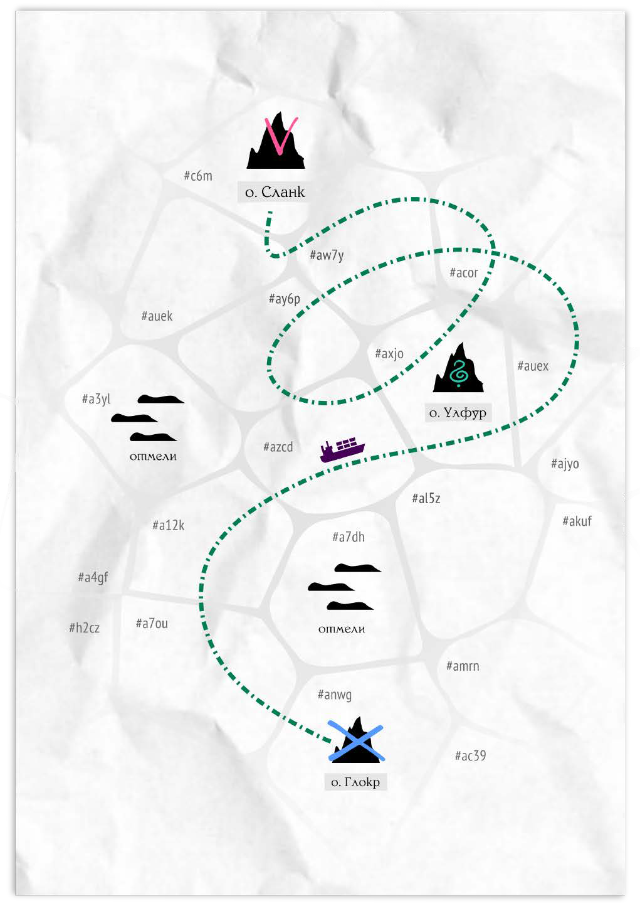

# По морям, по волнам

## Секторы

Вся доступная для путешествий игровая карта поделена на отдельные участки – секторы. В каждом впервые посещённом секторе вас может ждать ранее неизвестный остров, неожиданная встреча с чем-либо или совершенно пустая водная гладь. Впрочем, некоторые из расположенных в таких секторах объектов могут быть вам заранее известны из тех или иных источников – слухов, консультаций, найденных или купленных данных и подобного.

В начале игры вы ставите фишку своего корабля на предоставленную ведущей карту моря, и, впоследствии, двигаете её из сектора в сектор, по тому или иному маршруту. В процессе, ведущая сверяется с записями, иногда кидает кубики и рассказывает вам обо всём, с чем вы встречаетесь по пути.

## Навигация

### Геометрия направлений

Доступный всем и наиболее проблематичный способ попасть куда-либо – геометрическая навигация – проста, как солевой червь: навигатор рутинно высчитывает направление согласно известным ориентирам, берёт азимут и старается, чтобы судно плыло ровно по прямой всю дорогу до предполагаемого конечного пункта.

Очевидными минусами является абсолютная невозможность точной корректировки курса за пределами ранее изученных гексов с постоянными ориентирами, а также влияние факторов случайности: погрешности в расчётах, бурных морских течений, ~~алкоголизма, сексоголизма и шизофрении~~ небрежности рулевого и т.п.

### Гильдия лоцманок и певчих

Общепризнанно надёжным и коммерчески применимым решением для путешествия в какое-нибудь отдалённое, но известное место на просторах Веа Туароа служит профессиональная интуиция представительниц Гильдии лоцманок и маячных певчих народа ва’ро. История этой организации теряется в глубинах седой древности, а олъмские пока так и не смогли объяснить, на каких натурфилософских явлениях и законах основаны предлагаемые Гильдией способы навигации. Однако факт остаётся фактом – если вам будет известна конечная точка и вы заплатите гильдейской лоцманке, она приведёт вас туда, куда вам надо. Ну, если не сядет в своё складное каноэ и не покинет вас на полпути в случае какого-нибудь конфликта.

### Течения

Бурные течения Веа Туароа чрезвычайно своенравны. Именно их никому не подвластная и неукротимая мощь часто приводит к тому, что странствующие суда сбиваются с изначально намеченного пути, отклоняются от курса и блуждают во тьме.

Однако их можно применять и для собственной пользы. В случае потери всех запасов топлива или поломки двигателя посреди нигде, вы можете опустить за борт самодельный или комплектный подводный парус и просто ждать, пока течения со скоростью один сектор за четыре вахты не вынесут вас куда-нибудь.

Говорят, давным-давно, во времена Империи ва’ро, это даже было одним из основных способов путешествий. При наличии гильдейской лоцманки вы всё ещё можете использовать его целенаправленно, меняя глубину постановки паруса согласно её указаниям и медленно, но верно дрейфуя в нужном направлении.

## Скорости и затраты

Обычно при работающем двигателе пересечение каждого сектора занимает одну вахту (семь склянок) и расходует один стаунт (стр. XX) топлива. При необходимости вы можете форсировать двигатель и идти на пределе его возможностей – в два раза быстрее. Конечно же это приведёт к двойному расходу топлива и потребует проверки удачи вашего механика. Риском для такой проверки будет крупная, эффектная и добавляющая +1 полом (см. стр. 92) неисправность ходовой части судна.

На старте при нулевом классе судна (см. стр. XX) вы тратите одну меру провианта за каждый пройденный сектор, но можете сэкономить вдвое, если матросов на борту – только половина от максимальной вместимости (с округлением в меньшую сторону, например 5 матросов для базового класса судна, см. стр. XX). Однако будьте осторожны! В том случае, если количество матросов внезапно окажется меньше половины от доступного максимума (4 и менее на старте игры), скорость вашего судна точно так же уменьшится вдвое.

Наконец, вы можете использовать матросов в качестве провианта (в пропорции 1 к 1), однако каждый тайно съеденный матрос увеличит смуту (стр. XX) на d6 единиц. Каждый матрос, съеденный без какой-либо секретности, поднимет смуту сразу на 3d6 единиц и приведёт к судебному преследованию, а затем и штрафу за антиобщественное поведение в первом же порту, в котором об этом станет известно.

### Буксировка

Ваш корабль может, вполне эффективно, тащить за собой на тросе (буксировать) те или иные плавучие объекты, размером до четырёх раз превышающие его самого. Например, торговое судно первого класса может буксировать суда второго, третьего, четвёртого классов. Однако каждое кратное увеличение размера «прицепа» будет снижать скорость движения – буксировка судна второго класса замедлит вас вдвое, третьего – втрое, а нагрузив себя судном четвёртого класса вы будете преодолевать один сектор за четыре вахты, соответственно.

При этом, какой-нибудь плавучий, снабжённый понтонами, контейнер с грузом до 1500 стаунтов (меньше или сопоставимый с размером трюма) тот же кораблик первого класса на длинной дистанции может буксировать без сокращения скорости, хотя и несколько теряя в манёвренности – получая +осложнение на крутых поворотах, трюках и т.п. Два 1500-стаунтовых контейнера (или буксируемое судно второго класса), соответственно, дадут уже +2 осложнения и снизят ходкость вдвое. Три… ну, в общем, вы поняли принцип. А более четырёх таких контейнеров судно начального класса уже буксировать не сможет, в рамках всё того же, озвученного выше, правила.

## Фуражировка

Фуражировка, как вы, вероятно, знаете из других игр про путешествия, представляет собой процесс поиска припасов на местности. Конечно же она возможна и в нашей игре. Например, команда, заявив именно такую ставку в коллизии, может завладеть некоторым количеством рационов после поимки и умерщвления какой-либо морской живности, а топливом и запчастями – после обыска (см. стр. XX) встреченных во время путешествия мест и т.д.

## Морская смута

Зыбкая тьма Укрытого моря не создана для уроженцев суши. Каждая вахта плавания по тёмно-фиолетовой глади вдали от хорошо освещённых и обжитых портов давит на психику, лишает воли, провоцирует развитие психозов и усугубляет фобии. Когда негативные эффекты в той или иной степени касаются вашего экипажа, на корабле, как некая невесомая эманация, начинает копиться нервное напряжение. Или, как его чаще обозначают во флоте, – смута.

Конечно, полновесные олъмские мореходы вроде ваших протагонистов умеют держать себя в узде и бороться со стрессом, однако более простые души – рядовые матросы, пролы (см. стр. XX) – куда уязвимее. В их случае скопившаяся смута может и будет прорываться наружу вспышками истерии, насилия и самоубийств. И, как давно известно, даже полная смена команды вам тут не поможет – попав на борт, свеженабранные пролы будут нервничать в той же степени, что и предыдущие. Однако способы сбросить смуту всё же существуют и они перечислены ниже.

1.  Базовое значение смуты на борту в начале игры равно нулю.

2.  Каждый пройденный сектор карты увеличивает значение смуты на единицу.

3.  Некоторые события (встречи с непреодолимой опасностью, сцены жестокости или беспомощность перед лицом злого рока) также могут увеличить значение смуты на количество, определяемое ведущей.

4.  В то же время позитивные события, например показательное избегание неминуемых рисков и ужасных опасностей, могут уменьшить смуту на значение, определяемое ведущей.

5.  Вы можете уменьшать смуту*,* отпуская команду на берег для посещения местных пабов (возможны дезертирства), посещая различные увеселительные заведения (может привести к незапланированным приключениям) или проводя профилактические беседы с матросами от лица вашего медика (см. ниже).

### Примеры изменений морской смуты:

- −2d6 за посещение всеми офицерами танцевального салона, см. стр. ХХ;

- −d6 за посещение офицером дурманного притона, стр. ХХ;

- −d6 за отправку матросов на одну вахту в паб, стр. ХХ;

- −d6 за преодоление опасностей и значимый триумф над стихией;

- −d6 (или −d6/2) за успешную профилактическую беседу (см. далее);

- +1 за каждую вахту пути во время морского путешествия;

- +1 за смакование мрачных тем вслух или перебранку офицеров;

- +d6 за показательную публичную жестокость по отношению к окружающим;

- +d6 за поведение, косвенно подвергающее окружающих опасности;

- +d6 за каждую склянку, проведённую в пугающих местах и опасных условиях;

- +d6 за каждого разумного пассажира или члена команды, втайне переработанного на провиант;

- +2d6 за намеренное и вопиющее пренебрежение безопасностью, жизнями и здоровьем окружающих;

- +3d6 за каждого разумного пассажира или члена команды, без какой-либо секретности переработанного на провиант.

### О профилактических беседах

Каждую чётную вахту ваш судовой медик может организовать для всех не занятых матросов терапевтическое собрание, чтобы сбить уровень стресса через мотивирующие беседы, групповые психопрактики, психодраму и подобное. Всё перечисленное сопровождается специфической и лишённой рисков проверкой – броском 4d6 со всеми полагающимися модификаторами. В случае полного успеха этой проверки, смута снизится на d6 единиц, в случае частичного – на d6/2. Из-за отсутствия рисков такую проверку нельзя будет заменить торгом (см. стр. XX).

#### Шкала опциональных эффектов накопленной смуты

|  |  |
|:---|:---|
| **0‒4** | Матросы ведут себя нормально и с готовностью выполняют свои обязанности |
| **5‒9** | Матросы чуть более беспокойны и суетливы, чем обычно |
| **10‒14** | Матросы суматошны, в их разговорах часто проскальзывают бредовые фантазии |
| **15‒19** | Матросов беспокоят кошмарные видения. По кораблю прокатываются их странные шепотки. Кто-то не переставая ноет, кто-то причитает или истерически смеётся прямо во время работы |
| **20‒24** | Матросы подавлены и почти забросили свои обязанности. Каждую вахту d6 матросов пытается свести счёты с жизнью |
| **25+** | Матросы уже за гранью безумия. Их разум окончательно ломается и они поднимают бунт. Возможно, через посулы, обещания, самопожертвование или непомерную жестокость вам удастся справиться с восстанием. В таком случае уровень смуты, вне зависимости от количества попутных жертв, снизится на d6 единиц |

### Фиксация смуты: пиратский метод

Те морские разбойники, которые вообще держат в команде матросов-пролов, давно нашли свой метод борьбы за дисциплину – добавляя к вахтовому провианту по унсу покойной зомы (см. УкМ, стр. XX) на десять пролов, они вчетверо замедляют накопление смуты. Побочными эффектами являются шанс ⅙ терять,, одного прола каждую вахту из-за отравления и острой диареи, а также невозможность опустить смуту до значения менее 10-ти.

### Таблица путевых расходов (на один сектор)

|  |  |  |  |
|:---|:---|:---|:---|
|  | Базовые расходы | Иллюминация | Форсированный режим\* |
| Более половины команды | −1 *топлива*, −1 *провизии*, +1 *смуты* | −2 *топлива*, −1 *провизии*, +0,5 *смуты* | −1 *топлива*, −0,5 *провизии*, +1 *смуты* |
| Половина команды | −1 *топлива*, −0,5 *провизии*, +1 *смуты* | −2 *топлива*, −0,5 *провизии*, +0,5 *смуты* | −1 *топлива*, −0,25 *провизии*, +1 *смуты* |
| Менее половины команды | -2 *топлива*, −0,5 *провизии*, +1 *смуты* | −4 *топлива*, −0,5 *провизии*, +0,5 *смуты* | −2 *топлива*, −0,5 *провизии*, +1 *смуты* |

*\*Требует регулярной проверки навыков Механика*

## Торговые караваны

Караваны — цепочки судов, плывущих сквозь тьму ради единой цели, — один из основных способов торговых сношений для народов Укрытого моря. За относительно небольшую мзду эти плавучие торговые сообщества могут обеспечить весьма неплохую защиту от морской жути, пиратов, погрешностей в расчёте припасов и т.д. Вспомните об этом, когда задумаетесь о переправе на тот или иной остров через неспокойные и полные опасностей морские просторы. Возможно, путешествие в дружной компании среди множества коллег – торговцев, экспертов, авантюристов и других (см. стр. XX) персонажей ведущей – подойдёт вам лучше, чем одиночные странствия во тьме. Как минимум – в начале игры.

### Лица караванов

Как правило, караваны принадлежат нескольким людям или даже какой-то организации. При этом у конкретного каравана всегда есть т.н. «первое лицо» — та или тот, кто руководит морским походом. Подобные официальные представительницы и представители наверняка станут для вас отличным материалом для социализации во время длинных рейсов, например партнёрами по беседе, азартным играм, морским байкам и подобному. Вы можете взять имена для таких лиц на стр. XX, XX и XX или придумать их самостоятельно, а остальные детали определить броском 4d6 согласно приведённой ниже таблице.

|  |  |  |  |  |
|----|----|----|----|----|
|  | **Типаж** | **Народ** | **Приметная деталь** | **Мотивация** |
| 1 | Бандитка на пенсии | Олъм | старая травма, заметно осложняющая жизнь | строить безупречную деловую репутацию |
| 2 | Таинственная леди | Олъм | всегда в маске и бесформенном балахоне | максимизировать прибыль и минимизировать убытки |
| 3 | Дерзкая юница | Олъм | постоянно увешана оружием и взрывчаткой | поддерживать неукоснительные дисциплину и порядок |
| 4 | Простоватая великанша | Ва’ро | необычайно отвратительна и добросердечна | беречь своих людей и заводить полезные знакомства |
| 5 | Скаредная карлица | Ва’ро | привлекательна, жестока и любвеобильна | стать лучшей караванщицей в рейтинге Торговой лиги |
| 6 | Эксцентричная аристократка | Кансе | до странности беспомощна и рассеянна | рисковать и участвовать в авантюрах |

### Размеры караванов

В общих чертах торговые караваны Укрытого моря представлены тремя типами — маленькими и компактными ватагами, более крупными спайками, а также особенно большими и редкими гуртами.

|                  |                      |            |                       |
|------------------|----------------------|------------|-----------------------|
| **Тип каравана** | **Количество судов** | **Защита** | **Помощь в коллизии** |
| Ватага    | d6+3                 | d6+2       | +4 преимущества       |
| Спайка    | d6+10                | 2d6+10     | +8 преимуществ        |
| Гурт      | 2d6+20               | 4d6+10     | +12 преимуществ       |

### Защита караванов

Защиту каждого конкретного каравана представляют вооружённые суда сопровождения, берущие на себя все встречающиеся на пути угрозы.

Механически такая защита — это число опасных встреч в море, которые караван может попросту миновать. При этом с каждой пропущенной встречей защита будет уменьшаться на единицу. Караван может полностью восстановить свой показатель защиты, простояв на рейде Олъма, Н’Те Поа или Салайфа две полных вахты.

#### Нулевая защита

Разумеется, рачительные владельцы караванов предпочитают не допускать снижения защиты до нуля, регулярно восполняя её в трёх столицах, однако в море случается всякое.

Исчерпавший свою защиту караван не теряет способности обороняться при встрече с неприятностями. Но в подобных ситуациях опасности становятся куда весомее – теперь торговым судам участников придётся принять бой или улепётывать, путая следы и отклоняясь от проверенного маршрута. Что в обоих случаях для ваших персонажей означает коллизию с некоторым количеством преимуществ, зависящих от размера каравана.

Фиксированным риском такой коллизии здесь будет сокращение пригодных к самостоятельному передвижению судов каравана на единицу. Если результатом такого вычета судов окажется 0, то весь караван прекратит своё существование.

### Не опасные события и встречи

В ситуациях, когда повстречавшиеся места и события не опасны, но вызывают интерес у игроков, их офицеры могут провести радиопереговоры и поделиться с первым лицом своим любопытством. Если лицо будет заинтересовано (например, каким-либо подарком), караван может (хотя и не бесплатно) встать на постой и подождать, пока ваша команда удовлетворит свои интересы. Средняя цена такого ожидания начинается от 2 000 ог. за вахту.

### Маршруты караванов

Ведущая может определить маршрут каждого каравана на свой вкус, просто соединив острова и порты по цепочке, однако такой путь следования всегда должен учитывать два простых правила:

- караваны посещают только гавани трёх столиц и тридцати наиболее крупных ходовых островов, перечисленных на стр. XX;

- караваны всегда избегают мёртвых вод, ржавых кладбищ, жутевых впадин и окрестностей пиратской столицы – Костегрыза.

### Стоимость участия

Базовая стоимость присоединения к каравану составляет 500 ог.

### Прибавьте к этому:

- по 100 ог. за каждый дополнительный порт на пути следования;

- по 100 ог. за каждую единицу защиты каравана свыше первых пяти;

- опционально – 5 000 ог. за страховку перевозимых товаров, что позволит получить возмещение стоимости испорченных товаров в денежном эквиваленте прямо во время плавания;

- опционально – 5 000 ог. за страховку судна от повреждений, что позволит получать бесплатный ремонт прямо во время плавания;

- опционально – 10 000 ог. за страховку судна от уничтожения, что позволит в течение d6 окт получить новое судно эквивалентного класса в ближайшем крупном порту.

### Поиск караванов

В любом ходовом порту Веа Туароа ваш капитан может сделать специфическую, без существенных рисков, проверку удачи – бросок базовых 4d6 со всеми полагающимися преимуществами и осложнениями.

1.  При безоговорочном успехе (2 шестёрки в результатах броска) караван уже стоит в порту и отправляется прямиком до нужного вам острова в течение ближайшей вахты.

2.  При успехе с оговорками (одна шестёрка) просуммируйте все выпавшие значения 3 и меньше – именно столько островов посетит этот караван перед тем, как достигнет интересующего вас порта. Стоянка в каждом промежуточном пункте при этом займёт не менее двух вахт.

3.  При провале (отсутствии шестёрок) просуммируйте все выпавшие 3 и меньше — именно столько вахт, согласно местным слухам, пройдёт до появления следующего каравана в интересующем вас направлении.

По умолчанию доступные вам караваны имеют минимальный размер – являются ватагами (см. выше). Однако за каждую шестёрку сверх первых двух вы можете увеличить размер доступного каравана до следующей категории.

### Путешествие в караване

Для команды: отмечайте путевые траты как обычно и не утруждайтесь расчётами маршрута — опытные коллеги проведут вас оптимальным (хоть и не всегда кратчайшим) путём ровно к обещанным портам.

Для ведущей: совершай броски на путевые происшествия как обычно и отменяй те из них, которые сочтёшь опасными, постепенно уменьшая защиту каравана.

### Внутренний рынок

Путешествуя в караване, вы всегда можете приобрести топливо и провизию по двойной олъмской цене и продать любые свои товары за половину стоимости. В случае отсутствия страховки караван также может предоставить вам все необходимые стройматериалы и запчасти, оборудование и квалифицированных ремонтниц (входят в стоимость материалов) за тройную цену.

### Расставание с караванами

Вы и ваше судно можете покинуть караван в любой момент. Потраченные деньги не возвращаются. Бизнес есть бизнес.

## Учётные документы

Практически любая игровая кампания с использованием материалов УкМ:БП имеет все шансы превратиться в бесконечный поток самый разных сведений об окружающем протагонистов мире – имён, географических названий, денежных сумм, деталей взаимоотношений и локальной политики… Большая часть такой информации вряд ли нуждается в каком-либо документировании, однако ваша игра и ваши персонажи только выиграют, если вы воспользуетесь предоставленными нами инструментами для ведения записей, примеры заполнения которых мы приводим далее. Пустые бланки этих же документов вы можете найти в конце книги, на стр. XX, или скачать с нашего сайта – укрытоеморе.рф

### Бланк грузоперевозок

Табличный документ, предназначенный для записей о наименовании, количестве, пункте назначения и сроках доставки (когда они вообще есть) тех или иных перевозимых вами грузов.

\<иллюстрация_заполненный_бланк_грузоперевозок\>

### Бланк социальных контактов

Ещё один табличный документ с полями для информации об именах, местонахождении, размере долга (что особенно важно в случаях выбора соответствующих пунктов драматического торга) и кратких деталях взаимоотношений с теми или иными торговыми контрагентами.

\<иллюстрация_заполненный_бланк_социальных контактов\>

### Произвольные заметки

Помимо двух документов выше мы рекомендуем вам также держать где-нибудь неподалёку несколько листов писчей бумаги для зарисовок и записей о всякой всячине, не укладывающейся в сухие графы табличных столбцов.
