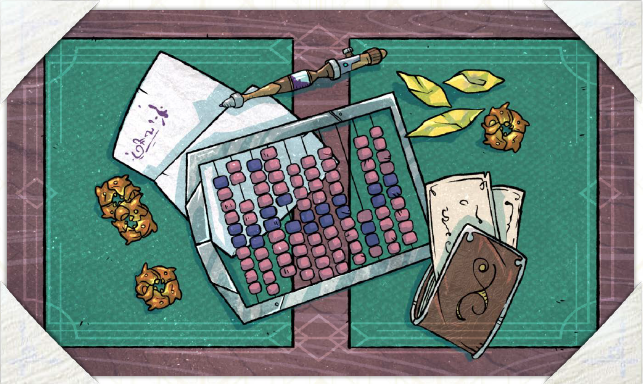
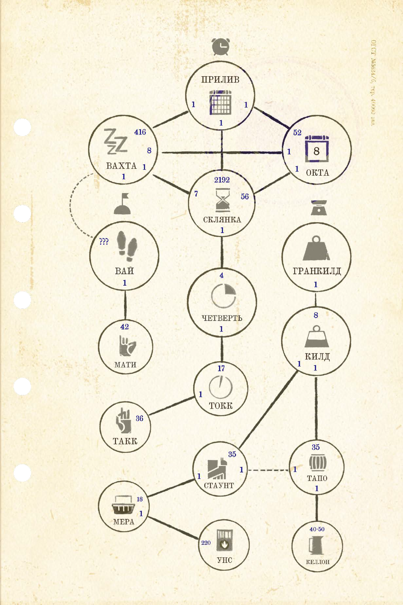
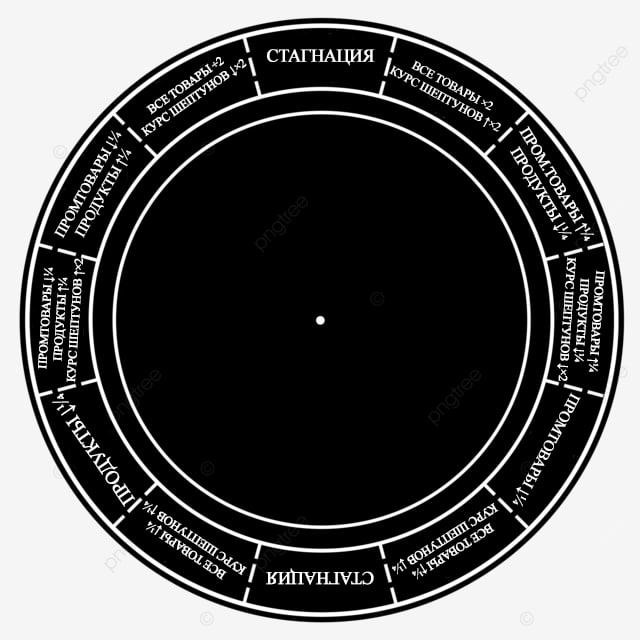

# Прикладная экономика

## Экономика

В трёх столицах только и разговоров, что о море и барышах. Торговые площади и рынки в любую вахту полны посетителей. Стрекочущие наречия продавцов и покупателей не замолкают ни на мгновение, взрываясь то криками зазывал, то отменной базарной руганью. А за закрытыми дверями солидных зданий из стекла и стали совершаются сделки покрупнее. Здесь решается судьба трёх народов, вовлечённых в бесконечный цикл товарооборота.

Вот уже с десяток приливов как борьба за выживание переоделась из военного мундира в сюртук морского торговца, снабжённый десятком потайных карманов и тугих кошельков. На давно обжитых островах не всегда хватает пространства, еда в дефиците, а за внимание рынка приходится бороться. В паутину устоявшихся связей одинаково крепко вплетены и одиночные предприниматели, и торговые группы, и крупные холдинги с государственным участием.

Основу выживания каждого развитого поселения Укрытого моря составляет торговля, и наверняка это почтенное занятие скоро окажется в сфере ваших интересов. Далее мы излагаем ряд сведений о началах товарооборота и того, как именно он может пойти вам на пользу.

### Конвертируемая валюта

Транснациональная экономика Укрытого моря зиждется на огневицах – спящих бесконечным сном гусеницах редкой бабочки-пламенки, обитающей исключительно в пределах Ва'ро Рохе. Способ усыпления гусениц известен только избранным жрицам ва’ро, а количество ежеприливно попадающих на рынок огневиц настолько мало, что не вызывает какой-либо существенной инфляции.

Огневицы нельзя подделать, подменить или украсть: каким-то образом чёртовы спящие личинки чуют нечистых на руку торговцев и взрываются прямо у них в кошеле! Несмотря на подобные свойства (скорее, даже благодаря им), огневицы уже много сотен приливов позволяют всем желающим заключать сделки и приумножать состояния.

Вторым универсальным предметом обмена служат шепчущие камни, они же шептуны: небольшие, длиной в палец, блестящие веретёнца, каждый из которых стоит не менее тысячи огневиц и имеет собственный уникальный «голос». Камни действительно шепчут, и любой желающий может легко в этом убедиться, хорошенько прислушавшись. Говорят, камни прокляты, и хранящие их долго неизбежно сходят с ума – заболевают счётной болезнью. Говорят также, что для производства шептунов используют человеческие души, а узнавшие секрет производства в деталях неизбежно погибают от синегнили всего за пару десятков вахт. Но разве всё это может помешать бизнесу?

Наконец, в качестве третьего способа оплаты, клиенты одного из банков Олъм Нде и Ва\`ро Рохе могут воспользоваться банковским чеком или переводом (например для того, чтобы оформить по-настоящему крупную сделку).

> **Примечание:** если вы действительно захотите включить в игру опасность использования шептунов и вам нужна какая-нибудь несложная механика, просто кидайте 4d6 каждый раз, когда ваш персонаж использует это платёжное средство. В случае выпадения четырёх единиц добавьте ему +1 недостаток – теперь его неудержимо тянет кататонически пересчитывать любые однотипные предметы в поле зрения. После повторения такого инцидента персонаж обзаведётся ещё одним недостатком – устрашающими слуховыми галлюцинациями. После третьего раза без успокаивающих прикосновений к вожделенным шепчущим камням начнёт впадать в бешенство. И, наконец, после четвёртого станет пожирать эти камни при любой возможности, что, конечно же, приведёт к медленной и мучительной смерти. Такие дела.2

### Единицы измерения

\[ИНФОГРАФИКА: ЕДИНИЦЫ ИЗМЕРЕНИЯ\]

Обитатели Укрытого моря много торгуют друг с другом и давно выработали устоявшуюся систему измерений.

- Время, в том числе для путешествий, состоит из приливов, вахт и склянок. В один прилив вмещается 416 вахт или 52 окты, в одну окту – 8 вахт, а в одну вахту – время, которое ваш персонаж может воздерживаться ото сна без последствий для здоровья – 7 склянок. Каждую из которых для удобства делят на четыре т.н. четверти. Вахты при этом могут быть условно разбиты на ранневахту, средневахту и поздневахту.

- Более мелкие периоды времени также могут быть измерены токками и такками. Такк здесь – минимальная единица измерения, щелчок пальцами. А токк – 36 таких щелчков, 1/17 часть четверти склянки.

- Дистанции измеряются вахтами пути, ваями и мати. Один вай примерно равен длине человеческого шага и состоит из 42 мати.

- Вес измеряется гранкилдами, килдами, стаунтами, мерами и унсами. Один стаунт это то, что человек может поднять и пронести примерно восемь шагов. Он вмещает 18 мер, а одна мера составляет приблизительно 220 унсов. Один килд составляет ⅛ гранкилда и состоит из 35 стаунтов.

- Объёмные вещи, например жидкости, меряют келлонами – количеством жидкости, которую средний человек может выпить за один присест, – и бочками-тапо, в каждую из которых вмещается от 40 до 50 келлонов.

### Профильные темы

Каждый экипаж вольных торговцев с актуальным министерским патентом может заходить в любой порт Олъм Нде и Ва’ро Рохе, а также имеет право запрашивать как юридическую, так и силовую защиту любой из этих двух наций. Более того, на первые пять приливов своей деятельности эти кооперативы освобождены от уплаты каких-либо налогов согласно условиям специальной Программы.

Конкретное направление бизнеса вольных кооперативов при этом регламентируется не строго – их участникам, конечно, запрещён ряд бизнес-проектов оседлого (см. стр. XX) типа, но всё остальное более чем разрешено и даже поощряется. Ваши протагонисты могут торговать. Могут возить людей и почту. Могут оказывать услуги как юридическим, так и частным лицам. Могут очень многое. И часть из этого «многого» мы перечислим далее, где-то предлагая готовые игровые структуры, а где-то полагаясь на сообразительность и эрудированность вашей группы. Ведь на все нюансы даже какого-то одного рода бизнеса ни одной книжки не хватит.

#### Экспорт-импорт

Самый простой и почти всегда попутный способ заработка. Покупая товары в одной гавани и сбывая их в другой (см. далее), вы можете прозаично и банально получать маржу с этих операций.

##### Разницы цен

- Купленные в любой из трёх столиц – Олъме, Салайфе и Н’Те Поа – промышленные (не пищевые) товары стоят в два раза дороже на островах, отдалённых от этих столиц более чем на четыре сектора;

- пищевые товары и промышленное сырьё в столицах также дороже, чем на периферии;

- каждый ходовой порт (см. стр. XX‒XX) имеет один непромышленный товар, стоящий в два раза дешевле обычного;

- свежие (не старее 7 вахт) олъмские газеты и журналы стоят в пять раз дороже где угодно за пределами Олъма, но пригодны к реализации только в количестве 4d6x1000 мер в цивилизованном порту и 2d6 – в хоть сколько-то населённой гавани.

##### Пульсы курсов

> Этот блок дополнительных правил предназначен только для самых хардкорных любителей бухгалтерии. Применяйте исключительно на свой страх и риск!

При каждом заходе в любую из трёх столиц делай бросок по приведённой ниже таблице (или запускай волчок по шаблону-крутилке со стр. XX) и соответственно обыгрывай результат для своих игроков.

##### 2d6 колебаний курсов

2\. Цена на все товары повышается в два раза и курс шептунов к огневицам увеличивается вдвое.

3\. Цена на промышленные товары повышается на четверть, а на продуктовые товары – понижается на четверть.

4\. Цена на промышленные товары повышается на четверть,на продуктовые товары понижается на четверть, а курс шептунов к огневицам уменьшается вдвое.

5\. Все промышленные товары дешевеют на четверть.

6\. Цена на все товары повышается на четверть и курс шептунов к огневицам понижается на четверть.

7\. Стоимость товаров и валютные курсы остаются без изменений.

8\. Цена на все товары понижается на четверть и курс шептунов к огневицам повышается на четверть.

9\. Все продуктовые товары дешевеют на четверть.

10\. Цена на промышленные товары понижается на четверть, на продуктовые товары – повышается на четверть, а курс шептунов к огневицам повышается вдвое.

11\. Цена на промышленные товары понижается на четверть и цена на продуктовые товары повышается на четверть.

12\. Цена на все товары понижается в два раза и курс шептунов к огневицам уменьшается вдвое.

#### ⊕ Заказные грузоперевозки

Самый простой вариант услуг – «от бизнеса к бизнесу»: нужно взять что-то на острове А и привезти на остров Б. За деньги. Иногда с задатком, иногда без – как договоритесь. Иногда с грузом тихим и несложным, а иногда с грузом, требующим обеспечения спец. условий (например, холодильника). Иногда с конкретными сроками. Иногда со сроками очень неконкретными.

Как правило, такие заказы приходят к вам через чтение газетных объявлений, слухи в портовых кабачках, друзей чьих-то друзей и «холодные визиты» – когда вы ломитесь чуть ли не в каждую лавку с вопросами «А вам ничего, тащемта, не надо бы да-аставить на?..» и воплями «Ма-а-арские перевозки! За-а-адёшево!!!»

> **Примечание для ведущей:** мы знаем, что придумывать снова и снова подобные заказы общего характера бывает утомительно. Так что тут ты всегда можешь делегировать их составление всей группе – предложить игрокам сочинить, что и откуда надо везти. И какие нюансы есть у этого простого, казалось бы, дела. Ну или воспользоваться нашим списком/карточками типовых заказов и конструктором со стр. XX.

##### Базовые расценки

- Попутная и не срочная доставка, за каждые 100 стаунтов, за сектор – 11 ог.;

- срочная (с фиксированными сроками) доставка в конкретное место, за каждые 100 ст/сект. – 55 ог.;

- спешная доставка в конкретное место и в сжатые сроки, за каждые 100 ст/сект. – 380 ог.

##### Надбавки за риск

- Небольшая вероятность столкнутся с осложнениями – +50%;

- значительные и регулярные риски в течение всего срока перевозки – +100%;

- гарантированная опасность для судна и экипажа – +300%.

##### Надбавки за спец. оборудование

- Перевозка груза в пром. холодильнике, +200%;

- сохранное буксирование негабаритных грузов (обычно, в плавучих контейнерах) специальной оснасткой, +50%.

При этом, рейсы за пределами Союза и вне Светличного пути всегда считаются значительными рисками и вознаграждаются соответственно.

##### Оплата

При попутной, но не срочной доставке, аванс составляет до 50% (по договорённости с отправителем). За срочную или скорую доставку перед началом плавания обычно выдают не более 1/3 гонорара. Полная предоплата – крайняя редкость, из разряда фантастики.

##### Нарушение сроков

При нарушении согласованного времени срочной транспортировки, отправитель вправе (хотя и не обязан) потребовать, на месте или через суд, неустойку в размере до 200% гонорара (по договорённости).

##### Повреждение или пропажа груза

При повреждении или пропаже груза, отправитель вправе (хотя и не обязан) потребовать, возмещение его полной стоимости и, дополнительно, сумму гонорара за доставку в тройном размере.

#### Пассажирские перевозки

Та же доставка из А в Б, но уже самих заказчиков. Приходит к вам теми же путями. При необходимости, имеет те же наценки за предсказуемые риски.

Может быть демократичной и массовой, а может – элитной и эксклюзивной. В первом случае потребует приобретения и установки на судне пассажирского отсека, во втором – пассажирского отсека премиум-класса (см. стр. XX). Питание в стоимость перевозки не входит и оплачивается отдельно (на чём некоторые ушлые кооперативы умудряются сколотить состояние, а затем и условный срок).

Вероятность того, что вас уже ждёт попутный пассажир до одного из ваших пунктов назначения, в трёх столицах составляет 1/2 на каждую вахту. На ходовых островах – 1/6, а в захудалых и отдалённых колониях – 1/6 на окту. Вероятность того, что на вас самостоятельно, без рекламы, выйдет заказчик, готовый оплатить весь рейс в конкретную точку только ради себя любимого, на старте кампании стремится примерно так к 1/100, увеличиваясь вдвое с каждым повышением класса вашего судна. За пределами ходовых островов эта вероятность вдвое ниже.

##### Базовые расценки

- попутная не срочная доставка за каждого пассажира, за сектор – 20 ог.;

- доставка в оговорённые сроки за каждого пассажира, за сектор – 40 ог.;

- скорая доставка в сжатые сроки за каждого пассажира, за сектор – 400 ог.

##### Надбавки за комфорт

- Общая каюта с питанием – +50%;

- каюта без соседей с питанием – +300+%;

- каюта премиум-класса на двоих с питанием – +350%;

- каюта премиум-класса без соседей с питанием – +500%.

> **Примечание для ведущей:** как и в случае заказов на доставку, потенциальных пассажиров ты можешь взять со стр. XX‒XX, XX‒XX или воспользоваться их конструктором на стр. XX.
>
> В том же разделе, на стр. XX-XX ты найдёшь куда более тяжеловесную и детальную расширенную версию правил по пассажироперевозкам.

#### Почтовые отправления

С окончанием Войны, расцветом второй, уже послевоенной, волны колонизации Внутреннего фронтира, после ряда чудовищных скандалов с продажей личных данных и переписки, а также из-за зашкаливающего процента не доставленной корреспонденции, доверие населения к Олъмпочте было окончательно подорвано. И вместе с шуточками типа «То, что мертво, умереть не может: Олъмпочта!» население постепенно стало больше полагаться на а) сложное и многослойное шифрование личной корреспонденции и б) конкретных, персонализированных, имеющих патент Программы вольных торговцев.

Так что теперь, в эпоху Благословенного прилива, в любом порту, прямо в будке таможенного чиновника, вы можете поинтересоваться, нет ли какой-то попутной корреспонденции – бандеролей, открыток и писем. За вручение которых вам традиционно заплатит адресат. И защита от вскрытия которых обеспечивается вложенными внутрь одной-двумя огневицами, взрывающимися при слишком сильном давлении, тряске, перегреве или распечатывании отправления кем-либо кроме адресата.

Вероятность того, что в одной из трёх столиц вам предложат доставку попутной почты составляет 1/6 на каждую вахту. На ходовых островах – 1/2. А в захудалых и отдалённых колониях вам предложат её доставить практически наверняка.

Не то чтобы это всё было хорошей основой для бизнеса, но подрабатывая почтарями, вы радуете вполне конкретных людей в конкретных местах. И, конечно, имеете шансы обзавестись множеством новых интересных знакомств повсеместно.

##### Базовые расценки

- Попутная доставка за письмо или открытку, за сектор – 2 ог.;

- попутная доставка за бандероль или мелкую посылку – 5 ог;

- доставка корреспонденции за пределы Союза – вдвое дороже.

#### Особые поручения

Иногда, настолько часто, насколько пожелает ваша ведущая, к вам будут обращаться с самыми деликатными просьбами различные лица и организации (стр. XX и XX, соответственно). Как правило, эти просьбы будут подкреплены солидными суммами. И, вероятно, будут содержать некоторые (например, таможенные) риски.

Приведённая ниже таблица позволит легко и быстро набросать для них скелетную основу, из которой, приложив немалую толику фантазии и опыта, вы наверняка сможете развить авантюрную историю, достойную любого кабака на просторах Веа Туароа. Ну или сможете просто решить, что такой вот замечательный заказ вам прямо сейчас не нужен.

Стоимость любого особого поручения будет начинаться от 10 тыс. ог. в том или ином эквиваленте. Заказчик, предмет, действие, неустойка и награда обязательно должны быть в единственном числе. А вот препятствий может быть более (но не менее) одного – каждое дополнительное увеличит бюджет вдвое: два препятствия поднимут стоимость заказа до 20 тыс. ог., три – до 40 тыс. ог. и так далее.

<table>
<colgroup>
<col style="width: 33%" />
<col style="width: 33%" />
<col style="width: 33%" />
</colgroup>
<tbody>
<tr>
<td><h5 id="заказчик">Заказчик</h5>

<strong>1.</strong> Армия.

<strong>2.</strong> Улицы.

<strong>3.</strong> Маска.

<strong>4.</strong> Торгаш.

<strong>5.</strong> Лорд.

<strong>6.</strong> Нечто.

<h5 id="предмет">Предмет</h5>

<strong>1.</strong> Деликатес.

<strong>2.</strong> Драгоценность.

<strong>3.</strong> Шифровка.

<strong>4.</strong> Механизм.

<strong>5.</strong> Пленник.

<strong>6.</strong> Чудовище.
</td>
<td><h5 id="действие">Действие</h5>

<strong>1.</strong> Доставка.

<strong>2.</strong> Устранение.

<strong>3.</strong> Похищение.

<strong>4.</strong> Подлог.

<strong>5.</strong> Поиск.

<strong>6.</strong> Изучение.

<h5 id="неустойка">Неустойка</h5>

<strong>1.</strong> Деньги.

<strong>2.</strong> Корабль.

<strong>3.</strong> Смерть.

<strong>4.</strong> Плоть.

<strong>5.</strong> Удача.

<strong>6.</strong> Боль.
</td>
<td><h5 id="препятствие">Препятствие</h5>

<strong>1.</strong> Пропажа.

<strong>2.</strong> Конкурент.

<strong>3.</strong> Порча.

<strong>4.</strong> Флот.

<strong>5.</strong> Жуть.

<strong>6.</strong> Подстава.

<h5 id="награда">Награда</h5>

<strong>1.</strong> Деньги.

<strong>2.</strong> Корабль.

<strong>3.</strong> Пакт.

<strong>4.</strong> Удача.

<strong>5.</strong> Карта.

<strong>6.</strong> Артефакт.
</td>
</tr>
</tbody>
</table>

#### Морские истории

Морские истории и зарисовки являются ценным товаром для различных периодических изданий и литературных альманахов. Время от времени вы можете неожиданно для себя оказаться участником подобной истории. А затем, посетив какой-либо цивилизованный порт на одном из ходовых островов, вы можете – исключительно в письменном виде – поделиться ей с местной газетой. Если написанный вами рассказ будет по-настоящему увлекателен (если он понравится вашей ведущей и остальным игрокам), вы единоразово получите d6 × 1 000 ог.

#### Кладоискательство

Немало сокровищ было похоронено на далёких островах Укрытого моря. Многие из этих кладов всё ещё ждут своих смельчаков. Практически в каждом порту вы можете купить не менее одной совершенно подлинной (ха-ха!) карты сокровищ или наводку на какое-нибудь странное, наверняка полное этих сокровищ место (например, один из наших особенных островов, см. стр. XX), чтобы отправиться в погоню за мечтой и отыскать сокрытые богатства.

«Полное сокровищ место» по решению ведущей может оказаться как относительно недавно заброшенным бункером или севшим на мель конвоем времён Войны, так и чем-то более старым – следами первой волны олъмской колонизации, остатками Империи ва’ро или ещё более странными вещами (см. стр. XX).

#### Портовые отчёты

Качественно выполненные портовые отчёты охотно скупаются олъмским Министерством (по цене 4d6 × 1 000 ог.) и могут служить источником вполне достойной подработки.

Однако для того, чтобы отчёт был признан качественным, вам обычно необходимо погрузиться в самую суть жизни посещаемого порта и разрешить конфликт (см. стр. XX), лежащий в её основе.

#### Помощь правопорядку

Набравшись смелости, вы можете попробовать себя в роли самозванных слуг закона и взять один из контрактов Агентства (см. стр. XX и XX). После этого вам останется только выследить какого-нибудь скрывающегося бедолагу, отловить его и доставить прямо в любящие объятья судебных приставов или патологоанатомов.

## Морской бибоп

> Изложенные далее на нескольких страницах материалы не обязательны к использованию в рамках вашей кампании. Более того, они, во-первых, могут существенно повлиять на жанровый ландшафт этой кампании, привнеся в неё приличную толику прямого и социально одобряемого насилия. Во-вторых, они потребуют дополнительных жанровых компетенций и усилий по интерпретации как от ведущей, так и от каждого игрока в группе. В общем, мы рекомендуем вам ответственно подойти к решению использования или игнорирования изложенных ниже правил, ключей и оракулов. *See you, ~~space~~ ~~cowboy~~ sea slugboy.*

Острова Веа Туароа разрознены. Морские пути, пролегающие между ними, ненадёжны, а нормы закона на периферии куда мягче, чем в окрестностях трёх столиц. Примитивные технологии распознавания лиц посредственны, как и контроль над населением. Впрочем, кое-кому это идёт на пользу. Закоренелые преступники и нарушители норм часто проскальзывают сквозь пальцы столичных служителей закона и, как морская дымка, растворяются в фиалковых сумерках отдалённых островных поселений.

Подобная, бесспорно, плачевная ситуация пагубна для общества. И в то же время очень хороша для бизнеса. Вашего бизнеса. Бизнеса, построенного на «охоте за головами».

### Миссия

Согласно нижеизложенным правилам, все заказы на беглых преступников состоят из:

1.  персоналий преследуемых объектов;

2.  вменяемых им провинностей;

3.  награды за доставку и передачу в руки властей;

4.  мест нахождения (и вероятной поимки) этих чрезвычайно ценных беглецов.

Все миссии по выполнению этих заказов официально санкционируются и оплачиваются только Агентством – межгосударственной организацией, плотно связанной с правительствами всех ныне живущих Народов моря. Агентство имеет представительства в каждой из трёх столиц (Олъме, Н'те Поа, Салайфе) и не спешит открывать свои офисы где-либо ещё.

Пункты 1‒3 ведущая может определить согласно таблицам «Конструктора миссии» (см. далее), а пункт 4 — по таблице «6d6 портов» на стр. XX.

#### Процедура охоты

1.  Во время пребывания в одной из трёх столиц, спроси у игроков, хотят ли они заглянуть на местную Площадь правосудия и ознакомиться со списком объектов охоты.

2.  Если игроки выразят интерес, воспользуйся «Конструктором» и составь d6 профилей миссии (объект, цена, вина и место).

3.  Предоставь эти профили и дальнейшие действия по их интерпретации игрокам.

4.  Реагируй на их действия соответственно, используй собственные задумки или процедуры УкМ для дальнейшего развития повествования.

5.  Когда (если) объект будет захвачен, предложи игрокам посетить ближайший офис Агентства, сдать пленника и получить причитающуюся награду.

#### Накладные расходы

- Все крупные разрушения, произведённые персонажами игроков в рамках охоты, должны вычитаться из суммы награды за поимку или компенсироваться самими игроками.

- Определение размеров этих сумм исключительно ситуативно, и нам пока не удалось выявить универсальной механики для подобных случаев. *Дальше не придумывали — импровизируй.*

- Персонажи игроков могут попытаться избежать ответственности за причинённый ущерб, но в таком случае сами рискуют рано или поздно очутиться в списке разыскиваемых лиходеев.

#### Взять живым или мёртвым

- Ваши персонажи могут доставить объект в Агентство как живым, так и мёртвым. Во втором случае важно сохранить его внешнюю узнаваемость.

- Естественные процессы разложения сделают объект неузнаваемым в течение примерно трёх вахт. Остановить эти процессы можно при помощи различных химикатов и консервантов: например, засыпав тело пеплосолью или замариновав в капо с крепким гроздёвым вином.

- Для опознания объекта и предоставления награды Агентству обычно достаточно только головы, рук и ног.

- Стоимость мёртвого объекта всегда в три раза меньше, чем живого.

#### Сложности выборов

- В процессе охоты вашим игрокам неизбежно придётся принимать те или иные решения с сомнительными и неочевидными результатами.

- Помните, что «поступить по закону» в реалиях Укрытого моря, как и в нашем мире, далеко не всегда означает «поступить правильно», а отказ от контракта *обычно* не грозит персонажам игроков вообще никакими формальными последствиями.

### Конструктор

#### 6 × 4d6 целей и обстоятельств

<table style="width:100%;">
<colgroup>
<col style="width: 4%" />
<col style="width: 9%" />
<col style="width: 11%" />
<col style="width: 12%" />
<col style="width: 13%" />
<col style="width: 8%" />
<col style="width: 22%" />
<col style="width: 18%" />
</colgroup>
<tbody>
<tr>
<td></td>
<td>Имя</td>
<td>Фамилия</td>
<td>Прозвище</td>
<td>Возраст</td>
<td>Цена</td>
<td>Вина</td>
<td>Интрига</td>
</tr>
<tr>
<td>4</td>
<td>Ларака</td>
<td>Щарл</td>
<td>Фонарь</td>
<td>На рассвете жизни</td>
<td>15 000</td>
<td>Самосуд</td>
<td>Встречный контракт</td>
</tr>
<tr>
<td>5</td>
<td>Токи</td>
<td>Йорс</td>
<td>Зубатка</td>
<td rowspan="7">На пике юности</td>
<td>9 000</td>
<td>Организация саботажей и забастовок</td>
<td>Заложники</td>
</tr>
<tr>
<td>6</td>
<td>Фенель</td>
<td>Гвидд</td>
<td>Красава</td>
<td>6 000</td>
<td>Множественные растления</td>
<td>Заточение</td>
</tr>
<tr>
<td>7</td>
<td>Бахаб</td>
<td>Керреши</td>
<td>Лот</td>
<td>3 600</td>
<td>Побег из матчего дома</td>
<td>Кубышка</td>
</tr>
<tr>
<td>8</td>
<td>Рика</td>
<td>Вармат</td>
<td>Нос</td>
<td>1 500</td>
<td>Политический терроризм</td>
<td>Дублёр</td>
</tr>
<tr>
<td>9</td>
<td>Эгир</td>
<td>Ресс</td>
<td>Штука</td>
<td>1 050</td>
<td>Торговля наркотиками</td>
<td>Ложный след</td>
</tr>
<tr>
<td>10</td>
<td>Ахи</td>
<td>Торайва</td>
<td>Соль</td>
<td>1 200</td>
<td>Сбежавшая супруга</td>
<td>Опасные связи</td>
</tr>
<tr>
<td>11</td>
<td>Вол</td>
<td>Герт</td>
<td>Туби</td>
<td>960</td>
<td>Торговля краденым</td>
<td>Покровительство</td>
</tr>
<tr>
<td>12</td>
<td>Пэт</td>
<td>Зекхи</td>
<td>Линза</td>
<td rowspan="6">На середине пути</td>
<td>900</td>
<td>Организация грабежей</td>
<td>Силовая поддержка</td>
</tr>
<tr>
<td>13</td>
<td>Вигиз</td>
<td>Брёт</td>
<td>Кирпич</td>
<td>600</td>
<td>Долговые обязательства</td>
<td>Перекуп</td>
</tr>
<tr>
<td>14</td>
<td>Рахам</td>
<td>Вадари</td>
<td>Слиток</td>
<td>850</td>
<td>Финансовые махинации</td>
<td>Конкуренция</td>
</tr>
<tr>
<td>15</td>
<td>Затая</td>
<td>Гараман</td>
<td>Кука</td>
<td>630</td>
<td>Похищение детей</td>
<td>Твердыня</td>
</tr>
<tr>
<td>16</td>
<td>Каушик</td>
<td>Ямани</td>
<td>Лапа</td>
<td>960</td>
<td>Не указана</td>
<td>Пешка</td>
</tr>
<tr>
<td>17</td>
<td>Арайа</td>
<td>Рост</td>
<td>Шрам</td>
<td>990</td>
<td>Засекречена</td>
<td>Информатор</td>
</tr>
<tr>
<td>18</td>
<td>Вокси</td>
<td>Карахи</td>
<td>Док</td>
<td rowspan="6">На склоне лет</td>
<td>1 200</td>
<td>Серийный вандализм</td>
<td>Невиновность</td>
</tr>
<tr>
<td>19</td>
<td>Тусси</td>
<td>Айоту</td>
<td>Шишка</td>
<td>1 500</td>
<td>Неуплата налогов</td>
<td>Неразлучники</td>
</tr>
<tr>
<td>20</td>
<td>Лекош</td>
<td>Восск</td>
<td>Пила</td>
<td>1 560</td>
<td>Тяжкое оскорбление</td>
<td>Иллюзионист</td>
</tr>
<tr>
<td>21</td>
<td>Локо</td>
<td>Локо</td>
<td>Угорь</td>
<td>2 400</td>
<td>Лжесвидетельство</td>
<td>Доброволец</td>
</tr>
<tr>
<td>22</td>
<td>Рутем</td>
<td>Рех</td>
<td>Весло</td>
<td>4 200</td>
<td>Нарушение контракта</td>
<td>Смертник</td>
</tr>
<tr>
<td>23</td>
<td>Госс</td>
<td>Роква</td>
<td>Мелочь</td>
<td>9 600</td>
<td>Кража в особо крупных размерах</td>
<td>Эпицентр</td>
</tr>
<tr>
<td>24</td>
<td>Лайо</td>
<td>Сатха</td>
<td>Кувалда</td>
<td>За пределами старости</td>
<td>15 000</td>
<td>Серийные убийства</td>
<td>Отзыв контракта</td>
</tr>
</tbody>
</table>

### Интриги

#### 4. Встречный контракт

Пока персонажи выполняли контракт по поимке цели, кто-то заключил контракт на них самих.

#### 5. Заложники

Поимка и извлечение объекта приведёт к гибели большого количества людей.

#### 6. Заточение

Объект уже находится в заключении (в частной тюрьме, на станции временного содержания, в клетках подпольных работорговцев, в другом подобном месте). Само собой, просто так объект персонажам не отдадут.

#### 7. Кубышка

Объект готов поделиться информацией о местонахождении тайника с деньгами и ценностями (не менее × 5 от первоначальной суммы контракта) в обмен на прекращение преследования и фальсификацию данных о смерти объекта.

#### 8. Дублёр

Всё это время персонажи ошибочно шли по следу другого, хотя и крайне похожего на объект человека.

#### 9. Ложный след

Первоначальные сведения о месте пребывания объекта оказались искусной дезинформацией. Персонажам нужно двигать на совсем другой остров, а ведущей — сделать ещё один бросок на определение интриги.

#### 10. Опасные связи

У объекта есть тайные, но могущественные союзники. Не выходя из тени, они на каждом шагу чинят персонажам различные и крайне досадные препоны.

#### 11. Покровительство

У объекта есть общеизвестный и могущественный покровитель, который обрушит свой гнев на персонажей в случае неукоснительного выполнения контракта.

#### 12. Силовая поддержка

У объекта в подчинении есть люди — крупная банда, баталия наёмников или сходная группа опасных и безжалостных людей, готовых устроить ад на земле любому, кто позарится на безопасность их босса.

#### 13. Перекуп

Объект готов немедленно выплатить персонажам полуторную сумму контракта в обмен на прекращение преследования и фальсификацию данных о его смерти.

#### 14. Конкуренция

По следу объекта кроме персонажей игроков уже идёт d6 конкурирующих наёмников.

#### 15. Твердыня

Объект укрылся внутри практически неприступной крепости (плавучей военной базы, стоящего на якоре тяжёлого крайсера, глубоком подземелье с ловушками, высокой башне с несколькими уровнями охраны, банковском хранилище и т.п.), куда так просто и не попадёшь.

#### 16. Пешка

Объект совершил вменяемые ему деяния не по своей воле, а подчиняясь таинственному и жестокому манипулятору — настоящему преступнику, и имеет неоспоримые доказательства своего бедственного положения.

#### 17. Информатор

В обмен на прекращение преследования объект предлагает поделиться чрезвычайно ценными компрометирующими сведениями о весьма влиятельных персонах и ответить на вопросы, интересующие персонажей игроков.

#### 18. Невиновность

Приписываемые объекту преступления совершило совершенно другое лицо, о чём объект имеет неоспоримые доказательства.

#### 19. Неразлучники

Захват и извлечение объекта неизбежно приведут к гибели другой, ни в чём не повинной, персоны.

#### 20. Иллюзионист

При помощи трюков и сложных устройств объект способен обманывать даже прожжённых профессионалов — любые коллизии с целью опознать или захватить его должны производиться с +2 осложнениями.

#### 21. Доброволец

Объект явно взял на себя чужую вину. После убедительно разыгранного побега от преследования и не менее убедительного сопротивления аресту, он готов понести (не)заслуженное наказание. И проследовать в места заключения с некой одному ему известной целью.

#### 22. Смертник

На момент контакта с персонажами игроков объект смертельно болен и вряд ли доживёт до сдачи заказчикам. Брось d6 и определи дополнительные нюансы этой драматической ситуации.

1.  Пурпурянка — объект не только болен неизлечимой разновидностью морской проказы, но ещё и чрезвычайно заразен.

2.  Лихачество — объект считает, что раз ему нечего терять, то лучше умереть прям тут и весело, чем в неволе и грустно.

3.  День нерождения — в преддверии смерти объект закатил грандиозную вечеринку и теперь просит своих преследователей дождаться её окончания.

4.  Заветный гештальт — у объекта осталась одна невыполненная мечта, и теперь он, не считаясь с рисками, идёт к её реализации.

5.  Старый долг — объект твёрдо намерен завершить одно застарелое дело и вернуть кое-кому услугу, вещь, деньги или ущерб.

6.  Аутодафе — на момент контакта объект как раз собирается оборвать свою жизнь самостоятельно, причём с огоньком и (топливной) помпой.

#### 23. Эпицентр

По совершенно необъяснимым причинам объект будто порождает несчастья и трагические нелепости, при этом оставаясь совершенно невредимым и спокойным в любых опасных ситуациях. До тех пор, пока персонажи игроков контактируют с ним, все коллизии для игроков будут иметь +4 осложнения.

#### 24. Отзыв контракта

Почти сразу после захвата объекта заказ на него аннулируется. Обвинения снимаются. Вся затея резко теряет смысл.

### 4d6 мест

4\. Игорный дом — казино, картёжный дом или контора, принимающая ставки.

5\. Публичные бани — популярное место бездумного отдыха, облицованное полированным камнем.

6\. Респектабельный кабачок — практически семейное заведение, наполненное постоянными посетителями.

7\. Модный танцзал — здесь постоянно пребывают множество молодых и не очень людей, флиртующих, танцующих и наслаждающихся модными шлягерами.

8\. Подпольный джаз-клуб — прокуренное и тесное пространство для настоящих ценителей актуальной музыки.

9\. Светский салон — выверенные и безукоризненно стильные пространства для отдыха и общения сливок общества.

10\. Старинный особняк — мрачноватое и словно вросшее в землю здание со множеством скелетов и тайн в толще массивных стен.

11\. Криминальный притон — место «только для своих», где гнусные хари обкашливают различные вопросики.

12\. Низкопробный бордель — избыточно декорированные интерьеры и разделённые занавесями кабинеты, полные томных вздохов, приглушённых воплей и телесных запахов.

13\. Жалкая ночлежка — замусоренное и грязное место, временное пристанище тех, кто лишился крова и социального статуса.

14\. Съёмные комнаты — невыразительные однотипные помещения с фанерными стенами, блёклыми обоями, полосатыми матрасами, примусами, бегониями и вездесущим запахом морского чая.

15\. Высококлассный отель — богато и со вкусом украшенное здание, полное длинных коридоров, лакеев, ливрейных портье, тележек с чемоданами и номеров на любой вкус.

16\. Дешёвая рюмочная — тёмное и гнусное заведение с барной стойкой, рядами потёртых бутылок и кучками не менее потёртых посетителей, толпящихся вокруг крохотных столиков.

17\. Подземная каверна — обширное неосвещённое пространство, надёжно укрытое в толще почвы и заполненное звуками текущей воды.

18\. Заброшенный док — всеми позабытое место неподалёку от порта с деревянными лесами, ремонтным оборудованием и клепальными инструментами, оставленными в спешке.

19\. Заводской цех — огромный шумный ангар, в любое время дня и ночи выплёвывающий из своих недр различные потребительские изделия.

20\. Офисное здание — множество одинаковых этажей, поделённых на отдельные рабочие места при помощи перегородок, столов, архивных шкафов, телефонных будок и прочего делопроизводственного хлама.

21\. Оживлённый рынок — прилавки и лотки, временные навесы, тканевые шатры, громоздящиеся ящики и всеразличные развалы всевозможных товаров, образующих совершенно непостижимый для посторонних лабиринт.

22\. Строящийся небоскрёб — высоченный стальной скелет, только начинающий обрастать плотью перегородок и облицовки.

23\. Ферма на отшибе — несколько огороженных и укреплённых строений в глуши, которая местным известа куда лучше, чем вам.

24\. Частная суперяхта — стоящая на якоре здоровенная посудина, не предназначенная для серьёзных морских переходов, забитая предметами роскоши и помещениями непонятного назначения.

### Медиаграфия

#### Фильмы и телешоу

- 3:10 to Yuma (2007) [https://www.imdb.com/title/tt0381849/](https://www.imdb.com/title/tt0381849/)

- Dog the Bounty Hunter» (2003-2012) [https://www.imdb.com/title/tt0424627/](https://www.imdb.com/title/tt0424627/)

- Cowboy Bebop (2021) [https://www.imdb.com/title/tt1267295/](https://www.imdb.com/title/tt1267295/)

- Black Lagoon (2006) [https://www.imdb.com/title/tt0962826/](https://www.imdb.com/title/tt0962826/)

- The Mandalorian (2019) [https://www.imdb.com/title/tt8111088/](https://www.imdb.com/title/tt8111088/)

- The Bounty Hunter (2010) [https://www.imdb.com/title/tt1038919/](https://www.imdb.com/title/tt1038919/)

- One for the Money (2012) [https://www.imdb.com/title/tt1598828/](https://www.imdb.com/title/tt1598828/)

- Domino (2005) [https://www.imdb.com/title/tt0421054/](https://www.imdb.com/title/tt0421054/)

- Slow West (2015) [https://www.imdb.com/title/tt3205376/](https://www.imdb.com/title/tt3205376/)

#### Книги

- The Seekers: A Bounty Hunter's Story [https://www.amazon.com/Seekers-Bounty-Hunters-Story-Finding-Guiding/dp/1484159373](https://www.amazon.com/Seekers-Bounty-Hunters-Story-Finding-Guiding/dp/1484159373) by Joshua Armstrong/Anthony Bruno

- Stephanie Plum book series [https://www.amazon.com/Stephanie-Plum-29-book-series/dp/B074C4DHGS](https://www.amazon.com/Stephanie-Plum-29-book-series/dp/B074C4DHGS) by Janet Evanovich

- Kill Game by Cordelia Kingsbridge [https://www.amazon.com/Kill-Game-Seven-Spades-Book-ebook/dp/B076NXS47G](https://www.amazon.com/Kill-Game-Seven-Spades-Book-ebook/dp/B076NXS47G)

#### Другие НРИ

- Bounty of the week [https://aquavertigo.com/bounty-of-the-week-v1-3/](https://aquavertigo.com/bounty-of-the-week-v1-3/)

- See you, space cowboy [https://www.drivethrurpg.com/product/382044/SEE-YOU-SPACE-COWBOY--Core-Rulebook](https://www.drivethrurpg.com/product/382044/SEE-YOU-SPACE-COWBOY--Core-Rulebook)

- Bounty head bebop [https://www.drivethrurpg.com/product/59021/Bounty-Head-Bebop](https://www.drivethrurpg.com/product/59021/Bounty-Head-Bebop)

- Lawman [https://www.drivethrurpg.com/product/374409/Lawman-A-Roleplaying-Game-About-Interstellar-Bounty-Hunters-And-Shooting-People-For-Money](https://www.drivethrurpg.com/product/374409/Lawman-A-Roleplaying-Game-About-Interstellar-Bounty-Hunters-And-Shooting-People-For-Money)

- Bounty hunter [https://www.drivethrurpg.com/product/367177/Bounty-Hunter-TTRPG](https://www.drivethrurpg.com/product/367177/Bounty-Hunter-TTRPG)

- Bounty hunters [https://www.drivethrurpg.com/product/330423/Interstellar-Bounty-Hunters-Tricube-Tales-OnePage-RPG](https://www.drivethrurpg.com/product/330423/Interstellar-Bounty-Hunters-Tricube-Tales-OnePage-RPG)

- Manhunters [https://www.drivethrurpg.com/product/235193/Manhunters-Bounty-Hunters-in-Clement-Sector-Third-Edition](https://www.drivethrurpg.com/product/235193/Manhunters-Bounty-Hunters-in-Clement-Sector-Third-Edition)

- Bounty hunter blues [https://www.drivethrurpg.com/product/115306/Bounty-Hunter-Blues](https://www.drivethrurpg.com/product/115306/Bounty-Hunter-Blues)

- Space bounty blues [https://nerdypapergames.itch.io/sbb](https://nerdypapergames.itch.io/sbb)

- Pew! Pew! [https://www.drivethrurpg.com/product/336706/Pew-Pew-Bounty-Hunters-in-Space](https://www.drivethrurpg.com/product/336706/Pew-Pew-Bounty-Hunters-in-Space)

- Notorious [https://alwayscheckers.itch.io/notorious](https://alwayscheckers.itch.io/notorious)

#### Кредиты и займы

Практически в любом развитом ходовом порту найдётся немало людей, готовых как официально, так и не очень одолжить вашим протагонистам – владельцам бизнеса и уважаемым в обществе людям – некоторое количество денежных средств при условии их дальнейшего возврата с процентами. И мы не говорим о банальных локальных ростовщиках – эти вряд ли будут иметь с вами дело, учитывая, что вы не местные. Нет, речь здесь о людях и организациях, способных проконтролировать возврат своих средств в весьма широких пределах – о министерском «Олъмбанке» и о сети повязанных с Синдикатом (см. стр. XX) ларьков «Быстрозайм!»

В первом варианте ваш кооператив может получить займ на нужды бизнеса в размере от 10 до 500 тыс. ог. со сроком возврата в 4d6 окт и скромной ставкой в 5% на весь этот период. Сам займ потребует преодоления коллизии, так как вам ещё нужно будет доказать свою состоятельность банковским клеркам. И каждые +50 тыс. станут в этой коллизии +осложнением. В случае невыплаты средств в срок, банк сначала увеличит ставку для невыплаченного остатка до 20%, а затем, по истечении половины прилива с момента просрочки, назначит за вашу головы награды через Агентство (см. стр. XX).

Во втором случае любой киоск «Быстрозайма!» будет рад вам предоставить от одной до пятидесяти тысяч на любые нужды, но сразу под 20% ставку и на 4d6 вахт. В случае просрочки срок возврата удвоится, но ставка поднимется до 50%, и вам нанесут визит невежливые люди с ломами и кувалдами, чтобы подправить ваш интерьер с анатомией. Ну а если вы не сможете удовлетворить этих кредитных хищников и в расширенный срок, криминальное подполье Олъм Нде и Ва’ро Рохе начнёт неторопливую полномасштабную охоту с целью сделать вас показательными жертвами ужасного несчастного случая, который наверняка попадёт в газеты.

#### Инвестирование

Если у вас внезапно появится много денег, которые больше некуда будет потратить, вы всегда можете отнести их в «Олъмбанк» и вложить там акции какой-нибудь крупной компании с не запоминающимся названием. Потом, через пять окт или более, в этом же или любом другом отделении банка вы сможете изъять эти деньги, иногда даже с приварком.

Придя за деньгами, бросьте d6 и определите, что именно с ними произошло: на 1‒3 вложенная сумма останется в неизменном состоянии, при 4‒5 подрастёт на d6 процентов и, наконец, на 6 увеличится в d6 раз. Проверив состояние своего вклада, вы можете оставить его на счету полностью или частично. Однако следующая проверка так же будет возможна не ранее, чем через пять окт.

#### Брак и наследование

Участвующие в Программе вольные торговцы, пусть и без особых официальных оснований, не допускаются Министерством (см. стр. XX) к процедуре заключения брака и выкупа плодящего прола. Таким образом, ваши протагонисты не могут официально завести биологического наследника. А неофициальные – наследники-бастарды – вместе с незадачливыми родителями по закону преследуются охотничьими командами ДОПС (см. стр. XX). Однако это же Министерство смотрит сквозь пальцы на (не более чем одно) усыновление или удочерение вольными торговцами любых полноправных гражданок и граждан Олъм Нде или Ва’ро Рохе. А сама процедура «принятия в семью» тривиальна и производится любым нотариусом всего за 100 огневиц.

Полученный таким образом наследник, согласно продвинутому задним числом подзаконному акту Министерства, в случае вступления в Программу вольной торговли и смерти «родителя» даже будет иметь право на половину накопительного счёта и все не потраченные отпуска усопшего. На этом, впрочем, плюсы заканчиваются.

#### Всеразличные аферы

Ваши предприятия не обязаны строго следовать букве закона. Так что вы, конечно же, можете ввязываться в любые авантюры – устраивать увеселительные круизы и благотворительные аукционы, продавать акции несуществующих предприятий, устраивать цирковые представления и подставные бои без правил, собирать взносы в воображаемые благотворительные фонды, перехватывать чужие грузы, представляться родственниками героев войны и подобное. При достаточной осторожности и находчивости подобные комбинации могут стать для вас как минимум неплохим приработком. Ну, до тех пор, пока вы будете успевать вовремя заметать следы, отчаливать из растревоженных вашей активностью портов и не нарушите свои формальные обязательства (см. стр. XX) перед Её Величеством.

#### Откровенная уголовщина

Наконец, воспользовавшись своей мобильностью, вы можете заняться каким-нибудь совсем уж мрачным криминалом. Например, начать выставлять банки и букмекеров, пиратствовать, мародёрствовать на местах крушений, брать заказы на устранение и другие мутные темы у Синдиката (см. стр. XX), похищать чьих-нибудь отпрысков, торговать чьими-нибудь органами и (пока ещё) живыми пленниками, воровать и уничтожать предметы искусства, организовывать акции устрашения, интервенции, аннексии и рейдерские захваты, шантажировать солидных людей их же шалостями, взрывать госпитали, сжигать мосты, обкладывать данью деревни, отравлять колодцы, газифицировать метро, третировать народных мстителей и тому подобное.

Такое поведение наверняка сделает вас изгоями. И, вероятно, даже выдавит из обжитых мест в пространства беззаконного Внутреннего фронтира или психоделические пустоши Внешней мглы (см. карту на стр. XX), где вы сколько угодно сможете иметь дело с равными вам по гнусности антисоциальными типами и другими джентльменами (не)удачи.

Мы нарочно не приводим в этой книге каких-либо специальных рекомендаций и правил для подобных, побочных нашей книжке и её темам, историй. Так что если они вам понадобятся, вы наверняка сможете придумать их сами.

### Ходовые товары

Здесь мы приводим ни в коем случае не всеобъемлющий список наиболее распространённых, востребованных и часто курсирующих из рук в руки промышленных и потребительских товаров, на которых ваши вольные торговцы могут построить те или иные свои гешефты.

Многое в этом списке встречается повсеместно. Некоторые вещи и материалы в той или иной степени редки, в силу чего дороги, особенно для потребителей – тех, кто знает, куда их приспособить. Однако все эти товары неуникальны, регулярно откуда-то появляются на рынке, часто меняют хозяев и потому обозначаются нами как «ходовые».

Если содержимого списка для вас окажется недостаточно, просто договоритесь с вашей ведущей о его расширении.

1.  Морской провиант – 30 ог. за меру. Прессованные грибная труха, жир тепелли, пеплосоль и перетёртая жгутица – основа пищевого довольствия каждого моряка.

2.  Каталитическое топливо – 72 ог. за *стаунт*. Компактный и до странности плотный химический реагент, нужный для работы тепловых двигателей олъмцев.

3.  Справочник штурмана – 5 054 ог. за штуку. Очень полезная книга из довоенных времён, содержащая местоположение и общие сведения о наиболее известных (см. стр. XX‒XX) островах Олъм Нде.

4.  Бабочковое бренди – 4 480 ог. за тапо. Пьянящий напиток из выделений тех самых бабочек-пламенок. Настолько же труден в употреблении, как и в изготовлении.

5.  Гроздёвое вино, 1 036 ог. за тапо. Веселящий напиток для застолий попроще, изготавливаемый на основе гроздьев-колоний долгоносных медоносиков.

6.  Водорослевый кап – 230 ог. за меру. Твёрдое волокнистое образование, изредка встречающееся в выбросившихся на берег клубках водорослей.

7.  Гадательный камень – 1 300 ог. за меру.

8.  Глубинный ихор – 15 ог. за геллон. Пахучая, приторная и неестественно холодная жидкость, промышленное сырьё, ценимое алхимиками.

9.  Слёзки пучеглазок – 700 ог. за геллон. Запаянные ампулы с фосфоресцирующей дымкой внутри.

10. Пышневые булки – 2 ог. за меру. Не черствеющая и неизменно вкусная выпечка.

11. Донное полотно – от 24 ог. за стаунт. Наиболее массовый материал для производства одежды.

12. Деликатная керамика – 63 ог. за унс. Лучшая застольная посуда олъмских мастеров.

13. Джиразоль – 800 ог. за унс. Светящийся и играющий искрами камень, иногда выбрасываемый морем.

14. Ежовое пойло – 4 ог. за геллон. Довольно отвратный, но нажористый веселящий напиток, популярный в низовых кругах общества.

15. Жгутица – 50 ог. за унс. Самая распространённая пряность Веа Туароа.

16. Запретные вирши – 420 ог. за буклет. Поэмы, оды и панегирики, запрещённые практически в каждом цивилизованном порту.

17. Инструменты плотника, набор – 208 ог. за комплект. Позволяют выполнять весь спектр ручных плотницких работ.

18. Инструменты слесаря, набор – 334 ог. за комплект. Позволяют выполнять весь спектр ручных слесарных работ.

19. Бодоковая кожа – 135 ог. за стаунт. Опасный в приобретении, сложный в выделке, но чрезвычайно прочный и ноский материал для защитной одежды.

20. Кашерам – 86 ог. за стаунт. Деликатная и модная ткань палевых оттенков с большим количеством металлических нитей.

21. Корпусная сталь – 80 ог. за меру. Пригодится и для ремонта, и для перепродажи.

22. Надойные слизни – 840 ог. за килд/особь. Огромные сухопутные моллюски со множеством выделяющих питательную слизь сосцов.

23. Бойцовые слизни – от 5 000 ог. за гранкилд/особь. Родственники надойных слизней, выведенные для спортивных сражений на ринге.

24. Морской чай – 14 ог. за унс. Бодрящий напиток, ценимый повсеместно.

25. Одежда дешёвая – 62 ог. за меру/комплект. Нательное бельё, блуза, пиджак и брюки, позволяющие выглядеть минимально прилично (на уровне простого трудяги) на улице и на работе.

26. Одежда деловая – от 114 ог. за меру/комплект. Бельё, пара рубашек, шейный платок, костюм-тройка с юбкой или брюками.

27. Одежда инд. пошив – от 513 ог. за меру/комплект. Состав комплекта может варьироваться в широких пределах.

28. Одежда класса «люкс» – от 1 590 ог. за меру/комплект. Состав комплекта может варьироваться в широких пределах.

29. Одобренные памфлеты – 84 ог. за меру. Пропагандистская юмористическая литература из Олъма.

30. Отвратные маски – 81 ог. за меру. Сувенир, сделанный из лиц отъявленных негодяев и, по слухам, приносящий удачу.

31. Пугательные линзы – 52 ог. за меру. Стёкла для производства особых фонарей, отпугивающих блазней (см. стр. XX).

32. Сладкий гроздник – 168 ог. за меру. Скопления особым образом законсервированных жуков-медоносиков, желанный десерт на любом столе Веа Туароа.

33. Пеплосоль – 27 ог. за унс. Необходимый для здоровья элемент питания любого обитателя Веа Туароа. Добывается из лавовых трубок и кратеров потухших вулканов.

34. Искряная преграда – 99 ог. за стаунт. Натёртая жиром буравника сетка, способная задержать или, если повезёт, даже пленить голодного блазня (см. стр. XX).

35. Пурпурные семена – 730 ог. за меру. Официально запрещённый афродизиак, популярный во многих местечковых культах.

36. Самописец – 150 ог. за унс / штуку. Небольшой прибор, обученный в виде текста записывать надиктованное.

37. Свежие газеты – 10 ог. за меру. Чем дальше от порта производства, тем ценнее.

38. Лотерейные билеты – 108 ог. за 1 000 шт. / меру. Купоны государственного розыгрыша денежных средств. Каждый имеет 1/10 000 шанса на выигрыш d6 × 1 000 ог. и каждый выигрышный имеет 1/10 шанса на × d100 от начальной суммы выигрыша.

39. Летучий растворитель – 21 ог. за тапо. Чрезвычайно огнеопасный промышленный компонент, применяемый в производстве множества товаров и материалов.

40. Световой жезл – 120 ог. за 50 штук / меру. Ярко светящаяся в течение склянки на воздухе и без него палочка. Незаменима в тёмных местах.

41. Священное сияние – 3 430 ог. за унс. Светящиеся кусочки металла, оставшиеся после разрушения плавучих вадтр Сияющего флота.

42. Ядренная кость – 6 500 ог. за меру, оч. редк. Очень токсичные и редкие осколки сердцевины разрушенного Костяного шпиля.

43. Сочные пигменты – 27 ог. за стаунт. Порошковые красители разнообразных цветов и оттенков.

44. Сигнальные ракеты – 140 ог. за 50 штук / меру вместе с одноразовой пусковой установкой. Горят недолго, но очень ярко.

45. Курная зома – 27 ог. за унс. Вязкая, густая и липкая масса, делающая употребившего пусть и ненадолго, но счастливее и спокойнее.

46. Резонит – 80 ог. за стаунт. Ценная окаменелость из глубин песчаных отмелей Фронтира.

47. Таловый самородок – 650 ог. за стаунт. Ценное, но чрезвычайно неудобное в перевозке металлургическое сырьё.

48. Вкусноплод – 140 ог. за меру. Чрезвычайно деликатное кушанье, вызывающее приступы оргиастической синестезии.

49. Устричное руно – 700 ог. за меру. Драгоценное сырьё для производства жемчужного полотна.

50. Утробный вьюн – 64 ог. за куст. Зловредное растение-паразит и неизменный участник множества эзотерических ритуалов.

51. Яйца чумных панцирников – 850 ог. за меру / штуку. Редкий деликатес, вызывают жар, сыпь, эйфорию и сладострастные судороги.

52. Крепоблок – 37 ог. за стаунт. Прочные кирпичи, способные выдерживать экстремальные температуры без деформации и разрушения.

53. Блазневые смолы – 285 ог. за стаунт. Отверждаемая пропитка для обработки древесины и других пористых материалов, придающие дополнительные прочность и химическую стойкость.

54. Ладиевый пруток – 1 210 ог. за стаунт. Формовые отливки из редкоземельного металла, сырьё для метаморфных сплавов.

55. Носиковый мёд – 700 ог. за тапо. Получаемая из долгоносных медоносиков экзотическая сладость и сырьё для алкогольной промышленности.

56. Печёные отрешки – 550 ог. за меру. Хрусткая закуска с незабываемым пряным вкусом, выращиваемая в обводнённых скальных расселинах.

57. Чпокая икра – 730 ог. за меру. Подкопчённая и спрессованная в брикеты яйцевая масса скальных плипок.

58. Брусковые формы – 15 ог. за набор / меру. Штампованные металлические лотки для оперативной фасовки самосхватывающихся составов.

59. Курительные смеси – 330 ог. за меру. Привычный способ расслабиться и популярный досуг для любителей задымить трубочку-другую.

60. Переливчатый холст – 716 ог. за стаунт. Особая ткань сложного плетения, созерцание которой вызывает лёгкие галлюцинации и эффект миража.

61. Кракасный хрящ – 2 090 ог. за стаунт. «Живой» биологически активный материал из плотевых шахт острова Кра’Кас, незаменимый в хирургии и трансплантологии.

62. Раксовая глина – 850 ог. за стаунт. Высокопрочная и химически стойкая после обжига глина яркого зелёного цвета для художественных и строительных нужд.

63. Фермные садки – 700 ог. за стаунт. Производственные изделия для морских ферм, обеспечивающие удобное и эффективное выращивание различной питательной живности.

64. Численные лампы – 1 450 ог. за стаунт. Лампы, оборудованные цифровыми индикаторами для точного отображения времени и других данных.

65. Тонкие компоненты – 1 244 ог. за стаунт. Мелкие детали и компоненты для производства точной электротехники, требующие аккуратного обращения и температурного режима.

66. Ратиола – 162 ог. за меру / штуку. бБытовое устройство для приёма сигналов массового эфирного вещания.

67. Гармофон – 92 ог. за меру / штуку. Электромеханический проигрыватель для звуковых пластинок с ручной загрузкой.

68. Жугбокс – 494 ог. за стаунт / штуку. Автоматизированный аппарат, способный проигрывать по очереди или вразнобой до 23 звуковых пластинок.

69. Свежие гармзаписи – 63 ог. за унс / штуку. Звуковые пластинки с актуальными произведениями мировой эстрады, а также аудиоспектаклями и обучающими материалами.

70. Массовая фармакология – 66 ог. за меру. Наиболее распространённые и повсеместные медицинские препараты.

71. Дефицитные лекарства – 562 ог. за меру. Медицинские препараты лимитированных серий, ограниченного распространения и с особыми условиями транспортировки.

72. Промысловые жиры – 16 ог. за тапо. Сырьё для изготовления широкого спектра бытовой химии, моющих средств и других подобных товаров.

73. Деликатное мыло – 178 ог. за стаунт. Повсеместно востребованное олъмское средство гигиены, которое обеспечивает мягкое очищение и уход за кожей, сохраняя её нежность.

74. Официальные бланки – 112 ог. за меру. Листы особой бумаги, государственно одобренные для применения в делопроизводстве и юриспруденции.

75. Фабричные ковры – 535 ог. за стаунт. Напольные покрытия рулонного типа с ворсистой поверхностью.

76. Релейные чайники – 370 ог. за стаунт. Электрические чайники с избыточно-интеллектуальными функциями.

77. Салайфские сласти – 165 ог. за меру. Фирменная серия «экзотических» кондитерских изделий фабрик Пищепрома (см. стр. XX), отличающихся высочайшим качеством, утончёным вкусом и быстрым развитием зависимости у сластён.

78. Модные шляпы – 300 ог. за меру. Элегантные головные уборы, подчёркивающие стиль и индивидуальность владельца.

79. Моющие средства – 66 ог. за тапо. Продукты для эффективной очистки различных поверхностей и предметов от грязи и жира.

80. Кухонная посуда – 110 ог. за стаунт. Сковороды, кастрюли и ковши для приготовления пищи и других кулинарных дел.

81. Охлаждённые полуфабрикаты – 107 ог. за стаунт. Почти готовые к употреблению блюда и деликатесы длительного хранения, требующие холодильного оборудования для перевозки.

82. Морской лёд – 419 ог. за стаунт. Паковый лёд с острова Каху, модный компонент множества прохладительных напитков, требующий холодильного оборудования для перевозки.

83. Точная оптика – 133 ог. за меру. Оптические элементы для сборки различного специального, промышленного и научного оборудования.

84. Чувствительные хронометры – 155 ог. за меру / штуку. Высокоточные промышленные и лабораторные приборы для измерения времени.

85. Исполнительные клавикорды – 461 ог. за стаунт / штуку. Клавишные музыкальные инструменты, предлагающие широкий диапазон звучания для самых взыскательных профессионалов эстрады.

86. Едкие химикалии – 13 ог. за тапо. Сырьё для различных промышленных преобразований и выгонки сложных органических составов.

87. Фотографические реактивы – 191 ог. за меру. Специальные вещества и составы для проявки и печати фотографий.

88. Плёнковые камеры – 788 ог. за меру / штуку. Приборы для запечатления изображений на особой светочувствительной плёнке.

89. Картиночная лента – 27 ог. за меру. 32-кадровые рулоны химически обработанной ленты для применения в плёнковых камерах.

90. Моментальные фонари – 179 ог. за меру. Особо яркие проблесковые источники света для создания максимально качественных фотоснимков.

91. Швейные машинки – 96 ог. за меру / штуку. Механические устройства для быстрой и качественной пристрочки тканей и других подобных материалов.

92. Популярные романы – 127 ог. за стаунт. Книги из массовых приключенческих серий, завоевавших признание и интерес среди широкого круга читателей.

93. Изящный фаянс – 284 ог. за стаунт. Качественные и модные санитарные изделия среднего ценового сегмента.

94. Проекционное оборудование – 1 745 ог. за стаунт / штуку. Комплекты для развёртывания синематографических показов.

95. Увлекательные настолки – 155 ог. за стаунт. Интеллектуальные и развивающие игры, предлагающие захватывающее времяпрепровождение для всей семьи.

96. Бронированные ящики – 144 ог. за стаунт. Надёжные контейнеры для хранения ценностей и документов, защищённые от внешних угроз.

97. Кожаные аксессуары – 110 ог. за меру. Качественные досуговые аксессуары, добавляющие элегантности и уверенности в личную жизнь покупателей.

98. Бюджетные цацки – 63 ог. за меру. Доступная бижутерия, скопированная с лучших образцов изделий модных мастеров.

99. Ходовые велосипеды – 63 ог. за стаунт / штуку. Персональное транспортное средство на мускульной тяге.

100. Машинные части – 127 ог. за стаунт. Различные компоненты для ремонта и обслуживания тяжёлой, а также авто- и мототехники.

101. Сборная мебель – 165 ог. за стаунт. Предметы обстановки, поставляемые в виде комплектов запчастей и предлагаемые к самостоятельному монтажу покупателем.

102. Просветлённые зеркала – 144 ог. за меру. Отражающие свет пластины с особым, улучшающим видимость, покрытием и эффектом «умного» увеличения пространства.

103. Постельное бельё – 60 ог. за стаунт, деликатное бельё для использования в местах дрёмы.

104. Джосковые свечи – 53 ог. за 80 шт. / меру. Алхимически улучшенные бездымные источники света.

105. Эстетичные канделябры – 127 ог. за стаунт. Напольные и настольные подставки для свечей и ароматических курений.

106. Серийные парфюмы – 78 ог. за меру. Доступные по цене и всеми любимые ароматические порошки, масла и летучие жидкости.

107. Декоративные короба – 82 ог. за меру. Эстетически привлекательная дизайнерская тара для хранения различных предметов и аксессуаров.

108. Изящные трости – 97 ог. за меру. Модный аксессуар с элегантным дизайном, имеющий широкую популярность у различных молодёжных субкультур.

109. Практичная обувь – 104 ог. за стаунт. Штампованные ботинки и туфли для повседневного массового использования.

110. Актуальные галстуки – 60 ог. за меру. Стильные и необходимые любому уважающему себя человеку аксессуары, идеальные для любого случая.

111. Полосчатые чулки – 52 ог. за меру. Элегантный предмет одежды и средство профилактики ряда заболеваний, крайне полезное любому работнику интеллектуального труда.

112. Металлопрокат – 60 ог. за стаунт. Широкий ассортимент прочных конструкционных материалов, для нужд промышленности и производства.

113. Строевая прессовка – 84 ог. за стаунт. Растительное сырьё для возведения жилья, производства мебели, утвари и подобного.

114. Листовое стекло – 45 ог. за стаунт. Прозрачные и хрупкие панели для сборки окон или переработки на более мелкие изделия.

115. Хваткая смесь – 34 ог. за стаунт. Сизый порошок, при добавлении воды превращающийся в быстро застывающий искусственный камень.

116. Глубинный броксит – 66 ог. за стаунт. Ценный ископаемый материал в широкой гамме цветов и оттенков, основное сырьё для чёрной и цветной металлургии.

117. Скальный пух – 66 ог. за стаунт. Негорючий гидрофобный и химически устойчивый изолирующий заполнитель, широко применяющийся в машиностроении.

118. Тавларовая леска – 1 020 ог. за меру. Практически неразрывное волокно малого сечения, инновационный материал для производства тросов, тканей и композитных покрытий.

119. Цеплючая лента – 33 ог. за стаунт. Свёрнутая в катушку тонкая металлическая полоса с острыми заусенцами.

120. Катушки Вррта – 432 ог. за стаунт. Надёжный элемент для построения масштабных сетей электроснабжения.

121. Электропровод – 140 ог. за стаунт. Гибкий металлический жгут в изолирующей оплётке, незаменимый материал для различных электротехнических конструкций.

122. Монтажная пена – 185 ог. за стаунт. Заполняющий, набухающий и клейкий материал для современного скоростного строительства не очень прочных зданий.

123. Разномастные метизы – 88 ог. за стаунт. Гвозди, скобы, болты, петли, шайбы и гайки всех сортов.

124. Электроприводные станки – от 2 000 ог. за килд / штуку. Позволяют выполнять различные операции по обработке промышленных материалов.

125. Автомобиль легковой подержанный – 3 000 ог. за три килда / штуку. Занимает 1 000 ст. в трюме, перевозит пассажиров и личные вещи, упрощает логистику на островах.

126. Автомобиль легковой новый – 4 500 ог. за три килда / штуку. То же, что и в предыдущем пункте, но имеет гарантию от производителя и ломается реже.

127. Автомобиль легковой новый премиум-класса за три килда / штуку. – от 12 000 ог. То же, что и в предыдущем пункте, только для богатых бездельников.

128. Автомобиль грузовой подержанный – 4 000 ог. за гранкилд / штуку. Перевозит 3 пассажиров в кабине и до 1 500 ст. груза в кузове по суше.

129. Автомобиль грузовой новый – 5 500 ог. То же, что и в предыдущем пункте, но имеет гарантию от производителя и ломается реже.

130. Мотоцикл подержанный – 1 600 ог. за килд / штуку. Перевозит 2 пассажиров или 1 пассажира и 10 ст. груза.

131. Мотоцикл новый – 2 500 ог. за килд / штуку. То же, что и в предыдущем пункте, но имеет гарантию от производителя и ломается реже.

132. Грузовой экзоскелет – 4 500 ог. за 2 килда / штуку. Медлительный, шумный и вонючий агрегат, позволяющий своему пилоту эффективно оперировать тяжёлыми (вплоть до гранкилда) и негабаритными грузами.

133. Жижкое топливо для авто- и мототехники – 15 ог. за стаунт (вахту активного использования одного т.с.).

134. Вёсельная шлюпка – 650 ог. за килд / штуку. Позволяет высаживаться на не оборудованный пристанью берег, неэффективна при длительных переходах.

135. Моторный катер – от 1 035 ог., килд / штука. Позволяет то же, что и шлюпка, но куда быстрее. Хрупок, не способен самостоятельно преодолевать дистанции более двух секторов.

136. Гарпунная пушка – 1 800 ог. за гранкилд / штуку. Занимает одну палубную турель, позволяет метать гарпуны, крючья, сети, пролов на палке и т.п.

137. Гарпуны и крючья и сети для пушки – 104 ог. за стаунт / 8 штук.

138. Подводные паруса – 2 230 ог. x класс судна за гранкилд / комплект.

139. Пожарный водомёт – 2 170 ог. за гранкилд / штуку. Занимает одну палубную турель, позволяет оперативно заливать или сбивать водяной струёй что-нибудь или кого-либо.

140. Корабельная лебёдка – 540 ог. за килд /штуку. Позволяет притягивать судно к чему-либо или что-либо к судну. Особенно хороша в сочетании с гарпунной пушкой.

141. Плавучий контейнер – 1 000 ог. Массивный буксируемый короб вместительностью 1000 стаунтов. При повреждениях, быстро тонет и тащит вас на дно, а пока прицеплен, добавляет +недостаток «нерасторопность» вашему судну.

142. Пескоходы – 1 500 ог. × *класс* судна. Монтируются снаружи корпуса судна, позволяют самостоятельно сняться с отмели.

143. Буксировочная оснастка – 1 000 ог. × *класс* судна. Монтируется на корму и позволяет сохранно тащить за собой различные плавучие объекты;

144. Мотылёк-разведчик – 200 ог. Один раз за вахту позволяет разведать географию и основные ориентиры соседнего сектора, не посещая его.

145. Склад запчастей – 2 000 ог. Занимает два гранкилда в трюме, позволяет в полевых условиях восстановить до двух поломов, перезаполняется за 1 500 огневиц при посещении Олъма, Н’те Поа или Салайфа.

146. Пассажирский отсек – 1 900 ог. Занимает 12 гранкилдов трюма, состоит из 4 кают по 4 чел., позволяет с базовым комфортом перевозить ваших пассажиров.

147. Пассажирский отсек премиум-класса – 9 270 ог. Занимает 15 гранкилдов трюма, вмещает 2 двухспальные каюты со всеми удобствами для наиболее взыскательных гостей вашего судна.

148. Пром. холодильник – 9 270 ог. Занимает два гранкилда трюма и позволяет перевозить до 450 стаунтов охлаждённого или замороженного груза.

149. Погружной отсек – 2 790 ог. Занимает 3 гранкилда трюма, позволяет осуществлять глубоководные работы, комплектуется водолазным снаряжением на 8 персон.

150. Потайной трюм – 5 880 ог. Занимает дополнительный килд трюма в межкорпусном и межпереборочных пространствах.

### Услуги третьих лиц

1.  Услуги маячной певчей (см. стр. XX) – 25 ог./сектор.

2.  Услуги лоцманки ва'ро(см. стр. XX) – 75 ог./сектор.

3.  Ремонт одного повреждения (см. стр. XX) судна – 300 ог..

4.  Найм матроса-прола, Олъм – 15 ог.

5.  Найм матроса-прола, Н’Те Поа – 70 ог.

6.  Найм матроса-прола, Костегрыз – 0 ог. +5 смуты.

7.  Найм матроса-прола, Салайф – 45 ог. +1 смута.

8.  Найм не прола – от 10 ог. x количество достоинств за вахту + питание.

9.  Найм не прола для работ с повышенным риском – от 100 ог. x количество достоинств за вахту + питание.

10. Аренда портового пирса – от 10 ог. за вахту.

11. Гостиничный номер, на офицера – от 10 ог. за вахту.

12. Аренда трёхкомнатных апартаментов – от 100 ог. за вахту.

13. Аренда склада, на 1000 стаунтов, на окту – 50 ог.

14. Ночлежка для матросов, на команду – от 20 ог. за вахту.

15. Питание в портовой столовой (на офицера) – от 10 ог. за вахту.

16. Питание в столовой (10 матросов + 4 офицера) – см. расход провианта на стр. XX.

17. Посещение ресторана (на человека) – см. расход провианта на стр. XX.

18. Такси пассажирское по городу – 2 ог. за поездку.

19. Такси грузовое по городу – от 5 ог. за поездку.

20. Аренда автомобиля – от 8 ог. за вахту, с залогом от 600 ог.

21. Телеграмма междугородная / международная, за символ – 2 ог.

22. Телефонный звонок междугородный / международный, за такк – 5 ог.

23. Телефонный звонок местный, за токк – 1 ог.

24. Факсимильная передача местная – 2 ог. за страницу.

25. Вооружённый морской конвой, базовый (d6 канонерок или клупов, см стр. XX) – 500 ог. за сектор пути.

26. Вооружённый морской конвой, усиленный (БС «Норм» или кривоброт, d6 канонерок или клупов, см стр. XX) – 2000 ог. за сектор.

27. Вооружённый морской конвой, превалирующий (d6 БС «Норм» или кривобротов, 3d6 канонерок или клупов, см стр. XX) – 5000 ог. за сектор

> Вооружённый конвой, конечно же – люди разумные до смерти драться не будут. Они норовят отступить из боя/коллизии и опасной области, сразу после потери половины (в случае ЧВК «Тукул Сурга», см. стр. XX) или трети (в случае всех остальных) от общей прочности боевой группы. Чего и вам советуют. Помешать их побегу возможно, но станет для вас отдельной дипломатической коллизией.
>
> Непосредственно, в опасной для вашего судна ситуации они работают как демпфер (впитывают поломы за вас), как +4/+8/+10 преимущества в соответствующей коллизии, и как орудие нанесения вреда – весь их суммарный урон становится частью последствий для ваших оппонентов по морской стычке.
>
> Наконец такой конвой вряд ли будет делать за вас какую-то «грязную работу». Они здесь для охраны вас, как торговцев. И не более. Ничего личного, только бизнес.
