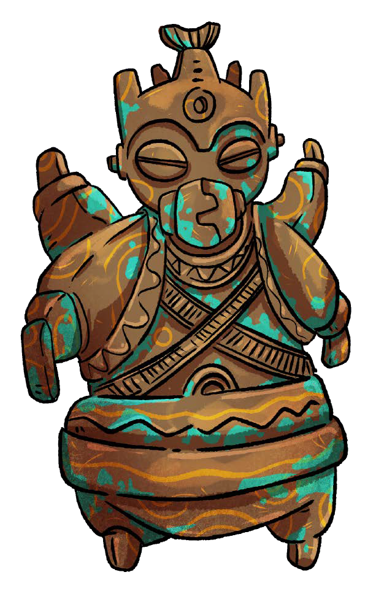

# Народы моря

Как вы помните, просторы Веа Туароа населены тремя цивилизованными народами – олъмцами, ва’ро и кансе.

> Существование четвёртого народа – таинственного племени «хумт» – лежит в области небылиц и апокрифов (типа предыдущей редакции этой книжки – прим. ред.). Согласно сказкам ва’ро, хумт были первыми вышедшими из моря обитателями этих странных берегов. Они же были создателями наиболее важных сельскохозяйственных культур и ремёсел, которые затем подарили своим ученицам – ва’ро. Но только для того, чтобы снова уйти в море и бесконечно сражаться там с какими-то беспокойными дрожащими островами. И всё это так запутано и бездоказательно, что никто из серьёзных людей в подобные россказни, конечно же, не верит.

Ранее мы уже вкратце описали, как олъмцы, ва’ро и кансе выглядят, сколько и где живут, на какую образность опираются. В этом разделе мы дополним минимальный контекст, рассказав больше про их язык, одежду, эстетику, философию, отношения с другими народами, социальную, семейную и сексуальную жизнь, цивилизационный статус, имена и политику.

## Олъм

Олъмцы, или «мраморные», названные так за свои до болезненно бледные и узорчатые тела, пришли на территорию современного Олъм Нде откуда-то из Внешней мглы около четырёхсот приливов назад, почти сразу после распада Империи ва’ро. Изначально примитивные и незатейливые, но очень последовательные, деловитые, приземлённые и практичные, под руководством своей бренхи (стр.XX) они быстро развили собственные культуру и экономику, унаследовав от ва’ро сельскохозяйственные технологии, многие топографические названия, представления о Море и своём месте в нём.

Олъмские технологии в эпоху Благословенного прилива считаются (особенно в самом Олъм Нде) наиболее прогрессивными, олъмский морской флот – самым многочисленным, промышленность – развитой, архитектура – модной и удобной, а экономика и общественная жизнь – наиболее стабильными на просторах Моря.

### Социальное устройство

Населённые олъмцами десятки островов составляют федеративную теософическую республику Олъм Нде, управляемую вездесущими клерками Министерства (стр.XX), руководствующуюся директивами заседающего в порту Олъм верховного парламента, Мввр Цингора и – формально – возглавляемую всё той же бренхи. Которую, впрочем, никто не видел на публике уже под сотню приливов. И которая для большинства олъмцев скорее символ нации, чем реальная персона.

### Ментальность

Основой олъмского общества издавна были торговля и дипломатия. Недаром по просторам Моря ходит присказка «Хочешь договориться? Зови олъмца!»

Знаменитые династии торговых капитанов не покидают страницы олъмской прессы, а могущественные промышленники и лоббисты направляют усилия целой нации к недостижимой, но от этого не менее желанной цели — особой «точке экономического баланса». Той точке, в которой ни один из граждан Союза не будет обделён общественными благами.

В подавляющем большинстве олъмцы совсем не суеверны (и вот почему практически не имеют иммунитета к расплодившимся в последнее время апокалиптическим сектам), а идя по жизни, руководствуются широко известным национальным «хокке» – системой принципов, направленных на безопасность, равенство, личную целостность и спонтанность социального потока.

Согласно Мкку Вккнгe, профессору олъмского «Института исследования счастья», всю систему «хокке» можно свести к восьми принципам:

1.  Делайте уютными места своего пребывания.

2.  Почаще принимайте в гости близких вам людей.

3.  Вкусно кушайте и наслаждайтесь приготовлением пищи.

4.  Будьте предприимчивы, ведите активный образ жизни.

5.  Одевайтесь в удобную, непринуждённую одежду.

6.  Получайте удовольствие от простых радостей.

7.  Имейте чувство меры в удовольствиях.

8.  Занимайтесь хобби и творчеством.

### Мода и стиль

Обычно олъмцы одеваются скромно и опрятно, выражая персональный вкус скорее сочетаниями цветов платья и фасоном шляп, чем богатыми украшениями и орнаментами. Они, как правило, застёгнуты на все пуговицы и подтянуты, всем своим видом выражая ту самую олъмскую деловитость. Крой их платья изобилует прямыми линиями и в куда меньшей степени наследует моду военного времени, чем можно было бы ожидать.

### Архитектура

В основе олъмской архитектуры лежат строгие и выверенные формы, а олъмские здания – хитрые комбинации кубов, параллелепипедов и пирамид – скорее утилитарны, чем вычурны. В их строительстве много используются сталь, стекло, готовые блоки и позаимствованный у соседей-ва’ро цемент. Декор фасадов лаконичен, геометричен и тяготеет к абстрактным узорам.

Городская застройка олъмцев в течение последнего стоприливия пришла к плотной, компактной и многоэтажной, на 3–4 десятка ярусов архитектуре: первые 7–10 этажей занимают магазины и конторы, далее идут 2–3 этажа складских помещений, 1–2 скелетных этажа с кабельной и санитарной инфраструктурой, блок из 5–7 этажей жилья среднего класса и, наконец, остальное – бюджетное жильё для одиночек, капсульные отели, прольские общежития и тому подобное. Общественный транспорт обычно размещается на эстакадах, на уровне 4–5 этажа.

Городские богачи предпочитаю селиться в отдельных элитных комплексах с жилыми помещениями увеличенного объёма, расположенными поверх 5 этажей складов, автоматизированных гаражей и элитных кухонь с лифтовой доставкой блюд на дом.\
Застройка малых поселений и сельской местности более традиционна. Она обычно состоит из классических каркасных конструкций с геометрической решёткой несущих балок из строевой прессовки, выходящих прямо на внешнюю поверхность стены, и с оштукатуренными промежутками между ними.

Сдержанная цветовая гамма экстерьера даже наиболее современных и дорогих зданий – штаб-квартир компаний и подобного – в полной мере компенсируется дороговизной интерьеров. В них олъмцы умело сочетают полированные камень и металлы, геометрическую скульптуру и орнаменталистику, лакированные панели, цветное стекло и современные пластики. Жилые помещения при этом оформляют скромно и в приглушённой гамме из двух-трёх цветов.

### Экономика и технологии

Олъмская промышленность не знает равных: дотошность, прагматичность и поставленное на конвейер производство метаматериалов в сочетании с чрезвычайно дешёвыми трудовыми ресурсами прольского населения ещё до Войны позволили Олъм Нде достичь фазы устойчивого экспоненциального развития, регулярно рождавшего новые технологии и подходы, как автопечка – пышневые булки.

Большая часть современных судов по всему морю выполнена по чертежам олъмских инженеров – зачастую с поправками на отсутствие прольской команды и с конверсией на не алхимическое топливо в случае кансейского флота. Большая часть промышленных товаров также выпускается фабриками Олъм Нде. Другими словами, олъмцы – авторы многих технических чудес и несомненные промышленные лидеры Веа Туароа.

### Размножение

Олъмцы подходят к продолжению рода осознанно и с большой ответственностью. Случайное зачатие исключено, ведь для появления потомства нужны сразу три разнополых родителя, сложные приготовления и справка о доходах от Министерства. Когда чета олъмцев готова к зачатию, они привлекают представителя третьего, т.н. слабого пола – специального плодящего прола в возрасте от 5 до 7 приливов. Перед этим его торжественно выкупают у родственников – его коммуны, оплачивают комиссию Министерству и регистрируют в отделе записи актов гражданского плодоношения. Выкуп и комиссия по традиции солидны, здесь не принято скупиться. Новые семьи на целый прилив окружают своих новых плодильных членов заботой и уважением. Ну а те в благодарность принимают генетический материал пары. После чего с вероятностью 87% гибнут в процессе родов, дав жизнь сразу двум или трём прекрасным олъмским младенцам.

### Имена и фамилии

Абгэл, Крун, Апстам, Рргина, Уррн, Алррн, Амфрра, Дллис, Кнния, Кррислин, Пллис, Пэтрр, Гэйдрр, Фэлннт, Рртисс, Лундд, Кррон, Джнн, Мннлр, Гррт, Йрра, Гвннллн, Път, Лррс, Йссф, Тррнтс, Ллд, Кррнф, Аффн, Ррстн, Длли, Йък, Пррсф, Мррава, Улъям, Прргрн, Гвъл, Йън, Дджм, Лълл, Кррт, Умбрр, Дллт, Тъллйр, Бъл, Дъвлл, Гъллхд, Лъллн, Кэддок, Йэлл, Гэнррс, Бэдврр, Афон.

Бррлън, Матон, Йэлл, Пъэррс, Лагрр, Энвтнн, Блэднн, Вэбнн, Саррк, Акррм, Хъмррэ, Мънчэр, Кллмб, Мрът, Вннго, Экк, Хсттн, Нънбррн, Глъв, Скабрр, Сэллн, Хъмннд, Фэурр, Хълс, Мэджвл, Гллън, Рэкллд, Звассн, Авллэн, Трртвър, Флэнн, Гвъррс, Кавэлл.

## Ва’ро

Темнолицые и красноглазые Ва’ро, или же «базальтовые», – самая древняя из ныне существующих цивилизаций Веа Туароа. Ведущие своё летоисчисление из глубин древности (здесь данные разнятся, но даже по самым скромным подсчётам цивилизация ва’ро раза в три старше олъмской), они и до сих пор верны стародавним свычаям, обычаям и табу. Работящие, неторопливые, выносливые, семейственные и по-хорошему, энергично агрессивные, под руководством своих Матрон они служат живым примером того, что для развитой культуры не так уж необходимы спешка, индивидуализм или сверхсовременные технологии.

Их профанный говор и письменность повсеместны и в эпоху Благословенного прилива вместе с модой на джез частенько заменяют олъмской молодёжи традиции и обороты родного языка. Их высокая речь – Высокий Баз – редка, и, по мнению специалистов, в разы превосходит по многомерности, сложности, поэтичности и выразительности как Олъмский, так и Кансейский вместе взятые.

### Социальное устройство

Когда олъмцы пришли на берега Веа Туароа, основной формой социального устройства ва’ро были разбросанные то тут, то там сёла и местечки. Каждое село или два управлялись одной Матроной – плодящей матерью рода, обитательницей высокой башни, окружённой собственным гаремом и когортами верных дочерей, а также грибными полями, загонами надойных слизней, вокликовыми и востричными фермами.

С тех всё сильно изменилась. Соседствуя с олъмцами, многому обучая и многое перенимая, ва’ро Дымящихся островов – некогда одной из окраин Империи – стремительно урбанизировались. Были отброшены табу на межостровные контакты. Традиционные технологии строительства башен из армированного бетона и опалубки позволили быстро возвести поселения городского типа, в которые стали массово переселяться Матроны со свитами, предпочитая централизованное водоснабжение и прочие городские удобства традиционным пасторалям. Сельские хозяйства стали современными фермами со сменяющимся персоналом.

И теперь, в эпоху Благословенного прилива, основная часть коренных обитательниц Ва’ро Рохе – это городские жители, время от времени выезжающие вахтовать на фермы или плановый вылов морской живности. Впрочем, клановая система никуда не делась. И Матроны в окружении своих гаремов всё также сидят в башнях, но теперь – созывая селекторные совещания и отдавая приказы по множеству телефонных линий. А сами башни всё также окружены длинными домами верных дочерей, выстроившимися в кольца и делящими каждый город ва’ро на родовые районы и околотки.

Верховным органом управления здесь служит Совет Матерей в одном из бывших храмовых центров Империи – Н’те Поа, где выборные делегатки островных Матрон решают общие хозяйственные вопросы для всего Ва’ро Рохе. Впрочем, как поговаривают, не принимая ни одного важного решения без согласования с представителем олъмсовета.

### Ментальность

Базальтовые Матроны любят говорить, что всё и всегда возвращается на круги своя, а время — это спираль. Их дочери поколение за поколением основывают свою идентичность на почитании старших и соблюдении множества табу. Практически никто до эпохи Благословенного прилива не слышал про изобретательниц, исследовательниц или естествоиспытательниц ва’ро. Более того, известно, что большинство ва’ро не чтут подобные пути и говорят, что всё новое — это хорошо забытое старое, а все действительно нужные людям знания уже здесь, вокруг нас, и не требуют ни постоянного олъмского поиска новых истин, ни необходимости в граничащем с антисоциальностью индивидуализме кансе.

#### Внутренняя империя

Некоторые олъмские и кансейские расологи утверждают, что ментальная «неразвитость» и недостаток амбиций ва’ро проистекают из биологии – той самой, что сделала один их пол слабее другого, семьи – многодетными, бытовое насилие – регулярным и тому подобное. В реальности, вероятно, всё сложнее, и это свойство национального характера во многом сформировано историей: тысячу приливов назад ва’ро безраздельно владел Морем. Их жрицы и воительницы сталкивались в сражениях, зачинали династии и строили процветающие полисы на бесчисленных берегах. Их естествоиспытательницы и натурфилософы изобретали механические чудеса. Затем они сформировали Империю, с трона которой Великие Владыки мудро направляли народ к развитию и расцвету. И потом всего за один катастрофический прилив Империя пала. Столица вместе с национальной элитой скрылась среди волн. А процветавшие до того полисы, лишившись глобальных экономических связей, пришли в упадок, обезлюдели и деградировали до фундаменталистских родоплеменных деревушек.

Никто в точности не знает, что именно тогда произошло. Но косвенные сведения о резкой депопуляции, а также огромное количество имевших хождение ещё пару сотен приливов назад табу – запретов на поиск потерянных истин, на изучение наследия Империи, на даже просто общение с обитательницами других островов, вероятно, говорит о пандемии – о страшной болезни, поразившей общество ва’ро на пике его развития. И затем разбившей его на мельчайшие осколки, накрепко засевших в головах этих наследниц Великой Империи.

#### Многобожие

Большая часть ва’ро религиозна, но степень этой религиозности варьируется в широких пределах. Практически все ва’ро верят в Великую Мать – в Море, источник всей жизни и всеобщую властительницу. Море не требует жертв и сложных ритуалов. Но оно требует следовать естественным циклам жизни и внимать своего зову, взамен давая понимание моментов, когда надобно сделать то или иное.

Коренные обитательницы родоплеменных поселений и крупных портов Ва’ро Рохе верят также в священные камни Конату-Тапу – кости Веа Тутатахи, тот тут то там проглядывающие из земли на Дымящихся островах. Конату-Тапу окружены множеством ритуалов: их поят слизневыми молоком и кровью, вокруг них водят хороводы и рядом с ними устраивают длительные бдения. Взамен эти камни дают прозрения и отгоняют врагов. Во всяком случае, так говорят Матроны и Посвящённые дочери.

Наконец, порывающие с традициями матрон обитательницы эксклавов, и, в особенности, Кольца Такоры (см. стр. XX), склонны обожествлять Последнюю Владыку – Великую Ай’атаро-Хатаке, дух которой, согласно этим верующим, уже в ближайшее время должен воплотиться в одной из «потерянных дочерей», чтобы привести свой темнолицый народ к возрождению во всей былой славе.

### Мода и стиль

Одежда ва’ро вычурна и несёт на себе множество орнаментов, не просто декоративных, но дающих понимающему наблюдателю комплексное представление о родовой принадлежности, иерархическом статусе и даже личных заслугах своих носительниц. Даже теперь, после нескольких поколений массовой урбанизации, ва’ро используют в одежде много традиционных материалов и кроев, тканей крупного плетения, пышных многослойных накидок из жёсткого моллюскового волокна и подобного. В ходу у них также высокие воротники-ожерелья, массивные, наклеиваемые на лицо кабошоны, лицевые росписи и, в случаях наделённых властью лиц, крупные церемониальные макаве – пластины из резной кости и рога, прикрепляемые на специальную портупею к верхней части спины. Всё это зачастую сочетается с элементами олъмского костюма, как повседневного, так и из остатков старой полевой униформы, которые многие вернувшиеся с Войны ва’ро носят с нескрываемой гордостью.

Отдельным предметом украшения и национальной гордости у женщин ва’ро служат длинные стилеты-кахуру, применяемые для частых ритуальных дуэлей и показывающие, что та или иная ва’ро пока не отказалась от надежды когда-нибудь стать Матроной.

### Архитектура

Традиционную архитектуру ва’ро можно чётко разделить на две категории: хорошо защищённые 12‒15 этажные башни из армированного бетона и камня, где хранятся наивысшие ценности рода – его плодящая Матрона с гаремом мужей, и длинные дома дочерей – просторные конструкции с треугольными крышами и плетёными стенами, главной защитой которых служат сами их обитательницы, готовые в любой момент выступить против какой-нибудь опасности. И то, и другое, насколько возможно, покрывается богатой резьбой и орнаментальными барельефами, которые регулярно окрашиваются во множество ярких цветов, да так красочно, что у непривычного к подобной эклектике олъмца глаза могут буквально полезть на лоб.

Современная городская архитектура Ва’ро Рохе чуть более сдержана в красках, хотя столь же богата в орнаментах. А её зодчие предпочитают традиционным очень ярким, но не стойким пигментам пастельные оттенки долговечных смальтовых панно. Дома в городах ва’ро возводятся из всё того же бетона, облицованного керамической плиткой. Они также разделяются на укреплённые башни (зачастую достигающие более 50-ти этажей) и остальные строения, стилистически имитирующие традиционные длинные дома сельских ва’ро, пусть и в более масштабной, многоэтажной форме. При этом современная городская архитектура ва’ро подразумевает большое количество мостиков и акведуков, зачастую позволяющих пройти через весь город, не коснувшись земли.

### Экономика и технологии

Ещё во времена Империи ва’ро достигли никем пока не превзойдённых высот в методах возделывания растений и выращивания как сухопутных, так и морских животных. Урбанизация и освоение новых технологий в пост-имперский период только увеличили и прирастили сельскохозяйственную эффективность этого народа. Так что, несмотря на изначально низкую агропригодность островов нынешнего Ва’ро Рохе, путём терраформирования, ирригации и других способов последовательного улучшения эти олъмские соседи добились несомненного лидерства в производстве продуктов питания для всего региона. Сейчас, в эпоху Благословенного прилива, фермы и промысловые артели Ва’ро Рохе кормят как своих соотечественников, так и подавляющее большинство олъмцев. А с учётом выработки сырья для лёгкой промышленности и активно развиваемой добычи полезных ископаемых, эта «пепельная житница» и вовсе бесценна для подданных бренхи.

К тому же, несмотря на нелюбовь к придумыванию нового, все ва’ро очень талантливы в повторении и улучшении увиденного. Мозаики, керамика, механизмы – что угодно, требующее точной и заранее известной последовательности действий, будет выполнено ими ничуть не хуже, а может и лучше однажды увиденного оригинала. Это обстоятельство ещё до войны сделало Ва’ро Рохе отличным местом для размещения фабрик по производству запчастей, компонентов и материалов, необходимых передовым машиностроительным и электротехническим предприятиям Олъм Нде. Конечно, за прошедшее время на территориях ва’ро так и не появилось ни одного собственного научно-исследовательского или научно-производственного комплекса, однако это не мешает самым именитым олъмским изобретателям и новаторам заказывать всё нужное для своих серийных изделий у трудолюбивых красноглазых мастериц.

### Размножение

Ва’ро двуполы, и на одного мужчину у них рождается по несколько тысяч женщин. В силу чего эти немногие округлые и мягкотелые представители прекрасного пола ценятся здесь на вес жемчуга и когда-то, в менее цивилизованные времена, за них даже велись кровопролитные сражения. Женщины у ва’ро крупные, сильные, напористые, вспыльчивые и, по большей части, бесплодные. Возможность стать матерью, социальная и биологическая избранность приходит к лишь единицам из них.

В точности неизвестно, что именно для этого необходимо, но время от времени одна из бесплодных сестёр вдруг начинает расти в размере и одновременно испытывает желание занять место матроны собственного рода. После этого она либо вступает в конфликт с текущей матроной и пытается победить её в ритуальной и строго регламентированной схватке, либо отказывается от противостояния. А затем получает в качестве отступных одного или двух мужчин, строит традиционную длинную лодку, уводит с собой дружину – группу из семи симпатизирующих сестёр – и пытается там, за морем, основать новый род и новое поселение.

Став же новой матроной, она уединяется в собственной башне и до двух раз за прилив разрождается восемью юркими красноглазыми отпрысками.

### Имена и фамилии

Аати, Рахурева, Укароа, Кайя, Мокана, Харману, Нинере, Канира, Раннан, Хорго, Руни, Майка, Ийола, Кху, Пруга, Тиики, Упене, Лумана, Хекевата, Рамана, Опена, Келани, Риихи, Лимоа, Эхера, Мараги, Аурик, Коами, Энпа, Хайан, Уинан, Краппа, Тангира, Ранаи, Накса, Уиола, Ахина, Некоа, Харати, Кануали, Иоку.

Макарай, Паку, Лотеми, Эране, Келекену, Хавили, Гекене, Опури, Ийоли, Роронга, Нану, Иноле, Помана, Ауколи, Малуа, Рамака, Херву, Нама, Оурили, Макоране, Виву, Хуринай, Маора, Теане, Хараки, Отере, Марик, Потана, Нгау, Оири, Керехана.

## Кансе

Кансе, они же «бронзовые», – самый молодой по меркам Веа Туароа народ и самый пышущий жизнью из всех. Они пришли на эти просторы едва ли сотню приливов назад. Они живут чуть ли не вдвое быстрее других и стареют к возрасту, когда остальные только достигают зрелости. Они спешат жить и бороться за своё место в Море. Они заслуженно – исторически – не любимы соседями, для которых во времена оны стали бичом и разрушительной стихией, навсегда изменившей лицо мира.

В эпоху Благословенного прилива населённый ими регион, расположенный на другом конце моря от Олъм Нде и Ва’ро Рохе, по олъмским меркам – далёкий загадочный край, еле-еле оправившийся от последствий Войны и находившийся на позиции догоняющего. Там бурно развиваются промышленность, наука и культура, налаживаются международные связи, восстанавливается демография, а экономика и политика бьются в горячечном ритме гиперинфляций и реформ.

### Социальное устройство

Конфедерация кансе раскинулась на пяти осколках былого величия – пяти т.н. «вилаях», формально демократических, имеющих собственные парламенты – сатваны, но управляемых, де-факто, союзом нескольких сверхбогатых семейств. Эти субрегионы имеют очень разную степень стабильности и экономического развития, так что нередки случаи внутренней миграции, когда кансе из одного вилая едут на заработки в соседний, для того чтобы присылать деньги родным на малую родину.

Все пять осколков под общим названием «Кансе Ткути» имеют плотные дипломатические связи и представительства в бюрократической столице региона – свободной экономической зоне порта и острова Салайф, заодно служащей экспортно-импортной точкой, открытой властями для беспошлинного и безвизового посещения иностранными гражданами. Посещение остальных частей региона при этом для инородцев ограничено и с большим или меньшим успехом контролируется властями. Таким образом, Салайф работает ещё и как пространство культурного обмена: в нём расположены коммерческие и дипломатические представительства Олъм Нде и – с недавнего времени – даже Ва’ро Рохе, в нём заканчиваются проложенный от Олъма светличный путь, а также маршруты массовых туристических и грузовых перевозчиков.

> **Примечание:** узнать больше о локальной географии и внутренней жизни Кансе Ткути вы можете из специализированной книги-дополнения, которую мы планируем выпустить уже в ближайшее время.

### Ментальность

Всего несколько поколений назад проникшие в рамках Великого Исхода на гостеприимные и полные жизни просторы Моря из неких земель холода и смерти, кансе изначально обладали весьма специфической и не до конца понятной как олъмцам, так и современным ва’ро психологией фанатичных завоевателей. Ещё недавно они считали, что выживает только сильнейший, и, более того, только тот сильнейший, кто физически уничтожил всех остальных. Таким «сильнейшим» в исторической перспективе они, конечно же, считали свой народ.

В процессе Войны их убеждения начали меняться. Кансе видели, что им противостоят разные, очень разные люди, вместе сражающиеся и вместе побеждающие, не выказывая какой-либо специфической слабости от такого союза. Конечно, кансейская пропаганда объясняла небезуспешность разнородных противников их Священного Кераджа различными «нечестными» методами: внутренними предателями, нарушением правил войны и подобным. Однако в той войне не было никаких правил и её солдаты с обеих сторон об этом прекрасно знали.

Измотанные длительным конфликтом, потерпевшие сокрушительное поражение, потерявшие большинство друзей и знакомых в паводках Большой волны, разуверившиеся в святости былых владык, прошедшие через горнило гражданской войны, почти декаду прожившие на грани экономического коллапса, современные коренные кансейцы (то есть не те «коллаборанты и изгои», что в итоге осели на олъмских территориях) не так уж верят в догматы. И, несмотря на былые убеждения, потихоньку налаживают связи с другими частями света, пытаясь переосмыслить свои наследие и миссию.

### Избранность

Согласно кансейским преданиям, когда-то их предки обитали в далёких плодородных землях вечной прохлады. Однако прохлада сменилась мертвящим холодом, убивавшим посевы, людей и животных. И все прото-кансейцы погибли бы, но наиболее смелые и мудрые из них, проникшие в запретные глубины Бесконечной горы, обнаружили заточённое там многоликое сияющее божество. Это безымянное божество объяснило, что единственный способ спастись – подняться до самой вершины Бесконечной горы в уготованный для наиболее смелых, стойких и праведных тёплый, влажный и плодородный рай, который станет новым домом для избранного народа – для будущих поколений кансе.

Вооружённые частицами божественной плоти – светоносными ватрами – и оставив множество безбожных соотечественников в ледяном аду, уверовавшая часть прото-кансе поколениями ползла по бесконечным горным склонам для того, чтобы в итоге оказаться на просторах Веа Туароа, у подножия Костяного шпиля, где они и основали свою столицу Священного Кераджа.

Неизвестно, давало ли светоносное божество прямые указания по уничтожению любых инородцев или это уже была поздняя интерпретация, канонизированная кансейскими Иерархами. Однако ощущения собственной избранности и непогрешимости тогда, сто приливов назад, очень помогли новоприбывшим развернуть полномасштабное уничтожение всех окружающих островных ва’ро.

Как уже сказано выше, с тех пор произошло много всякого. Кансейский фундаментализм за это время поистрепался, однако немногие уцелевшие ватры – частицы бога, выведшего синеглазый народ из ледяного ада – всё ещё доступны для паломников в глубинных храмах Кансе Ткути. И значит, отсветы золотого пламени истинной избранности всё ещё скрываются в немалом количестве кансейских сердец.

### Реваншизм

Поражение в войне в сочетании с Большой волной и последовавшей гуманитарной катастрофой сильно, вплоть до 75% демографических потерь, потрепало кансе. Их общество претерпело ряд кардинальных изменений: угнетённые низшие касты восстали, военные элиты усомнились в священных догматах, развращённые теократы были низвергнуты, а церковь подверглась реформации.

В горниле этих испытаний уже родилось множество новых, здоровых и целеустремлённых общественных сил. Всё чаще на собраниях политических кружков и дискуссионных клубов Кансе Ткути раздаются уверенные молодые голоса, провозглашающие Новый курс. А кансейские плавучие фабрики во всё больших темпах спускают с конвейера гражданские и военные суда, сельскохозяйственные машины и винтовки, ректификаторы, детские садки, строительные аппараты, проходческие щиты и радиоприёмники.

И всё это значит, что теперь, когда кансе перестали надеяться на всепобеждающую силу божественных ватр, когда они через обмен, обман, подкуп завладели множеством чужих промышленных секретов и наработали немало своих, теперь, когда выросло целое новое поколение, уже плохо помнящее ужасы Войны, но чётко усвоившее, что текущая нищета и разруха ей обусловлены… теперь часть их новых лидеров мнений наверняка хочет отыграться за былые обиды.

#### Эксклавы и диаспоры

Затянувшаяся и растянувшаяся по обширным пространствам Внутреннего фронтира война расколола синеглазый народ на части. В отличие от самих кансе, поначалу вообще не бравших пленных, деловитые олъмцы сгребали на баржи всех захваченных (и переживших вспышки гнева мстительных ва’ро) кансейских военнопленных вкупе с гражданским персоналом взятых штурмом островных баз, а затем отправляли их в трудовые лагеря, разбросанные по территории Союза.

После разрушения Костяного шпиля олъмскими коммандос и распада Кераджа, далеко не все обитательницы этих лагерей изъявили желание отправиться обратно, за море, на охваченную гражданской войной родину. Эти, как их называют в Олъм Нде и Ва’ро Рохе, «Оставшиеся», выйдя из бараков, добровольно продолжили делать то же, что делали в лагерях – строить, ткать, работать на конвейерах и мануфактурах, утилизации мусора, ассенизации, ирригации и в подобных местах.

В эпоху Благословенного прилива многие из них и подавляющее большинство их детей прекрасно владеют олъмским и торговым наречиями, сдали экзамен на гражданство и не видят своей жизни за пределами Олъм Нде. И они же волей-неволей стали цивилизационным мостиком – точкой соприкосновения трёх народов. Они вошли в дипломатические корпуса и различные комиссии, позволившие наладить связь между некогда смертельными врагами – ва’ро, олъмцами и кансе. Они позволили выстроить экономические и дипломатические отношения, создать Светличный путь и целый ряд международных инициатив в области бизнеса и культуры.

Конечно, многие коренные кансе в силу ресентимента считают Оставшихся предателями, купавшимися в довольстве, пока кансейские дети гибли от голода и обстрелов очередного синеокого бунтаря-адмирала. И немало бывших беженок-ва’ро, памятующих о довоенной резне, устроенной Кераджем на Внутреннем фронтире, частенько готовы перейти к обусловленному ПТСР спонтанному насилию при виде глаз «не того» цвета, не разбираясь в том, гражданином какого государства является встреченная «чушка».

Однако даже так культурная роль кансейской диаспоры Союза остаётся неоспоримой. А её влияние на литературу, театр и поэзию послевоенного времени сейчас сопоставимо только с модой на «имперские» романы типа «Шёпота раковины» и джез.

### Мода и стиль

Большая часть обитателей Кансе Ткути до сих пор носит одежду, перешитую из старой военной формы. Их чиновничество и торговцы, работающие с иностранцами, под влиянием моды, относительно недавно и массово переоделись в строгие костюмы олъмского кроя. Традиционные же одеяния этого народа тяготеют к удлинённому, расходящемуся вширь у пола силуэту, множеству драпирующих складок и причудливым орнаментам округлых очертаний.

Как и ва’ро, кансе часто носят массивную лицевую бижутерию и украшают лица красочными узорами.

### Архитектура

Кансейская школа резчиков по камню, дереву и кости не знает равных. Даже самая бедная хижина, в которой успело прожить хотя бы одно поколение, неизбежно покрывается изумительными, чрезвычайно сложными, изящными и текучими орнаментами, а также миниатюрами со сценками из быта.

Это же стремление к точёности проявляется и в самой конструкции зданий: их прочность и устойчивость традиционно обеспечиваются пересекающимися под сложными углами решётками, арками и тяжами скорее, чем массивностью стен. При этом сами здания чуть менее чем всегда возводятся из заранее подготовленных элементов и крупных блоков, а в собранном виде напоминают скорее вываренный и высушенный скелет гигантского иглокожего, чем что-то, построенное человеком.

Современные материалы, бетон, элластическая керамика, пластики и сложные металлоконструкции только усилили эту тенденцию. И теперь новые послевоенные здания того же Салайфа напоминают чужеземцам грандиозные художественные инсталляции – невообразимое сочетание ажурной лёгкости и монументальности. Их замысловатые узоры литых решёток, закручивающиеся в спирали колонны, парящие купола из стеклянного волокна и блазневых смол, невообразимые сочетания текучих орнаментов и полупрозрачных витражей бесконечно эстетичны и неизбежно вызывают резь в глазах при внимательном рассматривании.

Внутренний их интерьер при этом скромен и утилитарен – украшением является само здание и его орнаменты, но не утварь, его наполняющая. В качестве уникального свойства современных интерьеров кансе можно также назвать маскировку источников освещения – проводником света служат сами стены и стеклянные панели в них.

### Экономика и технологии

По очевидным для читателя причинам экономику Кансе Ткути никак нельзя назвать процветающей. Однако к эпохе Благословенного прилива синеглазые обитатели этого заморского края, пройдя через полосу кризисов, добились немалых успехов в том, чтобы её можно было назвать хотя бы стабильной. За счёт экспортированных из Ва’ро Рохе сельхозкультур был побеждён массовый голод. Деньги от налаженной через светличный путь торговли глубинным ихором, дорогими тканями, утварью и украшениями позволили развить собственное производство высокотехнологичных товаров. Открытые для преподавателей любой национальности салайфские университеты прилив за приливом выпускают превосходных специалистов во множестве областей человеческой деятельности.

При этом, конечно, большая часть населения Осколков ежевахтенно гнёт спину на слабо автоматизированных полях, фермах, шахтах и мануфактурах-потогонках, еле-еле наскребая на необходимый питательный минимум.

А салайфское технологическое чудо – две дюжины плавучих гигафабрик и верфей, спущенных со стапелей в течение последних пяти приливов, непрерывно выпускающих превосходные по цене и качеству электротехнику и радиотовары, компоненты машин, стройматериалы и предметы обстановки, готовые к эксплуатации суда и автомобили – основано на жесточайшей посменной эксплуатации фактически живущих на рабочих местах и на время контракта заваренных в чадящие экзоскелеты бедняков.

### Размножение

Кансе гендерфлюидны – способны менять пол, в зависимости от внешних обстоятельств и запросов общества. Возраст, социальный состав окружения и диета – вот условия, которые вполне предсказуемо позволяют им нужным образом измениться и либо приобрести способность к оплодотворению, либо возможность выносить потомство. Материнские особи не сильно отличаются от всех остальных. Немного увеличивается живот, становятся ярче узоры на теле, меняется вкус к одежде и украшениям. Полуприливный период вынашивания лёгок и почти не прерывает рабочих ритмов, а каждые роды дарят морю около восьми отпрысков. Обычно, младенчество переживают не более двух – самых сильных и агрессивных, за первые же две окты убивающих и поедающих остальную часть приплода. Сразу после эти победители получают первые, ещё детские, имена в рамках специального семейного торжества.

### Имена и фамилии

Ийка, Бениса**,** Ажим, Ренья, Хумари, Исмам, Цхина, Арготри, Кугон, Йурул, Лхуфина, Хурвати, Ундари, Акатри, Дарцут, Мирра, Искан, Гавья, Ратин, Фарипа, Несар, Хасым, Ниппа, Йурина, Кхасин, Сунара, Маракх, Рампа, Абас, Кестара, Ситлан, Схолид, Мардзин, Цастура, Нера, Айурх, Йерана, Мадесат, Фарикх, Искуб, Расура, Метиа, Афарья.

Риджая, Вигарья, Мати, Дахаю, Йакти, Ватани, Цатья, Аджнай, Чанпа, Батувара, Прарга, Ранхут, Цитанг, Хаттари, Рахиви, Утья, Марими, Одоро, Суръта, Фуми, Рунъха, Слаакти, Дагбари, Хонги, Азару, Сийунг, Ракхими, Нндари, Цинья, Акаса, Будихан.

## **Пролы**

О них не принято говорить как об отдельном народе, хотя биологически они существенно отстоят от всех прочих. На просторах Веа Туароа пролов даже больше, чем их ближайших родственников – олъмцев, которые считают этих малышей собственным третьим полом, издавна являясь для них то ли опекунами, то ли скотоводами.

Чтобы рассмотреть прола со всех сторон, придётся немного наклонить голову или присесть, ведь любой их них почти вполовину ниже взрослых представителей других народов. Небольшие габариты и мягкие податливые тела, делают пролов юркими, но физически слабыми. Даже в пределах одной коммуны редко можно найти две одинаковые особи — их тела постоянно меняют форму под влиянием внешних обстоятельств. Вмятины и трещины, зарубцевавшиеся раны и отверстия, произвольные мутации, разномастные глаза делают внешность каждого прола очень специфичной.

Сведения об изначальном происхождении пролов туманны. Наиболее старые матроны ва’ро время от времени упоминают, что было какое-то «время до малышей». Однако никаких записей об этом гипотетическом времени в олъмских архивах не сохранилось. Основная популяция пролов по понятным причинам сконцентрирована на островах Олъм Нде, вторая по размеру, хотя и сократившаяся по результатам недавней эпидемии, – в Ва’ро Рохе, и ещё некоторое количество разбросано по колониям Внутреннего фронтира. Точных сведений о прольском населении Кансе Ткути ни у кого нет, хотя известно, что кансейские промышленники недавно начали проявлять интерес к этому потенциальному источнику рабочей силы для своих фабрик.

### Социальное устройство

Большинство пролов селится коммунами из 30-ти особей в специально для этого оборудованных общежитиях. Внутри этих групп не существует каких-либо устойчивых иерархий, однако обычно не возникает и внутренних конфликтов. Судя по всему, сама биология пролов позволяет каким-то образом их избегать. Пролы из одной коммуны считают себя семьёй и безошибочно узнают друг дружку даже спустя приливы разлук.

Хозяйствуют пролы сообща. При необходимости готовят простую еду, прибираются, занимаются мелким ремонтом и уборкой помещений. На работу ходят бригадами, под руководством того или иного авторитетного «старшего товарища» не прольского происхождения. Причём старшинство они определяют исключительно по формальности одежды и «командирскому» головному убору – фуражке с кокардой. При этом, они вполне способны отличить «своего» привычного командира от какого-то чужого и отдать приоритет именно ему.

Никакой политической жизни у пролов нет – они не проявляют какого-либо интереса к организации собственной жизни за пределами коллективного быта. Так что на глобальном уровне прольские коммуны просто интегрируются в то общество, которое взяло над ними шефство.

### Ментальность

### Психология среднего прола устроена куда проще, чем у взрослого представителя любого из трёх народов моря. Внутренние механизмы его мышления прямолинейны, память коротка, запас внимания беден, а способность к терпению лимитирована. При этом пролы эмоциональны, непосредственны, неусидчивы и деятельны. Они буквально спешат жить и, в условиях достаточного питания, не отягощённого избыточным стрессом, очень, очень работоспособны. Отдельным их положительным качеством можно выделить умение не скучать – даже самую рутинную деятельность пролы быстро превращают в игру, что и позволяет эффективно использовать их на тех рабочих участках, где любой олъмец, ва’ро или кансе быстро взвыли бы со скуки.

#### Культура

### Если спросить у олъмцев о культуре пролов, то те только усмехнутся и скажут, мол, нет такой. Устойчивой мифологии у пролов нет, а их творческие потребности обычно выражаются в коллективном пении, хороводах и сочинении побасёнок, которые восторженно и с большим количеством искажений передаются из уст в уста. Представители маленького народа безграмотны, и лишь немногие из них осваивают азы устного счёта. Собственный язык пролам не требуется, так как его заменяют причудливые пиджины на основе языков народов-попечителей.

#### Изменчивость

Пролы очень пластичны и изменчивы. Их биология, генетика и неврология постоянно меняются, позволяя популяции быстро приспосабливаться к любым условиям. Они практически всеядны и не устают от однообразной пищи. Они быстро восстанавливаются после ранений и пережитого стресса. Короткая эмоциональная память спасает их от зацикливания на пережитом негативном опыте. То, что у кого другого вызвало бы тяжёлые травмы и ПТСР, для прола становится просто смутным, будто бы чужим, воспоминанием, лишённым какого-либо эмоционального наследия. Пролы даже не склонны испытывать долговременную неприязнь в отношении своих мучителей – эмоциональный опыт они оставляют в прошлом и живут настоящим, не погружаясь в былые переживания снова и снова.

#### Девианты

Вечное детство пролов имеет свои пределы – время от времени среди них появляются особи, отличающиеся от основной массы. Они умнее. Они серьёзней. Они задают неудобные вопросы. Они самостоятельно изучают буквы и слоги, для того чтобы украдкой читать ворованные книги. Одно их присутствие может критически снизить степень удовлетворённости и промышленной эффективности целой коммуны.

И вот почему специальная организация – ДОПС (см. стр. XX)регулярно инспектирует прольские популяции Олъм Нде и Ва’ро Рохе, где возможно отделять дефектных особей от здоровых и действенно санировать заражённые коммуны в случае необходимости.

> Как известно, пурпурная хворь, обрушившаяся на острова Ва’ро Рохе около прилива назад, была быстро побеждена совместными усилиями эпидемиологов Олъма и Н’те Поа. Несмотря на высокую смертность среди заражённых, быстрые и решительные действия военного крыла Министерства позволили сначала организовать карантинные периметры, а затем подавить начинающуюся эпидемию в зародыше. Но у всего этого процесса была и тайная, почти не просочившаяся на страницы газет история. Сохраняя то же соотношение – 50/1 – умерших к выжившим, уцелевшие части прольской популяции массово проявили признаки девиантности нового, неведомого ранее типа. Что привело к некоторому количеству травм и смертей среди персонала карантинных зон. И только самоотверженная работа бригад зачистки ДОПС не позволила этой новой социальной угрозе стать катастрофой для всего региона. Неизвестно, уцелел ли тогда хоть кто-нибудь из этих новых пролов-мутантов. Но если и так, то теперь где-то на задворках олъмского социума развернулась нешуточная охота ради блага всего общества и ради будущего для олъмских детей.

> **ИЛЛЮСТРАЦИЯ: МИНЬОН В КОСТЮМЕ МАГНЕТО**

### Мода и стиль

Одежду пролы обычно шьют самостоятельно, подбирая те или иные кусочки уже не нужных другим вещей в соответствии собственному вкусу. Они любят носить яркие, окрашенные в узелковой технике и повязанные куда попало платки, полосатые фуфайки и большое количество сделанных из подручных материалов украшений.

### Размножение

Жизнь отдельно взятого прола коротка, зато взросление и созревание стремительны: каждый прол в возрасте от пяти до семи приливов способен самостоятельно зачать и выносить собственное прольское или чьё-то ещё, какого-то другого народа моря, потомство. Причём потомки-пролы всегда имеют шанс унаследовать часть навыков и воспоминаний родителя.

Обмен генетическим материалом между пролами происходит незаметно для них самих во время коллективных трапез и традиционных приветственных обнимашек. Полученные гены могут долгое время никак себя не проявлять. А самооплодотворение прола происходит только тогда, когда его коммуна нуждается в восполнении состава - из-за естественной убыли или потому, что олъмцы-кураторы разделили её с целью искусственного увеличения численности. Вынашивание потомства занимает около половины прилива и завершается появлением троих быстро растущих отпрысков.

### Прозвища

Кривой-Штурвал, Умный-Колченог, Потерял-Пуговицу, Сизый-Плавник, Тройная-Голова, Сильно-Поскользнулся, Кидалец-Трапов, Большой-Очень, Голова-Трещина, Мутный-Глаз, Гремящий-Железяк, Всегда-Голоден, Голова-Кувалда, Костлявый-Грыбень, Который-Чешется, Третья-Склянка, Крайний-Случай, Одно-Глаз, Мокрый-Солёный, Вмятина-От-Якоря, Скрипит-Всегда, Старый-Канат, Хмурый-Киль, Мятый-Крепыш, Трое-Рук, Плипкина-Ракушка, Собирает-Камешки, Кривая-Лапа, План-Перехват, Первый-Залп, Широкий-Улыбка, Резвый-Палец, Глазун-Шутник, Барный-Стул, Хлипкий-Хог, Смурной-Новик, Щербатый-Умник, Варёный-Коралл, Подбитый-Сапог, Пышневый-Булк, Светлый-Маяк, Скальный-Зуб, Счастливый-Очень, Солёный-Камень, Гроза-Причалов, Липкий-Комок, Постоянный-Обжора, Морской-Узел, Сборщик-Костей, Дырявый-Мешок.
