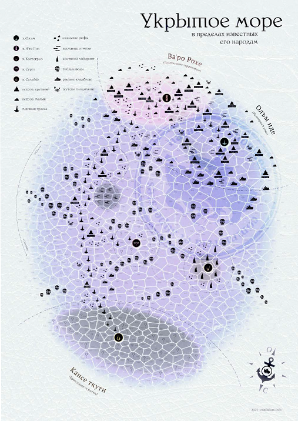
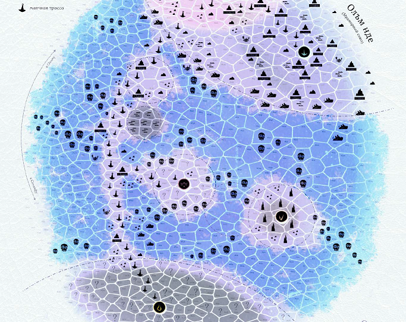
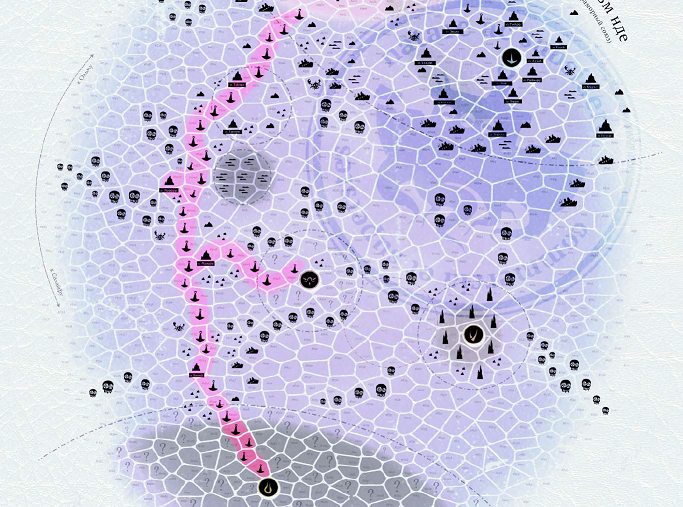

# Глобальная география

Известные народам моря пространства Веа Туароа можно более или менее условно разделить на несколько крупных регионов, обладающих собственной спецификой. Их границы очень приблизительны и не всегда однозначны. Но для ваших протагонистов их названия говорят о тех или иных вещах и служат отправными точками понимания в принятии решений, так что в этом разделе мы перечислим эти регионы и постараемся кратко раскрыть специфику каждого.

## Олъм Нде

Родина вашего экипажа. Хорошо обжитые просторы вокруг порта Олъм – около дюжины крупных островов и сотни, если не тысячи, островков-сателлитов, где изначально, четыреста приливов назад, осели предки ваших протагонистов. Пространства их хорошо картографированы и относительно безопасны – прошло уже немало времени с тех пор, как тут в последний раз слышали о морских бандитах. Олъм Нде пестрит центрами промышленности и добычи полезных ископаемых. Кому-то эти места могут показаться даже скучными, но наверняка у обладателей такого мнения нет какого-нибудь горящего груза и кучи интересных контрагентов за спиной.

Узнать больше о портах Олъм Нде вы можете на стр. XX‒XX.

\<olmnde.jpg\>

## Ва’ро Рохе

Некогда отдалённая окраина Империи и прибежище почти еретических (по имперским меркам) сект, за последние сотни приливов ставшая новым цивилизационным центром для народа ва’ро. Активный вулканический регион и один из источников ежеприливных пепельных бурь (см. стр. XX). Насчитывает до десятка крупных островов, вдоль берега которых можно идти целую вахту, и множество клочков суши поменьше, в том числе – не картографированных и даже необитаемых. Ва’ро Рохе хорошо изучен и не изобилует случаями морского бандитизма. Вместе с Олъм Нде в обиходной речи часто обозначается как «Союз».

Узнать больше о портах Ва’ро Рохе вы можете на стр. XX‒XX.

\<varorohe.jpg\>

## Внутренний фронтир (или просто Фронтир)

Чрезвычайно обширные, почти не картографированные просторы между территориями олъмцев и ва’ро с одной стороны и Кансе Ткути – с другой. Наверняка не менее насыщены островами, чем известные вашим протагонистам воды. Но, так как до этих мест пока не добрались дотошные олъмские картографы, точное положение островов обычно неизвестно. И даже упоминающиеся в «Справочнике навигатора» те или иные дикие гавани (см. стр. XX) не всегда имеют однозначные координаты и ещё только ждут тех, кто их найдёт и опознает. Немногими хорошо известными объектами тут являются области т.н. «гиблых вод» (см. стр. XX), найденные и нанесённые на карту капитаном уже прекратившего своё существование «Ордена фонарщиков» – знаменитым Йактой Тулаком (стр. XX), который посвятил сей достойной работе большую часть жизни.

Название этого географически центрального для Веа Туароа региона появилось уже после войны, в рамках олъмской маркетинговой кампании «Возродим морские просторы!» Эта кампания предлагала всем желающим с некоторой государственной поддержкой отправиться на опустошённые Войной и Волной далёкие острова, чтобы среди армейских (олъмских и кансейских) руин, пепелищ и гекатомб родовых поселений ва’ро, древних развалин Великой Империи и подобного при помощи передовых сельхозтехнологий завести собственную ферму, построить дом, основать очаг цивилизации, света и порядка.

Акция не принесла однозначного успеха – существенная часть новопоселенцев оказалась не подготовленной к фермерской жизни, регион быстро стал популярным убежищем выдавленных из цивилизованных мест криминальных элементов. А крупные торгово-транспортные компании, ссылаясь на огромные убытки от пиратства, попросту отказались вносить эти разрозненные поселения новоколонистов в свои маршрутные листы.

Частично ответом на подобное положение дел стала министерская инициатива – та самая Программа Вольной Торговли, в которой все ваши героини и герои по умолчанию участвуют.

Кроме множества пока не картографированных объектов и гаваней этот регион содержит и всем хорошо известные: через него проходит Светличный путь (стр. XX), на его просторах отстаивает собственную независимость Кольцо Такоры (стр. XX), живут какой-то нутрянной активностью Пенные отмели (стр. XX), готовятся к ожесточённому противостоянию либертарная республика Костегрыз (стр. XX) и социалистический кластер Сурга Луар (стр. XX).

\<intfrontier.jpg\>

## Кансе Ткути

Раскинувшиеся «на другом берегу» Фронтира пять разнородных и не до конца дружных гособразований народа кансе. Возникли они на месте окраины былого Великого Кераджа, наиболее далёкой от взорванного олъмцами Костяного шпиля и наименее пострадавшей от Волны. Имеют богатую историю внутренних раздоров, завершившихся Салайфским Пактом семь приливов назад.

С точки зрения олъмцев этот край не картографирован и неизведан, так как посещение любых его портов, кроме Салайфа, на момент Благословенного прилива для иноземцев строжайше запрещено.

> **Примечание:** вероятно, мы ещё посвятим этому региону, его хозяйству, географии и культуре отдельные книжку и кампанию по сбору средств. Подписывайтесь на наши соцсети, оставайтесь на связи.

\<kansetkuti.jpg\>

## Внешняя мгла

Полные стелющегося тумана и мало кому известные места, расположенные вне выше описанных областей. Ни у кого из народов моря нет точных сведений о каких-либо стационарных объектах там, за границей изведанного мира и людских карт. Но говорят, что этот буквальный край, край обитаемого и познаваемого, содержит невероятные чудеса и места, которые покуда не хотят быть раскрытыми. Говорят также, что если плыть во внешнюю мглу достаточно долго, то само время и пространство начинают вести себя иначе, верх меняется с низом, живые – с мёртвыми, определённость становится стохастичностью, а профанность сливается с трансцендентностью. Источники подобных слухов традиционно неизвестны. Ведь ни один разумный человек не отправится в те воды. А даже отправившись, разумным точно не вернётся.

\*\*\*

Отдельными упомянутыми выше и обладающими собственной спецификой микрорегионами карты Веа Туароа являются относительно небольшие, но способные заинтересовать ваш экипаж области: компактные политические образования, глобальные транспортные маршруты и тому подобное.

## Светличный путь

Секторы, через которые проходит маячная траса «Олъм-Салайф» (с недавних времён включает ещё и ветку на Сургу), со всем их оживлённым торгово-пассажирским трафиком, военными патрулями, телеграфными станциями, плавучими пунктами дозаправки и рекламными щитами, а также соседствующими островами, пользующимися благами цивилизации и богатеющими как на обслуживании проходящих мимо судов, так и на туристах.

Конечно, для эффективного использования этого торгового маршрута вам нужно либо вписаться в караван (см. стр. XX), либо зафрахтовать собственную певчую (стр. XX), однако в остальном это комфортные и почти безопасные воды, полные новых знакомств и чьей-то кипучей активности.

\<brightway.jpg\>

## Кольцо Такоры

Архипелаг с несколькими крупными, унаследовавшими множество военно-промышленных объектов эксклавами ва’ро, отказывающихся признавать власть как Матрон Н’те Поа, так и Олъмской бренхи. Здесь местные жительницы и регулярно примыкающие к ним сочувствующие пытаются построить собственную, не родоплеменную, а пронизанную духом и законами Старой Империи национальную идентичность.

Примыкая к устью светличного пути и находясь на краю Фронтира, это Кольцо служит важным перевалочным пунктом и оперативной базой для многих мелких торговцев, развозящих товары и письма дальше по более мелким поселениям новоколонистов.

\<takora.jpg\>

## Пенные отмели

Крупное скопление мелководных, окружённых огромными массами липких многоцветных пузырей, проток и полузатопленных дюн прямо посреди моря. Пространства, непроходимые для крупных судов и заросшие многоярусными джунглями. Пожалуй, самое крупное образование «островного типа» на территории Моря. Населённая большим количеством разнообразной эндемичной фауны и мелкими племенами совсем уж одичавших ва’ро, эта территория три прилива назад была объявлена международным заповедником и теперь охраняется Олъмским флотом.

В либеральной среде ходят упорные слухи, что охрана природы вовсе не является здесь основной целью Олъм Нде. И что подобный дорогостоящий проект был санкционирован Чёрным кабинетом (см. стр. XX), а следовательно – лично бренхи. Тем не менее, что именно является или может являться его настоящей целью, общественным активистам неизвестно. И это только усиливает несколько зловещую атмосферу вокруг происходящего.

> **Примечание:** вероятно, мы ещё посвятим этому региону, его хозяйству, географии и культуре отдельную книжку и отдельную кампанию по сбору средств. Подписывайтесь на наши соцсети, оставайтесь на связи.

\<foambanks.jpg\>

## Сурга Луар

Одноименный плавучий остров, порт и прилегающие к нему секторы, контролируемые «нацией воинов» под предводительством бывшего кансейского адмирала – Мамата Красной руки. Поликультурное самозванное государство, изначально состоявшее из беглецов, по результатам гражданской войны не ужившихся в Кансе Ткути. Здесь будут рады любому, кто ищет порядка и мира, а также хочет работать на благо по настоящему равноправного социального государства, граждане которого, независимо от происхождения, получают всё необходимое для собственного безбедного существования в обмен на общественно-полезный труд.

Узнать больше о Сурга Луар вы можете на стр. XX.

\<surgat_zone.jpg\>

## Костяной лабиринт

Костяной лабиринт и п. Костегрыз – гнездо морского бандитизма и одновременно самое социально свободное, самое либертарное образование Веа Туароа, провозгласившее личную свободу и личную ответственность наивысшей ценностью общества. Лишённое какой-либо этнической доминанты, ещё недавно хаотичное и неуправляемое, в последние приливы это сообщество самоорганизовалось в так называемый «Костяной пакт» (см. стр. XX) и теперь добивается международного политического признания, несмотря на то, что большая часть окружающих правительств считают обитательниц Лабиринта чем-то средним между бытовыми вредителями и бешеными зверями.

Узнать больше о центре Лабиринта – порте Костегрыз – вы можете на стр. XX.

\<gnawer_zone.jpg\>

\*\*\*

Вот на этом геополитическом ландшафте мы и предлагаем вам развивать замысловатую историю странствий ваших протагонистов. Не то чтобы такая карта, довольно скромная по классическим меркам, однозначно поражала воображение своим масштабом. Даже наоборот: мы постарались сделать её не слишком большой и не слишком маленькой – играбельной, но не однозначно избыточной. Достаточной для того, чтобы у вашей группы была реальная возможность хотя бы поверхностно исследовать её большую часть до того, как персонажи накопят нужную для выхода на пенсию сумму.
