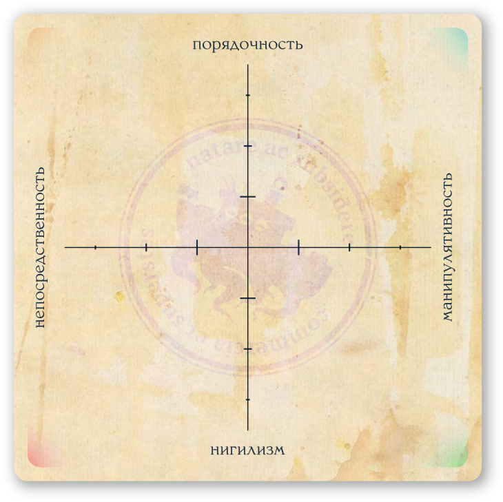
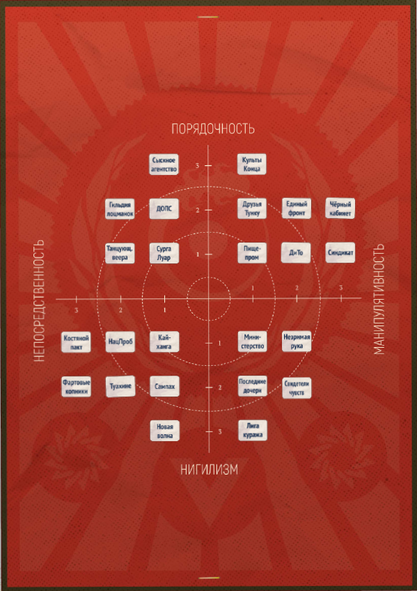

# Влиятельные коалиции

В поисках личной выгоды и стремясь к безопасности, обитатели Веа Туароа образуют сообщества единомышленников той или иной степени открытости. Культы и гильдии, диаспоры и тайные движения, картели и негласные союзы объединяются здесь по самым разным соображениям от сугубо прагматических до возвышенно идейных. Предлагаем вам познакомиться с организациями и движениями, слухами о которых полнятся портовые базары и городские пабы. Деятельность этих групп может стать основой и подспорьем для канвы вашей истории. А их представительницы и представители (см. стр. XX) могут быть заказчиками, объектами поиска, конкурентами или союзниками вашего экипажа.

> Конечно, полный список коалиций, действующих на просторах Веа Туароа, вышел бы куда как объёмнее (быть может, даже достойным отдельной книжки), если вообще не бесконечным. Так что, ведущая, не стесняйся и в случае необходимости придумывай свои собственные, наподобие представленных тут образцы.

Каждая указанная далее коалиция кроме общего описания имеет собственную идейную приверженность (см. далее), девиз, смысловые метки и список первоочередных интересов. У некоторых есть оплоты и опорные базы для активной деятельности – места, острова и порты, в которых коалиция обладает наибольшим и неоспоримым, хотя и не обязательно публичной, контролем.

## **Идейная приверженность**

Все описываемые нами далее драматические коалиции и персоналии (включая ваш экипаж вольных торговцев) имеют те или иные характерные повадки и принципы. А также методы действий и не всегда осознаваемые взгляды на то, как должны работать общественные отношения.

Для удобства быстрого использования такого идейного корпуса, а также для определения, кто вам более враг, а кто – друг, мы разложили эти методы, ценности и убеждения по двум осям координат – от нигилизма до порядочности и от непосредственности до манипулятивности.

- **Нигилизм (+ни)** здесь означает стремление отрицать любые устойчивые нормы и порядки, вместо этого концентрируясь на своих эгоцентрических устремлениях.

- **Порядочность (+пор)** наоборот подразумевает нутряное желание ставить кодексы, уложения и общественные договоры выше порывов собственного мятущегося эго.

- **Непосредственность (+неп)** предполагает стремление решать возникающие задачи быстро и просто, с высокой степенью личного вклада и минимальным количеством промежуточных этапов.

- **Манипулятивность (+ман)** делает ставку на непрямое воздействие, сложные схемы взаимовлияний и выполнение работ чужими руками, зачастую не подозревающими об истинном смысле происходящего.

Каждая коалиция и персоналия, как вы можете видеть далее, имеет ту или иную позицию – приверженность – в рамках данной схемы. Собранный согласно правилам со стр. XX‒XX экипаж (да-да, весь экипаж целиком) также имеет положение в этой системе координат. На старте игры – где-то неподалёку от центра.

Персоналии и коалиции, находящиеся в той же четверти квадрата приверженностей, что и ваш экипаж, относятся ко всем протагонистам с симпатией, что не выражается однозначно и механически, но может означать заботу, комплименты, чуть лучшие условия контрактов, более выгодные цены и подобное в зависимости от вашего вкуса и желаний.

Персоналии и коалиции, находящиеся в противоположной, наискосок от вас, четверти будут испытывать к вам выраженную антипатию, что во многих коллизиях может стать осложнением. Но это взаимно и потому вы всегда будете иметь +3 преимущества во время противостояний (см. стр. XX) со всеми подобными «антиподами».

Ваш экипаж время от времени может менять свою приверженность. Находясь в цивилизованном порту (см. стр. XX) и вкладывая деньги в репутацию, за каждые 20 000 огневиц протагонисты получат смещение на единицу по любой из шкал уже к следующей игровой встрече.

Ведущая также может скорректировать приверженность группы, если посчитает, что действия протагонистов этому способствовали. Однако такое смещение возможно только на одно деление и не чаще, чем раз в две игровые встречи. Каждое такое изменение приверженности целиком восполняет запас удачи у всего экипажа.

## Олъм Нде и Ва'ро Рохе

### Министерство благосостояния

*Управленческий аппарат Олъм Нде и (отчасти) Ва'ро Рохе.*

**Девиз:** «Унификация, централизация, выгода».

**Приверженность:** +ни, +ман.

**Смысловые метки:** правительство, коррупция, бюрократия.

**Контроль:** Олъм, Н'те Поа, Глокрр, Хэррн, Кэллн, Тллсин, Те'Каинга, Тикароа, Мррфрр, формально – повсеместно.

Министерство Общественного Благосостояния и Всего с Этим Связанного (обычно упоминаемое как просто «Министерство») – огромное, чрезвычайно раздутое образование, занимающееся примерно всем, относящимся ко внутренней жизни общества, постоянно подвергающееся критике за это и выполняющее роль большей части управленческого аппарата Олъм Нде и Ва'ро Рохе.

Де-юре под контролем Министерства находятся налогообложение и распределение федерального бюджета, охрана правопорядка и здравоохранение, культурные ценности, гражданский и военно-морской флот, попечительство над науками и искусствами, гос. регулирование в сфере промышленности и спорта, образования, трудовой занятости населения, строительства, судопроизводства, колоний, природных ресурсов и тому подобного. Де-факто эффективность этого управления чрезвычайно спорна, в отличие от эффективности Министерства как ещё одного отстойника для тех, кто купил себе диплом гос. Академии, но провалился на почве практической деятельности. А также как социального лифта для карьеристов, психопатов-манипуляторов и беловоротничковых проходимцев всех сортов.

Конечно же этот бюрократический монстр не всегда эффективен. И конечно же он нуждается в реформировании. Но, обладая огромной властью и инстинктивно защищая свои интересы, в предыдущие послевоенные приливы этот квазиживой организм довольно успешно отбивался от всех попыток общества (и Олъмского Совета – в частности) его расчленить, подсушить, обезжирить и сделать деятельность Министерства хоть сколько-нибудь более прозрачной.

#### Министерство хочет:

- агрессивно защищать себя от нападок;

- сохранять текущее положение дел;

- пренебрегать вашими интересами;

- принуждать к подчинению;

- регулировать всё и всех.

#### Министерство не хочет:

- заботиться о ком-либо, кроме себя;

- как-либо меняться и развиваться;

- терять власть над вашей жизнью;

- любой честной конкуренции;

- урезания бюджетов.

### Пищепромышленный союз

*Лидер в области продовольствия, его поставок, а также связанных с этим стандартов и технологий.*

**Девиз:** «Вместе сытнее».

**Контроль:** Кэррвн, Гвэдус, Улфур, Те'Ароха, Те'Роа.

**Приверженность:** +пор, +ман.

**Смысловые метки:** бизнес, производство, питание.

Крупнейшее объединение сельскохозяйственных, животноводческих, рыболовных и перерабатывающих предприятий с долей государственного присутствия, каким-то чудом всё ещё не угодившее под крыло Министерства. В обиходной речи обычно именуется как Пищепром. Ответственно не только за поставки продовольствия, но и за разработку стандартов на его производство, упаковку, хранение и т.п.

Будучи чисто коммерческим объединением, Пищепром в основном занимается согласованием процессов и логистики между участниками рынка, не лезет в политику и редко становится объектом публичных скандалов. Однако в силу размеров и солидной продолжительности существования он давно уже имеет под своим началом частный банк с программой льготного кредитования, впечатляющие строительные мощности, собственный (как транспортный, так и промысловый) флот, охранный холдинг, огромный земельный фонд, обширные пространства частного шельфа для морских ферм и много чего ещё.

Совет директоров этого тихого рыночного гиганта традиционно не публичен. Отчётность о деятельности появляется разве что в сотне экземпляров отраслевого альманаха. Любые юридические претензии быстро решаются во внесудебном порядке. И всё это, конечно же, говорит внимательному наблюдателю о том, что за нарочито не вызывающим интереса скромным фасадом Пищепрома скрывается целая теневая империя с отлаженным контролем рисков и утечек информации.

#### Пищепром хочет:

- экспериментировать с добавками, вызывающими привыкание;

- выращивать морепродукты вместо их отлова;

- одомашнивать диких и вкусных зверей;

- поглощать конкурентов.

#### Пищепром не хочет:

- расчленения и большего государственного контроля;

- внимания «Общества друзей Тунку» к своим методам;

- проникновения Синдиката в свои ряды;

- терять лидерство в своей области.

### Гильдия лоцманок и певчих

*Священное сестринство и закрытая организация самых незаменимых в море специалисток.*

**Девиз:** «Море темно и полнится песнями».

**Контроль:** Ра'Кау.

**Приверженность:** +пор, +неп.

**Смысловые метки:** бизнес, консерватизм, навигация.

Чрезвычайно могущественная и многочисленная, хотя на первый взгляд и совершенно лишённая амбиций, организация. Участницы этого уходящего корнями в седую старину, освящённого национальными традициями и очень закрытого, иерархического сестринства народа ва'ро посвящают свои жизни помощи в нахождении нужного вам пути на тёмных просторах моря.

Несмотря на множество исследований, их методы поиска маршрутов остаются тайной даже в наше просвещённое время. И пусть способ активации традиционных поющих маяков в последнее время был хорошо и изучен, и воспроизведён промышленным способом, его технические реализации столь ненадёжны и дорогостоящи, что мы до сих пор рассчитываем на добрую волю специалисток Гильдии в подобных вопросах. Весьма иронично, что мореплаватели Олъм Нде настолько полагаются на способы навигации, недоступные их пониманию. Но способы эти так надёжны и дёшевы, что большая часть ходящих по просторам моря олъмцев попросту с этим смирилась.

О внутренней деятельности и устройстве Гильдии известно немногое. Но её сложная структура клятв, строгий отбор кандидаток как в лоцманки, так и в маячные певчие, ритуальные фразы, издалека узнаваемые накидки, орнаменты и украшения, будто бы сошедшие с мозаик времен Империи ва'ро, архаичная конструкция рыбацких снастей и складных лодок позволяют предположить крайнюю консервативность этой организации. Консервативность возможно последнего общественного института ва'ро, отказавшегося меняться и обречённого в ближайшее время пасть перед неумолимой поступью прогресса.

#### Гильдия хочет:

- неукоснительно следовать уложениям и канонам;

- отправлять сложные ритуалы поклонения морю;

- вовремя получать оговоренную оплату;

- выполнять свой долг перед обществом;

- сохранять свои и чужие тайны.

#### Гильдия не хочет:

- терять или сокращать свою автономность;

- работать с непорядочными клиентами;

- раскрытия своих связей с «Туахине»;

- как-либо участвовать в политике;

- торговаться.

### Сыскное агентство

*Частные сыщики с международными полномочиями.*

**Девиз:** «Откуда угодно и кого угодно».

**Контроль:** не локализован.

**Приверженность:** +пор, +неп.

**Смысловые метки:** охота за головами, международное, найм.

Международная (имеющая представительства в Олъме, Н'те Поа, Сурге и Салайфе) некоммерческая организация, выступающая посредницей между местными – островными – органами правопорядка и частными специалистами, желающими этим органам помочь. Чаще всего упоминается как просто «Агентство» и управляется «Советом девяти», состоящим из представителей всех трёх народов моря.

Функция Агентства проста – оно имеет эксклюзивное право делегировать частным лицам силовой захват и возврат в лоно судебной системы тех или иных беглецов, решивших скрыться за пределами зоны ответственности какого-либо территориального подразделения по охране правопорядка. Другими словами, Агентство раздаёт открытые контракты охотникам за головами (см. стр. XX) – смельчакам, готовым рискнуть своей шкурой за деньги и преследовать своих жертв даже там, куда рядовые стражи порядка не сунутся. Все пойманные таким образом подозреваемые и осуждённые могут быть возвращены в ближайший из филиалов Агентства в обмен на крупное денежное вознаграждение. Как правило, в дальнейшем Агентство этапирует их к местам рассмотрения судебных дел или напрямую к местам отбывания срока наказания.

Менее публичной стороной работы Агентства, известной только его влиятельным клиентам и некоторым заслужившим достаточно высокий рейтинг охотникам, является подбор кадров и обеспечение поддержки для малых военизированных отрядов, выполняющих затем различные щепетильные силовые операции в пределах нейтральных вод Внутреннего фронтира.

#### Агентство хочет:

- тратить большие средства на саморекламу;

- открыть представительство в Костегрызе;

- выглядеть респектабельно любой ценой;

- романтизировать профессию охотников.

#### Агентство не хочет:

- ответственности за сопутствующий ущерб;

- усиления организованной преступности;

- потерять государственную поддержку;

- всерьёз враждовать с Синдикатом.

### Кайханга

*Лучшие экспертки по сборке, ремонту, доводке и оптимизации промышленной техники.*

**Девиз:** «Мы слышим голос машин».

**Контроль:** Те'Ранга.

**Приверженность:** +ни, +неп.

**Смысловые метки:** технологии, профессионализм, экспертность.

Сестринство, уходящее своими корнями в историю императорского инженерного корпуса империи Ва'ро Рохе. Тщательно отобранные дочери Дымящихся островов, лучшие специалистки по сборке, ремонту, доводке и оптимизации практически любой промышленной техники. Говорят, что кандидаток в Кайханга начинают воспитывать ещё с детского садка, а их ритуалы инициации чрезвычайно жестоки и зачастую смертельны. Говорят также, что их общее количество никогда не превышает толики октов, а любая новая мастерица обязана победить какую-то из кандидаток на трёх дуэлях – мастерства, духа и крови.

Как бы то ни было, профессионализм участниц этой гильдии чрезвычайно высок, а услуги дороги. Конечно, когда дело доходит до прорывных изобретений или научных экспериментов, ни одна ва'ро не сравнится с лучшими умами олъмцев. Но практически каждый такой великий ум наверняка бы хотел иметь хотя бы одну подручную из Кайханги – деловитую, исполнительную и чудесным образом безошибочно не только распознающую все слабые места любого механизма, но и почти наверняка знающую способы отладить его работу.

В общем, на каждом производственном предприятии и в каждом порту понимают, как выросли бы качество продукции, уровень сервиса и прибыли после найма хотя бы одной из мастериц «Кайханги». Но те знают себе цену – обычно куда как более высокую, чем может себе позволить большинство мелких и даже средних промышленников.

#### Кайханга хотят:

- поддерживать репутацию лучших механщиц на просторах моря;

- вызволить сестёр, силой удерживаемых в лабораториях ДиТо;

- раскрыть тайну машины уничтожения, разрушившей Шпиль;

- учиться новому и собирать знания о том, как работает мир.

#### Кайханга не хотят:

- в открытую участвовать в политической жизни общества;

- давать огласку своим конфликтам с другими коалициями;

- признавать, что не способны изобрести ничего нового;

- раскрывать свои методы, фонды, клятвы и таинства.

### Дилингем-торг (ДиТо)

*Компания-лидер в производстве инновационных и высокотехнологичных товаров.*

**Девиз:** «Будущее прекрасно».

**Контроль:** Кррк, Тайнуи.

**Приверженность:** +пор, +ман.

**Смысловые метки:** бизнес, технологии, корпорации.

Крупная и невероятно успешная компания, некогда в честь основателя (см. стр. XX) называвшаяся «Дилингем-торг», а ныне просто сокращаемая до ДиТо. Вместе с рядом дочерних контор производит массу высокотехнологичных товаров от ламповых усилителей до тепловых двигателей. Устройства, разработанные ДиТо, можно найти на каждом втором судне Веа Туароа и на каждом первом – в пределах Олъм Нде.

В буклетах о работе на ДиТо много пишут о том, что прогресс не должен стоять на месте. И о том, что их «Отдел передовых разработок» неустанно трудится над новыми открытиями. О просветительских и благотворительных инициативах. О научной организации труда. О визионерах и гениях в руководстве. И о том, что ДиТо выступает первопроходцем, делая то, чего не делают другие. А вот про что в рекламных проспектах не пишут, так это про цветущий внутри компании культ личности основателя, сомнительные экономические схемы, передовые технологии эксплуатации персонала, раздутые рекламные бюджеты и стойкий, но трудно объяснимый интерес компании к тайнам былых времён.

Между тем ДиТо через третьих лиц регулярно и щедро спонсирует частные археологические экспедиции в отдалённые уголки моря и щедро платит участникам. А находки из подобных вояжей (чем бы они ни были) никогда не попадают в музеи и не демонстрируются публике.

Помимо того, ходят слухи, что отдел по рекламе и связям с общественностью в рамках компании имеет куда большие полномочия, чем можно было бы ожидать, занимаясь не только организацией выставок, но также и разведкой, и преследованием инакомыслящих, и контактами с различными весьма специфическими партнёрами, типа тех же культов Конца.

#### ДиТо хочет:

- удерживать лидерство в по количеству военных подрядов;

- безжалостно, но тихо расправляться с оппонентами и конкурентами;

- преуменьшать опасность своих фабрик и технологий;

- владеть умами жителей Олъм Нде;

- присваивать чужие изобретения.

#### ДиТо не хочет:

- внешнего контроля со стороны общества или отдельных лиц;

- снижать темпы развития ради заботы о людях и природе;

- чтобы персонал чувствовал себя чересчур комфортно;

- плохо выглядеть в глазах публики.

### Незримая рука

*Тайный и полукриминальный сговор крупных торговцев.*

**Девиз:** «Преумножай интересы».

**Контроль:** Эйллн, Эвнн, Н'Гамоту.

**Приверженность:** +ни, +ман.

**Смысловые метки:** торговля, интернациональность, заговор.

Тайное и окружённое невероятными слухами транснациональное неформальное объединение крупных торговцев. Говорят, что название общества напрямую связано с их приветственным ритуалом – особым рукопожатием, незаметным окружающим. Участники «Руки» якобы используют в качестве символики весы менял и лучезарное око Первого Судьи. Злые языки приписывают этому т.н. «объединению» крайне запутанную иерархию, большое количество внутренних склок и многоступенчатую структуру посвящения, завязанную на всё большие денежные взносы. Разведывательные службы Олъм Нде и Кансе Ткути традиционно заявляют, что многое отдали бы за возможность вычислить иерархов «Руки» в правящих кругах. Но, вероятнее всего, это не более чем имитация бурной деятельности, так как руководители разведок сами давно уже имеют весьма высокие степени посвящения.

Поговаривают, что иерархи «Незримой руки» много работают над дискредитацией наладившихся связей «Костяного пакта» и Синдиката (см. далее). Возможно, чтобы ослабить обе этих группы. А возможно, чтобы прибрать к рукам – сделать ещё одним своим активом – вызревающую лавину опустошительных сил объединённой пиратской вольницы.

#### Незримая рука хочет:

- любыми средствами приобретать хозяйственные активы;

- провоцировать большие и малые рыночные кризисы;

- спекулировать, эксплуатировать и завышать цены;

- культивировать секретность ради секретности;

- обзавестись собственной армией.

#### Незримая рука не хочет:

- развенчания мифа о своём могуществе;

- упускать возможности для обогащения;

<!-- -->

- иметь могущественных конкурентов;

- расследования собственных афер;

- терять свои рычаги влияния.

### Единый фронт

*Международная политическая партия консервативного толка.*

**Девиз:** «Союз, который построили мы».

**Контроль:** Пенллн, Эрдду.

**Приверженность:** +пор, +ман.

**Смысловые метки:** политика, консерватизм, интернационализм.

Члены партии «Единый фронт» знают, что избыток свобод неизбежно ведёт к хаосу. Обычный житель Олъма порой не может решить, что ему на ужин приготовить и во что одеться. Что уж говорить о решениях, которые повлияют на целые народы. Единственный разумный выход для всех – сильная и бессменная лидерка, полновластная бренхи, не отвлекающаяся на прихоти разнообразных политических подонков и мошенников из Совета. Она своей крепкой десницей сдержит крушение братского союза народов олъма и ва'ро и проложит крепкий путь в скорое светлое будущее, которое надо просто подождать.

Уверенные в своей абсолютной правоте, члены «Фронта» частенько прибегают к силовым, сомнительным, а то и вовсе нелегальным способам политической борьбы через множество прокси-организаций и «автономных патриотических групп». «Да, кое-кто будет страдать. Но это целительная боль», – в таких случаях увещевают скептиков лидеры партии, перед тем как отправиться на закрытый фуршет к каким-нибудь богатеям-спонсорам.

В конечном итоге «Фронту», конечно же, безразличны рядовые «патриоты», столь усердно накачиваемые пропагандой и решимостью к действию. Да, сама партия бесспорно заинтересована в сохранении статуса кво и предотвращению раскола общества. Но её руководством – бонзами из т.н. «Громкой пятёрки» – движет вовсе не забота о народе. Ими, непосредственными свидетелями кровавого безумия Революции пелаев и распада Кераджа, движет глубоко укоренившийся ужас. Который они, впрочем, давно привыкли скрывать под маской неустанных благоволительниц.

#### Единый фронт хочет:

- словом и делом доказывать несостоятельность демократии;

- укреплять вертикаль власти и не давать «раскачивать лодку»;

- горячо поддерживать единомышленников;

- выглядеть гласом простого народа;

- ломать жизнь противникам.

#### Единый фронт не хочет:

- усиления независимости Ва'ро Рохе;

- напрямую ассоциироваться с насилием;

- расползания подрывных левацких идей;

- вызывать недовольство спонсоров;

- признавать собственные ошибки.

### НацПроб

*Национальное политическое движение реформационного толка.*

**Девиз:** «Хватит терпеть».

**Контроль:** М 'Катеа, Манайа, Такора

**Приверженность:** +неп, +ни.

**Смысловые метки:** политика, сепаратизм, бунт.

НацПроб (или же «Национальное пробуждение»), будучи скорее газетным ярлыком, чем точным политологическим термином, объединяет под своим «гербом» множество довольно самостоятельных политических организаций.

Расходясь в деталях, эти «ячейки», «движения» и «бригады» тем не менее имеют единую точку сборки – необходимость пробуждения национального духа и созидательной воли у ныне разделённого на племенные общины и политически апатичного народа ва'ро. И этим же он выражает чаяния и надежды так называемого «поколения потерянных дочерей» – множества дев, в юности ушедших на Войну и навсегда изменившихся, сплотившихся, поставивших верность своей пролитой крови и великому полузабытому наследию выше семейных дрязг.

Какие-то из фракций НацПроба считают, что искомый дух нужно выразить через месть кансейцам. Другие – что вместе с ва'ро за независимость от Олъма должны бороться пролы. А третьи… просто думают, что на идеях подобного сорта можно неплохо нажиться. Тем не менее на данный момент все эти группы работают в одном направлении, считая, что главное – запустить процесс национальной сепарации, а потом уж будет ясно.

И конечно же, находясь на полулегальном, а то и вовсе подпольном положении, участники НацПроба активно сотрудничают с такими же отщепенцами и тёмными коньками. Находя союзников то в дурманных притонах «Сампаха» и прокуренных салонах закрытых торговых клубов, то среди белёсых отрогов Костяного лабиринта, а то и вовсе во тьме за пределами Олъм Нде.

#### НацПроб хочет:

- проводить «акции прямого действия» всеразличного вида;

- расширять круг союзников и сочувствующих;

- близить момент национальной революции;

- бороться с идейными врагами.

#### НацПроб не хочет:

- отвлекаться на мелкие разногласия и сопутствующий ущерб;

- отказываться от подвернувшихся возможностей;

- действовать взвешенно, разумно и аккуратно;

- соблюдать законы Олъм Нде.

### Добровольная Организация Поддержки Стабильности

*Влиятельная организация консервативных экстремистов.*

**Девиз:** «Ради будущего олъмских детей».

**Контроль:** Ррфэлрр, Кррф.

**Приверженность:** +пор, +неп.

**Смысловые метки:** здравоохранение, ксенофобия, преследования, евгеника.

Чаще всего обозначаемая просто как «Организация» или ДОПС, эта небольшая некоммерческая непубличная и негосударственная, но ресурсная и влиятельная группа лиц, которая попечительствует положительному психологическому и социальному состоянию граждан Олъм Нде и Ва'ро Рохе. Причём «положительное социальное состояние» здесь трактуется максимально широко. В сферу интересов Организации, согласно утверждению её представителей, входят и политическая благонадёжность, и наследственные болезни, и отсутствие пагубных ересей относительно тех или иных патриотических доктрин, и даже ежедневный позитивный настрой граждан Союза.

Особым же вниманием, съедающим большую часть ресурсов Организации, пользуются пролы (см. стр. XX), подвергающиеся регулярным проверкам и даже попыткам стандартизации с отсевом, просевом и последующей утилизацией «отравляющих популяцию образцов». Формулировка «отравляющие популяцию» также нарочито широка и подразумевает как физические уродства и слабое здоровье, плохо совместимые с продуктивной деятельностью на благо общества, так и самое опасное – болезни ума: патологические несговорчивость, ленность, самостоятельность, вещизм, угрюмость, любопытство, грамотность и противодействие устоявшимся брачным традициям.

Несмотря на полную добровольность и отсутствие внятных источников финансирования, Организация разменяла уже вторую сотню приливов. По слухам, на текущий момент она управляется рядом влиятельных семей, сросшихся с финансовыми и военными элитами Союза. Конечно, как и многие другие общественные институты, в послевоенный период она испытала ряд потрясений и столкнулась с новыми вызовами. Достоверно известно, например, что многие её участники добровольно отправлялись в очаги пурпурной хвори. Они вахту за вахтой, работали там в пламени копоти до тех пор, пока болезнь не подкашивала их окончательно. Но даже сейчас эти поредевшие когорты идейных борцов за здоровье общества представляют собой силу, с которой стоит считаться.

#### ДОПС хочет:

- ничем не гнушаться «ради защиты будущего наших детей»;

- поддерживать низкий уровень интеллекта у прольского населения;

- эффективно устранять генетических девиантов;

- выглядеть мучениками и святошами.

#### ДОПС не хочет:

- раскрывать свои связи с силовыми структурами;

- вызывать смех и выглядеть несерьёзно;

- встречать достойное сопротивление;

- сомневаться в своих догматах.

### Чёрный кабинет

*Неофициальное (контр)разведывательное управление Олъм Нде.*

**Девиз:** «Здесь смотреть не на что».

**Контроль:** Пьятата, Квинф

**Приверженность:** +пор, +ман.

**Смысловые метки:** правительство, шпионаж, заговор.

Официально не существующий, «Чёрный кабинет» неизменно становится предметом множества пересудов среди тех, кто заинтересован во внутренней и внешней политике Олъм Нде. Говорят, «Кабинет» не отчитывается ни перед кем, кроме самой бренхи, и не ограничен никакими иными законами. Говорят также, что число непосредственных участников «Кабинета» не может превышать трёх дюжин, а выходом из этой организации становится только окончательная смерть. Досужие болтуны частенько обвиняют «Кабинет» на пару с «Туахине» во множестве нераскрытых происшествий, убийств, похищений и несчастных случаев по всему Укрытому морю, но сходятся на том, что это всё дело тёмное и надо наблюдать дальше.

В любом случае, если «Кабинет» и существует, то он представляет собой крайне структурированную, централизованную, и в то же время разветвлённую организацию, словно грибница незаметно вросшую в саму плоть общества Олъм Нде, но всё ещё остающуюся отдельным организмом. Организмом, способным выделять или выводить токсины, лечить и убивать, поддерживать или угнетать согласно собственным желаниям и нуждам.

Как и белёсые нити грибницы, этот симбионт (или всё же паразит?) не всегда заметен на срезе поражённой им структуры, пока вы не начнёте пристально её разглядывать. Если же вы начнёте, и особенно – если в результате разглядывания у вас появится ощущение, что грибница разглядывает вас… то помоги вам Море не стать в ближайшее время пациентом одного из тех весёлых государственных заведений, что много пекутся о душевном здоровье олъмцев.

#### Чёрный Кабинет хочет:

- удерживать сепаратистов ва'ро в роли пугала, но не более;

- использовать самые передовые технические средства из доступных;

- оставаться незамеченным и неузнанным, но могущественным;

- накапливать и обрабатывать всю доступную информацию;

- поддерживать свою репутацию типа «мы везде и нигде».

#### Чёрный Кабинет не хочет:

- действовать напрямую от лица штатных сотрудниц;

- объединения и усиления Кансе Ткути;

- уничтожать то, что можно надёжно спрятать;

- убивать тех, кого можно завербовать;

- отпускать что-либо на самотёк.

### Танцующие веера

*Сетевая академия изящных искусств и политический институт.*

**Девиз:** «Важен каждый шаг».

**Контроль:** Салайф.

**Приверженность:** +пор, +неп.

**Смысловые метки:** культура, развлечения, шпионаж.

Непревзойдённые теоретики и практики танца, адепты выверенных гармоний и моделей, утончённые знатоки церемоний и ритуалов, изысканного искусства безупречно одеваться и раздеваться, сложнейших техник лечебного массажа, контроля своих и чужих тела, ума и голоса, написания хроник и рассказывания историй, искусные певцы и музыканты. Ещё недавно, во времена правления Иерархов, эти изящные персоны были закрытым придворным корпусом, который немногие гости со стороны считали чем-то наподобие коллективного гарема для развращённой кансейской теократии. Однако дальнейшие события показали, что это мнение никогда в полной мере не соответствовало действительности. «Веера» никогда не были только гаремом и всего лишь слугами. Прилив за приливом они накапливали информацию, дёргали за незримые нити и совершали политические ходы настолько же сложные, насколько и эффективные.

Теперь, когда монолит Кераджа распался вместе с Костяным шпилем, «Веера» поставили перед собой очередную великую задачу. Они хотят пересобрать Кансе Ткути в нечто иное, никем ранее не виданное. В общество, не окутанное пологом деструктивных религиозных догматов и не отвергающее всё новое. В сияющую утопию, в социальную машину, которой правит не консервативный фундаментализм, но строгие правила прагматичной логики. В машину, которую на сей раз никто остановить не сможет.

Они многочисленны и единодушны в своём желании покончить с эпохой прозябания для своего народа. Они искусны и предприимчивы. Здесь, в чуждых и не родных водах, на их стороне множество вольных и невольных союзников, развитая агентурная сеть, десятки приливов отточенных ментальных техник, харизма и страсть, навыки и дары длительной селекции, влиятельные спонсоры и секретные, сохранившиеся ещё с военных времён, фонды. В общем, они – мягкая, но непреклонная сила, скрывающаяся в полумраке будуаров и неоновых отсветах рекламных витрин. Сила, готовая перекраивать мир.

#### «Веера» хотят:

- ослеплять, отравлять, обманывать, приручать, ослаблять и уничтожать своих врагов;

- объединения олигархических кланов Кансе Ткути под своим началом;

- увеличения культурного и торгового обмена с Олъм Нде;

- искоренить кастовые различия внутри собственного народа;

- всеобщих любви и симпатий.

#### «Веера» не хотят:

- чтобы «Чёрный кабинет» узнал о сплетённом вокруг него заговоре;

- терять статус самых изящных созданий на просторах моря;

- военных конфликтов между островами Кансе Ткути;

- раскрытия своих контактов и союзников;

- чтобы их воспринимали всерьёз.

### Синдикат

*Влиятельная преступная организация консервативного толка.*

**Девиз:** «Семья – это святое».

**Контроль:** Сланк, Похуту, Ллэнб.

**Приверженность:** +ман, +пор.

**Смысловые метки:** криминал, консерватизм, инфраструктура.

В Синдикат, формально или фактически, входит абсолютное большинство преступных организаций Олъм Нде. Отдельные звенья этой подпольной империи могут отличаться друг от друга по составу, целям и методам заработка, однако различия теряют значение, когда речь заходит о верности Кодексу и уважении к Старшим. Синдикату плевать, чем ты занимаешься и кто ты такой, пока ты соблюдаешь правила: к Старшим нужно прислушиваться, Старшим нужно платить дань. Тот, кто «прослужил» дольше, получает большую долю. Подмахивание «погонам» и работорговля караются смертью. Мелкие прегрешения караются болью. Остальное – малозначимые детали.

Недоброжелатели распускают слухи, что таинственные главы Синдиката – Старшие – часто вращаются в тех же кругах, что и многие гуру культов Конца, оказывая взаимные услуги в решении тех или иных вопросов. Говорят также, что часть младших «фирм» Синдиката в последнее время наладила связи с «Костяным пактом», несмотря на кардинальное расхождение по ряду идейных моментов.

В конечном счёте вне зависимости от слухов и пересудов одно остаётся фактом: Синдикат – это целая подпольная империя, скрывающаяся в тенях и запустившая свои щупальца в большинство сфер жизни Олъм Нде. Огромные запасы человеческих и материальных ресурсов – подпольные медики, мастерские, безопасные убежища, товарные склады, биржи услуг, юристы и эксперты всех мастей. Несомненная сила, с которой нужно считаться. Дремлющий гигант, способный как залить улицы Олъм Нде кровью, так и сплотить его и помочь ему выстоять, как уже не раз происходило в Войну.

#### Синдикат хочет:

- расширять границы своей подпольной империи;

- мстить за оскорбления и благодарить за услуги;

- демонстрировать силу через жестокость;

- защищать тех, кто им платит мзду;

- добиваться уважения или страха.

#### Синдикат не хочет:

- применять дипломатию там, где можно проявить силу;

- оставаться обязанным и прощать чужие долги;

- увлекаться новшествами сверх меры;

- жить и выглядеть скромно;

- сотрудничать с властями.

### Сампах

*Криминальная субкультура философско-поэтической направленности.*

**Девиз:** «Жизнь коротка, танцуй!»

**Контроль:** не локализован.

**Приверженность:** +ни, +неп.

**Смысловые метки:** криминал, гастролёры, вещества.

Представители «Сампах» – традиционных преступных групп Каансе Ткути – всеми силами стремятся придать своему образу жизни оттенок благородства. Они убивают только людей недостойных. Грабят для того, чтобы потратить, а не обогатиться. Восстают против социальной несправедливости, этнической розни и закоснелых традиций. Упражняются в уличных эпистемологии и поэзии. Легко дают и легко расторгают обещания. Свои выборы они вверяют подсказкам карточной колоды и решают разногласия поединками на изогнутых ножах-керисах. Другими словами, большинство членов «Сампах» – те ещё позёры.

И при этом они каким-то образом умудряются оставаться единой… скорее субкультурой, чем организацией, время от времени объединяющейся вокруг тех или иных наиболее харизматичных своих представительниц.

Большая часть гастролирующих по территорию Олъм Нде участников «Сампах» ведут беспорядочный образ жизни – от случая к случаю занимаются заказными убийствами, похищениями, частной охраной и грабежом контор, помогают доставлять различные интересные вещества из Салайфа и выполняют другую опасную работу для того, кто больше заплатит. При этом они кажутся совершенно незаинтересованными в местных политических дрязгах. Но знающие люди утверждают, что всё это только видимость. И что на самом деле эти бездумные поэты-бретёры готовят почву для чего-то большого, жестокого и страшного.

#### Сампах хочет:

- втайне от всех перехватить контроль над сетью дурманных притонов;

- поддерживать националистические настроения ва'ро;

- организовывать «несчастные случаи» для своих противников;

- саботировать сближение Синдиката и «Костяного пакта»;

- выглядеть скромно, но достойно и щеголевато.

#### Сампах не хочет:

- чьей-либо победы в противостоянии олъмцев и ва'ро;

- обзаводиться серьёзными и долговременными врагами;

- потерять доверие покровителей – «Танцующих вееров»;

- подчиняться каким-либо строгим правилам;

- чтобы его воспринимали всерьёз.

### Туахине

*Легендарный культ наёмных убийц.*

**Девиз:** «Почаще оглядывайся».

**Контроль:** Ра'Токо.

**Приверженность:** +ни, +ман.

**Смысловые метки:** криминал, ликвидация, тайны.

Городской миф и повод для пересудов, о котором неизвестно ничего конкретного – таинственная организация (или орден, или агентство или даже отдельное племя), якобы стоящая за множеством необъяснимых исчезновений и трагических случайностей, время от времени происходящих с различными персонами, как правило, нажившими много врагов.

Говорят, что участницы «Туахине» способны менять облик по собственному желанию. Что могут читать чужие мысли. Что они способны превращаться в туман и ходить сквозь зеркала. Что обходятся без пищи, света и сна целыми приливами, а подкрепляют свои силы исключительно кровяным супом. Что они чудовищно сильны, выносливы и жизнеспособны. Что даже ваш сосед, которого вы знаете уже полтора окта приливов, в конечном итоге может оказаться одним из *них*.

Согласно наиболее влиятельным конспирологам, «Туахине» это что-то вроде культа, уходящего своими корнями к корпусу придворных убийц давно позабытых императриц. Культа, намного пережившего своих былых покровительниц и нашедшего себе новое место в новом мире – место дорогостоящих посредников в разрешении сложных деловых ситуаций. Людей, которым можно доверить даже, казалось бы, невыполнимую миссию. И, как ни парадоксально, людей, о которых никто и ничего не знает наверняка.

#### Туахине хочет:

- устранять тех, кто слишком много знает;

- поддерживать пугающую репутацию;

- выполнять дорогостоящие заказы;

- хранить чужие тайны.

#### Туахине не хочет:

- зависеть от кого-либо слишком сильно;

- становиться чем-либо определённым;

- раскрывать свои секреты и таинства;

- пристального внимания.

### Лига куража

*Профессиональные организаторы различных состязаний.*

**Девиз:** «Делайте ваши ставки».

**Контроль:** Корара.

**Приверженность:** +ни, +ман.

**Смысловые метки:** культура, развлечения, спорт.

Совершенно неформальное и во многом беспорядочное то ли объединение, то ли просто сеть знакомств и репутаций самых разных людей, выбравших своей профессиональной областью риск, кураж, соревнования и всё с этим связанное. Ставки на спорт, гонки и турниры, азартные игры и атлетические многоборья с денежными призами стали для этих людей жизнью, досугом и источником заработка.

Не имея какой-то чёткой структуры, «Лига» при этом уже долгое время выступает в роли мощной социальной поддержки для тех, кто себя с ней ассоциирует. Взаимная реклама, благотворительные сборы, финансовое посредничество, обмен списками потенциальных спонсоров для мероприятий, закрытые вечеринки, частные семинары, пополняемые сообществом каталоги репутации и другие подобные активности существуют тут на уровне общепринятой культуры.

Для внешних контрагентов – площадок проведения мероприятий, спортивных клубов, слизнезаводческих ферм, гоночных мастерских, прессы, PR-отделов коммерческих компаний, охранных фирм и подобного «Лига» всегда готова предоставить экспертную поддержку, рекомендации персонала, помощь в организации спортивных событий, ресурсы для продвижения информации, точки инвестирования, заранее прогретую аудиторию и многое другое.

#### Лига куража хочет:

- приватно предоставлять услуги по легализации денежных средств;

- распространять истории о впечатляющих выигрышах;

- проводить яркие и запоминающиеся мероприятия;

- наживаться на простаках и туристах.

#### Лига куража не хочет:

- раскрывать информацию о контактах с Синдикатом;

- всерьёз сотрудничать с налоговыми службами;

- заморочек, усложнений и прочей подобной мути;

- становиться солидной организацией.

### Культы Конца

*Разрозненные апокалиптические секты и культы.*

**Девиз:** «Скоро всё схлопнется».

**Контроль:** не локализован.

**Приверженность:** +пор, +ман.

**Смысловые метки:** секта, религия, тайны.

*«Апокалипсис близок и совсем скоро этот гниющий мир подавится собственным невежеством. Лишь самых верных ждёт переход на следующий уровень бытия», –* так считают члены разрозненных, но многочисленных «культов смерти», расплодившихся на просторах послевоенного Веа Туароа. Одурманенные различными «сакральными» памфлетами, они ожидают скорого «конца всего» и верят, что только избранным уготован экстаз вечного полёта средь священных огней. Но стать избранным очень непросто. Нужно беспрекословно подчиниться своему гуру, отказаться от мирских благ, избегать контактов с неверующими, каяться и регулярно умерщвлять плоть.

Что же до пастырей и кормчих этих кружков и сект, то они, привыкшие жить в комфорте и почитании, сейчас, во времена Благословенного прилива, со скорбью отмечают угасание веры в своих подопечных. Вот почему эти поводыри страждущих так стремятся обратить себе на пользу бредни безумной сказочницы – Тунку Ватоко, приютив её, захватив, приручив и заполучив в своё распоряжение. Хотя для этого Тунку сначала придётся найти и обезвредить.

Поговаривают, что ДиТо (см. стр. XX) и ряд других крупных игроков рынка втайне даже спонсируют эти поиски, ожидая, что надёжно заточённая в обителях какого-нибудь закрытого культа, Тунку наконец перестанет привлекать внимание общественности к опасностям технического прогресса.

#### Культы Конца хотят:

- изображать угнетаемых праведников;

- укреплять своё политическое влияние;

- вовлекать страждущих и нуждающихся;

- видеть знамения в случайных событиях;

- найти и захватить Тунку Ватоко.

#### Культы Конца не хотят:

- раскрывать свои бухгалтерию и состав участников;

- открытых дискуссий и обсуждения своих догматов;

- расследования пропаж и смертей своих участников;

- внепланового внимания публики.

### Последние дочери

*Литературный клуб и оккультное сообщество.*

**Девиз:** «Шествуя в отблесках тайны».

**Контроль:** не локализован.

**Приверженность:** +ни, +ман.

**Смысловые метки:** культура, литература, холизм.

Сеть участниц литературных кружков, собирающихся раз в неделю в собственных книжных лавочках, читающих, обсуждающих и распространяющих самописные памфлеты. Несмотря на безобидный фасад, многие считают их подозрительными. Ведь их собрания происходят регулярно и с неукоснительной точностью, их магазинчики никогда не страдали от стихийных бедствий и послевоенных погромов, не разорялись, не привлекали внимание власть имущих и даже не подвергались ежеприливным нашествиям бытовых вредителей. Впрочем, обычно болтуны всё-таки сходятся на том, что перечисленных совпадений недостаточно для однозначных выводов и навешивания ярлыков на добропорядочных горожанок, увлечённых литературой.

Любовь «Последних дочерей» к литературе не ограничена книгами и памфлетами современности. Они также обожают литературные артефакты прошлых эпох, с удовольствием их собирают, восстанавливают и переписывают. Если у вас в руках оказалось что-то подобное – смело обращайтесь к «Дочерям» и знайте, что вам добротно заплатят.

Впрочем, ни одна любовь не может быть всеобъемлющей, так что и у «Дочерей» есть на современном литературном пейзаже как минимум два повода для регулярной критики. Первый – различная, как они её называют, «ми-сти-фи-ка-ционная макулатура», издающаяся под эгидой «Культов Конца» (см. выше). Второе – «СПГС-ное бумагомарательство», которым «Дочери» совокупно именуют сборники «Знак будущего», во множестве тиражируемые «Обществом друзей Тунку» (см. далее).

Неизвестно, заходят ли «Дочери» в своей антипатии к вышеописанным опусам дальше желчных шпилек, но поговаривают, что их встречи с оппонентами на книжных ярмарках представляют весьма развлекающее и поучительное зрелище.

#### Последние дочери хотят:

- давать полезные советы своим влиятельным подругам;

- приобретать и сохранять запрещённую литературу;

- обмениваться таинственными посланиями;

- организовывать случайные неслучайности;

- строить козни самозванным эзотерикам.

#### Последние дочери не хотят:

- подтверждать или опровергать слухи о себе;

- активно расширять знакомства и продажи;

- поддерживать мракобесие любого рода;

- следить за модой и пеной дней;

- внимания властей.

### Друзья Тунку

*Постиронические экологи и прогрессивно-атеистические пара-культисты.*

**Девиз:** «Фнглуб птрнгх! Да-да?»

**Контроль:** не локализован.

**Приверженность:** +пор, +ман.

**Смысловые метки:** культура, литература, пост-ирония.

Разветвлённая сеть неформальных знакомых или просто клуб по интересам, как они сами себя называют, «Общество друзей Тунку» посвящает свой досуг чтению и толкованию многочисленных и беспорядочных записей речей Тунку Ватоко (см. стр. XX): реже – сделанных ей самой, и чаще – набросанными случайными свидетелями выступлений. Не обладая какой-либо формальной иерархической структурой, «Друзья» весьма упорядочены и разбиты на большое количество небольших ячеек-толковищ, ведущих постоянную почтовую переписку друг с дружкой.

Помимо публичных чтений и обсуждений, «Друзья» также знамениты своими регулярными конференциями и съездами, как организуемыми самостоятельно, так и вместе с книжными и журнальными издательствами, среди которых у «Друзей»… кхем, много друзей и коллег. Такие конференции обычно состоят не только из докладов и обсуждений «для своих», но становятся значимыми событиями в жизни того или иного порта, привлекающими большое количество любителей «серьёзной», нехудожественной литературы, обществоведения, истории литературы и подобных культурных штудий.

Наконец, нигде не афишируемой, но явной для внимательной наблюдательницы стороной деятельности «Друзей» является, конечно же, ресурсная поддержка самой неуловимой Безумной Пророчицы Конца Всего – Тунку Ватоко. Практически наверняка без финансовой и организационной поддержки «Друзей» она бы не смогла ни столь эффективно скрываться от недоброжелателей, ни столь свободно перемещаться по просторам моря.

#### Друзья Тунку хотят:

- ограждать своего кумира от любых неприятностей и недоброжелателей;

- организовывать мероприятия, посвящённые общественным наукам;

- выводить на чистую воду и публично высмеивать своих оппонентов;

- развивать, издавать и популяризовать речи и идеи Тунку.

#### Друзья Тунку не хотят:

- мешать Тунку в его путешествиях и прочей деятельности;

- поимки и удержания своего кумира кем бы то ни было;

- излишнего фанатизма в собственных рядах;

- репутации «ещё каких-то сектантов».

### Новая волна

*Субкультура экспериментаторов и бунтарей на ниве искусства.*

**Девиз:** «Приступ и натиск!»

**Контроль:** отсутствует

**Приверженность:** +ни, +неп.

**Смысловые метки:** культура, искусство, авангард.

Обширный коллектив или даже целая субкультура, школа, движение авторов – писательниц, поэтов, скульпторесс, живописцев, музыканток, деятелей синематографа и театра, отвергающих прежние, наработанные поколениями каноны своих художественных дисциплин ради экспериментов, вызова, коллизии форм и идей, бури и натиска.

Единые в этом порыве. Бесконечно разнообразные в формах. Бесстыдно и артистично ворующие друг у друга идеи, чтобы дерзновенно воплотить их каким-нибудь совершенно иным, вопреки изначальному предназначению, способом. Врывающиеся на выставки в галереи со своими буйством цветов и бунтом форм. Устраивающие внезапные представления с участием пролов прямо посреди улиц и премьеры своих работ – в фабричных цехах. Экспериментирующие с новейшими технологиями для получения по-настоящему авангардного звучания, цвета и динамики.

Эти представительницы и представители «Новой волны» – нарочито драматичное подражание, память о той первой Большой волне, что символически смыла ужасы военного времени и дала долгожданный покой многим их свидетелям, – стали заметной, если не политической, то общественной силой в последние приливы. Ими интересуются, у них есть спонсоры и влиятельные поклонники, их мнение значимо, они имеют успех у публики. Они уже неоднократно вовлекали крупные массы людей в различные художественные активности. И рано или поздно наверняка воспользуются этим успехом, выступив на стороне той или иной уже политической фракции.

#### Новая волна хочет:

- пробовать передовые способы влияния на общественное мнение;

- экспериментировать с новейшими технологиями;

- творить так, как никто ещё не творил;

- нести искусство в массы.

#### Новая волна не хочет:

- раскрытия связей с ПсО-отделом «Чёрного кабинета»;

- ограничений и регуляций со стороны общества;

- уменьшения публичного присутствия;

- быть практичной.

### Свидетели чувств

*Творческое объединение сексуальных просветительниц.*

**Девиз:** «Обнажая прекрасное».

**Контроль:** не локализован.

**Приверженность:** +ни, +ман.

**Смысловые метки:** культура, развлечения, сексуальность.

Возможно, не самая влиятельная, но однозначно заметная на культурном ландшафте Олъм Нде группа визуальных и не визуальных артистов, экспериментирующая в форматах синематографа, фото и звукозаписи, а также интерактивной литературы, запечатлевающей и воспроизводящей сексуальное поведение народов моря. Они называют свои произведения «хроникой страсти», «искусством, близким всем нам», «прививкой от стресса», а также образовательными материалами, необходимыми для лучшего понимания и принятия людьми самих себя.

Конечно, их идейные противники клеймят подобное творчество подрывом моральных устоев общества. Однако, как верно подмечают сами Свидетели, подобную позицию можно воспринимать всерьёз, только если считать моральными опорами Олъм Нде фрустрацию, ксенофобию, нервное напряжение, вспышки гнева, персональную несвободу, а также постоянное недовольство собой и окружающими.

Внутри самой этой группы творцов тоже существует немало разногласий относительно «уместно ли демонстрировать то или это», «должно ли диктовать или подстраиваться», какие категории населения или активности не должны быть объектом «хроник» и подобное. Что, впрочем, не мешает Свидетелям регулярно проводить шумные выставки и конференции, иметь на своей стороне влиятельных, хотя и не публичных союзников, сети распространения, выигранные судебные процессы и подобное.

#### Свидетели чувств хотят:

- укреплять контакты с другими творческими объединениями;

- громко судиться со всеми, кто пытается им противостоять;

- вовлекать вас в ряды соратниц и единомышленников;

- откликаться на запросы аудитории.

#### Свидетели чувств не хотят:

- допускать уменьшения личных свобод человека и гражданина;

- раскрытия своих связей с ПсО-программой «Танцующих вееров»;

- социальной стигматизации своей деятельности;

- законодательного преследования.

## Внутренний фронтир и нейтральные воды

### Фартовые копники

*Субкультура люмпен-археологов и охотников на потерянные сокровища.*

**Девиз:** «Возьмём и найдём».

**Контроль:** не локализован.

**Приверженность:** +ни, +неп.

**Смысловые метки:** криминал, раскопки, история.

Крупная и слабо организованная послевоенная группа людей, охотящихся за артефактами былых времён с целью их продажи на чёрном рынке. Официально осуждаемая обществом и законодательно запрещённая на территории Олъм Нде, такая деятельность, тем не менее, находит отклик в сердцах многих асоциальных любительниц и любителей лёгких денег. С другой стороны, мода на частные исторические коллекции, охватившая нуворишей Олъм Нде в последнее время, только способствует увеличению количества подобных «археологов» на просторах Олъм Нде и – в особенности – Внутреннего фронтира.

Чаще всего «Копники» не имеют обширных ресурсов, стойких этических принципов, профильного образования и даже какого-либо уважения к объектам своей охоты. Они устраивают засады на конкурентов, используют фугасные методы расчистки, режут на куски бесценные барельефы, выбивают украшения из глазниц статуй и творят в отношении объектов исторического наследия множество других бесчинств, что конечно же приводит к невосполнимой утрате большей части найденных ценностей.

Вернувшись в цивилизованные места на попутных судах мелких торговцев, проскочив таможню, перевязав раны и пролечив паразитарные заражения, искатели собираются для обмена слухами и поиска новых объектов разграбления в неприметных барах «только для своих», прокуренная атмосфера которых наполнена пьяным смехом и характерными словечками типа «хабар», «жужелы», «смычка», «герлянда», «футовый шесток», «чики-брыки» и подобными. Всё найденное при этом быстро сливается через целую сеть профильных спекулянтов. И уже потом, пройдя через несколько рук и многократно увеличившись в цене, оказывается на каком-нибудь частном приёме в качестве предмета пустопорожнего хвастовства.

#### Копники хотят:

- найти, наконец, своего надёжного и не жадного барыгу;

- раскопать что-то по-настоящему дорогое и уникальное;

- тратить заработанное без оглядки на завтра;

- проявлять смелость на грани безумия;

- гордиться своим образом жизни.

#### Копники не хотят:

- попадать в зависимость от деловых партнёров;

- беспокоиться о сопутствующем ущербе;

- договариваться с кем-либо миром;

- вести дела с Синдикатом;

- действовать осторожно.

### Костяной пакт

*Сговор морских бандиток и свободное общество нового типа.*

**Девиз:** «Убей в себе государство».

**Контроль:** Костегрыз.

**Приверженность:** +неп, +ни.

**Смысловые метки:** криминал, интернационализм, пираты.

Группа именитых пираток и контрабандисток, всего за несколько последних приливов превратившая разрозненные морские банды Костяного лабиринта в крайне выгодный, системный и изобретательно организованный бизнес. И пускай со стороны совещания «Пакт» кажется кучкой постоянно ссорящихся бандиток, их всех накрепко связывает желание превратить Костегрыз в нечто большее – в центр политического влияния, альтернативный властям и Союза, и Сурги, и Осколков.

Оплот «Пакта» – порт Костегрыз – надёжно укрыт среди хаотичного лабиринта осколков Костяного шпиля, и пока что ни олъмцы, ни кансе не пытались взять его штурмом, ограничиваясь взаимными обвинениями в спонсировании пиратства.

Основательницы «Пакта» уверены, что в эпоху Благословенного прилива наибольшей силой будут обладать владельцы наиболее передовых технологий. И поэтому они не жалеют никаких средств, чтобы создать Костегрызу славу рая для независимых экспериментаторов и технологических гениев. Широко известно, что лаборатории и оружейные порта не испытывают нужды в подопытных, реагентах, редких материалах и энергии. Чего, конечно, не скажешь об остальной части этого гнезда либертарных романтиков.

#### Костяной пакт хочет:

- стать государством идеи и воплощённой мечтой;

- потягаться в значимости с соседними державами;

- владеть самыми передовыми технологиями;

- внушать ужас своим врагам и жертвам.

#### Костяной пакт не хочет:

- сдерживать поступь прогресса буржуазной моралью;

- сотрудничать с теми, кто не разделяет их идей;

- отказываться от идеала абсолютной свободы;

- оценивать людей и вещи по их прошлому.

### Сурга Луар

*Социалистическое государство и частная военная компания.*

**Девиз:** «Утопии нет нигде».

**Контроль:** Сурга.

**Приверженность:** +пор, +неп.

**Смысловые метки:** армия, интернационализм, сепаратизм.

Они были верны своей державе. Были её мечом и щитом. Беспристрастно и точно исполняли приказы. Гордились своей ролью. Были готовы убивать и умирать за великое дело, которое до конца не понимали. Но потом они стали не нужны и отправились, в лучшем случае, на дальнюю полку. Тогда к ним, наконец, пришло осознание – положиться можно только на себя и подобных. Таких же, как они, ветеранов самых разных армий. А потом появился человек, который дал им новые возможности и новую мечту.

Так родилось изначально никем не признанное, но с боем отстоявшее свою свободу интернациональное государство бывших солдат – внешнее, относительно и Олъм Нде, и Кансе Ткути, убежище для неприкаянных, изломанных Войной душ. Жемчужина и оплот порядка для всего Внутреннего Фронтира. Сурга Луар.

Теперь оно привечает всех, кто разочаровался в собственных правительствах, но скучает по армейскому единству и дисциплине. А также тех, кто готов работать на своё будущее – будь то строители, постоянно расширяющие понтонные острова вокруг порта Сурга, морские фермеры или знаменитые ударные отряды «Тукул Сурга», готовые быстро навести порядок в любой точке Веа Туароа и выполнить боевую задачу любой сложности за приемлемую цену.

#### Сурга Луар хочет:

- навязывать контракты на охрану крупным клиентам;

- поддерживать репутацию гаранта порядка и мира;

- увеличивать количество ватр в своём арсенале;

- привлекать всё новых жителей и поселенцев;

- удерживать лидерство на рынке ЧВК.

#### Сурга Луар не хочет:

- внимания к своим источникам финансирования;

- вовлекаться в чужие конфликты бесплатно;

- всерьёз тягаться с Осколками или Союзом;

- репутации беспринципных агрессоров;

- терять своих людей по пустякам.
