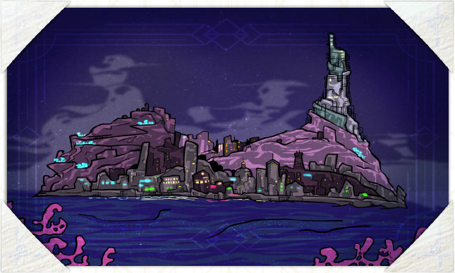

# Ключевые порты

В этом разделе мы кратко перечислим ряд наиболее популярных портов Ва\`ро Рохе, Олъм Нде, Фронтира и Светличного пути. Три из них – столицы протяжённых государственных образований. Два – полисы, города-государства с относительно небольшими территориями политического контроля. И ещё три-с-хвостиком десятка представляют в высокой степени самостоятельные острова, формально находящиеся в подчинении у Олъма или Н\`те Поа.

Здесь, в общедоступном разделе книги, мы приводим только краткие описания специфики этих мест в объёме, который наверняка уже известен любому навигатору. Больше сведений обо всех этих и других, чуть менее известных, местах вы можете получить в разделе «Для владычицы морской» на стр. XX.

## Три столицы

### Олъм

*Порт приписки вашего экипажа, город смога.*

Здесь дымно, многолюдно и чрезвычайно тесно. Дома покрыты копотью, декоративные зверушки богачей обряжены в банты и чепчики, а дети торгуют на углу газетами в свободное от труда на фабрике время. Чистыми от копоти и радужной плёнки осевшего смога остаются лишь патентованные рекламные щиты и снабжённые автоматическими омывателями портреты бренхи.

Именно здесь максимально сконцентрированы денежные потоки и технологические чудеса Союза. Местные всегда торопятся что-нибудь продать, купить, узнать, вложить и далее по списку. Никто не хочет прийти последним в необъявленной гонке за богатствами. И каждый второй абсолютно уверен в том, что именно ему суждено место лидера.

Повсюду царит атмосфера научного оптимизма и технического азарта. Каждую вахту в газетах пишут о каком-нибудь изобретении или усовершенствовании. И все вокруг, несмотря на плотный смог, глядят в будущее с большой надеждой. Быть в курсе технических новинок тут модно, а делать вид, что ты хоть что-то понимаешь в науке, – хороший тон. Такой ситуацией пользуются многие шарлатаны и мошенники, но за шквалом «меняющих мир» новостей это тяжело заметить.

В Олъме можно найти кого угодно, но не всё что угодно. Статус всеморской экономической столицы завлекает сюда многие влиятельные организации. Здесь официальные и теневые дельцы обменивают товары на деньги, а деньги на услуги через множество посредников, здесь на свет множества культурных мероприятий слетаются люди искусства или желающие таковыми быть, а научные лаборатории и институты корпят над инновационными проектами.

Олъмские элиты, рассекающие город на роскошных авто и совершающие променад по ажурным эстакадам крытых бульваров, пресыщены и голодны до экзотических редкостей. Ведь если ты состоятелен в Олъме, то ты безумно, невероятно, сногсшибательно богат во всех остальных уголках моря. Но олъмские буржуа не готовы покидать уют своих нарядно обставленных гостиных и роскошь бальных залов. Так что именно ваши небогатые, но отважные и предприимчивые протагонисты имеют все шансы заинтересовать местных нуворишей и торговых ноблей своими скромными, хорошо оплачиваемыми услугами.

### Н\`те Поа

*Столица Ва\`ро Рохе, пылающий город башен, мостиков и расселин.*

Н\`те Поа часто называют Пылающим городом, и это связано не только с тем, что поселение, выросшее вокруг храмового комплекса, было построено среди расселин и лавовых трубок, гейзеров и отсветов расплавленного камня тройного вулкана. Вторым по значимости поводом служит эндемичная мегафлора – толстые, оплетающие мосты и башни, лозы с пурпурными розетками плодовых тел. Эти лозы живут в тесном симбиозе с городской застройкой. Закреплённые в кладке стен металлическими штифтами, они работают как эластичный каркас, спасающий здания от частых и характерных для острова подземных толчков.

Как и Олъм, Пылающий город служит центром собственного региона. Как и Олъм, он пропускает через себя множества товаров и денежных средств, а его не конечное, промежуточное положение на Светличном пути только усиливает этот эффект. Конечно, технологические инициативы тут не так развиты, как у соседей-олъмцев, а общество более консервативно. Однако этот город также живёт полной жизнью. А его обитатели вовсе не согласны считать себя «догоняющими».

Основными властью и деньгами в городе обладают наиболее влиятельные и родовитые из матрон ва\`ро, диктующие Вышнему совету Матерей свою волю. Эти столичные матроны давно уже привыкли к привилегированному положению и часто стараются поразить друг дружку роскошью и очередной перестройкой своих титанических башен. Их свита также старается не отставать в тратах на золотую пыль для косметики и дорогостоящие безделушки. Всё это даёт множество возможностей предприимчивым дельцам, обслуге и всем остальным, процветающим под столь мудрым политическим руководством.

### Салайф

*Столица Кансе Ткути, город сияния, куполов, лестниц и статуй.*

Архитектура этой третьей, по олъмскому счёту, столицы невольно поражает воображение гостей «с той стороны Фронтира». Хрупкая на вид вязь стен. Органические округлые извивающиеся, расходящиеся и вновь сходящиеся, закручивающиеся спиралью контуры зданий. Ажурная паутина эстакад. Ряды рассеивающих золотистый свет панелей. Маковки куполов и иглы шпилей – в общем, всё то, что мы уже описали на стр. XX, здесь приобретает повсеместные бушующие, ничем не сдерживаемые и устремляющиеся прямо в крупичный полог формы. Этот город, большая часть которого построена недавно, в последние 5‒7 приливов выглядит и (поначалу) ощущается средним олъмцем как «образ далёкого будущего» из бульварного романа про Бкка Рргрса.

Конечно, на нижних ярусах, в подбрюшье автострад и проспектов Салайфа, находится место для бедных районов и откровенных трущоб, где влачат свои вахты многочисленные представители низшей касты кансейского общества – т.н. пелаи. Однако с моря, с одного из бульваров или мостов города они не видны, что выдаёт немалый архитектурный гений градоправителей. По слухам (и только по слухам, ведь в другие кансейские поселения вас просто не пустят) Салайф является наиболее экономически благополучным мегаполисом – своеобразной витриной Кансе Ткути. И во многом он предназначен для того, чтобы пять кансейских Великих Домов могли продемонстрировать иноземцам стабильность экономики, величие культуры и социальное здоровье своих держав.

Как и любая другая столица, этот город полон людей с деньгами, людей с большими запросами, увеселительных заведений, лавок, рынков, представительств самых разных международных организаций, агентов бизнеса и агентов различных разведок, дипломатов, дельцов, артистов и писателей, шпиков, политиков, газетчиков, слуг и подобной публики. Местный товарооборот во многом состоит из обмена кансейской экзотики на олъмские технику и модные предметы культуры. И значит в случае посещения этого удивительного, почти открыточного города вашим дельцам всегда будет чем заняться.

## Два полиса

### Костегрыз

*Бандитский притон, беспорядочное нагромождение и самая свободная республика моря.*

Костегрыз возник буквально на обломках кансейской цивилизации. Всего через пару приливов после того, как это место стало могилой для целой четверти кансейцев разом, после того, как их врезанная в шершавые бока Шпиля столица была взорвана вместе с самим Шпилем, первые мародёры начали лепить свои хижины здесь, на белёсых боках невообразимо огромных осколков, усеявших морскую гладь. Те первые жители нынешней Республики были отчаянными до безумия людьми. Обитатели Фронтира, потерявшие жильё и родных в паводках Большой Волны, дезертиры армий Союза и Кераджа, любители лёгкой наживы, бывшие узники трудовых лагерей, контрабандисты и подобная публика – все народы моря смешались тут и, после ряда кровавых бесчинств, образовали некоторое подобие устойчивого общества, существующее до сих пор.

> Вседозволенность Костегрыза обманчива. Да, среди его верёвочных мостиков, обитаемых каверн, навесных домиков и решётчатых платформ площадей легко приобрести любой дурман и любое непотребство. Однако есть правила. Они просты. И их нарушение жестоко карается.

1.  Имущество священно. Никто не вправе отбирать что-либо силой. Любая передача прав собственности должна быть добровольной. Собственные жизнь, здоровье, телесная автономность могут быть товаром. Свободный обмен и свобода выбора – это высшие ценности.

2.  Прошлое неважно. Важно то, что человек делает здесь и сейчас. Правосудие не интересуется былыми проступками. Правосудие моментально, предметно и оперирует только актуальными данными.

3.  Ваши правила жизни, убеждения, идеи и привычки – только ваши. На окружающих они не распространяются до тех пор, пока окружающие сами не решат их воспринять.

4.  Спорные случаи решаются поединком при свидетелях. Делегирование, покупка и замена бойцов разрешены. Момент окончания поединка определяют участники – до тех пор, пока они на это способны.

5.  Наказание провинившегося должно удовлетворять пострадавшего. Наказанием могут стать только штраф, лодочное изгнание или смерть.

Несмотря на высокую из-за ландшафта фрагментарность застройки, Костегрыз это именно город – со своими районами, зачастую вертикальными или даже подвесными улицами, системами общественного транспорта, границами и укреплениями, хижинами и особняками, средствами массового вещания, уличными патрулями, электроснабжением и канализацией, досуговыми заведениями, рынками и тому подобным. Город управляется крупными бандами-униями, которые контролируют те или иные районы. Самые влиятельные банды даже объединились в т.н. «Костяной пакт» (см. стр. XX) и теперь добиваются признания Костегрыза с прилегающими территориями полноценным социальными образованием – Свободной Республикой, обладающей официальным статусом на международной политической арене.

Экономика города питается из трёх источников. Самый крупный и печально известный – пиратство – не сводится к потоплению чужих судов. Охотничьи ватаги Костегрыза после пары предупредительных залпов склонны сначала предложить взнос в «фонд укрепления дружбы». И переходят к грабежу только в случае недружелюбного поведения.

Второй столп местного благосостояния вытекает из первого: через Костегрыз в Союз везут большинство запрещённых психоактивных веществ из Кансе Ткути. И наоборот, ограниченные подсанкционные технологии Союза попадают в Салайф именно через эти воды. Третий традиционный промысел – мародёрство – заключается в поиске по всему Фронтиру заброшенных военных объектов и складов стратегических запасов. Он не особенно прибылен в денежном измерении, но стабильно снабжает жителей Свободной Республики топливом, строительными материалами и боеприпасами, а промышляющие им пользуются всеобщим уважением. Сельское же хозяйство Костегрыза не развито как из-за особо паскудного планктона, окрасившего морской кисель Лабиринта в цвет крови, так и в силу полчищ отожравшихся на сбрасываемом вниз мусоре спруджей (см. стр. XX).

### Сурга

*Дом отступников, военизированный анклав и первое социалистическое государство моря.*

Центр самопровозглашённого государства Сурга Луар не использует каких-либо естественных участков суши для размещения многочисленных жителей: весь т.н. «мобильный полис» собран из сотен поставленных на якорь понтонных платформ, барж, военных судов класса «неспешный» и даже нескольких плавучих крепостей. А над всем этим лоскутным ковром, непрерывно колышущимся и поскрипывающим, подсвеченным фонарями и прожекторами, покрытым натёками патины, следами ржавчины и яркими пятнами свежей грунтовки, украшенным неоновыми вывесками, пропагандистскими плакатами, террасными насаждениями и светоотражающими граффити возвышается стальной колосс шагающего бастиона-амфибии «Баада Зеке», личной крепости отца нации – беглого адмирала Мамата Красной руки.

Сурга была основана небольшой кансейской флотилией, отказавшейся принимать сторону какого-либо из Пяти Домов, сражавшихся за скудные ресурсы на осколках Великого Кераджа. Ведомые Маматом, эти, согласно официальным кансейским медиа, «национал-предатели» в районе 3 пп. достигли центра Внутреннего фронтира и сформировали здесь ядро будущей Сурги. Прилив за приливом они давали кров и пищу беженцам, боролись с бандитизмом, прирастали союзниками и ресурсами. К настоящему моменту им удалось добиться международных признания и востребованности. Так из кучки изгнанников и предателей Сурга Луар стала новым народом и новой нацией. А её столица, город Сурга, – крупнейшим оплотом порядка и социальной справедливости в неспокойных водах Фронтира.

Ритм жизни Сурги напоминает чёткий распорядок военного лагеря: следуя звуковым сигналам из систем массового оповещения, его жители посменно ходят на работу, учатся, едят, отдыхают и участвуют в общественно-политических мероприятиях. Каждый здесь вне зависимости от этнической принадлежности, возраста и профессии знает свою роль и понимает свой вклад в общее дело. Проложенные прямо над палубами широкие улицы в любую склянку полны куда-то идущих людей и деловитых трамваев, а пролетающие среди мачт вагончики канатных дорог – курьерами и другими спешными гражданами. По разделяющим районы каналам потоком двигаются морские такси и грузовые баржи, а среди переулков фундамента города – узких щелей между корпусами – происходит совсем уж таинственная и скрытая от посторонних глаз жизнь.

## 31 порт

### Глокрр

*Центр машиностроения и судостроения.*

Ключевой объект морского могущества Союза, ежевахтенно отправляющий со стапелей в море всё новые и новые корабли. Его гигантский, размером с половину Олъма, порт полон звуков непрерывной тяжёлой работы, а улицы наводнены рабочими, инженерами, торговцами крупной техникой и запчастями. Гигантские краны возвышаются над береговой линией, словно памятники индустрии, а на складах можно найти всё – от судовых двигателей до тонких радиотехнических компонентов и деталей автомашин. Тем не менее жизнь на Глокрре непроста: экологические проблемы и постоянные нагрузки на инфраструктуру превращают остров в бурлящий котёл социального напряжения.

#### Достопримечательности:

- **монумент «Гармония механизмов»**, посвящённый неустанному труду инженеров Союза;

- **музей «Сердце стальных волн»** с большой коллекцией раритетных судовых двигателей и макетов легендарных кораблей.

### Ррфэлрр

*Центр текстильной и лёгкой промышленности.*

Место, обеспечивающее весь Союз массовой одеждой и тканями всех сортов. Местные фабрики славятся качеством продукции, а рынки, регулярные ярмарки и конференции привлекают дельцов и модников со всех уголков моря. Узкие улочки Ррфэлрра пестрят витринами ателье и фабричных представительств, где можно увидеть, как портные создают разнообразную одежду прямо у вас на глазах, а ловкие приказчицы демонстрируют качества очередного рулона замысловатой материи. Жизнь на острове пропитана запахом красителей и перестукиваниями ткацких станков, а портовые рынки постоянно принимают и отправляют новые суда, полные текстильного сырья и готовой продукции.

#### Достопримечательности:

- **музей «Ткань времени»** с образцами материй и мод прошлого;

- **фонтан «Пряха судеб»**, украшенный статуями древних ткачих.

### Хэррн

*Добыча сырья для чёрной и цветной металлургии.*

Шельфовые области и породы этого острова чрезвычайно богаты металлическими рудами, что сделало его месторождения ключевыми в олъмской экономике военного и послевоенного времени. Практически в каждом судне за пределами Салайфа есть детали из хэррнских меди, орсина, железа, пломта и бронзы. Хэррнские шахты – одни из самых глубоких во всём море, а карьерная добыча породы на островном шельфе настолько масштабна, что для неё пришлось создать отдельные отрасли и линейки специфического, шельфового, машиностроения. При всей своей нужности для экономики этот состоящий из каменистых холмов и пустошей остров нельзя назвать преуспевающим или изобильным – это мрачное и скучное место, полное таких же мрачных и не склонных к излишествам людей. Подобное положение только поддерживается так называемой культурой «Хэррнского духа», воспевающей умеренность на грани остракизма, эмоциональность на уровне лежалого сухаря и немногословность на пределе функциональности.

#### Достопримечательности:

- **шахта «Сверхглубокая»** – рекордный по вертикальному размеру подземный комплекс, временно замороженный для дальнейшей прокладки;

- **Сыпкий батя** – самый крупный террикон во всём Союзе.

### Кэррвн

*Разведение и промышленная добыча морепродуктов.*

Источник изысканных деликатесов и повсеместных пищевых продуктов. Его прибрежные воды, лагуны и отмели заполнены сетью разметочных буёв, рядами садков и вечно куда-то спешащими катерами обслуживающего персонала. Именно здесь выращиваются всеразличные пищевые моллюски, знаменитые кралловые кикады и деликатесные блопы. А на равнинных просторах самого острова размещены перерабатывающие заводы и рыбные рынки, пестрящие разнообразием свежих даров моря. Жизнь на Кэррвне подчинена ритмам размножения и вызревания, засева садков и сбора урожая. А местные жители гордятся своими традициями и поколениями предков, которые и сотни приливов назад точно так же предлагали заезжим торговцам приобрести несколько тапо солёных плипок за недорого.

#### Достопримечательности:

- **ресторан «У комелька»**, известный своим неоспоримым статусом лучшего и самого старого заведения подобного рода в Союзе;

- **океанариум «Глубинный мир»**, где представлены различные виды морской фауны, включая уникальные образцы ещё не классифицированных видов.

### Пэнллн

*Производство пластиков и синтетических материалов.*

Совсем недавно отстроенные заводы Пэнллна выпускают все виды синтетического сырья – от высокопрочных волокон для канатов и тканей до устойчивых к коррозии деталей кораблей и станков. Пологие берега острова усыпаны складскими комплексами, откуда готовая продукция отправляется в порты всего Союза и за его пределы. Пэнллн традиционно славится инновациями в химическом производстве, однако цена за этот прогресс – постоянный смог и строгие экологические ограничения, с которыми местные жители давно привыкли жить, даже внеся их в собственный кодекс поведения «сознательного гражданина».

#### Достопримечательности:

- **институт №47** – научно-производственное предприятие времён Войны, а ныне – музей, открытый для всех желающих;

- **мемориал Первопроходцев**, установленный на месте взрыва третьей лаборатории института №47 в честь первых исследователей синтетических волокон и моющих материалов.

### Гвэдус

*Выращивание и добыча шельфовой растительности.*

Источник материалов, жизненно важных для пищевой, медицинской и текстильной отраслей Союза. Его прибрежные воды покрыты сетью плавучих плантаций, где культивируют бессчётное количество сельскохозяйственных видов водорослей и планктона. Сам этот холмистый, заболоченный и поросший стланником остров покрыт сетью предприятий по переработке растительного сырья в продукты питания, волокна и экстракты для фармацевтики. Культура острова традиционно славится высокой экологической осознанностью и стремлением эту осознанность распространять.

#### Достопримечательности:

- **НИИ «Шельф»** – центр передовых исследований редкой морской флоры;

- **парк «Аквафло»**, где можно увидеть сотни видов культивируемой на острове растительности во всех подробностях и насладиться подводной экскурсией на шагающем батискафе.

### Кэллн

*Мореходный и судостроительный учебно-производственный центр.*

Здесь массово готовят капитанов, инженеров и корабелов для гражданского и военного флота. Укрытые среди скалистых отрогов и расселин академии острова славятся как своими традициями, так и новейшими методиками обучения, а практическая подготовка проходит на верфях и тренировочных судах, построенных прямо здесь – зачастую самими учащимися. Студенты и закалённые мастера трудятся в мореходном центре бок о бок, создавая опытные версии кораблей, которые когда-нибудь отправятся бороздить просторы всего моря. Культура Кэллна известна своей дисциплиной и тягой к непрерывному обучению через практику, чтение и ожесточённые публичные дебаты, зачастую транслирующиеся по радио.

#### Достопримечательности:

- **Морская Академия** – ведущее и наиболее привилегированное учебное заведение для специалистов всех мореходных профессий Союза;

- **памятник «Фоглу»** – первому судну, спущенному со стапелей самой старой кррвинской верфи и впоследствии потерянному в море.

### Улфур

*Производство молочных продуктов и удобрений.*

Холмистый и совершенно обыкновенно выглядящий кусок суши. Место расположения небольшого горняцкого посёлка, пары маяков и нескольких фермерских хозяйств, внезапно для себя ставшее центром крупной стройки – возведения фабрики по шельфовой добыче ископаемых. В данный момент местные застарелые обычаи нехотя сдаются и отступают перед напором больших денег и новых людей. Однако и до сих пор Улфур можно считать в хорошем смысле образцом олъмской провинциальности – его размеренная жизнь, умиротворяющие пейзажи и буколическая растительность совершенно не располагают к каким-то особым драмам, кроме драм на основе спорного куска изгороди или заблудшего прола.

#### Достопримечательности:

- **памятник «Грибономка и слизневод»**, высеченный из цельной скалы-останца на деньги какого-то мецената;

- **музей ферментации** с большим количеством методических материалов и маленькой, но полностью автоматизированной линией по производству творожной массы.

### Тллсин

*Переработка и синтез горюче-смазочных материалов.*

Место, снабжающее топливом и смазками подавляющую часть техники Союза. Его перерабатывающие заводы работают без перерыва, превращая сырьё из местных и удалённых месторождений в продукцию, необходимую для двигателей, корабельных механизмов и промышленного оборудования. Холмистый ландшафт острова утопает в трубопроводах, шаровых резервуарах и факелах сбросовых патрубков, а воздух пропитан побочными продуктами ректификации и алхимических преобразований. Жители Тллсина традиционно лидируют в списках различной медицинской статистики, но до фанатизма гордятся своей ролью в поддержании стабильности государства.

#### Достопримечательности:

- **технопарк и экспоцентр «Это – будущее»**, где демонстрируются инновации и концепции развития топливной промышленности;

- **Камнелапа** – очень высокая и узкая скала странной формы, обзорная точка с панорамным видом на инфраструктуру острова.

### Эйллн

*Производство точных приборов и электротехнических изделий.*

Центр производства всеразличной электрической техники, запчастей и компонентов, необходимых для быта, навигации, связи и научных исследований. Его конвейеры непрерывным потоком выпускают лампы и неоновые трубки, барометры, генераторы, реле, трансформаторы, приводные узлы, логические комбинаторы, программаторы, шифраторы, радиоприёмники, осциллографы, печатные платы, транзисторы и блоки управления. Отдельной и важной статьёй экспорта здесь служат программируемые механизмы – автоматоны всех размеров и сортов, которых многие эйлннцы считают чуть ли не членами семьи.

#### Достопримечательности:

- **музей Точности**, где представлены уникальные приборы, прототипы, счётные механизмы и другие артефакты истории техники;

- **показательный завод «Электра»**, экскурсии на который демонстрируют процесс создания различных сложных изделий.

### Эрдду

*Курорт с минеральными водами, лечебными глинами и грязями.*

Одно из самых благоустроенных мест Союза с крайне дорогими въездными визами. Именно сюда уставшие от сутолоки больших городов богачи приезжают поправить здоровье, насладиться уникальным микроклиматом и тишиной уединённых коттеджных посёлков класса люкс. Купальни и санатории Эрдду предлагают широкий спектр процедур – от расслабляющих ванн до терапии редкими минералами. По холмам и речным долинам острова, вокруг минеральных источников и коттеджей раскинулись ухоженные парки и тропы для верховых прогулок, а вид на кристально чистые, подсвеченные плавучими светильниками лагуны только дополняет атмосферу умиротворения. Ну а гарантом этой гармонии служит самая современная и одна из самых дорогих систем безопасности островного масштаба.

#### Достопримечательности:

- **грот Здоровья** – природный источник с целебной водой и фантастическим естественным интерьером, крайне популярный среди отдыхающих;

- **парк фонтанов**, украшенный множеством статуй, символизирующих восстановление и энергию.

### Кррф

*Центр разведения редкой флоры и производства медицинских препаратов.*

Плантации этого острова полны экзотических растений, а его ботанические лаборатории постоянно работают над созданием уникальных лекарств – от восстанавливающих эликсиров и антибиотиков до сложных противовирусных сывороток. Учёные и агрономы острова ведут постоянные исследования, внедряя инновации в культивирование растений. Кррф также славится красотой своих ландшафтов: ухоженные террасные сады и обширные участки культивируемых грибных джунглей, окружённые бескрайними полями лекарственны спороносцев, создают атмосферу спокойствия и прогресса. Примечательным является ещё и средний уровень образования жителей острова – по этому параметру остров традиционно занимает одно из первых мест в море.

#### Достопримечательности:

- **оранжерея «Живое лекарство»**, в которой можно увидеть редчайшие виды растений со всего моря, собранные в одном месте;

- **НИИ «Корень здоровья»**, открытый для публичных экскурсий и конференций.

### Кррк

*Университетский и учебно-производственный центр широкого профиля.*

Второй (после Олъма) по значимости образовательный центр Союза, сочетающий долгие традиции с передовыми практиками и комплексным подходом к формированию новых специалисток широкого спектра. Здесь студенты изучают всё: от инженерии и медицины до философии и теоретической физики, применяя свои знания на местных опытных фабриках, лабораториях и верфях. Кампусы пяти местных университетов всегда полны молодёжи, а открытия, рождённые на Кррке, неоднократно становились основой для качественных скачков союзной промышленности и культуры. А ещё этот гористый остров славится богатой растительностью и протяжёнными пещерными комплексами, когда-то игравшими важную роль в мистериях имперских времён.

#### Достопримечательности:

- **библиотека Великого знания** – крупнейшее собрание научных трудов и архивов Союза;

- **институт Прогресса**, в котором проходят выставки научных достижений и экспериментов.

### Ллэнб

*Производство органических и не органических строительных материалов.*

Воздух Ллэнба полон грохота взрывов и каменной пыли, а на его рейде непрерывно толпится множество судов, доставляющих сырьё и вывозящих штабеля, цистерны и контейнеры со строевой прессовкой, кирпичами, цементом, бетонными блоками, балками, метизами, легковесным плывуном, клеями и уплотнителями, проволочной сеткой, керамическими панелями и другими строительными компонентами. Улицы острова кипят рабочими, инженерами и агентами строительных компаний, а каменистый пейзаж заполнен силуэтами терриконов, заводских труб и карьерных экскаваторов. Местная культура невзыскательна и превозносит сильные семейные связи, упорный труд, простую, но сытную пищу, чтение и спортивные мероприятия по выходным вахтам.

#### Достопримечательности:

- **каменоломня «Сердце скалы»,** открытая для посещения и демонстрирующая добычу сырья;

- **музей строительства** с экспозицией редких и инновационных материалов.

### Эвнн

*Промышленный центр в области неорганической химии.*

Здесь массово и эффективно создаются материалы и соединения, нужные для металлургии, энергетики и производства высокотехнологичных устройств. Фабрики острова выпускают всё: от кислот и щелочей до сложных катализаторов, прекурсоров, красителей и присадок. Местные лаборатории известны своим передовым оборудованием и строгими стандартами безопасности, а учёные (обычно это выпускники Эвннского химического университета) работают над инновациями, которые буквально меняют отрасль раз в несколько приливов. Одним из основных компонентов культуры влажного и низинного Эвнна является терраформирование – многие его участки буквально отвоёваны у болот, осушены, огорожены насыпями и укреплены завезённым грунтом.

#### Достопримечательности:

- **технопарк и экспоцентр «Синтез будущего»**, где демонстрируются достижения в области химической инженерии как настоящего, так и прошлого.

- **набережная технологий** с интерактивными экспозициями о химической промышленности острова.

### Сланк

*Чёрная металлургия и выработка пеплосоли.*

Развитая промышленная агломерация из нескольких мелких, соединённых перешейками островов на границе Олъм Нде и Ва\`ро Рохе. В годы войны стала центром тяжёлого машиностроения и частью «производственного тыла», а в наше время сохранила процветание благодаря торным маршрутам до Н\`те Поа и востребованности продукции: запчастей, строительной техники, рабочей одежды, шельфового газа и пеплосоли. Главный порт Сланка помимо промышленной активности известен культурными достопримечательностями – театрами, газетами, радиостанцией и спортивной ареной.

#### Достопримечательности:

- **Башня-17** – автономный колосс, возведённый уже почившим магнатом и предназначенный для пережигания глубинных соков на пеплосоль;

- **Старый театр** – отлично сохранившийся амфитеатр с феноменально хорошей акустикой.

### Корара

*Столица вечного карнавала и один из основных поставщиков вина на просторах Укрытого моря.*

Популярный туристический центр и претендент на звание культурной столицы Союза. Остров террасного земледелия, уникальной «мерцающей» архитектуры, чрезвычайно развитого виноделия и вечного праздника. Чуть ли не каждую окту местные жители устраивают грандиозные фестивали в честь нового урожая, какой-нибудь исторической даты, выхода книги, спектакля или фильма, дня рождения одной из многочисленных местных матрон и тому подобного. Алкогольные напитки, бесшабашность, лёгкое отношение к жизни и смерти, культурное меценатство и сложные отношения между местными кланами уже сотни приливов являются здесь неотъемлемыми частями культурного ландшафта. Что, в конечном счёте, и привлекает сюда множество туристов, ищущих отдыха и забвения в ежевахтенных попойках, случайном сексе, танцах, карнавалах, ставках на спорт и наблюдениях за очередным актом вендетты прямо под окнами гостиницы.

#### Достопримечательности:

- **Пьяный каскад** – комплекс причудливых фонтанов, наполненных довольно качественными гроздёвым вином.

- **Стена клятв** – кусок древнего контрфорса, исписанный наслоениями надписей, рассказывающих о том, кто, как и кому хочет отомстить;

- **Музей Топоки** – богатейшее и насчитывающее более тысячи приливов от момента основания собрание исторических материалов, рассказывающих о винодельческих традициях острова.

### Те\`Каинга

*Центр животноводства и производства удобрений.*

Самый плодородный из островов Ва\`ро Рохе, а также место проживания крупнейшей в Союзе популяции домашних вокликов (см. стр. XX). Издавна славящийся животноводческими традициями, Те\`Каинга и поныне держит лидерство в поставках вокличатины как для окружающего региона, так и далеко за его пределами. Побочная статья экспорта – органические удобрения – также чрезвычайно важна для Ва\`ро Рохе. Ведь именно этот натурпродукт позволил октаду за октадой превратить многие бесплодные острова в пригодные для выращивания агрокультур места. Жительницы Те\`Каинги известны своей нелюдимостью. Их укрытые между лесистых холмов традиционные деревни так и не выросли в более крупные агломерации городского типа. И даже единственный порт острова населяют в основном приезжие работники транспортных компаний, с опаской посматривающие на местных «дичков».

#### Достопримечательности:

- **Старый замок** – почти идеально сохранившееся имперское укрепление со следами давнего штурма;

- **тропа в никуда** – цепь древних каменных арок, проходящая практически через весь остров и заканчивающаяся береговым обрывом.

### Те\`Ранга

*Центр судостроения и машиностроения.*

Скалистый и неприветливый остров, с незапамятных времён служащий монастырём и крепостью для «Кайханги» (см. стр. XX) – профессионального ордена ва\`ро, надолго пережившего создавшую его Империю. В современный исторический период Те\`Ранга продолжает удерживать славу средоточия инженерной мысли региона, ежевахтенно выпуская огромное количество деталей для тяжёлой техники, спуская со стапелей мириады кораблей и соперничая в этом разве что с Глоккром. Традиционная культура острова прагматична и содержит много не характерных для ва\`ро и, вероятно, уходящих в имперские времена, черт. Например, матроны острова не обладают властью, а их гражданские права ограничены кодексами «Кайханги». Это, конечно, рождало и рождает недовольство у властительниц Ва\`ро Рохе, однако высокая автономность Те\`Ранги и его ценность для Олъма традиционно позволяет местным властям игнорировать недовольство официального Н\`те Поа.

#### Достопримечательности:

- **Шестерёночная крепость** – помесь долговременного укрепления и гигантского механизма, точное назначение которого давно утеряно;

- **площадь Времени** – обширное мощёное пространство с колонной из сотен циферблатов, показывающих одно и то же время абсолютно синхронно.

### Те\`Ароха

*Производство консервированных продуктов питания.*

Этот остров ещё со времён Войны обеспечивает продовольствием как гражданский, так и морской флоты Союза. Его заводы перерабатывают ввозимые море- и грибопродукты, мясо, жиры и молоко, превращая их в удобные и практически вечные судовые пайки, деликатесные концентраты, компоты, сгущённые смеси, сублиматы и многое другое. Продукция Те\`Арохи известна неизменным качеством и разнообразием, а отточенные поколениями технологии позволяют сохранять вкус и питательность продуктов на совершенно неестественный срок. При этом плоский, песчаный и бесплодный остров не обладает каким-либо собственным сельским хозяйством, и его роль в экономике Союза обусловлена логистическими причинами вкупе с капризом какого-то богатея, приливов сто назад открывшего здесь первый консервный завод.

#### Достопримечательности:

- **музей Длительного вкуса**, рассказывающий об истории консервирования;

- **завод «Превосходная банка»**, открытый для экскурсий и дегустаций.

### Те\`Роа

*Выращивание, заготовка и переработка грибной массы.*

Центр выращивания и переработки грибной массы, используемой в пищевой, фармацевтической и текстильной промышленности Союза. Его бочковые плантации укрыты доминирующими над равнинным пейзажем куполами гигантских теплиц, соединённых бесконечными лабиринтами старых лавовых трубок. Именно здесь создаются известные по всему Союзу органические концентраты, медицинские субстраты и биоматериалы. Жительницы острова гордятся своими традициями грибоводства, несмотря на их относительную молодость – первые теплицы здесь были построены всего два поколения назад, а экономика острова выросла в основном на военных поставках.

#### Достопримечательности:

- **лаборатория «Живое волокно»,** в которой демонстрируются инновации в переработке особых грибных пород, способных жить даже в сотканном виде.

- **парк Грибных королей**, с коллекцией редких и декоративных грибных видов.

### Ра\`Кау

*Морские промыслы и переработка мегафауны.*

Место, где труд морских охотников, мрежников, вершевиков и промышленных инженеров превращает плоть, требуху и выделения морских гигантов – корпусников, спруджей и прочих – в ценные для людей ресурсы. Порты острова полны судов, доставляющих улов и вывозящих переработанные полуфабрикаты. На многочисленных заводах из ещё живой добычи получают масла, ткани, структурные материалы, ингредиенты для парфюмерии и фармацевтики. Также Ра\`Кау славится своей культурой производства морских амулетов – искусно обточенных кусочков кости и панцирей, которые многие моряки считают приносящими удачу и навевающими странные сны. Культурная жизнь острова скудна: здесь не любят чужаков, а традиции местных ва\`ро тщательно скрываются от глаз приезжих.

#### Достопримечательности:

- **Раповая башня** – памятник доимперских времён, сложенный из покрытых орнаментами остовов и панцирей уже неопознаваемых морских гигантов;

- **перерабатывающий комплекс «ЖЫР!»**, открытый для посещений и экскурсий.

### Н\`Гамоту

*Лёгкая промышленность и производство бытовой утвари.*

Остров и поликультурное сообщество, специализирующееся на производстве бытовой утвари и товаров повседневного спроса. Его фабрики и семейные мастерские выпускают всё – от посуды и текстиля до инструментов, мебели и декоративных изделий, обеспечивая множество домов Союза качественной и практичной продукцией. Жизнь среди холмиков и конических скал Н\`Гамоту протекает в ритме производства и торговли, а регулярные местные ярмарки привлекают много странствующих дельцов. Помимо прочего остров славится дружелюбным характером своих жителей и их чрезвычайно развитыми традициями гостеприимства.

#### Достопримечательности:

- **ярмарка «Нужные вещи»**, известная широким ассортиментом самых разных, но наверняка вам нужных товаров;

- **музей Повседневности**, демонстрирующий эволюцию бытовой утвари.

### М\`Катеа

*Карьерная камнедобыча, производство строительных материалов.*

Крупный центр добычи строительного камня и производства первичных стройматериалов – блоков, панелей, щебня, крошки и подобного. В данный момент служит полигоном для испытания новых, небризантных средств добычи, из-за чего его жители внезапно оказались в обстановке непривычной тишины. Рассечённый гребнями вулканических отрогов пейзаж острова скуден на растительность, однако обилен мелкими животными – обитающими в глубоких мшистых расселинах рачками и порхающими полипами. Культура острова богата сложными и многочисленными ритуалами, строго исполняемыми в то или иное время прилива.

#### Достопримечательности:

- **карьер «Глотка гиганта»**, открытый для экскурсий и самостоятельной добычи приятных сувениров;

- **музей камня**, в котором представлена коллекция редких пород и поделок из них;

- **заповедник «Чудесный мир полипов»** в одной из наиболее разветвлённых мшистых расселин острова.

### Тикароа

*Производство сырья для медицинской промышленности.*

Заросший клочковатой порослью комок губчатого камня, ключевой поставщик растительного и животного сырья для медицинского сектора Союза. Здесь выращивают, добывают и перерабатывают разнообразные виды живых существ, выделяя из них полуфабрикаты, идущие на создание лекарств, антисептиков и других биологически активных препаратов. Остров известен своими лабораториями, работающими над выведением новых видов содержащей вещества с заданными свойствами живности, и закрытым НИИ «Антитоксин», ответственным за добрый кусок разработки вакцины от пурпурной хвори. Традиционная культура острова ещё с имперских времён восхваляет образованность и экологичность, что в наши дни привлекает сюда немало современных эко-эзотериков.

#### Достопримечательности:

- **учебный центр «Здоровье»**, где проводят экскурсии и семинары о различных, в том числе не ортодоксальных методах использования растений и животных в медицине;

- **музей традиционной медицины ва\`ро**, демонстрирующий историю соответствующих практик от древних времён и до сих пор.

### Похуту

*Производство стеклянных и керамических изделий.*

Здесь создают всё: от бытовой посуды, декоративной керамики и санфаянса до точной оптики и компонентов электротехники, востребованных далеко за пределами Союза. Сглаженные, складчатые и по большей части состоящие из лавовых натёков просторы острова рассечены множеством трасс скоростных поездов, а фантастически выглядящие строения с фасадами из стеклоблоков обильно подсвечены декоративными лампами – тоже местного производства. Культура острова ещё не сложилась до конца и представляет сложную смесь из привычек столичных инженеров и традиционных повадок ва\`ро. Однако и те, и другие считают свой остров светочем культуры и знания на окружающих тёмных просторах.

#### Достопримечательности:

- **музей «Огнёвый промысел»**, демонстрирующий эволюцию технологий выделки стекла и керамики с течением времени;

- **сад стеклянных скульптур**, в котором выставлены работы лучших стеклодувов острова и Союза.

### Такора

*Производство сырья для лёгкой промышленности.*

Богатый разнообразными ландшафтами остров, непрерывно снабжающий всем необходимым текстильные фабрики, обувные мастерские и производственные линии бытовой утвари Союза. Здесь перерабатывают как собранные на месте, так и завозные, как первичные, так и вторичные растительные и синтетические волокна, кожу, кость, древесину, пластики, лом цветных металлов и другие материалы, превращая их в основу для множества изделий лёгкой промышленности. Заводы острова работают практически непрерывно, особенно после принятия ряда природоохранных актов, а из порта склянка за склянкой выходят грузы готового сырья для предприятий Олъм Нде и Ва\`ро Рохе. Культура этой самозванной столицы бережливых технологий наполнена новыми веяниями, модными идеями и желанием непременно преобразовать, догнать, перегнать, улучшить, совершить переворот, оптимизировать и тому подобными.

Такора является ещё и политическим центром так называемого «Кольца Такоры» – архипелага, пару приливов назад официально и мирным путём вышедшего из состава Ва\`ро Рохе. Чем на текущий момент и Н\`Те Поа, и Олъм сдержанно недовольны.

#### Достопримечательности:

- **институт конверсионных материалов**, в котором демонстрируются инновации в сфере вторичной переработки и экологичного производства;

- **музей промышленной эволюции**, рассказывающий о развитии индустриальных технологий в области лёгкой промышленности.

### Тайнуи

*Переработка и синтез горюче-смазочных материалов.*

Расположенный в прифронтовой полосе и созданный как ресурсная база для нужд армии, порт Тайнуи сильно потерял в популярности сразу после войны, что вызвало закрытие заводов и отток населения. Однако прокладка Светличного пути возобновила интерес к острову, сделав его востребованным перевалочным пунктом и гаванью для патрульных сил флота Союза. Сейчас Тайнуи живёт размеренной жизнью заштатного транспортного узла, принимая сырьевые танкеры и заправляя сухогрузы, вырабатывая и очищая топливо, снабжая проходящие мимо суда провиантом и не стараясь быть чем-либо ещё интересным чужакам. Население этого невыразительного болотистого и плоского, как оладья, острова скудно, а культура ещё толком не успела сложиться. Впрочем, недавнее вступление острова в состав Кольца Такоры уже вызвало волну политически ангажированных мигранток из Ва\`ро Рохе, хотя новая власть пока ничего и не меняла в жизни острова.

#### Достопримечательности:

- **Большой пудл** – самый крупный в Союзе участок зыбучих песков и заповедник эндемичной флорафауны;

- **Камни первопоселенцев** – почти ушедшие в болотистую почву останки каких-то имперских строений непонятного назначения;

- **кабачок «Збс!»**, имеющий славу самого отвратительного пивного заведения в Союзе.

### Мррфрр

*Центр добычи редкоземельных элементов.*

Важнейший источник промышленного сырья Союза, чьи недра обеспечивают вашу родину необходимыми для развития современных технологий ресурсами. Карьеры и шахты острова работают круглосуточно, добывая минералы, которые потом используются в производстве электротехнического оборудования, передовых двигателей и энергетических систем. Жизнь Мррфрра сосредоточена вокруг перерабатывающих заводов, а гул и огни обогатительных комбинатов стали неотъемлемой частью местного скалистого ландшафта. Несмотря на суровые условия жизни и непростую экологическую ситуацию, остров привлекает как желающих трудиться на благо науки и технологий Союза, так и множество дельцов, имеющих тут коммерческий интерес. А близость Светличного пути и недавняя декларация независимости расположенным неподалёку Кольцом Такоры только усилила этот интерес.

#### Достопримечательности:

- **карьер «Глаз времени»** – геологический музей, наглядно демонстрирующий слои редких, составляющих основание острова пород;

- **экспозиция «Наш вклад»,** выставочный комплекс, посвящённый применению добываемых на острове минералов.

### Манайа

*Вторичная переработка морских судов и транспортный узел.*

Самый близкий к Салайфу эксклав ва\`ро и один из транспортных узлов Светличного пути, вот уже восьмой прилив служащий местом вторичной переработки списанных судов и плавучих крепостей, Манайа с недавнего времени стал ещё и оживлённым перекрёстком – стартовой точкой новой ветки маячной трассы, протянувшейся к далёкой Сурге. Последнее резко увеличило политический вес острова и вызвало на нём взрывной рост бизнеса. А заодно, обострило трения между простыми работягами верфей и свежеприбывшими дельцами и мутными типами с чемоданами полными денег. Культура этого гористого, влажного и заросшего джунглями клочка суши в данный момент активно развивается, смешивая олъмские, кансейские и ва\`ро мотивы в невиданных ранее пропорциях.

#### Достопримечательности:

- **экспозиция «Кладбище гигантов»**, на которой выставлены части корпусов старейших и наиболее знаменитых моделей кораблей военного времени;

- **музей конверсионной инженерии**, рассказывающий о технологиях сборки, разборки и переработки судов в исторической перспективе;

- **казино «Денежный рояль»**, регулярно устраивающее рекордные по бюджету турниры в самых разных видах азартных игр;

- **варьете «Всех одинаково»**, прославившееся своей беспощадной (и очень смешной) политической сатирой вкупе с регулярными джезовыми концертами.

### Квинф

*Морские промыслы, судовое снабжение и добыча глубинного ихора.*

Порты Квинфа полны танкеров и рыболовецких судов. А на его усыпанных крутыми сопками берегах высятся ряды цистерн и компрессионных установок, перемежаемых холодильными и консервными комбинатами, где улов превращается в полуфабрикаты, а ихор – в концентрированное сырьё для алхимических преобразований. Жители Квинфа чрезвычайно – в локальном смысле – патриотичны и сконцентрированы на собственной самодостаточности: развитии мелких производств полного цикла, общинности, сокращении импорта товаров, совмещении традиционных промыслов и долгих морских походов с новейшими технологиями шельфовой добычи. Отдельной статьёй экономики Квинфа является обслуживание проходящих мимо судов.

И хотя порт Квинф очень молод и далёк от родных вод своих обитателей, он вырос вокруг базы «мирных наблюдателей» – флотилии союзного ВМФ, сразу после войны выставленной Олъмом рядом с границей Кансе Ткути. Квинф не испытывает недостатка в ресурсах и переживает непрекращающийся экономический рост, вышедший на новый виток с открытием Светличного пути.

#### Достопримечательности:

- **Рыжая башня** – старинная маячная конструкция имперских времён,с видом на шельфовые вышки;.

- **рыбацкая гавань** – историческое место ежедневных аукционов свежего улова.
