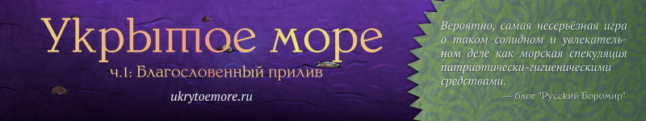
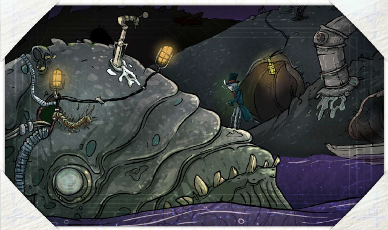

# Путевые перипетии

Практически каждое скитание в морской тьме полно различных происшествий, находок и встреч. Иногда их больше, а иногда меньше – конечная динамика того или иного рейса принципиально, жизнеподобно стохастична и зависит от специальных механик для ведущей со стр. XX. Однако все эти, как выражаются в других играх, «случайные сцены», «импровизированные локации» и «энкаунтеры» можно разделить на несколько категорий, в общем и целом известные вашим прошедшим учебку «Программы» протагонистам.

Конечно, некоторые (не перечисленные здесь) представители морской живности или места могут стать для вашего экипажа сюрпризом, однако такой сюрприз будет скорее исключением из уже имеющегося общего знания о возможностях и опасностях жизни олъмского вольного торговца.

## Места

Море, по которому вы ходите, неоднородно. В нём встречаются как обширные пустые пространства, так и места, где в каждом секторе есть тот или иной географический объект. Один тип таких объектов вам уже знаком – это всякоразмерные острова, выступающие из морского киселя куски суши с тем или иным винегретом сверху. Однако кроме островов в пространствах Веа Туароа можно встретить ещё кое-какие крупные, стабильные и типовые, не меняющие свои положение и характер со временем, географические объекты. Большую, неплохо известную протагонистам часть таких объектов мы перечислили далее. Полный и расширенный их список вы также можете найти в разделе для ведущей на стр. XX.

Все связанные с географическими объектами эффекты и потенциальные сложности по определению будут докучать вашим путешественникам только при посещении соответствующих секторов, содержащих тот или иной объект. И наоборот – избегнуть этих мест возможно, просто не посещая сектор, где они находятся.

Совсем заранее узнать о наличии того или иного места (включая острова и более-менее крупные островки) в каком-нибудь секторе можно через изучение карт и Навигационные кружки (см. стр. XX). Загодя, из соседнего сектора – при помощи мотылька-разведчика (стр. XX). И, наконец, в последний момент, на входе в сектор – от нанятых вами лоцманок (стр. XX), у которых на такие вещи чутьё.

### Гиблые воды (и всеобщий распад)

Порождение нового времени, гиблые воды – это участки отравленного кашицеобразного бурого и отвратно пахнущего моря, впервые обнаруженные сразу после Войны. Несмотря на оптимистичные прогнозы олъмских маринистов, за последний десяток приливов гиблые воды не пропали сами собой. Более того, занятые ими площади медленно увеличиваются.

Посещение таких участков без специальных защитных средств приводит к тяжёлой интоксикации: сразу после входа в сектор гиблых вод ваши протагонисты (олъмцы, ва’ро, кансе) получают по одной ране, а d6 матросов-пролов отбывают в мир иной. Продолжительное нахождение в гиблых водах приводит к получению уже d6 ран и 2d6 смертей матросов каждую новую вахту.

Гиблые воды пагубно влияют не только на здоровье людей. При контакте с их отравленной атмосферой даже стойкие и надёжные промышленные материалы – металлические части судна, пластик, резина защитных костюмов и т.п. – начинают меняться, расцветая ветвящимися спиралями хрупких треугольных наростов и чешуек.

Так что сразу после входа в гиблые воды ваше судно (если оно не сделано из стекла остилитовой керамики или баснословно дорогих корацитовых сплавов) также получит один полом. И будет получать полом каждую последующую вахту, до тех пор, пока остаётся в заражённом секторе. Ну а прорезиненные костюмы химической защиты, противогазы и подобное вам тут придётся менять каждую склянку.

Как бы то ни было, гиблые воды Веа Туароа хорошо картографированы благодаря усилиям знаменитой капитанки Йакта Тулак (см. стр. XX), так что попасть в них случайно и в трезвом уме даже для ваших протагонистов будет затруднительно.

### Ржавые кладбища (и кррровожадные дикари)

Для обитателей цивилизованных островов Союза ржавые кладбища с их агрессивными обитателями не более чем тревожная сказочка. Для тех же, кто рискует плыть дальше и путешествует по просторам Фронтира, это куда более предметная, пугающая и жестокая реальность.

Ржавые кладбища – это огромные, занимающие целые сектора, таящиеся во тьме скопления полузатонувших, еле держащихся на плаву остовов боевых кораблей Войны. Далеко не все они известны, однако расположение дюжины ближайших к границам Союза общеизвестно и документировано. Сами по себе эти скопления старого железа не представляют угрозы. Но обитатели этих мрачных мест – многочисленные одичавшие и утратившие цивилизованный облик подобия людей, некогда бывшие олъмцами, кансе и ва’ро – садисты, убийцы и каннибалы, чрезвычайно опасные для любого судна, оказавшегося поблизости от их мест обитания. На множестве лёгких и быстрых каноэ они скрытно подбираются к проходящим судам и врываются на борт вихрем кровавого безумия. Их оружие примитивно, а лица и тела покрыты множеством устрашающих шрамов и украшений из чьих-то деликатных частей. Их набеги всегда внезапны и скоротечны. Они заманивают моряков в примитивные ловушки, устраивают диверсии и атакуют со всех сторон разом. Обычно их не интересует что-либо кроме живой добычи и они стараются забрать с собой как можно больше пленных.

Никто в точности не знает, как и откуда появились эти безумцы. Или что они делают с пленниками. И ни один антрополог пока не может похвастаться сведениями об устройстве их общества. Однако обитатели ржавых кладбищ предельно реальны и наверняка станут для вас коллизией при любом посещении их охотничьих угодий. А ещё, вне зависимости от исхода это коллизии, увеличат смуту на десять единиц разом.

### Камни (злобно ломающие ваш корабль)

Острые зубы, внезапно выныривающие из тьмы. Пилообразные гребни, вспарывающие подбрюшья корпусов. Зазубрины и шипы, кромсающие лодки зазевавшихся мореходов. Всё это – образы, отлично описывающие безжалостные и молчаливые рифы Веа Туароа, которые каждый прилив губят немало неосторожных судов. Как и в случае ржавых кладбищ, сектора с большим количеством рифов нанесены на карты только там, где вплотную примыкают к населённым водам – такие места вы можете легко избежать, грамотно проложив маршрут. А вот на Фронтире вероятность внезапно оказаться в зарифованном (и не картографированном) секторе очень далека от нулевой.

Любое посещение такого сектора, станет очередной коллизией человека и стихии, где этим человеком, отчаянно пытающимся избежать d6 × класс судна поломов, будет ваш капитан, а стихией – молчаливые, сдержанные и брутальные рифы за бортом.

### Отмели (что хотят вас оставить навсегда)

Эти штуки похожи на рифы, но в более коварной версии. Жертвы рифов обычно погибают быстро. По крайней мере, в этом есть какая-то романтика. Об этом можно сложить балладу, например. А вот длительная неприятная и очень-очень скучная гибель экипажей, севших на песчаную или галечную мель вдали от оживлённых маршрутов, оставляет после себя только фрустрацию и заснувших в процессе подсчёта «сколько нам осталось до момента, когда начнём есть капитана» наименее стойких игроков. Впрочем, ситуация чудесным образом преображается, если на вашем судне установлены пескоходы (см. стр. XX): с ними вы пусть и медленно – со скоростью 1 сектор в окту, – но можете преодолевать замеленные участки моря, попутно спасая каких-нибудь бедняг и ценности из других застрявших в этих местах судёнышек.

Если пескоходов у вас нет, то вход в замеленный сектор через d6 склянок вызовет внезапную для экипажа коллизию, чреватую остановкой судна. Выигранная коллизия позволит вернуться в предыдущий сектор. Частично выигранная – вернуться, потеряв от 2d6 вахт на (успешные) попытки самостоятельного съёма с мели и поиска безопасного фарватера. Проигранная оставит вас застрявшими посреди моря, вахта за вахтой радирующими сигнал SOS и уповающими на какое-нибудь случайное судно (см. правила для ведущей на стр. XX), способное и желающее буквально вытащить (на тросе) вас из этой неловкой ситуации.

### Плодилища (где хрюкочут зелюки, как мюмзики в мове)

Печально (?) знаменитые части морских просторов, где биоразнообразие достигает размеров полного безобразия, а плодовитость обитателей может поспорить только с их ядовитостью и аппетитом. По неизвестным науке причинам там в любой момент времени можно наблюдать яростную битву за выживание огромного количества обитателей моря, часть из которых не поддаётся классификации, а часть выглядит сумасшедшими гибридами из какой-нибудь фантастической лаборатории. Море на территории секторов-плодилищ кипит от всяческой живности. Над поверхностью и в воздухе носятся тучи летающих зверюшек различной степени кровожадности, а среди волн мелькают причудливые тела совершенно невообразимых морских гигантов. Все эти создания непрерывно питаются, размножаются, убивают друг друга и пытаются сбежать от конкурентов по эволюционному процессу.

Плодилища одновременно и представляют огромный интерес для науки, и настолько (в силу агрессивной фауны) опасны, что учёные Союза до сих пор не знают, как к ним подступиться (особенно после неоднократных трагических инцидентов, поумеривших пыл потенциальных инвесторов). Примечательно также то, что биотическая опасность плодилищ быстро сходит на нет, и в соседних с ними секторах уже отсутствует. Причины подобного современной маринистике с биологией также неизвестны.

Вне зависимости от научных экивоков посещение плодилищ гарантированно приведёт ваш экипаж к потенциально бесконечной серии коллизий – столкновений с неведомыми созданиями неописуемых форм (см. стр. XX), пытающимися то ли вами пообедать, то ли с вами (и вашим судном одновременно) совокупиться, то ли просто поиграть, как Тузик с грелкой. И всё это – с поломными, ранящими, потенциально фатальными последствиями.

### Всякое сокрытое (и внезапное)

Помимо выше перечисленного среди слабо обжитых или даже кажущихся пустыми секторов моря могут скрываться пусть и постоянные и не меняющие своё положение, но объекты менее крупные и менее заметные, в силу чего не обнаруживаемые автоматически при прохождении через сектор или с помощью мотыльков. Так, какой-нибудь совсем небольшой, не более трёх тысяч ваев в длину, островок или торчащая из моря таинственная тёмная башня имеют все шансы оставаться незамеченными случайными мореходами. А их целенаправленный, в случае прицельного интереса, поиск также будет являться предметом коллизий, даже в случае объективного факта их наличия в прочёсываемом секторе.

## События

Помимо вещей непреходящих – мест и явлений, которые имеет смысл отмечать на картах, – во время морских рейсов у вас будут шансы пересечься с объектами мимолётными, меняющими своё положение и не предполагающими непременной возможности к ним вернуться. Их мы так же разбили на несколько условных категорий, которые, с некоторым количеством примеров, привели в краткой форме далее (и в развёрнутом виде – на стр. XX).

### Кочевники

Далеко не все обитатели лишённого штормов и других погодных неприятностей тёплого и мелководного Веа Туароа склонны селиться на надёжной и устойчивой почве. Существенная часть его жителей, изначально – ва’ро, но ныне не делающих различий по национальному признаку, тянут свои вахты в т.н. плавучих посёлках. Эти бубликоподобные и массивные конструкции благодаря движению течений и умело поставленному такелажу совершают бесконечный путь по тьме, никогда не приставая ни к одному из берегов.

Каждый такой посёлок в высокой степени уникален. Однако обитатели любого из этих плавучих анклавов наверняка свободолюбивы и не считают себя поданными какого-то из государств. Они умеют за себя постоять, имеют для этого достаточно средств и зачастую дружны с морскими бандитами, контрабандистами, смутьянами, париями и отребьем всех сортов в местах своих странствий. Их общества пестрят всеми расцветками политического спектра и оттенками всех идеологий, но обычно имеют геронто- или меритократическую форму правления, а также те или иные традиции, поддерживающие мир и благоволящие к чужакам, желающим что-нибудь купить, продать, обменять или взять на борт ещё одного молодого, горячего и охочего до приключений «морского компаньона».

### Патрули

Там, где Союз или Осколки, или Сурга, или даже Костегрыз имеют притязания на официальный статус, неизбежно появляются военизированные патрули. Они внушают уверенность законопослушным гражданам и решительно сдерживают ретивость правонарушителей. Они, как правило, хорошо вооружены и оснащены, способны действовать автономно и самостоятельно определять законопослушность всех встреченных в море. Таким образом, вне зависимости от политической принадлежности, для ваших протагонистов они представляют собой Власть со всеми плюсами и минусами этого определения.

Иногда с такими патрулями можно вести переговоры и торговлю, но чаще всего им нет дела до ваших коммерческих интересов. И чаще всего вашим вольным торговцам выгодно, чтобы так всё и оставалось.

### Бандитизм

В основном оставшийся в прошлом и вытесненный на никем не контролируемые территории Фронтира, морской бандитизм тем не менее продолжает существовать и в эпоху Благословенного прилива. Конечно, его ареал теперь ограничен. И вместо многочисленных жертв былых вахт, когда бандиты активно пользовались военной и послевоенной неразберихой, современным разбойникам приходится довольствоваться набегами на новоколонистов Фронтира, постепенно интегрируясь в их общество и занимая нишу сил охраны правопорядка. Или складывать свои головы в попытках пощипать бока Сурге, Олъму, Салайфу и Н’те Поа. Или примыкать к «морским таможенникам» Костегрыза.

Однако в последние несколько приливов олъмская «Программа Вольной Торговли» вдохнула второе дыхание в бандитский промысел. Большое количество мелких судёнышек, ринувшихся налаживать товарно-денежные отношения с отдалёнными колониями, стали однозначно соблазнительной целью как для матёрых ветеранов, так и для молодых энтузиастов силового приобретения материальных ценностей.

Так что посещая небогатые патрулями воды Внутреннего фронтира, готовьтесь к тому, что вам придётся иметь дело с этими любителями лёгкой наживы. К их или вашей выгоде.

### Флорафауна (сокр.)

Море вокруг ваших протагонистов живёт и дышит. Агломерации его экологических систем и биомов куда-то движутся в собственных ритмах, взаимодействуя, кооперируясь или конкурируя, свиваясь в клубки или распадаясь на отдельные элементы. Важной и постоянно присутствующей в окружающем ваш экипаж пространстве частью этого мира являются его растения, животные и те, что между ними, во множестве обитающие в море и вокруг него.

Далее мы приводим несколько наверняка известных протагонистам хотя бы понаслышке и типичных для морских рейсов разновидностей подобной флорафауны. Часть из них может быть опасна, часть – полезна, а некоторые – не более чем забавный элемент окружающей действительности. Ещё больше сведений об этих и других видах, более редких или менее тематических для морских рейсов, вы можете найти в разделе для ведущей на стр. XX‒XX.

**Долмары** – головастые создания с длинными бахромчатыми плавниками по бокам. Раза в три крупнее человека. Игривы, любопытны, любят плавать стаями рядом с кораблём, выпрыгивая из моря и радостно щебеча.

**Тепелли** – неуклюжие одутловатые полипы размером в полчеловека, обитатели прибрежных скал и крупного плавучего мусора. Многочисленные источники ценного жира, сонных кошмаров и дурных воспоминаний.

**Спруджи** – крупные подслеповатые и крайне прожорливые головоногие падальщики, охочие до поедания произвольных предметов (включая плохо закреплённый на палубе груз). В случае опасности обстреливают окружающих струями очень стойкого и дурно пахнущего пигмента.

**Мячницы** – плавучие водоросли с очень вкусными светящимися шариками на концах. Требуют крайне аккуратной кулинарной обработки. В противном случае смертельны для едоков.

**Моровики** – похожие на круглые щиты огромные плавучие полипы, складчатые, губчатые и населённые множеством приживал. Источники деликатесных яиц. Крайне заразны при незащищённом контакте.

**Старкалки** – стайные светящиеся медузки, способные генерировать сильные электрические разряды, вызывать сбой электрических приборов, а также головные боли и даже ожоги при близком контакте. Могут работать как живая электробатарея.

**Бодоки** – практически непробиваемые очень глупые и упорные гиганты, иногда по ошибке таранящие своими мягкими головами грузовые суда. Не особенно опасны, но очень утомительны.

**Маклаки** – крупные и агрессивные создания с очень прочными панцирями и клешнями, способными резать металл. Крайне коллективны и территориальны. Быстро обживают любое севшее на мель судно.

**Ржавки** – роевые мошки, поедающие и превращающие в труху любые сплавы железа, до каких только могут добраться. Могут служить ценным сырьём для чёрной металлургии, но по большей части только увеличивают ваши расходы на ремонт.

**Корпусники** – старшие родственники спруджей, огромные, территориальные и собирающие из корабельных корпусов себе панцири бестии. Постоянно растут. Регулярно нуждаются в новых корпусах. Заинтересованы в корпусе вашего судна.

**Студенцы** – титанические плавучие шматы прожорливого желе, в которые легко вляпаться на полном ходу всем кораблём, чтобы потом долго ждать своей очереди на переваривание. Естественный источник сырья для химической промышленности. В основном безвредны.
