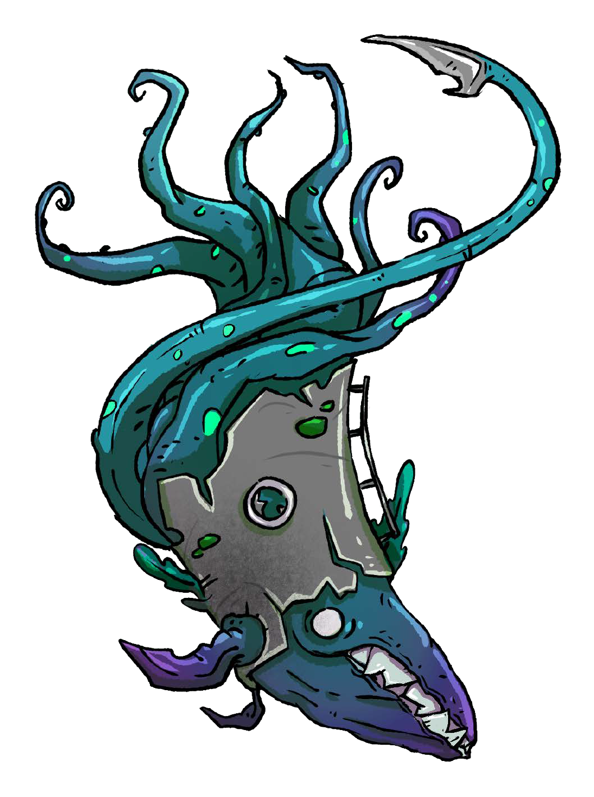

# Вступительная часть

В устроенном нами недавно опросе про «что вы не хотите видеть в разделе для ведущих» на момент написания этих строк пункт про определение «хорошего мастера» занимает первое место. И действительно, занесение в настольно-ролевой продукт каких-то обособленных рассуждений, обобщающих чьи-то личные проекции о том, кто принципиально хорош, а кто плох в рамках хобби, мы находим неуместным. Так что вместо подобных классификаций, а также для затравки вкинем тут пару тезисов об относительности сущего, ловушках восприятия, самокритичности, компетентности и том, как это всё может быть связано с нашей игрой.

## Условность личного опыта

Где-то выше мы уже писали, что УкМ:БП подойдёт только многоопытным ведущим. Но игровой опыт любой ведущей условен – он может как помочь, так и помешать при взаимодействии с новой информацией. Один и тот же набор навыков, интересов, знаний может оказаться недостаточным, «в самый раз» или избыточным в тех или иных ситуациях.

К чему это мы? К тому, что вне зависимости от твоего количества лет в хобби, количества прочитанных, ~~пропитых~~ прописанных, прожитых, ~~проданных~~ проигранных настольных ролевых игр ты можешь оказаться как достаточно, так и недостаточной опытной и странной для этого конкретного странного-странного произведения. Потому, что только (практические) тесты покажут. И потому, что игровой опыт бесполезно мерить «по головам». Это комплексное явление, невыразимое какой-то одной метрикой. Его разнообразие, например, может в лёгкую компенсировать недостаток непрерывного стажа. А раскачанный аналитический подход (ну, когда без шаблонных догматизмов) наверняка перебьёт оба упомянутых фактора. Так что дерзай. Тебе уже хватило «опыта», чтобы дочитать до сих мест. И значит у тебя есть отличные шансы на успешное использование изложенного далее для создания вместе с твоими чертовски крутыми игроками чертовски крутой игровой кампании.

## Парадокс бесполезности наставлений

И до этой страницы, и ниже мы расположили множество идей. И отражающих эти идеи концептуальных механик. И не менее концептуальных деталей повествовательного контекста. Все они могут показаться (вполне возможно, что у тебя уже сложилось такое мнение) созданными для того, чтобы сказать тебе, как «единственно правильно», «истинно», «безупречно» делать то и это.

Однако мы не стремились и не стремимся к подобному. Ведь любые наставления и советы парадоксально бесполезны в момент их изложения – если они подтверждают сложившуюся точку зрения, их принимают с одобрением (но без пользы). А если они противоречат убеждениям, то вызывают немедленное отторжение, кажутся чушью и отбрасываются. Таким образом, польза от новых идей если и возникает, то только со временем – на длинной дистанции, на практической апробации, после периода первичного переваривания, усваивания, трансформации и синтеза.

Так что в общем смысле мы не учим тебя играть (по-новому). И не напихиваем какой-либо «философией». Мы демонстрируем ряд тезисов и предлагаем системный инструментарий для реализации определённого игрового опыта. Причём и тезисы, и инструментарий с высоким шансом уже показались тебе непривычными. Контрастирующими. Спорными. Неудобными. Неподходящими. Возможно, даже возмутительными и неподобающими.

Не оспаривая само это (возможное!) впечатление, заметим, что: во-первых, практически любое «новое», если оно по-настоящему свежо и только-только из «Азбуки вкуса», вне зависимости от объективных качеств (например, полезности), вызывает у нас – Homo Sapiens Sapiens – подобные чувства. Непосредственно перед тем, как стать привычным, понятным и (кто знает?), может даже, комфортным. И что, во-вторых, там, прямо по курсу, будет ещё более чем всякого трансгрессивного контента. Присаживайся поудобнее. Уютного чтения.

## Краткое содержание раздела

Всю эту закулисную часть книги мы разбили на следующие логические блоки:

- **«Про идеологию дизайна»**. Занимает стр. XX‒XX и явно и более подробно, чем это уже было сделано раньше, рассказывает о целевом опыте, рассматриваемых темах, художественном стиле и сквозных принципах правил;

- **«Нулевая встреча»** на стр XX и **«Первая встреча»** на XX – сразу два блока, с правилами для подготовки и начальной стадии игровой кампании.

- **«Структуры и циклы»**, стр. XX‒XX. Даёт инструкции для начала вашей игры, т.н. «нулевой» и первой игровых встреч, а также формализует регулярные последовательности действий, через которые будет проходить группа в процессе кампании – посещение портов, гаваней и островов, улучшение или ухудшение публичного облика экипажа, обновление новостной повестки, работа с календарём и подобное;

- **«Пространство путешествий»** на стр. XX‒XX. Углублённо рассказывает про географические регионы Веа Туароа и морские странствия с точки зрения ведущей, а также даёт инструменты для их организации вокруг экипажа;

<!-- -->

- **«Порты и гавани»**, стр. XX‒XX. Отдельно от глобальной карты даёт (в продолжение уже ранее описанного) список из более чем трёх десятков цивилизованных портов и чуть меньшего количества диких гаваней вкупе с помогающими в использовании этого богатства правилами;

- **«Прочие каталоги»**, стр. XX‒XX. Предоставляет развёрнутые списки готовых к применению проходных обывателей и дорогостоящих подарков

- Наконец, **«Бизнес не для всех»**, рассказывает о различных нюансах игромеханической реализации таких специфических видов услуг как заказные грузовые и пассажирские перевозки.

## Про реестры и перечни

В процессе работы с обратной связью читателей и тестировщиков, мы обратили внимание на то, что далеко не всем взявшим в руки эту книгу ведущим очевидно значение реестров, перечней, каталогов игровых объектов – персонажей, мест, товаров, животных и других штук. А также то, как их можно использовать или не использовать в рамках собственной игровой кампании. Признаться, нас это несколько удивило, но, отвечая на такой вот запрос общественности, попробуем объяснить.

Повествовательное пространство любой игровой кампании построено из большого количество «строительных блоков» – всё тех же персонажей ведущей, мест и подобного. Они выполняют те или иные роли – места служат декорациями, мелкие предметы – символами, стимулами или загадками, персонажи ведущей и резвящиеся животные добавляют интерактивности разворачивающемуся сюжету. Всех их, достаточно опытная ведущая, может придумать с нуля. Но если (или «когда») ведущая не имеет желания этого делать и, например, ищет главзлодея для своей сюжетной задумки, или место в котором хорошо будет смотреться придуманное «оружие судного дня», она всегда может обратиться к готовым наборам. К чему-то универсальному, типа Masks: 1000 memorable NPCs и Eureka: 501 Adventure Plots или к чему-то более узкому, поставляемому авторами конкретной игры, типа нашего раздела «Персоналии и характерные типы» (стр. XX-XX).

Она может взять такой каталог, бегло ознакомиться с ним, выбрать что-нибудь подходящее – понятное, применимое, само-собой ложащееся куда надо – и добавить это в свою игру. Быстро, дёшево, эффективно. Вот такая идея, вот такой метод.

И конечно, то что мы озаботились составлением объёмных каталогов, вовсе не означает, что тебе нужно запихнуть их содержимое в свою кампанию целиком. Даже наоборот, куда разумней будет брать только те их элементы, которые подходят по смыслу к твоей группе, их деятельности и прочему контексту.
