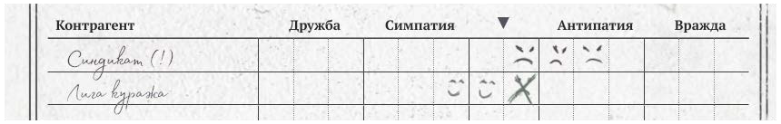
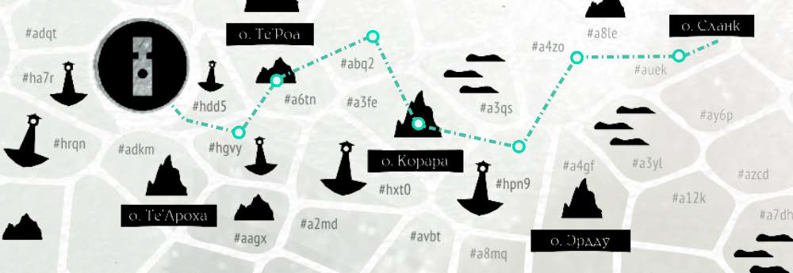
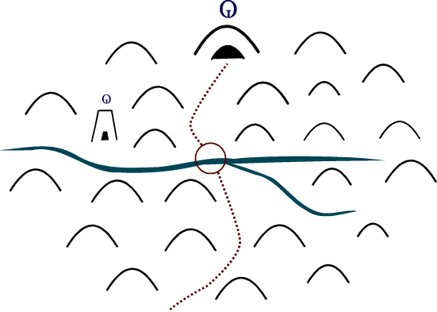
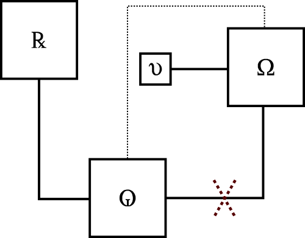
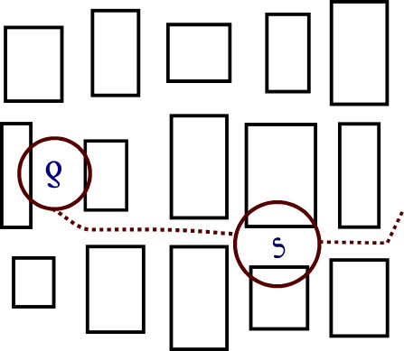

# Структуры и циклы

Любая игровая кампания по правилам УкМ:БП в высшей степени динамична – события (как вокруг протагонистов, так и за кадром, см. стр. XX) развиваются, коалиции медленно (в масштабах кампании – скорее символически) ползут к своим целям, курсы цен (см. стр. XX) меняются от порта к порту, а время (см. стр. XX) неуклонно утекает, как морской кисель сквозь пальцы.

Чтобы ты могла поддерживать всё происходящее в этом живом и холистичном состоянии, мы подготовили несколько регулярных процедур – циклических действий, предназначенных как для игровых встреч, так и для пространства между ними.

Мы постарались, чтобы они не были утомительной рутиной или отнимающим много сил упражнением, а скорее выступали подспорьем и гибким скелетом, на который ты сможешь навивать причудливую плоть вашей и только вашей игры.

## Инвентарь журналирования

### Для ведущей

Ключевой инструмент описанного далее – какой-либо электронный документ или блокнот, возможно даже подшивка бумажных листов, где ты встреча за встречей будешь вести хронику кампании.

Помимо самого журнала тебе может пригодиться что-нибудь для цветного выделения и, в случае записей на бумаге, какие-нибудь фигурные штампы для маркировки событий, связанных с именными персоналиями (стр. XX) и глобальными коалициями (стр. XX).

Вторым местом хранения и записи полезной информации будет документ с календарём (см. стр. XX) в электронном или распечатанном виде.

Третьим и четвёртым выступят бланки длительных взаимоотношений и выдающихся деяний со стр. XX и XX.

### Для игроков

Ведение собственных журналов на стороне игроков совершенно не обязательно. Более того, отсутствие привычки вести записи на начальной стадии кампании может стать хорошим источником отличнейших трагикомических ситуаций – срыва сроков, непонимания, кто друг, а кто враг, и подобного.

Однако по нашим наблюдениям игроки, в которых действительно откликается эта игра, всё же склонны вести записи. При желании они также могут воспользоваться соответствующими бланками со стр. XX‒XX.

## Создание вызовов и препятствий

Традиционно создание препятствий, делающих процесс игры интересным, считается прерогативой ведущей. Однако в УкМ:БП этот фокус сильно смещён на сторону рядовых игроков – наша система правил предполагает, что они будут достаточно мотивированы для формирования и активных попыток реализации интересов своих протагонистов. И, следовательно, сами будут втравливать себя в неприятности, сами будут выбирать, что становится для них препятствием на пути к успеху.

Конечно же это не запрещает тебе реализовывать ранее изученные трюки – придумывать всяческих немезид и неприятные оказии, упражняться в прикладной драматургии и подобном. Однако «первой скрипкой» в этом по нашей задумке всё-таки должны быть твои игроки в сочетании с различными генераторами путевых (см. стр. XX) и портовых (стр. XX‒XX) событий.

## Пропущенные возможности

В процессе кампании ты можешь обратить внимание на то, что многие части игры, повествования, общего воображаемого пространства, в которые ты хотела бы вовлечь своих игроков, внезапно (или не очень) оказываются им не интересны. Протагонисты проскакивают мимо, отправляются на следующий остров, отворачиваются, получают деньги, отваливают. И это абсолютно нормально. Это как раз то, чего стоит ожидать от внесистемных проходимцев, которыми все вольные торговцы и являются.

Так что единственный, на наш взгляд, прагматичный способ работы с такими ситуациями – быть к ним эмоционально готовой. Ожидать подобного развития событий по умолчанию. И впоследствии снова и снова показывать игрокам результаты такого выбора – новости в газетах, слухи, возможно даже их собственную славу «людей, которые отвернулись». Таким образом (повторно) вовлекая их через обратную связь там, где они ранее не вовлеклись, и давая повод возвращаться туда, откуда уже отбыли, снова и снова циклически накручивая степень реиграбельности всех этих историй.

> Строго говоря, переживания об «упущенных возможностях» и «не использованных материалах» в целом характерны (а также абсолютно нормальны) для ведущих, ещё не вполне освоившихся с проведением кампаний в т.н. «открытом мире». Однако специфика такого формата состоит именно в том, что большая часть игровых объектов, скорее всего, никогда не будет изучена одним конкретным экипажем в рамках одной конкретной кампании (и вот почему покупные материалы тут более целесообразны – вы тратите куда меньше собственного времени впустую, за вас его уже потратили авторы). Потому что обилие материалов в играх такого типа выполняет другую, не связанную с непременным показом чего-то или внушением каких-то конкретных моралей (как в случае более театрализованных, сценарных практик) функцию – создаёт интерес и возможность для повторения, для возвращения, для экономичного (пере)использования однажды приобретённой книги снова и снова. А также для внушения игрокам сосущего под ложечкой ощущения от упущенных возможностей и неоткрытых горизонтов – специфической эмоции, приятной для некоторого количества людей, входящих в аудиторию нашей игры.

## Игра в последствия

В УкМ:БП каждое решение протагонистов принципиально должно оставлять тот или иной след, а задача ведущей – не просто записывать, но стараться возвращать их в игру, таким образом снова и снова давая игрокам ту самую обратную связь. И вот как такой возвратный цикл можно организовать.

### Фиксация событий

После каждой встречи кратко, одной-тремя строками. записывай в свой журнал следующую информацию:

- при использовании физической карты, географическое положение судна и экипажа – название порта, гавани или условный код сектора

- номер встречи и дата (окта/вахта) согласно игровому календарю;

- что произошло – факты значимого на твой взгляд события;

- где именно – конкретный порт, гавань или сектор;

- кто был вовлечён – именные персоналии, глобальные коалиции или конкретные местные обыватели / группы;

- чем закончилось – краткое описание непосредственных итогов;

- что потом – любые твои идеи о том, к чему приведёт событие.

Если значимых (на твой взгляд) событий было несколько, то каждое стоит записать отдельным блоком под общим заголовком с датой.

### Очевидное развитие

У любых действий протагонистов может быть и наверняка будет то или иное понятное для всей группы развитие – получение гонорара за выполненный заказ, получение ордера на арест за вопиюще публичный поджог публичного дома и тому подобное. Такие последствия не требуют применения каких-то отдельных процедур и вам достаточно формировать их «здесь и сейчас», согласно «безжалостной логике повествования» ©™ – то есть вашему групповому представлению о том, во что всё выльется.

### Событийные триггеры

**Когда экипаж вернётся** в место, где ранее произошло занесённое в журнал событие, сверься с записями, выбери одну или две идеи категории «Что потом?» и реализуй их в пространстве игры, показав игрокам развитие созданного ими контекста.

**В каждом посещённом порту** выбирай из журнала что-то, произошедшее не менее чем за 2 окты до текущего момента, и в сильно искажённом виде демонстрируй его эхо через газеты, радио и рыночные пересуды.

**Один раз в 4d6 вахт** (такие моменты стоит раскидать по календарю заранее) сталкивай протагонистов с кем-либо из задействованных в событиях двух и более октовой давности лиц, демонстрируя через них последствия принятых экипажем решений.

## Список заслуг

Когда протагонисты в открытую и от своего имени совершают безусловно выдающиеся и публичные (сразу или со временем становящиеся известными широкой публике) деяния, будь это уже упомянутый поджог или спасение множества людей из затонувшего корабля, вноси однострочные записи об этих деяниях в d66-таблицу «Бланка заслуг» со стр. XX. Негативно оцениваемые обществом события ты можешь записывать в конец списка, а позитивные – в его начало. Полученную таблицу можно использовать двумя способами.

1.  Желая произвести на кого-нибудь впечатление, игроки могут напомнить о своих заслугах – сделать один или несколько бросков по таблице и получить по +4 преимущества или +4 осложнения на каждый выпавший (не пустой) результат – событие, о котором респондент действительно слышал в связи с названием судна и именами экипажа.

2.  С другой стороны ты можешь в любой момент игры выбрать из списка какое-либо событие, сделав его общеизвестным (и, следовательно, влияющим на все социальные взаимодействия) в месте пребывания экипажа. Но за такое использование каждый игрок получит +1 метку удачи.

Учти, что положительное или отрицательное отношение к тем или иным заслугам (и, соответственно, их трактовка как преимуществ / недостатков) сильно зависит от личных взглядов аудитории, ведь далеко не все обитатели Веа Туароа разделяют господствующее в цивилизованном обществе мнение о поджогах или ограблениях.

## Долговременные отношения

Маркируй все как напрямую полезные, так и непосредственно вредоносные для коалиции или персоналии события какими-нибудь отдельными значками. К примеру, полезные ты можешь отмечать как 😊, а вредоносные – как 😠.

> **ИЛЛЮСТРАЦИЯ: ДВЕ СТРОКИ ИЗ ТАБЛИЦЫ ОТНОШЕНИЙ**

На бланке отношений с персоналиями и коалициями (см. стр. XX), начиная от середины – с нейтральной позиции, отмечай количество связанных с ними полезных и вредоносных эпизодов. Нейтрализуй каждый 😊 свежеполученным 😠 и наоборот. При достижении соответствующих колонок-зон, затронутые лица / организации будут переходить от нейтрального отношения к одному из следующих состояний:

- дружба – затронутая коалиция / персоналия считает экипаж своими фаворитами и регулярно, как минимум раз в d6 окт, снабжает ваш экипаж особыми, стоимостью 4d6 × 1 000 × класс судна ог. поручениями и заказами. А ещё вы всегда можете попросить такого своего партнёра об услуге;

- симпатия – затронутая коалиция / персоналия питает к экипажу тёплые чувства и протагонисты могут рассчитывать, например, на первоочередное обслуживание запросов;

- антипатия – затронутая коалиция / персоналия питает к экипажу неприязнь, в силу чего избегает любого сотрудничества с протагонистами;

- вражда – затронутая коалиция / персоналия считает экипаж своими заклятыми врагами и регулярно ставит палки в колёса как минимум раз в d6 окт, пытаясь подпортить репутацию и имущество протагонистов, а также сорвать получение или выполнение очередного контракта в рамках характерного для себя образа действий. А ещё такой недоброжелатель наверняка попробует усугубить любые общеизвестные неприятности героев.

Подобного рода репутацию возможно прицельно поправить деньгами – в любой момент экипаж может приобрести 😊 или 😠 всего за 10 000 × класс судна ог. каждая.

## Жизнь других

Именные персоналии в УкМ:БП – далеко не статичные фигуры, пылящиеся в кладовке до встречи с протагонистами. Они наверняка действуют где-то вне поля зрения группы, добиваются своих целей и реагируют на изменения обстановки. Их активность логична, последовательна и основана на их же интересах. И для отражения этой активности в пространстве кампании – для быстрой имитации (взамен тяжеловесной и медленной симуляции) достоверно выглядящего «мира больших людей» – мы предлагаем вам вот такие простые правила.

Перед каждой игровой встречей одна из персоналий, перечисленных в таблице ниже, делает нечто, отвечающее интересам той коалиции, с которой себя ассоциирует, и одновременно достаточно громкое, чтобы это попало в газеты (а ваши протагонисты об этом узнали). Какая конкретно это будет персоналия и что примерно она сделает, ты можешь понять из приведённой далее таблицы.

Учти, что виновницы новостного повода не обязательно будут названы по имени – часть из них точно предпочтёт сохранить анонимность. И точно также вовсе не обязательно, чтобы новость о событии занимала первую полосу или прайм-тайм – с тем же успехом она может ютиться в уголке на пятой странице или только вскользь упоминаться диктором. Однако любой игрок, спросивший «Что новенького в газетах и на радио?» наверняка среди прочего наткнётся именно на эту новость и она волей-неволей осядет у него в голове.

<table>
<colgroup>
<col style="width: 12%" />
<col style="width: 37%" />
<col style="width: 25%" />
<col style="width: 25%" />
</colgroup>
<tbody>
<tr>
<td>d6 групп</td>
<td><blockquote>

d6 персоналий

</blockquote></td>
<td>d6 прилагательных</td>
<td>d6 действий</td>
</tr>
<tr>
<td>1</td>
<td><ol type="1">
<li>
Гвин Деллиннгем
</li>
<li>
Анару Тай’ко
</li>
<li>
Расура Цитанг
</li>
<li>
Мамат Краснорукий
</li>
<li>
Тунку Ватоко
</li>
<li>
Йурут Акса
</li>
</ol></td>
<td>возмутительно</td>
<td>демонстрирует ценности своей коалиции</td>
</tr>
<tr>
<td>2</td>
<td><ol type="1">
<li>
Лоллн Ррнвен
</li>
<li>
Харати Келекену
</li>
<li>
Малок Айюб
</li>
<li>
Белах Зуйснн
</li>
<li>
Керута Вопоко
</li>
<li>
Флиппа Пвэлл
</li>
</ol></td>
<td>впечатляюще</td>
<td>совершает профессиональную ошибку</td>
</tr>
<tr>
<td>3</td>
<td><ol type="1">
<li>
Мррава Брнтт
</li>
<li>
Уллна Хевора
</li>
<li>
Б. Вместилище
</li>
<li>
Ррвет Чох
</li>
<li>
Радж Фераба
</li>
<li>
Убрак Ллоргрр
</li>
</ol></td>
<td>провально</td>
<td>тратит огромное количество ресурсов</td>
</tr>
<tr>
<td>4</td>
<td><ol type="1">
<li>
Лиль Нобурн
</li>
<li>
Лунди Авлен
</li>
<li>
Иску Будхата
</li>
<li>
Додж Гррвилл
</li>
<li>
Пруга Ири
</li>
<li>
Вокт Аддркт
</li>
</ol></td>
<td>эффективно</td>
<td>становится предметом чьего-то расследования</td>
</tr>
<tr>
<td>5</td>
<td><ol type="1">
<li>
Таика Катоа
</li>
<li>
Калати Манао-Теа
</li>
<li>
Айоква Ратапока
</li>
<li>
Бррн Мэдвин
</li>
<li>
Листер Ррвелл
</li>
<li>
Бхата Айари
</li>
</ol></td>
<td>конструктивно</td>
<td>наносит ущерб конкурирующей коалиции</td>
</tr>
<tr>
<td>6</td>
<td><ol type="1">
<li>
Гвидде Тллст
</li>
<li>
Гррффит Прртч
</li>
<li>
Кела Хамаи
</li>
<li>
Близнецы Марими
</li>
<li>
Апстам Йэйк
</li>
<li>
Роана Ауэра
</li>
</ol></td>
<td>разрушительно</td>
<td>просто делает свою работу</td>
</tr>
</tbody>
</table>

## Окружающие просторы

Наиболее значимая и заметная деятельность, которой ваша группа будет заниматься в процессе кампании помимо в высшей степени ролевых, а значит слабо детерминированных торговли и сутяжничества, – регулярные путешествия по карте региона, прицельное посещение отдельных островов, ознакомление с их спецификой и ~~попытки оттуда сбежать~~ подобная околотуристическая деятельность.

### Морские путешествия

> Мы не предполагаем, что твои игроки будут тщательно утюжить морские пространства «просто чтобы посмотреть, что там есть» – это и бесполезно, и толком не поддерживается правилами. Конечно, мы знаем, что такое поведение характерно для части людей, как нам кажется, не вполне понимающих, о чём эта книга. Но делать его своей проблемой мы точно не собираемся.

Процедура морских путешествий довольно громоздка, поэтому мы вынесли её в отдельную главу, на стр. XX‒XX. Однако здесь мы всё же упомянем основные моменты для большей связности излагаемого материала:

- вся карта разбита на секторы, каждый из которых имеет условное наименование из четырёх символов;

- каждый сектор может содержать или не содержать целый ряд статических, стабильно остающихся в нём объектов;

- каждый сектор также может содержать на момент посещения протагонистами ряд объектов динамических, которые «сегодня здесь, а завтра – там»;

- путешественники перемещаются из сектора в сектор и автоматически обнаруживают большинство перечисленных объектов;

- при необходимости путешественники взаимодействуют с найденными объектами – посещают гавани и порты, плавучие посёлки, станции дозаправки, световой азбукой шлют наилучшие пожелания встречным судам, драпают от призывно курлыкающего корпусника и тому подобное;

- процедура повторяется до момента, пока герои не окажутся в конечной точке своего путешествия, – месте, которого и пытались достичь.

> **ИЛЛЮСТРАЦИЯ: ПРИМЕР КАРТЫ**

### Торговые порты

Каждый визит в цивилизованный порт – это в первую очередь возможность поддержать жизнеспособность вашего плавучего кооператива. С другой стороны, для властей того или иного порта прибытие вольных торговцев – возможность символически проявить свой контроль и одновременно воспользоваться свежеприбывшими ресурсами.

#### Поэтому большинство таких посещений начинается с:

- регистрации в портовой канцелярии и проверки документов;

- подачи официальной декларации на перевозимые грузы;

- предложения выкупа того, в чём порт нуждается – тех товаров, которые тут в дефиците (см. стр. XX);

- пополнения при необходимости запасов еды, топлива и запчастей;

- погашения накопленной смуты через посещение различных увеселительных заведений;

- ремонта полученных судном повреждений.

Эти рутинные действия сразу приводят к первым точкам взаимодействия – знакомству с клерками, судоремонтной командой, докерами, барменами, массажистами и крупнейшими местными торговцами (которые как раз и стараются оптом взять все дефицитные товары).

Если экипаж решает задержаться в порту на какое-то время, то сразу после этого начинается менее типизируемая ролевая активность. Однако и здесь можно выделить повторяющиеся элементы.

Обычно после решения базовых задач герои ищут новые возможности:

- читают объявления, узнают новости и собирают слухи;

- посещают бары и припортовые рынки;

- продают и покупают газеты;

- ищут новые заказы.

Всё перечисленное также создаёт последствия – всё новые знакомства и всё большее погружение в местные перипетии. Как раз на этом этапе мы рекомендуем применять персональные микромеханики значимого прошлого персонажей – делать проверки на обнаружение старых знакомых, профессиональные контакты и подобное. Здесь же игроки могут получить базовые сведения о заданном конфликте (см. стр. XX) текущего порта и решить, хотят ли они посвятить участию в нём ещё N встреч.

Наконец, финальным шагом цикла становится отбытие. Возможно, предвещающее скорое возвращение, а возможно – и нет.

### Городская топография

Портовые города за вычетом специфики (см. стр. XX‒XX) устроены очень шаблонно. Как правило, они состоят из:

- порта – ремонтных доков, грузовых, промысловых и пассажирских причалов, конторских зданий, увеселительных заведений и гостиниц;

- торгового района – припортового рынка, лавочных рядов, представительств гильдий и крупных фирм;

- административного центра – главной площади, ратуши, городской стражи, банков, центрального отделения почты и телеграфа, газетных издательств;

- туристических мест – театров, клубов, концертных залов, парков, исторических достопримечательностей;

- фабрик и заводов, также входящих в агломерацию и соединённых с городом трамвайными линиями;

- спальных районов и трущоб – дешёвого жилья, обычно соседствующего с крупными производственными и складскими комплексами и заодно служащего опорной базой для различных криминальных группировок;

- богатых районов – находящихся на окраинах, вдали от шума, скоплений особняков и вилл.

### Дикие гавани

В отличие от портов, гавани (см. также стр. XX) не обладают какой-либо развитой инфраструктурой, богатой экономикой и налаженной портовой жизнью. Однако в них есть где причалить без риска увязнуть на мелководье и, как правило, есть какие-то обитатели, с которыми можно перекинуться парой слов.

#### В случае гаваней цикл типовых действий обычно сокращается до:

- пополнения при возможности запасов еды, топлива и запчастей;

- попыток понять, чем живёт гавань (и какой здесь заданный конфликт);

- произвольных активностей типа топографических исследований или посещения опасных мест (см. далее);

- отбытия (иногда – в панической спешке).

#### Структура диких гаваней

Может быть абсолютно любой в зависимости от характера конкретной гавани и острова, на котором она расположена. Тем не менее в её пределах обычно можно выделить небольшое число повторяющихся узнаваемых элементов, например:

- точка швартовки – мол, пирс, причальная стена со ступенями или лифтом, искусственно углублённая бухта или что-то подобное, зачастую – видавшая лучшие времена и в давно не обслуживаемом виде;

- следы пребывания предыдущих путников и жителей – тенты, навесы, хибарки, пепелища, старые развалины или останки временного лагеря;

- переходы в другие части острова – тропы, мостики, ступени, тоннели, расщелины и так далее.

### Сухопутные колоброждения

Долговременные пешие исследования не входят в фокус нашей игры. И поэтому мы не предоставляем полноценного комплекса как материалов, так и правил для подобного рода активностей – разбитых на собственные «подсектора» подробных карт островов, отдельных правил по движению сквозь эти сектора и всего такого.

Однако если твои игроки всё же надумают посвятить своё время подобным активностям, то вот вам несложные и компактные правила для этого.

#### **1.** Определите и зафиксируйте детали путешествия.

1.  **Точки интереса** *–* конкретные руины, возвышенности, населённые пункты и т. д.

2.  **Метод передвижения** *–* пешком или на моторном транспорте.

3.  **Ресурсы** – еда + вода, запас топлива, источники света, ремонтные комплекты, специальное снаряжение.

    1.  Выберите 2, если путешествуете пешком, 3 – если используете мототехнику и 5, если двигаетесь на автомобилях.

4.  **Что вам помогает** *–* карта с ориентирами, знание местности, собранные слухи, надёжный проводник.

#### 2. Выясните, как быстро вы доберётесь до следующей точки.

1.  Сделайте путевую проверку – бросьте d6 и определите, добралась ли экспедиция в точку интереса за прошедшую вахту.

    1.  При 6+ вы оказались на месте через 5‒6 склянок с момента начала движения.

    2.  Если результат от 3 до 5, то вы свернули куда-то не туда и оказались где-то не там. Вероятно, в следующую вахту вам повезёт больше.

    3.  Если результат 1‒2, то протагонисты и не преуспели, и повстречались с какой-то неприятностью (см. далее).

2.  Вы можете улучшить свои шансы за счёт того, что вам помогает: такие вещи как «карта», «проводник», «слухи» и «знание местности» добавят к результату броска по +1 каждая.

#### 3. Неприятности в пути, которые могут (не)произойти.

1.  **Потеря одного из ресурсов**. В таком случае экспедиция теряет *или* еду + воду, *или* запас топлива, *или* источники света, *или* ремонтные комплекты, *или* специальное снаряжение – на выбор игроков.

2.  **Ухудшение шансов** – накапливающийся штраф −1 при путевых проверках.

3.  **Потери личного состава** – один из протагонистов теряется насовсем.

#### 4. Точки интереса, которые вы ранее наметили.

1.  Такие точки интереса представляют собой пространство для свободной, не регламентированной экспедиционными правилами ролевой игры. Находясь в них, общайтесь, лицедействуйте, создавайте коллизии и т.п.

2.  Для большей структуризации исследования точек интереса вы также можете использовать процедуру проникновений в опасные места (см. далее).

#### 5. Завершение экспедиции и подведение итогов.

1.  Экспедиция принудительно завершается, если потерян запас еды + воды, а все её участники-протагонисты получают по одной ране.

2.  Экспедиция будет вынуждена оставить моторные средства передвижения, если будет потерян запас топлива.

3.  Экспедиция всегда и без каких-либо сложностей может вернуться по своим следам. Возврат займёт столько вахт, сколько точек интереса уже было пройдено ранее.

> **ИЛЛЮСТРАЦИЯ: ПРИМЕР КАРТЫ ЭКСПЕДИЦИИ**

### Опасные проникновения

Время от времени твоя игровая кампания может и будет приводить игроков в ситуации, когда необходимо проникнуть в то или иное опасное место, обследовать его и вернуться оттуда с чем-нибудь ценным. Для подобных эпизодов ты можешь использовать любой удобный тебе способ – рисовать детальные карты, обходиться общими описаниями, сводить всё проникновение к 1‒2 (например, одну для захода и одну отхода) драматическим коллизиям или использовать описанную далее структуру.

#### Концепция места и карта его частей

1.  Выберите общую концепцию своего опасного места – склад, фабрика, храм, пещера и т.п.

2.  Определите (случайным образом или усилием воли), сколько игровых сцен вы хотите создать в этом месте.Каждая из них потребует отдельного сегмента (обычно соответствующего какому-либо помещению) на общем плане.

3.  Придумайте для каждого сегмента собственную легенду – практическое назначение и облик помещения, – перекликающуюся с основной концепцией.

4.  Составьте блок-схему со всеми сегментами и нарисуйте связи между ними. Эти связи – переходы – в дальнейшем послужат местами отдыха и точками плавной смены декораций.

5.  Определите, какие из переходов надёжны, а какие – проблематичны и рискованны (мы рекомендуем соотношения 2/3 или 3/1).

6.  Определите, где на вашей карте находятся вход с выходом, и переходите далее.

#### Риски и ставки процесса проникновения

1.  Составьте список опасностей, которые могут угрожать героям в этом месте, например недружелюбная живность, токсичная растительность, высокая температура, бандиты, конкуренты, хитрые ловушки, вооружённая охрана и т.д. и т.п.

2.  Распределите опасности по ранее созданным сегментам и проблематичным переходам в количестве не более двух штук на каждую точку размещения.

3.  Определите награду — вместе с игроками решите, какие сокровища ждут их (предположительно или точно) в случае успешного избегания всех опасностей или некоторых из них.

#### Процедура исследования

1.  Начните с ранее намеченной точки входа.

2.  Описывайте посещаемые помещения, отвечайте на вопросы игроков, реагируйте на их действия и сталкивайте их с ранее обозначенными опасностями.

3.  Создавайте коллизии, если необходимо, однако не более одной на каждый сегмент.

4.  Постепенно, по мере преодоления препятствий, выдавайте игрокам части обещанной награды или (если награда не делится) интересные сведения о ней.

5.  Давайте игрокам возможность по-быстрому перевести дух в беспроблемных переходах.

### Пример: заброшенная шахта.

> **ИЛЛЮСТРАЦИЯ: ПРИМЕР КАРТЫ**

#### Детали:

- гулкие туннели;

- обвалившиеся штреки;

- глубокие провалы;

- покорёженные рельсы.

#### Опасности:

- рои кровожадов (см. стр. XX);

- внезапные обвалы;

- удушающие газы;

- ветхие лифты и лестницы;

- безумный шахтёр с динамитом.

#### Награды:

- уникальный образец оборудования.

### Пример: кансейское гетто.

> **ИЛЛЮСТРАЦИЯ: ПРИМЕР КАРТЫ**

#### Детали:

- узкие проулки;

- запахи пищи и экскрементов;

- кровь на брусчатке;

- запертые ставни и двери;

- визгливый джазец.

#### Опасности:

- местная шпана;

- киллер мафии;

- упавший сверху рояль;

- стая одичавших керветок;

- аварийная застройка.

#### Награды:

- перстень с родовым гербом;

- саквояж с бомбой;

- пакет с чертежами.

## Ход времени

В нашей игре время – ценный и ограниченный ресурс, который группа может бесцельно терять или осознанно инвестировать наравне с деньгами, связями и прочими запасами. Ведь многие события вокруг экипажа происходят по календарю. А глобальные и тактические цели протагонистов часто требуют действовать с учётом точных дат и склянок. Так что тебе предельно важно в любой момент понимать, где именно на календаре – на временной карте кампании – вы находитесь.

### Работа с календарём

Ваш первый экипаж начинает свой путь в третью вахту Благословенного прилива. Каждый раз, когда протагонисты предпринимают какие-либо продолжительные действия – выжидают, путешествуют, отдыхают в порту и подобное, – отмечай потраченное ими количество вахт, сдвигая отметку на календаре всё вперёд и вперёд.

Положение экипажа во времени может существенно измениться в результате посещения областей Внешней мглы (см. стр. XX). Если протагонисты, воспользовавшись временным скачком, захотят встретиться с самими собой из прошлого, убей один из двух экипажей каким-нибудь особо зрелищным способом.

В любом случае мы настоятельно рекомендуем тебе наглядно демонстрировать игрокам их скольжение вдоль временной линии, чтобы подстегнуть сфокусированность группы.

### Запланированные даты

Совместно с игроками отмечайте на календаре будущие моменты окончания взятых обязательств, гарантированные сроки доставки, предполагаемое время выздоровления и другие аналогичные точки. Чем скрупулёзнее вы будете делать это, тем удобнее вам будет совладать с огромным количеством информации, регулярно сваливающимся группе на головы в процессе кампании.

### Предопределённые события

Наш календарь Благословенного прилива полон предстоящих событий, которым суждено случиться в тех или иных уголках Веа Туароа. Часть из них – фестивали, премьеры и подобное – явно общеизвестны и доступны при учёте планирования. Другая часть – покушения, нападения, пропажи и т.д. – скорее холистична или даже стохастична, в силу чего частью планов экипажа быть не может.

Демонстрация или сокрытие второго типа событий зависит только от ваших вкусов – мы подготовили очищенную от них версию календаря на стр. XX. Однако вне зависимости от того, станут протагонисты их случайными (или нарочными) свидетелями и участниками или нет, для этих событий есть стойкие предпосылки, о них будут писать в газетах, говорить по радио и в пабах по всему морю.

### Смена приливов

При достаточной продолжительности кампании в какой-то момент вы можете выйти за пределы размеченного нами календаря. В таком случае тебе стоит, фигурально выражаясь, перевернуть страницу – скопировать календарную сетку с регулярными мероприятиями со всё той же стр. XX, добавить к ней что-нибудь от себя и продолжить движение вперёд, в туманное будущее.

## Ключевые рейсы

Ключевые рейсы – это четыре расположенных на стр. XX‒XX и подготовленных нами торговых контракта, которые могут послужить тебе основой для кампании. Перемежая их с периодами свободной торговли и самостоятельных путешествий экипажа, ты можешь создать последовательную, с общей идеей линию эмерджентного повествования, которая приведёт протагонистов из безвестности к широкой популярности в узких, но могущественных кругах.

Каждый их четырёх рейсов имеет собственные условия для начального вовлечения экипажа. Игроки при этом вольны пропустить любой из них – это также станет важным и заслуживающим уважения выбором. Наконец, тебе вовсе не обязательно использовать все четыре рейса в своей кампании. Ты можешь добавить только один или два из них. Однако даже так мы рекомендуем соблюдать их последовательность и условия старта.

## Развитие персонажей (и структура кампании)

В УкМ:БП развитие персонажей – не просто прокачка их навыков, это изменение положения, репутации и возможностей в мире. В дополнение к чисто механической атрибутике (пополнению коллекции достоинств) каждый протагонист копит опыт и связи. А вся команда при этом обрастает финансовыми активами, улучшает судно и увеличивает количество вещей, которыми может заниматься. Например, приобретение погружного отсека позволит экипажу изучать подводные чудеса, пассажирский отсек даст попробовать силы в регулярной перевозке пассажиров (см. стр. XX), а пескоходы – возможности для прочёсывания мало кому доступных замелёванных секторов.

Однако вернёмся к персональному развитию. Как ты помнишь, каждое приобретение нового достоинства персонажа предполагает длительный, более чем в сотню вахт длиной, период отпуска. И, как ты уже догадалась, игроки могут совмещать подобные периоды – уходить в один большой отпуск для всего экипажа.

Это в свою очередь даёт уже тебе отличную возможность для структурирования кампаний – придания ей ритмики, свойственной пикареске, разбиения на крупные отрезки, за время которых многое меняется. Cтарые знакомцы оказываются втянуты в новые неприятности. Глобальные цены растут или падают. Ну а протагонистам приходится заново осваивать узнаваемый, но изменившийся мир – пространство новых политических событий, новых конкурентов, торговых маршрутов или даже подправленной географии.

## Чередование персонажей

В УкМ:БП, как и в подавляющем большинстве других игр, любой из вас может управлять сразу несколькими протагонистами – либо по очереди, выводя «на сцену» кого-то из них в зависимости от ситуации, либо одновременно, если обстоятельства позволяют. И это открывает возможности для ещё ряда циклических действий, способных украсить кампанию.

Например, запасные персонажи могут выходить на первый план, в то время пока основные в отпуске. Или действовать встреча через встречу, занимаясь делами в разных частях карты, обмениваясь информацией и формируя общий семейный бизнес. Наконец, они просто могут иметь разную специализацию, нужную для того или иного стиля ведения дел и тех или иных различающихся по культуре портов.

## Естественный финал

Рано или поздно достаточно упорные игроки имеют все шансы добраться до лимитов своих пенсионных счетов и наконец-то освободиться от кабалы «Программы Вольной торговли». Однако этот момент вовсе не обязан становиться концом вашей кампании (и компании). Воспринимай это скорее как логический контрапункт, отмечающий место, где игрокам уже не нужны будут направляющие стапеля торговых рутин. И где они, имея на руках весьма внушительные капиталы, смогут наконец заняться тем, чем всегда хотели. На этот раз по-настоящему.
