# Пространства путешествий

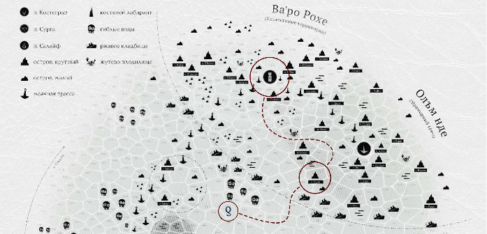

Как ты помнишь, карта кампании поделена на разграниченные секторы и более абстрактные, лишённые чётких очертаний глобальные регионы.

> **ИЛЛЮСТРАЦИЯ: МЯТАЯ Ч/Б КАРТА С ПОМЕТКАМИ**

Мы предполагаем, что твои игроки будут проводить над этой картой приличное количество времени – прокладывать маршрут, перемещать миниатюру своего корабля из сектора в сектор, размышлять, планировать, отмечать находки и прочее. По нашему опыту именно карта моря будет главенствующим (особенно с учётом её размера) и важнейшим элементом вашего игрового интерфейса. А вкупе с изложенными, как ранее так и далее, механик – ещё и конструктором увлекательных историй, управление которым будет доступно каждому из игроков.

> Если ты знакома с предыдущими версиями этой игры, то уже могла заметить существенное изменение – по целому ряду причин в УкМ:БП мы больше не предлагаем ведущим самостоятельно составлять карту моря. Вместо этого мы разместили в книге (а также предлагаем в качестве отдельных товаров на сайте укрытоеморе.рф [https://xn--e1aanjickenh4g.xn--p1ai/](https://xn--e1aanjickenh4g.xn--p1ai/) эталонный образец такой карты с примерно на 60% определённым нами содержимым. Разумеется, тебе всё ещё ничего не мешает взять листок разграфлённой бумаги или распечатку бланка незаполненной карты, который можно скачать всё с того же сайта, и нарисовать своё собственное море – наполнить его островами, маяками и прочими объектами в любых нужных тебе пропорциях.

## Процедуры перемещений

Процесс путешествия тривиален – экипаж выбирает, куда плыть, пересекает сектор за сектором, накапливает смуту, списывает ресурсы и, если всё проходит гладко, достигает выбранной цели. Обычно эта процедура рутинна, не является испытанием или коллизией, не требует каких-то особых усилий – любой, у кого есть корабль, команда, надёжный способ держаться разумно и безопасно выбранного курса, а также достаточное количество ресурсов, наверняка доберётся, куда хотел.

Приключения начинаются только когда не соблюдено какое-либо из перечисленных выше условий – когда судно неисправно, припасы скомпрометированы, команда недостаточна или слишком тревожна, средства навигации недоступны или ошибочны, а курс проложен через опасные места.

На основании собственного опыта мы предполагаем, что большая часть игроков в начале кампании будет осваивать ближайшие к стартовой точке – Олъму – безопасные зоны, плескаться на мелководье, возить почту, нарабатывать собственные рецепты заколачивания барышей, обрастать знакомствами, снаряжением, бюджетами и тому подобное. А затем, через 5‒7 встреч, они могут захотеть экзотики и попробуют себя в более рискованных (и денежных) областях Светличного пути или Внутреннего фронтира. Где с ними и приключится всё выше описанное.

### Предварительная разведка

Важный, хотя поначалу и не для всех игроков очевидный элемент путешествий в УкМ:БП – возможность так или иначе заранее узнать максимум доступной информации о предстоящем маршруте и точке назначения. Чтобы, например, иметь больше шансов повстречаться с нужным, а с не нужным не повстречаться. Добывать такую информацию можно в портах и в пути, бесплатно или за деньги, быстро и механически или обстоятельно и повествовательно.

Приведённый ниже список способов наверняка не исчерпывающий – ваш бравый экипаж в процессе игры найдёт немало своих вариаций и вариантов. Однако эти несколько путей наиболее очевидны для протагонистов, так что эпизоды сбора полезной информации почти наверняка будут включать какой-то из них.

Сама идея что-то разведывать при этом вряд ли придёт в голову твоим игрокам вот так сразу. Однако рано или поздно, возможно по результатам продемонстрированных тобой через твоих персонажей примеров, они могут освоить этот нехитрый концепт. Мы не рекомендуем тебе вываливать все варианты скопом – естественное их изучение даст куда более фактурную историю проб и ошибок, а значит – пойдёт на пользу истории.

#### Досужие слухи

Наиболее ненадёжный, зато чрезвычайно ролевой вариант – старое доброе «Йэй, старче, хватай чарку. Заздравэ! Чо бают о проходке от сих и до Сланка? Не намело ли там банок? И не рыскают ли окресь лиходеи?»

Как правило, подразумевает наличие (вокруг протагонистов) тех, кого можно опросить, и твоё желание за этих «кого» полицедействовать. Сведения, полученные из таких источников, могут как соответствовать, так и отличаться полностью или частично от фактов реальности. Зато за них не просят денег, если не считать нескольких огневиц на традиционное вежливое угощение.

#### Покупная информация

Более достоверна и профессиональна, хотя с вероятностью 1/3 может оказаться фуфлом. И в половине случаев точно будет слегка искажённой. Покупается у присутствующих в каждом порту «знающих людей» – информационных брокеров, на которых можно выйти через барменов и уличных попрошаек. Знают эти люди примерно столько, сколько и ты. Минус то, чего, по-твоему, они знать не должны.

Стоимость сведений о тех или иных вещах зависит от рисков их разглашения для самого брокера и от того, насколько богато или опасно выглядит клиент. Для потрёпанного морехода она будет начинаться от 100 ог. за вопрос. Для баского хлыща в костюмчике с искрой вырастет раз на десять. Ну а для серьёзных девиц со шрамами и портупеями будет сделана 20% скидка. При этом инфоброкеры не будут намеренно врать и даже в случае ненадёжной информации честно предупредят о рисках её использования. Хотя деньги и не вернут. Попытки надавить на них, торги с позиции силы и подобное обязательно привлекут внимание Синдиката (см. стр. XX), плотно крышующего все инфоброкерские ларьки.

#### Профессиональные клубы

Как уже было упомянуто на стр. XX, во всех обжитых портах вашему навигатору доступны элитные профессиональные заведения, на коммерческой основе дающие подробную справку о различных местах и помогающие обсчитать наиболее безопасный курс куда-либо.

#### Навигаторские мотыльки

Незаменимый инструмент оперативной путевой разведки, небольшие – не выше колена – одомашненные летуны, достаточно разумные и дружелюбные для того, чтобы несколькими танцевальными па рассказать о вещах, которые видели недавно. Их азбуку точно знает любой навигатор, а вот остальным она обычно даётся с трудом (что, скажем, приводит к путанице в 5/6 случаев).

Стоят мотыльки (см. стр. XX) недорого, прокорм себе добывают сами, работают за почухивание загривков и весёлую музыку. Летают они раза в три быстрее среднего грузовоза. За один облёт – четыре склянки – успевают смотаться до соседнего сектора и обратно. После чего докладывают навигатору, что там увидели, и ещё три склянки отдыхают на жёрдочке. Содержать их можно в количестве до четырёх штук – пять и более начнут выяснять, кто лучше танцует, и в процессе наверняка не обойдётся без жертв.

Есть у них и существенные минусы: подвижные и мелкие объекты мотыльки попросту не распознают, так что ни о проходящих судах, ни о рыскающих корпусниках, ни о клочках суши мельче пяти тысяч гранваев длиной они вам не расскажут. И вообще ни о чём, не входящем в их ограниченный словарный запас, состоящий из наиболее типовых объектов карты – островов, гиблых вод, ржавых кладбищ, крупных скоплений скал, рифов и отмелей, – сообщить не смогут чисто физически.

Самый же критичный и мало кому известный недостаток этих умильных летунов – их способность гарантировано теряться на просторах плодилищ (см. стр. XX): попав в них, мотыльки уже никогда не возвращаются.

#### Лоцманское чутьё

То ли очередная суперспособность, то ли просто опыт гильдейских лоцманок, позволяющий им оценить степень угрозы (но не характер) чего-либо в следующем секторе прямо перед переходом в него. Руководствуясь этим чутьём, нанятая лоцманка может предостеречь капитана и предложить изменить маршрут, если сочтёт ожидающую прямо по курсу опасность существенной. И если капитан проигнорирует этот совет, лоцманка тихо и незаметно для всех покинет корабль – сядет в складное каноэ и отчалит во тьму, оставив не израсходованную часть своей оплаты на видном месте.

#### Катерные рейды

Пожалуй, самый длительный и потенциально дорогой способ разведать что-либо, лежащее в другом гексе, – это приобрести моторный катер (см. стр. XX) и лично отправиться на нём вдаль по волнам, пока ваше судно отдыхает, встав на якорь. Конечно, запаса жижкого топлива на этой легкомоторной скорлупке хватит только на то, чтобы за 8‒10 склянок смотаться туда и обратно. Ну или на то, чтобы за то же время сделать два гекса пути в одну сторону. Несмотря на очевидные риски навсегда потеряться во тьме или стать добычей какой-нибудь морской жути от среднего размера и выше, эффект личного присутствия может быть неоценим для особенно рисковых мореходов. Особенно в случае, если они исповедуют принцип loosing is fun!

### Ещё раз о навигации

В отсутствие глобального, надёжного, однозначного и всем известного способа определения направления – планетарных магнитных линий или хотя бы звёзд, – народы Веа Туароа разработали сразу несколько параллельных, непременно проблемных и с переменным успехом работающих способов понимать, где вы находитесь относительно той или иной точки моря.

#### Математика направлений

Самый безобидный, самый глубокомысленный и, вероятно, самый бестолковый способ достался олъмцам – в отсутствие альтернатив флотские навигаторы просто сверяются со специальными установленными в родных портах стеллами направлений, берут арифмометр и пересчитывают вектор, скорость, дистанцию, а потом плывут, полагаясь на эти расчёты.

Однако далеко так не поплаваешь и много не наплаваешь. Во-первых, для этого способа нужно иметь стеллу направлений – начинать рейс в одном из портов Олъм Нде. Помимо того, начиная с третьего пройденного сектора изменчивые течения незаметно для мореходов понемногу меняют курс судна, уводя вас с проложенного маршрута. В итоге подобные плавания целесообразны только внутри архипелагов – кратчайшими путями от одного островка к другому.

Тем не менее, пока у вашего экипажа есть дееспособный навигатор с арифмометром, начальная точка вашего маршрута – один из портов Олъм Нде, а дистанция до конечной не превышает двух секторов, протагонисты гарантированно не собьются с пути.

##### Брось d6, если экипаж идёт по арифмометру уже более двух секторов:

- на 1‒2 их судно отклонилось на сектор влево от заданного курса;

- на 3‒4 продолжает идти туда, куда и задумывалось;

- на 5‒6 судно отклонилось на сектор вправо.

#### Путевые горлянки

Примерно аналогичный по надёжности способ нашли для себя кансейцы – они массово изготавливают особые металлические, украшенные множеством лиц, сосуды, сложный внутренний механизм которых через разбираемый только кансе атональный звон позволяет двигаться в одном заранее заданном направлении по нескольку вахт кряду. Причём и надёжность, и продолжительность действия этих музыкальных конструкций можно легко увеличить, кратно увеличивая их в размере и массе. Так, соответствующие части современных судов кансе могут занимать до половины объёма их трюмов.

#### Указующие аппараты

Несмотря на то, что магнитных компасов в нашем понимании у народов моря нет, к моменту Благословенного прилива секретные лаборатории Олъма и Салайфа параллельно друг дружке разработали и начали внедрение глобальных систем навигации нового поколения, основанных на сети искусственных «полюсов притяжения» и формирующих «одические линии» прямо в толще крупичного полога. Само собой, все технические средства, созданные в рамках соответствующих проектов, принципиально недоступны гражданским лицам, как и любая достоверная информация о них.

#### Гильдейские лоцманки

Самый надёжный способ достался ва'ро. Ещё в давние времена они научились распознавать, укреплять и усиливать особое дарование некоторых своих дочерей – умение «слышать» пульс подводных течений, распознавать их имена, возраст, настроение и намерения. В сочетании с непревзойдённой имперской школой картографии, сохранившейся на текущий момент только в стенах Гильдии, этот дар позволяет лоцманкам безошибочно довести ваш корабль с двигателем или парусом туда, куда вы хотите добраться. Пусть и только в случае, если вы знаете, куда, собственно, вам нужно.

За подобные совершенно непонятные современной науке способности лоцманки расплачиваются большой ценой – отрекаются от родни, отказываются от имён, не имеют шансов стать матронами и быстро, всего за десяток приливов карьеры, сгорают под действием усиливающих дар снадобий.

Лоцманки почти всегда фанатично следуют строгому кодексу поведения. А самих себя видят в первую очередь стражницами, оберегающими свет цивилизации от угасания, распада и беспорядка. Что, конечно, осложняет сотрудничество с ними погрязшим в практическом нигилизме экипажам.

#### Гильдейские маячные певчие

Несостоявшиеся лоцманки с недостаточными способностями. В отличие от лоцманок, от работы не выгорают. Не употребляют алкоголь, так как он мешает им петь. Применимы только в пределах Светличного пути, но как раз в его пределах (пока) и незаменимы. Своим пением – утробными басовитыми руладами – они, сидя на носу вашего корабля, будят плавучие маяки (см. стр. XX), из которых Светличный путь (стр. XX) и состоит. И вот так от одного маяка до другого под утробное мурлыканье певчей вы добираетесь в ту точку Пути, в которую вам надо.

### Отдавшись течениям

Впав в дрейф, не имея подводного паруса и лоцманки, которая подскажет, как им пользоваться, ваши мореходы всё равно будут куда-то плыть – медленно, преодолевая один сектор за четыре вахты, двигаться произвольным, меняющимся раз в окту курсом.

#### Брось d6, чтобы определить направление дрейфа:

- на 1 течения несут вас в сторону Салайфа;

- на 2 – точно так же, но уже к Олъму;

- на 3 и 4 тащат к самому близкому из островов;

- на 5 – к ближайшей точке Светличного пути;

- на 6 – туда, куда вы и плыли до этого.

### Смутные секреты

Ты уже могла обратить внимание на несколько мистический и обскурный характер так называемой морской смуты – специфического вида стресса, сводящего с ума корабельных пролов в длительных переходах. Возможно, на текущий момент ты уже думаешь, что это чистая настольная условность или, наоборот, одержимость какими-нибудь загробными сущностями, селящимися на корабле, чтобы донимать команду, неважно – старую или свеженанятую. Но на практике всё очень материалистично: морская смута – это эффект особого летучего вещества, части социальной химии пролов, оседающего на всех предметах, с которыми эти малыши имеют дело. Оно совершенно не ощутимо для обычных олъмцев, кансе и ва'ро, никогда не становилось предметом серьёзного научного изучения (ведь у науки есть дела поважнее), однако предельно действенно – объединяет всю прольскую команду разделяемым контекстом эмоциональных переживаний. Так что единственный (и никому не известный) способ избавиться от этой напасти без организации командного досуга – промыть уксусом металлические части корабля, а все неметаллические заменить новыми.

## В родных водах

> **ИЛЛЮСТРАЦИЯ: МЯТАЯ Ч/Б КАРТА С ПОМЕТКАМИ**

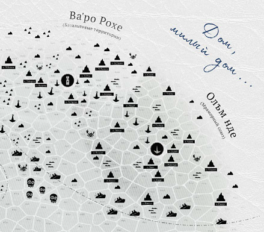

Начальная область путешествий ваших героев – союз государств Олъм Нде и Ва'ро Рохе – плотно населён, хорошо обжит и картографирован. Подавляющее большинство описанных нами в следующей главе на стр. XX‒XX торговых портов расположена именно здесь, что создаёт естественный плацдарм для первых этапов твоей игровой кампании. Морские переходы тут почти безопасны, зоны риска (см. стр. XX) общеизвестны, заблудиться сложно, а дистанции между населёнными островами редко когда превышают пару секторов.

В общем, основным источником развлечений для игроков здесь будет скорее социум, чем стихия или неизведанные чудеса диких просторов. И это нормально – мы не рекомендуем тебе сверх меры нашпиговывать Союз таинственными проклятыми островами, взрёвывающими в тумане монстрами причудливых очертаний и подобным. Куда лучше будет оставить здешние воды простым и понятным игрокам «домом», где они могут просто покупать и продавать, следовать от порта к порту, иногда прерываясь на события со стр. XX. Домом, за порог которого они и сами потом захотят выйти. И в безопасность которого ещё захотят вернуться, сбросив потрёпанные плащи и, возможно, вздрогнув от воспоминаний о том, что видели там, за окоёмом.

## Неразмеченные части

> **ИЛЛЮСТРАЦИЯ: МЯТАЯ Ч/Б КАРТА С ПОМЕТКАМИ**

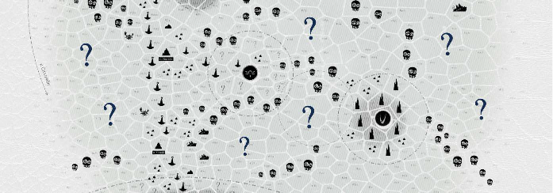

Как ты уже могла заметить, в секторах центральной области нашей карты – во Внутреннем фронтире – расположилось куда меньше географических объектов, чем в пределах Ва'ро Рохе, Олъм Нде и Светличного пути. Разумеется, это не случайно и является частью закладываемого нами в игру опыта – области Фронтира и для игроков, и для их персонажей, и даже для правительства их держав это mare incognitum, энигма, загадка. Место, где спят потерянные всеми чудеса, область надежд и будущих экспансий. Потенциальный источник ценных ресурсов и жизненного пространства для всё увеличивающегося населения цивилизованных островов. И, конечно же, «белое пятно», отведённое нами для твоего самостоятельного творчества.

В конце Войны многочисленные острова этой области, освобождённые Волной практически от всего своего населения и некогда бывшие оживлённым центром Империи ва'ро, ещё не картографированы, не открыты и не описаны в архивах олъмского Адмиралтейства. Соответственно, их только предстоит нанести карту. Ты сама вольна решать, где они расположены. И можешь отмечать их положение любым удобным тебе способом – флажками, наклейками, штампами или чем-то подобным – по мере обнаружения игроками.

Три десятка затерянных островов Фронтира мы уже описали в разделе «Дикие гавани» на стр. XX‒XX. Если у тебя возникнет нужда в большем количестве или ты захочешь поупражняться в самостоятельном творчестве, ты также (см. стр. XX) можешь создать свою собственную дикую гавань, воспользовавшись конструктором со стр. XX.

Хороший способ интеграции этих «тайных» объектов в кампанию – особые заказы, солидные пассажиры и почтовые отправления (см. стр. XX, XX и XX соответственно) – все три варианта позволят протагонистам получить координаты конечной точки где-то на Фронтире и мотивацию к ней плыть.

## Дальние переходы

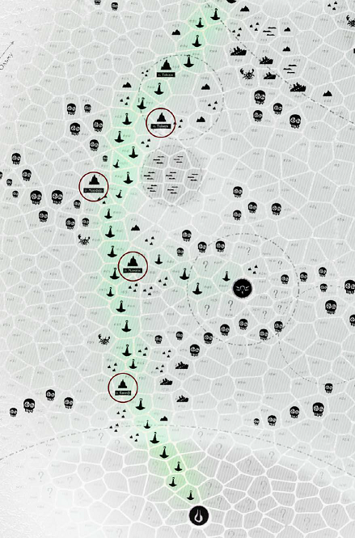

Нарочито очевидный вариант «выбраться из песочницы», предусмотренный нами для игроков, пресытившихся быстрыми (и дешёвыми) рейсами внутри Союза, это крупные и хорошо известные «центры цивилизации», расположенные в отдалении от родных вод – порты Светличного пути, Сурга, Костегрыз и Салайф (см. стр. XX‒XX). И если первые в списке во многом наследуют родной культуре протагонистов, фактически являясь колониями Олъм Нде, то каждый из последующих трёх обладает своей собственной, неповторимой культурой, особенностями рынка и интересом к заморским торговцам.

При этом Сурга и Салайф относительно легко достижимы – скопив достаточное количество денег и следуя маякам Светличного пути, докупая припасы в портах и плавучих станциях дозаправки, сигналя проходящим мимо коллегам и военным патрулям, твои игроки без труда преодолеют 30‒40 секторов до любого из этих двух портов. Костегрыз же место совершенно иное, предназначенное для записных нонконформистов и эджлордов, которые, соблазнившись образами пиратской утопии, будет готовы рвануть к нему либо напрямую – через беззаконные пространства Фронтира, либо по Светличному пути до Сурги, а затем через т.н. «Спорные территории», необъявленную линию фронта, где сначала стреляют, а потом (может быть) что-то спрашивают. В обоих случаях приключения экипажа будут весьма интенсивными, как минимум, за счёт подготовленных нами таблиц путевых событий (см. стр. XX).

### Великие полисы Фронтира

Возможно, ты уже начала думать о том, как могут развиваться события твоей кампании в настолько специфичных местах, как Сурга или Костегрыз. И, быть может, даже успела посетовать на то, что мы пока не озаботились выпуском отдельной книжки для одного или даже двух из этих Великих полисов Фронтира. А уж мы-то на это успели посетовать неоднократно – все попытки найти кого-нибудь, кто возьмёт, скажем, материалы по Форнхайму, Даскволлу, Марлинко, Бастиону и Дождеграду, вдохновится ими и напишет что-нибудь такое про Сургу и Костегрыз… в общем, эти попытки были безуспешны. Но мы всё ещё заинтересованы. Так что еcли ты – как раз такая, готовая взять, да и написать, то для начала черкни нам что-нибудь в [mb@exnihilum.info](mailto:mb@exnihilum.info).

### О дивный Салайф!

Мы нарочно не стали подробно размечать нижнюю часть карты – территории Кансе Ткути. И потому, что их посещение запрещено иноземцам, и потому, что собираемся рассказать об их географии, населении, культуре, проблемах, календарных событиях и подобном – одновременно похожем и не похожем на аналогичные детали родного для протагонистов Союза – в отдельной книге, включающей в себя как справочные материалы и каталоги, так и дополнительные ключевые рейсы. Так что следите за новостями. Что-то да будет.

## Особые тайны

Как ты помнишь из главы «Путевые перспективы», в этом море встречается немало огромных, размером с целые сектора, скорее мест, типов ландшафта, чем отдельных объектов – уходящие вдаль болезненные туманы гиблых вод, покрытые бурунами поля рифовых мелководий, обманчиво непримечательные скопления отмелей, целые архипелаги севшего на мель ржавого железа и тому подобное. Всё что о них можно сказать, мы уже написали ранее. Но так как в хорошей игре всегда должно быть место интриге, ряд деталей и целый один тип особых мест мы приберегли только для твоих глаз.

### Рейдеры гиблых вод

Гиблые воды – крайне вонючие и отвратные части моря, места всеобщего распада, где противоестественная коррозия быстро разъедает и судно, и плоть любого незваного гостя. Казалось бы, у людей нет и не может быть здравых причин вторгаться в их пределы. Однако время от времени находятся смельчаки или сумасшедшие, отваживающиеся искать здесь укрытия от безжалостных преследователей или опыта, не сравнимого ни с чем другим. Большая часть таких посетителей погибает в первую пару вахт. Меньшая – возрождается в новом и чудовищном обличье.

Любой, ставший жертвой гиблых вод, имеет 1/6 вероятности восстать в искажённом и проклятом самой природой виде т.н. порченого (см. стр. XX) – не стареющего, безумного и чрезвычайно живучего кадавра, не способного, впрочем, подолгу находиться вдалеке от заражённых территорий. Прилив за приливом эти совершенно проклятые существа сбиваются в немногочисленные банды и, оседлав таких же порченых морских тварей, устраивают рейды за пределы родных вод, похищая суда и экипажи для пропитания и создания себе подобных. От их касания рассыпаются самые стойкие материалы, а кожа людей покрывается мучительными волдырями. Их изломанные конечности похожи на рачьи клешни, а облепленные наростами головы постоянно подёргиваются, словно в такт чудовищному танцу. Они – воплощённый кошмар. Они – байка, которой на Фронтире пугают детей. Они выныривают из жижи за бортом и карабкаются на палубу, чтобы… наверняка не для того, чтобы сделать с вами хоть что-нибудь хорошее.

> Порченые рейдеры позволят тебе добавить в игру немного элементов классического морского ужаса о злобных призраках и проклятых мертвецах, которые возвращаются снова и снова. А их уродство, хрипы, запредельная живучесть и привычка разъезжать на мутировавших корпусниках только усилят ассоциации с «Чёрной жемчужиной» и «Немой Марией».

### Реликтовые плодилища

До сих пор не раскрытый учёными народов моря и естественным образом охраняемый их агрессивной флорафауной секрет плодилищ прост и причудлив одновременно. Каждое из таких мест представляет собой неглубокую впадину морского дна – каньон, расселину, кальдеру или что-то подобное. В глубинах этих впадин таятся древние гиганты – автономные биологические фабрики давно исчезнувшего народа хумт, надолго пережившие своих создателей, деградировавшие и расстроенные. Они бесконечно выпускают на волю мириады эволюционного сырья – как серийных созданий типа корпусников, корр, кусак и планктона, так и всевозможных не стандартизированных гибридов и дизайнерских особей, расползающихся по окрестным просторам.

Большая часть экспериментальной биопродукции вне зависимости от размера излишне агрессивна и в целом нежизнеспособна, в силу чего быстро погибает, становясь разносимой течениями питательной биомассой. Меньшая, наиболее живучая и генетически устойчивая, становится криптидами или эндемиками секторов-плодилищ. Чтобы в дальнейшем, возможно, дать новый виток эволюции морских экосистем.

> Биофабрики-плодилища – удобный инструмент, который позволит легко подселить на просторы моря твоих любимых зверюшек неописуемых форм из Alien, The Thing, Still Wakes the Deep и Cold Fear. Или показать игрокам Великого Морского Змея. Или что-нибудь из Scavengers Rain. Или огромного головоногого гуманоида с псионическими способностями.

### Бонус: звонкие бездны

Места, известные тем, что (время от времени, не постоянно) проходящие по ним суда видят в глубинах тусклые огни и слышат оттуда глухой мелодичный звон. Известны чрезвычайно сильными и хаотичными течениями, буквально выталкивающими корабли из сектора. Многие навигаторы используют это себе на пользу, экономя топливо и сокращая время рейса. Лоцманки, если спросить их, говорят, что такие «звонкие бездны» – места скорби, хотя и не могут поделиться какими-то конкретными деталями.

На деле каждая звонкая бездна – расположенные в глубоководной расселине древние развалины того или иного анклава народа хумт, опустошённого и разрушенного гигантами-асбами. Автоматика этих подводных комплексов продолжает работать, время от времени посылая проходящим судам сигналы о помощи. Однако защитные системы, формирующие плотный кокон отталкивающих течений, подводный вихрь искорёженных обломков, автономные кинетические турели, кластеры минных заграждений и сложный рельеф дна делают любые попытки добраться до них коллизией с +5 осложнениями.

Достигшие полузатопленных корпусов анклава подводники могут столкнуться уже со вторичным эхом древней войны – боевыми биоконструктами, бронированными автоматонами, энергетическими полями и замершими в ожидании незваных гостей колониями агрессивных наноботов. Всё это сделает любую попытку спуска в такие места совершенно незабываемой, а найденные в глубинах «бесценные» (в кавычках, так как мертвецам они деньги, ха-ха, не нужны) техноартефакты – не такими уж оправданными. Возможно, мы ещё выпустим сборник карт для подобного типа исследований. Позднее. В случае запросов аудитории. Подписывайтесь на наши соцсети, следите за новостями.

## Внешняя мгла

Туманная дымка не-света встречает каждого, пытающегося выйти за пределы этого мира, туда, где нет секторов, границ, измеримых расстояний и каких-либо намёков на детерминированность пространства, где время теряет знакомые всем свойства великой реки жизни и распадается на множество проток, расходящихся, объединяющихся, образующих петли, спирали и кольца. Где законы привычного нам мира становятся скорее конкурирующими абстракциями, чем непреложными фактами реальности. Где гипотезы обретают плоть и хищные устремления, а мертвецы не менее деятельны, чем живые.

Путешествия в этих водах чрезвычайно опасны и в то же время имеют весьма сомнительную ценность. Однако они осуществимы и время от времени люди, пресытившиеся этим морем, пытаются плыть за его границы, чтобы придать смысл своим истекающим жизням. Такими людьми были некоторые отчаявшиеся и гонимые чудовищными асбами хумтские экипажи. Таким человеком была знаменитая капитанка Йакта Тулак. Возможно, такими же дерзновенными безумцами в какой-то момент решат стать ваши герои. И для подобных случаев вот тебе простая, но действенная механика: бросайте кубики, описывай последствия, двигайтесь дальше.

### Кванты мглы

Путешествие во Внешней мгле может быть разбито на кванты – условные отрезки меняющихся условий (или способов восприятия реальности – никто в точности не знает, что тут более верно). Для выбора предстоящего кванта игроки могут использовать бросок четырёх кубиков. При желании игроки могут потратить чью-либо метку удачи и сделать повторный бросок, приняв его результаты вместо предыдущего. Количество таких «перебросов» ничем, кроме запаса меток, не ограничено.

Нахождение в каждом кванте занимает от одного субъективного такка до бесконечности. Выход из кванта случается только тогда, когда персонажи стремятся его покинуть. Потерявшие желание двигаться дальше остаются здесь навсегда. Каждый квант забирает с собой d6 пролов и наносит экипажу суммарно d6 ран (которые могут быть распределены по протагонистам или компенсированы за счёт пролов). Все забранные мглой пролы и достигшие предела своих ран персонажи продолжают существовать в виде фрактальных фантомов, не способных покинуть мглу и присутствующих на борту до выхода судна из неё. Все фантомы немы, но могут общаться с окружающими жестами и узнают наперёд (потому что ты им его показываешь) содержимое следующего кванта сразу после броска. В силу чего могут захотеть повлиять на решение группы о перебросе.

Путешествие продолжается до точки выхода (варианты 7, 11, 17, 21), разрушения судна или до тех пор, пока все протагонисты не становятся фрактальными фантомами.

#### 4d6 квантов внешней мглы

4.  Декомпозиция – все соединительные элементы судна распадаются, превращая его в облако свободно парящих деталей. Через мгновение та же участь постигает персонажей – их внешние покровы истончаются и распадаются на лепестки, а внутренние органы дрейфуют в пространстве, что приводит к быстрой и лёгкой смерти. Этот экипаж навсегда потерян во мгле.

5.  Бесконечная лекция – непроницаемая темнота и хор голосов, рассказывающих на всех языках одновременно об истории этого мира, его прошлом, настоящем и близкой смерти от вечного холода так, как будто все они уже произошли.

6.  Суп абстракций – невыносимо сияющее пространство вокруг наполняется мириадами теорем и уравнений, сражающихся друг с другом за логическое превосходство. Они покрывают все обозримые поверхности и даже персонажей, каждый из которых получает 1/6 вероятности быть немедленно помноженным на ноль и стать фантомом.

7.  **Точка выхода** – экипаж покидает мглу практически в том же месте, в котором начал путешествие за границы мира. Протагонисты даже успевают увидеть уходящую в туман не-света корму собственного судна. Помимо экипажа на палубе обнаруживается ранее погибший и дорогой кому-либо из игроков персонаж, сидящий в плетёном кресле и задумчиво потягивающий охлаждённую гроздёвку. Если ваша кампания пока не породила кандидатов на перерождение, то обнаруживается только кресло и разбитый стакан, покрытые большим количеством смрадной мононуклеарной слизи.

8.  Всё переплетено – пространство наполняется пучками еле заметных и неразрывных нитей, тянущихся из ниоткуда в никуда. Часть нитей соединена с персонажами, кораблём и всеми предметами на нём. Попытки взаимодействия с не принадлежащими персонажам и кораблю нитями с вероятностью 1/3 приведут к необъяснимому исчезновению d6 именных персоналий (см. стр. XX) и с вероятностью 1/6 – к внезапной гибели всех формальных представителей одной из коалиций (стр. XX) Веа Туароа.

9.  Временной калейдоскоп – пространство распадается на созерцаемые всеми одновременно осколки, в которых параллельными курсами движется множество копий вашего судна в различные моменты его прошлого. Протагонисты, уже ставшие фрактальными фантомами, выиграв или выкупив коллизию могут насильно отправить сознания и воспоминания всего экипажа в один из осколков, вытеснив себя предыдущих из собственных же тел.

10. Время двойников – от каждого протагониста, ещё не ставшего фантомом, отделяется его тень, обретающая плоть и сознание. Все получившиеся копии немедленно проявляют волю к власти, пытаясь насильно занять место оригиналов.

11. **Точка выхода** – экипаж покидает мглу в результате длительных, затянувшихся на двадцать три прилива блужданий среди абстрактных пространств и концепций. Постаревшие (и наверняка слегка тронувшиеся умом) протагонисты обнаруживают себя во время третьей вахты Благословенного прилива в окрестностях Глоккра, доставляющими крупный груз мыла некоему Йогру Трллку (см. стр. XX) на своём корабле, который совсем не то, чем кажется. Обсудите, что с ним не так, почему это хорошо и почему плохо. После этого добавьте каждому протагонисту ~~развесистый маразм~~ недостаток «старческая дряхлость».

12. Фундаментальные изменения – скорости распространения света и звука меняются, протагонисты видят и слышат всё вокруг с заметным опозданием, а туман за бортом закручивается в болезненно подёргивающиеся и хищно выглядящие спирали. Судно получает +полом.

13. Принудительная коррекция – всё вокруг становится плоским и двухмерным, а у протагонистов появляется ощущение, что за ними внимательно, въедливо наблюдает невидимая и совершенно безжалостная сущность. Количество каждого из отдельно расположенных (не упакованных в пачки и не скреплённых с чем-либо) дублирующихся предметов на корабле сокращается до одного. Также с корабля исчезают любые материальные предметы, которые игроки в пределах этого кванта называют вслух не словарным образом – обозначают сленгом, кальками или эрративами.

14. Расходящиеся горизонты – бесконечное на вид количество пересекающихся под разными углами плоскостей, по которым одновременно движется множество копий вашего корабля, почти одинаковых, но отличающихся в мелочах. Прямое взаимодействие между плоскостями невозможно, однако попытки дистанционного общения могут привести к забавным результатам.

15. Исполненность очей – всё вокруг покрывается множеством не вполне материальных плоских и двухмерных глаз. Они глядят из дымки за бортом, прорастают на досках палубы и стенах кают. Они пристально наблюдают. Они молча осуждают и еле слышно ехидничают. Это неприятно и оскорбительно. После покидания кванта каждый протагонист имеет 1/6 вероятности приобрести новое и совершенно не подчиняющееся ему око на каком-нибудь пока не закрытом одеждой месте.

16. Мальстрём – пространство сворачивается в завивающуюся трубу и с воем низвергается соударяющимся потоком куда-то в направлении условного низа. Судно получает +полом

17. **Точка выхода** – персонажи покидают мглу через 4d6 окт после того, как в неё вошли в противоположном (слева направо, сверху вниз или по диагонали) конце карты, субъективно затратив на путешествие не более склянки. Каждый протагонист окружён d6 полными копиями, объединёнными общим сознанием и находящимися под управлением одного и того же игрока. Каждая копия даёт +4 преимущества в коллизиях. Все копии погибают в течение 6d6 окт, но не чаще, чем одна копия за окту.

18. Пульсации смыслов – все предметы вокруг начинают меняться, хаотично переключаясь между множеством версий себя, будто бы принадлежащих разным вселенным. Их материал, структура, размеры, степени целости и опасности для окружающих, а также стиль отрисовки циклично скачут туда и обратно (прим. ред. – как в том мультяшном «Человеке-пауке»), но могут быть зафиксированы усилием воли какого-либо из протагонистов, если он того пожелает.

19. Чудовищный очаг – огромный огненный шар проносится где-то в вышине, заливая туманные пространства вокруг нестерпимым жёлтым светом. Этот свет вызывает зуд и острые приступы тревоги. Затем на окружающие просторы опускается благодатная тьма. Все протагонисты получают длительное покраснение незащищённых одеждой частей тела и +недостаток – фобию, боязнь огня.

20. Множественность – воздух наполняется тихим гудением, а у каждого из персонажей возникает 2d6 чётких теней, далеко не все из которых повторяют движения за оригиналом. Половина матросов-пролов становится двухмерными силуэтами, но как ни в чём ни бывало бродит по плоским поверхностям вокруг.

21. **Точка выхода** – экипаж возвращается на просторы Веа Туароа за 4d6 окт и 4d6 секторов от момента погружения во мглу, субъективно затратив на путешествие не более склянки. Судно протагонистов теперь не нуждается в топливе, не подвержено любым видам коррозии, заращивает по одному своему полому за вахту, перемещается резкими скачками, вызывает лёгкую головную боль у всех в радиусе ста ваев, а его поверхности блестят перламутром. Ремонт или повышение класса этого судна на верфях народов моря более невозможны.

22. Взаимоперетекание – на фоне сполохов невообразимых цветов, окрашивающих палубу во все оттенки разом, протагонисты попарно в произвольном порядке обмениваются сознаниями. С вероятностью 1/2 обменные сознания приживаются и сохраняются после выхода из кванта. В противном случае каждый переживший опыт обмена протагонист приобретает +достоинство того, в чьей голове побывал.

23. Потерянная легенда – из сиреневого тумана проступают контуры укрытого стазис-полями флагманского судна экспедиции Йакта Тулака (см. стр. XX). По его палубе дёргано перемещаются какие-то силуэты с волочащимися следом хвостами кабелей (см. Virus, 1999 [https://www.imdb.com/title/tt0120458/](https://www.imdb.com/title/tt0120458/)).

24. Фазовый переход – вся команда судна становится фрактальными фантомами одновременно. Этот экипаж навсегда потерян во мгле.

## Блуждания

На практике наша эталонная карта, отсутствие полноценного «тумана войны» (мы просто не нашли, как его удобно реализовать), надёжные средства навигации в лице лоцманской Гильдии, видимые всем игрокам сектора и подобное делают ситуации классического блуждания и рыскания из фэнтези игр (DMG 3.5, стр. 86, DMG 5, стр. 111, DMG 2024, стр. 40), когда ни рядовые игроки, ни их персонажи сами не знают, где находятся, маловероятными и трудно реализуемыми. Так что мы не рекомендуем тебе вообще заморачиваться этой околоBDSM-ной практикой, характерной для некоторых других жанров. Ни к чему это тут.

## Суда и другие мобильные объекты

Куда-то целенаправленно плывущие, рыскающие или дрейфующие, эти конструкции, обычно созданные людьми, частенько можно встретить (см. «Случайные происшествия», стр. XX) во время плавания. Будут ли подобные объекты полезны, безынтересны или даже опасны для вашего экипажа, зависит только от хода игры и решений группы.

Каждый из этих объектов обладает атрибутом «прочность», описывающим количество уже знакомых вам по главе «Ваш герой, экипаж и судно» поломов. Некоторые из перечисленных далее кораблей военного или криминального назначения также имеют второй атрибут – «урон», говорящий о том, сколько поломов такое судно может нанести противникам за одну коллизию.

**Хлюпкий плот** (прочность 1‒2) – сооружение из держащегося поверх морского киселя легковесного мусора или чего-то подобного. Мягко говоря, не самое практичное средство для путешествий.

**Гребка, катер или каноэ** (прочность 1) – малое судно на мускульной или легкомоторной тяге. Обычно плавает недалеко и в открытом море не встречается.

**Вака-туа** (прочность 2) – традиционная беспалубная парусно-гребная лодка ва’ро с высоким форштевнем вместимостью от 20 до 50 человек. Благодаря лёгкости и тренированной команде гребчих способна на резкие «броски» и развороты почти на месте.

**Берсай** (прочность 2) – ажурный и резной «крылатый» тримаран кансейской знати времён Великого Кераджа. По большей части остался на свалке истории и практически не встречается в море.

**Яхта** (прочность 2) – увеселительная или спортивная посудина, не особенно вместительная, но зато способная на длительные морские переходы как под парусами, так и с мотором.

**Грузопассажирский хог** (прочность 3 и выше) – обобщённое название т.н. «торгового типа кораблей», пузатых, вместительных, с большой осадкой. Хоги могут быть очень разного размера, оснащённости (см. стр. XX), планировки и дизайна, сильно зависящих от конкретной верфи и национальных привычек корабелов. Могут встречаться поодиночке и группами, плыть налегке или что-то буксировать – тащить за собой объёмный плавучий груз. На одной из таких посудин и начинает свою кампанию ваш экипаж.

**Промысловый тягун** (прочность 3-5) – суда добытчиков морской флорафауны (см. стр. XX), вершников, тральщиков, ихорников и жутебоев. Оснащены всем необходимым для отлова, первичной обработки и даже консервации своей добычи.

**Трассовик** (прочность 6-7) – крупное многопалубное и очень вместительное грузопассажирское судно, построенное специально для перевозки людей и товаров по Светличному пути.

**Топовоз** (прочность 10) – сверхбольшое грузовое судно, не способное пришвартоваться в большинстве портов и предназначенное для магистральных перемещений крупнооптовых партий различных товаров внутри Союза

**Канонерка** (прочность 2, урон 1) – вспомогательное боевое судно всяческих ВМФ. Поодиночке не особенно эффективно, но, сбиваясь в флотилии (в таком случае прочность всех участвующих во флотилии канонеwрок суммируются, а урон вырастает на единицу за каждые 6 штук), эти малышки могут быть поистине грозными защитниками мирных мореходов от всяческих угроз.

**Пиратский брантер** (прочность 1, урон 1) – моторная гребка с зарядом низкокачественной взрывчатки. Одноразовое и слабо управляемое (задолго до взрыва наводчик в спасжилете выпрыгивает за борт) оружие нападения.

**Пиратский клуп** (прочность 2, урон 2) – переоборудованное для стремительных рейдов торговое судно первого класса. Не отличается вместительностью (трюм в три раза меньше, чем у хога), выглядит уродливо, но быстро плавает и не нуждается в прольской команде.

**Пиратский кривоброт** (прочность 4, урон 4) – среднетоннажный, примерно аналогичный хогу второго-третьего класса и собранный из чего попало корабль. Довольно опасен, ходок, не нуждается в прольской команде, встречается редко и обычно без сопровождения.

**БС класса «Норм» (согл. олъмской классификации)** (прочность 7, урон 4) – основной тип кораблей дальних военно-морских патрулей Союза и Кансе Ткути. Встречается поодиночке и малыми группами.

**БС класса «Бегемон»** (прочность 25, урон 7) – дорогая, неповоротливая, но абсолютно убийственная махина, созданная в Войну как ультимативный довод в эскадренных сражениях и перестрелках с береговыми батареями.

**Плавучий посёлок** (прочность 50, урон 3) – собранная из чего попало лоскутная конструкция, служащая жилищем тем (см. стр. XX), кто почему-то не захотел жить на суше.

**Плавучая крепость** (прочность 100, урон 15) – буксируемая боевая платформа и мобильная армейская база, часть наследия Великой войны. В эпоху Благословенного прилива в исправном виде почти не встречается.

**Минное поле** (прочность ???, урон d6) – дрейфующая группа кем-то потерянных и теперь беспризорных взрывных устройств.

**Противокорабельные заграждения** (прочность ???, вероятна поломка ходовой части судна) – особые сети из прочного троса, закреплённые на притопленных буйках.

**Слухобой** (прочность 10, урон 2) – крупный буй, оснащённый программируемой (через перфокарты) системой прицеливания и пушкой, стреляющей на звук любого двигателя, не совпадающего с заложенным шаблоном. То есть любого не военного, произведённого вне конкретной верфи, артикула и партии.

**Проект «Э1337»** (прочность 6, урон 2) – экспериментальный разведывательный корабль олъмских ВМФ. Способен на сверхглубокие погружения и дальние автономные рейсы.

**Спецсудно «Йарват»** (прочность 3, урон 3) – кансейский идейный конкурент «Э1337». Легче, хрупче, быстрее и манёвренней своего собрата. Способно на полном ходу выпрыгивать из-под моря и нырять обратно.

**Путевой маяк** (прочность 30) – часть Светличного пути (см. стр. XX), заякоренный понтон с башенкой, пробуждающий светляковый фонарь при звуках горлового мурлыканья гильдейских певчих.

**Топливная канистра** (прочность 15) – часть Светличного пути, автоматизированное и автономное хранилище путевых запасов, продающее топливо по завышенным втрое ценам.

**Рекламный щит** (прочность 5) – регулярная часть «ландшафта» Светличного пути, платформа с каким-нибудь привлекательным посланием, громкоговорителями и подсветкой, включающимися при звуках судового двигателя.

**Морская закусочная** (прочность 8) – «приживала» Светличного пути, размещённый на понтонах барак с несколькими причалами, всегда готовый порадовать проплывающие суда свежей стряпнёй, неприличными ценами на выпивку, лавкой сувениров и дешёвой дребедени, а также тёплой компанией веселящихся коллег.

**Морское казино** (прочность 8) – ещё одна примета Светличного пути, понтонный «дворец развлечений» с азартными играми, предложениями эскорта и множеством тихо пьющих по углам подозрительных типов.

**Корабельная мастерская** (прочность 8) – необходимый многим ремонтный комплекс, работницы которого способны по-быстрому залатать ваше судно, починить отказывающий движок и проделать другие сервисные операции обычно втрое дороже сухопутных коллег.

**Плывучий коралл** (прочность 30) – дрейфующий во тьме островок пористых окаменелостей, населённый морской живностью и иногда служащий домом для какого-нибудь отшельника.

**Станция батисфер** (прочность 15) – изредка встречающееся (и ещё реже – работоспособное) древнее сооружение, служащее точкой входа в какой-нибудь полузатопленный подводный комплекс.

Во время путешествий ваш экипаж наверняка столкнётся со множеством прелюбопытнейших случаев, явлений и встреч. Его участники станут свидетелями различных чудес моря, жизни его флорафауны, сцен жестокости, следов былых трагедий, совершенно необъяснимых явлений и много чего ещё.

Все эти вещи могут и будут выступать основой для каких-то не очень крупных перипетий, препятствиями на пути к цели – чем-то, что своими приключениями экипаж делать не захочет, или просто очередными декорациями, характеризующими регион и задающими тон повествования.

В представленных далее таблицах мы подготовили по одному списку путевых событий для каждой из наиболее выделяющихся зон карты нашего моря.

### Сокращения и условные обозначения

- В целях экономии места далее такой параметр плавучих объектов как прочность (см. стр. XX) записан по формуле «пN», где N – количество поломов, которое может выдержать то или иное плавсредство перед тем, как пойдёт ко дну.

- Параметр урона – количество поломов, которые может нанести кому-нибудь это плавсредство за одну коллизию (короткую стычку), записывается аналогично – «уN».

- Ну а полная формула записи прочности и урона выглядит как «пNуN».

#### Принципы, методы и подходы

Сами по себе каталожные списки случайных путевых событий (частный случай таблиц процедурной генерации чего-либо) это всего лишь инструмент. И довольно простой, в силу чего не подразумевающий единственно верного, определяемого эталонным протоколом способа работы. То есть ими можно пользоваться очень, очень по-разному. И в руках человека сведущего, обладающего профильной «табличной» квалификацией, они дадут один результат, а для новичка (не обязательно – в НРИ, именно в использовании процедурной генерации за игровым столом) – совсем другой, зачастую куда более неловкий, неудобный, неказистый и не впечатляющий.

Если ты уже имела обширную практику использования таблиц, то наверняка сформировала те или иные собственные привычки. В таком случае смело можешь пропустить этот подраздел и перейти далее. Но если для тебя этот инструмент пока в новинку, здесь мы попробуем раскрыть некоторые нюансы его использования.

##### База: порядок накидки

- Выбери подходящую региону таблицу.

- Кинь указанное в заглавии количество d6 и определи происшествие.

- Если требуется, докинь ещё Nd6 для уточнения деталей.

##### База: каждую морскую вахту (в движении, дрейфе или на якоре)

- Определи или выбери событие.

- Навяжи игрокам коллизию в случае событий с 🚨 *или…*

- Опиши всё как есть и запроси у группы реакцию.

- Действуй по обстоятельствам;

- …

- Повтори цикл.

> В эту последовательность шагов мы нарочито не включили определение точного момента, склянки, четверти, токка и такка обыгрываемых путевых происшествий. На наш взгляд этой игре с учётом частоты событий и масштаба механик, предназначенных для работы с ними, такая временная детализация совершенно не нужна. Так что любое путевое событие прекрасно может начаться в любой удобный тебе момент, ну или как мы часто говорили во время пробной кампании – «примерно в середине вахты…»
>
> Ровно так же мы нарочно не стали добавлять в рекомендованные подсистемы процедуру сложного (и случайного) определения «настроения», отношения встреченных к персонажам. На наш взгляд, с учётом заложенной в эту игру динамики, путевые происшествия (опять же) не заслуживают подобной детализации, так как чаще всего опытные игроки в них и не вовлекаются, предпочитая прямолинейно следовать по собственному маршруту.

##### Принцип: осмысляй @ пересказывай

Любые каталожные элементы (в ролевых играх) это всего лишь полуфабрикаты, требующие от ведущей творческого переосмысления. Другими словами, для того, чтобы они хорошо, действительно хорошо и органично смотрелись на полотне твоего повествования, их необходимо покатать в голове, адаптировать, снабдить деталями, видоизменить, развернуть-раскатать и поставить ровно туда и тогда, куда и когда нужно. А попытка использовать их «как есть», просто зачитывая с листа (как и в случае дословного зачитывания любых заранее написанных текстов), обычно смотрится как минимум хуже, чем если бы эти же тексты были пропущены «через себя» и вольно пересказаны.

##### Принцип: насыщенность требует времени

Для подавляющего большинства знакомых нам ведущих очень непросто оказывается «на ходу», непосредственно во время игры, выудив из каталога (например, таблицы путевых событий) какой-либо случайный объект, красиво, насыщено, богато и одновременно быстро развернуть его в пространстве игры. Потому что, как ни крути, мозгу большинства из нас требуется немало времени на то, чтобы: а) впервые или нет ознакомиться с вот этой случайной штукой, б) сообразить, как она сочетается с текущим художественным контекстом, в) сформулировать вербальное описание и г) украсить его художественными деталями.

Так что, когда и если мы (обычно – вовсе не гении и профи сторителлинга, не Мёрсеры, Ковиллы и тому подобные господа) пытаемся по-быстрому навернуть случайное путевое событие на своё повествование, особенно в случае новых, не досконально нам известных каталогов, приходится на чём-то экономить. Чаще всего под нож идут красочные детали. Или интеграционная логика.

В общем, если у тебя и твоей группы есть запрос на относительно спешную, но ритмичную игру и насыщенные большим количеством событий встречи-путешествия, то стоит сразу понизить планочку и сказать себе: «нет времени – нет художки». Ну или наоборот – чтобы нормально, без жертв, снова и снова проделывать все необходимые операции, нужно никуда не спешить. Играть медленно. Размеренно. С паузами. Без нашей любимой накачки драматизма через интенсивность темпоритма. Или нет?

##### Отступление: эгоистическая прелесть бытия

d6, брошенный накануне игры, и d6, брошенный во время игры, имеют практически одинаковые шансы показать случайное значение на верхней грани. Таким образом случайные, набросанные по каталогу значения не потеряют изначальной случайности вне зависимости от того, насколько заранее вы их определили. Даже если сильно заранее. Даже если их записать на листочек.

Да, конечно, на эмоциональном уровне записанные детали не будут для тебя, ведущей, таким уж сюрпризом, спортивным вызовом, разрешением саспенса, каким стали бы непосредственно во время игры. И это важный фактор нашего с тобой ведущего удовольствия. Однако стоит понимать и делать (или не делать) выбор в его пользу с учётом двух факторов: а) такое удовольствие по определению чрезвычайно эгоистично и б) оно может дорого обойтись другим игрокам и самой игре.

Ведь каждый раз загоняя себя в адреналиновый цейтнот внезапной необходимости придумать, что и как вот здесь делают именно эти d666 гноллов, радостно шурша табличками и подтабличками, мы занимаемся изысканной интеллектуальной мастурбацией на виду у остальной группы. Которая… ну, тоже может в это момент чем-то себя занять, особенно если вы 100% на одной волне. И которая, что статистически происходит чаще, просто терпеливо (читай – как минимум без удовольствия) ждёт, когда наконец ~~этот чёртов вуайерист~~ Уважаемый Мастер закончит свои себялюбивые развлечения, а ролевая игра, ради которой остальная группа здесь и находится, наконец продолжится.

Да-да, описанное выше во многих и многих группах статистически является узаконенной нормой слабо осознаваемой ситуации привычного страдания. И, положа руку на сердце, мы тут такого не любим. Хотя тебе и не запрещаем.

##### Метод: подготовленная импровизация

Альтернатива вышеописанному карнавалу проста (и скучна, нет в ней спортивного вызова) – ты можешь набросать и записать в виде списка некоторое количество (5, 10, 15… не переусердствуй – переработки не оплачиваются) вариантов случайных путевых событий заранее. Или в виде нескольких списков для разных зон карты, если таковые имеются, а путешествие по ним ожидается в ближайшее время.

После этого ты можешь проработать полученные значения на любую удобную тебе глубину – расписать до 2‒3 предложений, составить описательный абзац или несколько, подобрать, отрисовать, сгенерировать иллюстрацию. Или обойтись без всего этого и оставить скопированное-вставленное значение «как есть».

И, в общем-то, всё. После этого ты будешь примерно представлять, что есть в этом шорт-листе, а чего – нет. Сможешь быстро – куда быстрее, чем из таблиц, – извлекать и применять эти события. Игра станет более плавной, описания, вероятно, – более насыщенными. А вот искомых авантюрных тревоги и неуверенности у игроков вовсе не убавится, ведь основа всей системы – случайность, значимая бессистемность набранных значений – никуда не делась.

И если твоими/вашими/нашими критериями качества игры здесь считать плавность, гладкость, управляемость, групповой комфорт, то подобное изменение будет к лучшему. А если нет – то нет.

##### Метод: блоки и взаимосвязи

Собрав заранее свой список – цепочку идущих одно за одним в будущей фабуле морской дороги случайных событий, – ты можешь (хотя и ни в коем случае не обязана) пойти дальше. Ещё не пытаясь увязать их в какой-либо протяжённый сценарий, ты можешь попробовать сгруппировать из них примитивные смысловые блоки. Например, прикинуть, как близко расположенные элементы цепочки могут перекликаться и влиять друга на друга.

Скажем, получив в цепочке последовательно стоящие варианты «промысловый тягун» и «стая моровиков», вполне можно предположить, совершенно не посягая на святость священного рандома©™, что эти вещи взаимосвязаны: что тягун ищет тех самых моровиков и при случае обязательно спросит о них у вашего экипажа.

Или, имея последовательность «пираты – плавучий посёлок (п50у3) – пираты» можно в общих чертах обрисовать в голове историю блокады этого самого посёлка морскими бандитами. И предложить протагонистам при желании разыграть сюжет «Семи самураев». Ну или наоборот – поставить их в ситуацию из эпизодов 171‒174 манги «Левиафан».

И вот таким образом можно легко, не жертвуя случайностью и «сюрпризностью» происходящего для игроков, увеличить консистентность, цельность, системность, последовательность, достоверность и убедительность повествования.

##### Подход: диктат механизмов

Вне зависимости от того, используешь ли ты предварительную накидку, подготовку, формирование цепочек и взаимосвязей, работа с любыми процедурными генераторами так или иначе упирается в один из трёх генеральных принципов, которым ведущая следует в процессе.

И первый из них кратко можно сформулировать как «даже я, ведущая и мастерица этого всего, не вправе идти против буквы правил» – случайные варианты всегда определяются максимально случайно (в крайних случаях это даже становится фетишем и порождает рассуждения о более или менее «честных» рандомизаторах). Подгадывать, менять местами, выбирать полученные значения нельзя. Никому. Никогда. По крайней мере до тех пор, пока не заменяется весь генератор целиком, например, пока вместо таблиц для джунглей не берутся таблицы для тундры (внезапный ледниковый период, ееее! – прим. тех. ред.).

Этому пути часто следуют люди в высокой степени авантюрные, сильные духом, ищущие вызова своему мастерству. Возможно, слегка скучающие. Не исключаем – испытывающие потребность в играх с частичной передачей контроля над собой и своими действиями. А ещё именно этот подход широкой культивируют в одной там ~~околоBDSM-ной~~ «школе».

##### Подход: энтропия на подпевках

Сбалансированный, не жёсткий, но и не примечательный путь «общего среднего» – таблицы и генераторы – это хорошо, они подстёгивают воображение. И дают живописные детали. Но если выпало что-то не то, что-то не соответствующее текущему замыслу, моменту, настроению, арке, чему-то ещё, то такой вариант можно заменить, перебросить, перетасовать и тому подобное. И вообще в среднем лучше оракулы – таблицы без конкретных расписанных событий, но с символами типа «тон – холодный», «поворот – предательство», «угроза – яд». Потому что такой уровень символизма уже даёт новые образы и твисты, но ещё не сковывает излишними структурами.

Этот путь чаще всего практикуют люди умеренные, прагматичные, скучноватые и лишённые запроса на teh drama, ценящие комфорт и предсказуемость, но при этом желающие время от времени удивляться и заинтересованные в «безопасных чудесах» наравне с «приключениями в пределах своего почтового индекса»[https://acomics.ru/~chainmail-bikini/3](https://acomics.ru/~chainmail-bikini/3). А также – видеть заметную, но не сковывающую степень порядка, предсказуемости и управляемости хотя бы в пределах своего досуга.

##### Подход: государство – это я

Антитеза первому случаю – ни одна книга не имеет права указывать Человеку©™, что и как ему делать. Ведущая, мастерица, рассказчица – полновластная хозяйка игры, обладающая всей возможной властью и всей возможной ответственностью. Её замысел, её сценарии и сюжетные повороты (зачастую действительно интересные и вкусные) не нуждаются в случайностях. Они подобны хорошему фильму. Или книге. Или хотя бы ~~слэшфику~~ повести. Так что если (с большой «Е») какие-то таблицы и применяются для написания сценария игры, они служат исключительно в качестве каталогов, из которых можно выбрать самое вкусное, а невкусное – не выбирать. Потому что, как верно говорят классики, лишних частей в хорошем сценарии быть не должно. Как и неподходящих действующих лиц.

Любительницы этого подхода часто стремятся к совершенству контроля и контролю над совершенством, пусть и рамках собственных определений. А ещё к правильности, выверенности, балансу (чем бы он ни был) и – в идеале – абсолютной предсказуемости. Они искренне отвергают хаос и желают укротить его, возможно в силу какого-то давнего и далеко не позитивного с ним знакомства. А ещё именно этот подход одновременно и широко высмеивается, и почти повсеместно поддерживается в современной нам культуре наиболее массовых ролевых игр.

### 2d6 \| Родные воды Олъм Нде и Ва’ро Рохе

> **ИЛЛЮСТРАЦИЯ: МЯТАЯ Ч/Б-КАРТА С ПОМЕТКАМИ И ШТАМПИКОМ ОЛЪМА**

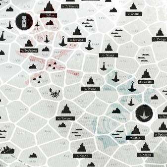

2\. Караван (см. стр. XX), d6 (6) хогов начального (п3) класса + d6 (5) канонерок (п2у1).\
3. Плавучий посёлок (п50у3, см. стр. XX), куда-то плывёт.\
4. Промысловый тягун (п4), промышляет морскую живность.\
5. Какая-то флорафауна (+d6 деталей).\
6. Одинокий хог d6 (5, п8) класса (+d6 деталей).\
7. Корабельные огни и гудки, переговоры на торговых частотах.\
8. Рекламный щит (п5) с автоматической подсветкой (+d6 деталей).\
9. БС «Норм» (п7у4) и d6 (3) канонерок (п2у1, +d6 деталей).\
10. Шикарная прогулочная яхта (п2), громкая музыка и пьяный смех.\
11. Топовоз (п10), куда-то везущий огромное количество контейнеров.\
12. Сильное течение незаметно меняет ваш курс в +d6 сторону, брось по таблице ещё раз\
и определи, что произошло помимо того:

> 1‒3 — на сектор вправо,
>
> 4‒6 — на сектор влево.

#### Генератор рекламных щитов

1.  «Слушай. Иначе» – реклама новых «умных» жугбоксов ДиТо.

2.  «Каждый дом – по стандарту!» – социальная реклама Министерства.

3.  «О дивный Салайф!» – реклама кондитерской продукции.

4.  «То, что я люблю!» – реклама столовых Пищепрома.

5.  «На пределе возможного» – имиджевая реклама ДиТо.

6.  «На волне успеха!» – реклама мероприятий «Лиги куража».

<table style="width:44%;">
<colgroup>
<col style="width: 44%" />
</colgroup>
<tbody>
<tr>
<td style="text-align: left;"><strong>БС «Норм» и канонерки</strong></td>
</tr>
<tr>
<td style="text-align: left;">
1‒2. В патруле.

3‒4. На учениях.

5. На перегоне.

6. Обстреливают (+d6):

1‒3. …взрослого моровика,

4‒5. …крупного корпусника,

6. …плавучий мусор
</td>
</tr>
</tbody>
</table>

<table>
<tbody>
<tr>
<td style="text-align: left;"><strong>Одинокий «Норм»</strong></td>
</tr>
<tr>
<td style="text-align: left;">
1‒2. В патруле.

3‒4. Досматривает какое-то судно.

5. На ремонте в полевых условиях.

6. Преследует (+d6):

1‒3. …какую-то яхту,

4‒6. …какой-то хог
</td>
</tr>
</tbody>
</table>

<table style="width:44%;">
<colgroup>
<col style="width: 44%" />
</colgroup>
<tbody>
<tr>
<td style="text-align: left;"><strong>Одинокий хог</strong></td>
</tr>
<tr>
<td style="text-align: left;">
1‒4. Плывёт по своим делам.

5. Стоит на якоре.

6. На ремонте в полевых условиях
</td>
</tr>
</tbody>
</table>

<table style="width:54%;">
<colgroup>
<col style="width: 54%" />
</colgroup>
<tbody>
<tr>
<td style="text-align: left;"><strong>Морская живность</strong></td>
</tr>
<tr>
<td style="text-align: left;"><ol type="1">
<li>
Бескрайнее поле мячницы.
</li>
<li>
Стаи пышнявок.
</li>
<li>
Полчища стрекалок.
</li>
<li>
2d6 (5) долмаров преследуют 4d6 (21) усих.
</li>
<li>
d6 × 100 (100) мигрирующих зуд.
</li>
<li>
🚨 Голодный спрудж
</li>
</ol></td>
</tr>
</tbody>
</table>

### \

### 3d6 \| Дальние странствия Светличный путь и Кольцо Такоры

> **ИЛЛЮСТРАЦИЯ: МЯТАЯ Ч/Б-КАРТА С ПОМЕТКАМИ И РЕКЛАМКОЙ СТОЛОВКИ**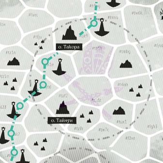
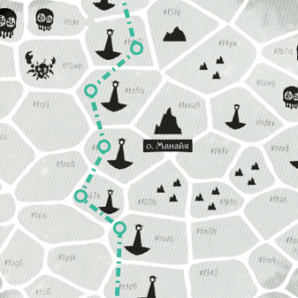

3\. Пиратская ватага – кривоброт (п4у4) и d6 (2) брантеров (п1у1, +d6 деталей).\
4. Морское казино (п8), ярко освещено, играет громкую музыку.\
5. Сильное течение незаметно меняет ваш курс, снося на d6 в сторону, брось по таблице ещё раз и определи, что произошло помимо того:

> 1‒3 — на сектор вправо,
>
> 4‒6 — на сектор влево.

6\. Сверкающий многопалубный трассовик (п6), полный товаров и туристов.\
7. Плавучий посёлок (п50у3), куда-то плывёт по своим делам (см. стр. XX).\
8. Автоматическая топливная канистра (п15), всегда рада клиентам.\
9. Рекламный щит (п5) (+d6 деталей) с подсветкой.\
10. Корабельные огни и гудки, переговоры на торговых частотах.\
11. Одинокий хог 1-го класса (п4), куда-то плывёт по своим делам.\
12. Одинокий БС «Норм» (п7у4) (+d6 деталей).\
13. Караван (см. стр. XX) из d6 (3) хогов 1-го класса (п4).\
14. Морская закусочная (п8, d6 + d6 для названия).\
15. Караван (см. стр. XX) из d6 (2) хогов начального (п3) класса и d6 (4) канонерок (п2у1).\
16. Флотилия из d6 (5) промысловых тягунов (п4), на перегоне.\
17. Какая-то флорафауна (+d6 деталей).\
18. Густой туман, искажающий звуки и сводящий видимость в ноль.

#### Генератор рекламных щитов

1.  «Выбери удачу!» – реклама ближайшего морского казино (замени следующее событие на него).

2.  «О дивный Салайф!» – реклама кондитерской продукции.

3.  «Ешь и пей, будь веселей!» – реклама ближайшей закусочной (замени следующее событие на неё).

4.  «Рынок освобождает!» – реклама Программы поддержки вольной торговли.

5.  «Эх, сопроводим!» – реклама услуг охраны силами «Тукул Сурга».

6.  «Слушай. Иначе» – реклама новых «умных» жугбоксов ДиТо.

<table style="width:55%;">
<colgroup>
<col style="width: 23%" />
<col style="width: 31%" />
</colgroup>
<tbody>
<tr>
<td colspan="2" style="text-align: left;"><strong>d6 + d6 названий закусочных</strong></td>
</tr>
<tr>
<td style="text-align: left;">
1. Мерцающее.

2. Уютненькое.

3. Тишайшее.

4. Сытнейшее.

5. Аппетитное.

6. Путевое
</td>
<td style="text-align: left;">
1. Пристанище.

2. Едалище.

3. Приютище.

4. Укрытище.

5. Столовище.

6. Местечко
</td>
</tr>
</tbody>
</table>

<table>
<tbody>
<tr>
<td style="text-align: left;"><strong>Флорафауна</strong></td>
</tr>
<tr>
<td style="text-align: left;">1. Бескрайние скопления светковиц . 
2. 4d6 (15) долмаров преследуют d6 × 100 (200) усих. 
3. 4d6 × 100 (400) мигрирующих зуд. 
4. 4d6 × 100 (1 700) шарошипов. 
5. 🚨 Любопытная пучеглазка. 
6. Престарелая за́рница</td>
</tr>
</tbody>
</table>

<table style="width:62%;">
<colgroup>
<col style="width: 61%" />
</colgroup>
<tbody>
<tr>
<td style="text-align: left;"><strong>Одинокий «Норм»</strong></td>
</tr>
<tr>
<td style="text-align: left;">
1‒2. В патруле.

3‒4. Досматривает какое-то судно.

5. На ремонте в полевых условиях.

6. Преследует (+d6):

1‒2. …какую-то яхту (п2);

3‒5. …какой-то хог (п3);

6. …пиратский клуп (п2у2)
</td>
</tr>
</tbody>
</table>

<table>
<tbody>
<tr>
<td style="text-align: left;"><strong>Пиратская ватага</strong></td>
</tr>
<tr>
<td style="text-align: left;">
1‒2. 🚨 В засаде, с выключенными огнями.

3‒4. Преследует какой-то хог (п3).

5‒6. Сражается с d6 (6) канонерками (п1у1)
</td>
</tr>
</tbody>
</table>

### 3d6 \| Островок порядка Сурга Луар

> **ИЛЛЮСТРАЦИЯ: МЯТАЯ Ч/Б-КАРТА С ПОМЕТКАМИ И ШТАМПИКОМ СУРГИ**

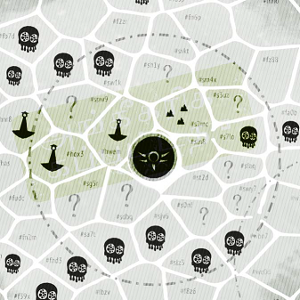

3\. 🚨 Очень дерзкая пиратская ватага (+d6 деталей).

4\. Автоматическая топливная канистра (п15) всегда рада клиентам.\
5. Караван (см. стр. XX) из d6 (6) хогов начального (п3) класса и d6 (4) канонерок (п2у1).\
6. d6 (3) канонерок (п2у1) Сурги на боевом патрулировании.\
7. Следы сражения и плавучие обломки.\
8. Понтонный остров (+d6 деталей) и 2d6 (7) канонерок (п2у1).\
9. d6 (4) подозрительных БС «Норм» (п7у4) на патрулировании.\
10. Рекламный щит (п5) (+d6 деталей) с подсветкой.\
11. Корабельные огни и гудки, переговоры на торговых частотах.\
12. Одинокий (и подозрительный) хог начального (п3) класса.\
13. Караван (см. стр. XX) из 2d6 (5) грузопассажирских хогов d6 (2-го, п5) класса.

14\. БС «Норм» (п7у4) и d6 (4) канонерок (п2у1) на патрулировании.\
15. Промысловый тягун (п4), промышляет морскую живность.\
16. Эскадра (+d6 деталей) из 2d6 (9) канонерок (п2у1), d6 (2) «Норм»-ов (п7у4) и БС «Бегемон» (п25у7).\
17. Какая-то флорафауна (+d6 деталей).\
12. Сильное течение незаметно меняет ваш курс, снося на d6 в сторону, брось по таблице ещё раз и определи, что произошло помимо того:

> 1‒3 — на сектор вправо,
>
> 4‒6 — на сектор влево.

#### Генератор рекламных щитов

1.  «Слушай. Иначе» – реклама новых «умных» жугбоксов «ДиТо».

2.  «Работаем – значит, побеждаем!» – социальная реклама Сурга Луар.

3.  «Трудности временны. Гордость вечна» – социальная реклама Сурга Луар.

4.  «Болтун – находка для пирата» – социальная реклама Сурга Луар.

5.  «Ты не одна. Мы вместе!» – социальная реклама Сурга Луар.

6.  «Мамат смотрит!» – социальная реклама Сурга Луар.

<table style="width:40%;">
<colgroup>
<col style="width: 39%" />
</colgroup>
<tbody>
<tr>
<td style="text-align: left;"><strong>Понтонный остров</strong></td>
</tr>
<tr>
<td style="text-align: left;">
1. Свечной заводик.

2. Ремонтная база.

3. Пост наблюдения.

4. Военные склады.

5. Спорт-арена.

6. Тюрьма
</td>
</tr>
</tbody>
</table>

<table>
<tbody>
<tr>
<td style="text-align: left;"><strong>Флорафауна</strong></td>
</tr>
<tr>
<td style="text-align: left;">1. Стаи светковиц. 
2. Скопления стрекалок. 
3. 4d6 × 100 (1 500) пырехватов. 
4. 🚨 d6 (2) бодоков. 
5. 🚨 Крупный студенец. 
6. Паровановый плывун</td>
</tr>
</tbody>
</table>

<table>
<tbody>
<tr>
<td style="text-align: left;"><strong>Эскадра Сурги</strong></td>
</tr>
<tr>
<td style="text-align: left;">
1‒2. В патруле.

3‒4. На учениях.

5‒6. На перегоне
</td>
</tr>
</tbody>
</table>

<table style="width:59%;">
<colgroup>
<col style="width: 58%" />
</colgroup>
<tbody>
<tr>
<td style="text-align: left;"><strong>Пиратская ватага</strong></td>
</tr>
<tr>
<td style="text-align: left;">1‒2. Кривоброт (п4у4) и d6 (3) брантеров (п1у1). 
3‒4. Кривоброт (п4у4) и d6 (5) клупов (п2у2). 
5. d6 (3) кривобротов (п4у4). 
6. Обломки, горящее топливо, тонущий кривоброт</td>
</tr>
</tbody>
</table>

### 4d6 \| Необъявленная война Спорные территории

> **ИЛЛЮСТРАЦИЯ: МЯТАЯ Ч/Б-КАРТА С ПОМЕТКАМИ, ОПАЛИНАМИ, ТЁМНЫМИ БРЫЗГАМИ**

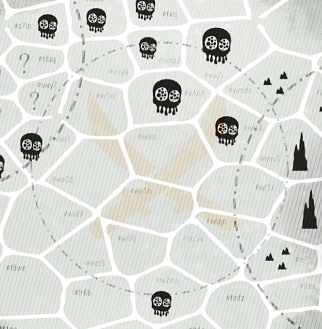

4\. Блуждающие светляки, издающие звуки, похожие то на плач, то на стоны.\
5. Сильное течение незаметно меняет ваш курс, снося на d6 в сторону, брось по таблице ещё раз и определи, что произошло помимо того:

> 1‒3 — на сектор вправо,
>
> 4‒6 — на сектор влево.

6\. 🚨 После боя, Сурга Луар (d6 деталей, см.ниже).\
7. 🚨 Рейд, 3d6 (9) кривобротов (п4у4) и 2d6 (3) клупов (п2у2).\
8. Выжившие в дрейфе – гребка (п1) с 2d6 (8) пиратами.\
9. 🚨 Морское сражение (d6 + d6 деталей).

10\. 🚨Противокорабельные заграждения.\
11. Хог d6-го (3, п6) класса, улепётывает к границе региона.\
12. 🚨 Недобитки, тонущий кривоброт (п4у4) и d6 (1) потрёпанных клупов (п2у2).\
13. Обломки кораблей, тонущий груз, следы недавнего боя.\
14. Далёкие всполохи и рокот стрельбы, неразборчивая ругань в эфире.\
15. Густой туман, искажающий звуки и сводящий видимость в ноль.\
16. 🚨 Патруль из 3d6 (17) БС «Норм» (п7у4) и 4d6 (14) канонерок (п2у1).\
17. Кансейский хог d6-го (3, п6) класса, идёт к Лабиринту.\
18. 🚨 Обширное минное поле.\
19. Какая-то флорафауна (+d6 деталей).\
20. Выжившие, катер (п1) с 2d6 (6) моряками Сурги, в дрейфе.\
21. Караван (см. стр. XX), d6 (5) хогов 2-го (п6) класса, d6 (3) канонерок (п2у1) и БС «Норм» (п7у4).\
22. 🚨 После боя, Костегрыз (+d6 деталей).\
23. 🚨 Чей-то слухобой (п10у2), и он вам не рад.\
24. Тайный сговор – кривоброт (п4у4) и БС «Норм» (п7у4), мирно, бок о бок.

<table style="width:42%;">
<colgroup>
<col style="width: 41%" />
</colgroup>
<tbody>
<tr>
<td rowspan="2" style="text-align: left;"><strong>Флорафауна</strong></td>
</tr>
<tr>
</tr>
<tr>
<td style="text-align: left;">1. 🚨 Раненый корпусник. 
2. Паровановый плывун. 
3. 🚨 d6 × 1 000 (6 000) шарошипов. 
4. 🚨 2d6 моровиков. 
5‒6. 🚨 Полчища ржавок</td>
</tr>
</tbody>
</table>

<table style="width:82%;">
<colgroup>
<col style="width: 82%" />
</colgroup>
<tbody>
<tr>
<td rowspan="2" style="text-align: left;"><strong>После боя, Костегрыз</strong></td>
</tr>
<tr>
</tr>
<tr>
<td style="text-align: left;">
1‒2. Экипажи d6 (4) клупов (п2у2) соревнуются в стрельбе по выжившим с тонущего «Норм»-а.

3‒4. Экипаж кривоброта (п4у4) с шутеечками и мегафоном выгуливает по доске пленных.

5‒6. Экипажи d6 (5) кривобротов (п4у4) грабят подбитый хог d6 (1) класса
</td>
</tr>
</tbody>
</table>

<table>
<tbody>
<tr>
<td rowspan="2" style="text-align: left;"><strong>После боя, Сурга</strong></td>
</tr>
<tr>
</tr>
<tr>
<td style="text-align: left;">
1‒2. Экипажи d6 (2) канонерок (п2у1) сжигают пиратский клуп вместе с примотанной к поручням командой.

3‒4. Экипаж канонерки играет с пленными в «есть один стул…»

5‒6. Капитан БС «Норм» (п7у4) в мегафон рассказывает идущему на дно кривоброту о сравнительных радостях смерти от утопления
</td>
</tr>
</tbody>
</table>

<table>
<colgroup>
<col style="width: 63%" />
<col style="width: 36%" />
</colgroup>
<tbody>
<tr>
<td colspan="2" style="text-align: left;"><strong>Морское сражение</strong></td>
</tr>
<tr>
<td style="text-align: left;"><strong>Сторона Костегрыза</strong></td>
<td style="text-align: left;"><strong>Сторона Сурги</strong></td>
</tr>
<tr>
<td style="text-align: left;">
1‒3. Кривоброт (п4у4) и d6 (4) клупов (п2у2).

4. d6 (3) кривобротов (п4у4), 3d6 (12) клупов (п2у2) и 6d6 (21) брантеров.

5. d6 клупов (п2у2) и d6 × 10 (20) брантеров.

6. 2d6 (6) кривобротов (п4у4), 4d6 (19) клупов (п2у2) и переоборудованный в плавучую орудийную батарею топовоз «Моря и воли!» (п20у50)
</td>
<td style="text-align: left;">
1. 2d6 (8) канонерок (п2у1).

2‒3. «Норм» (п7у4) и d6 (4) канонерок (п2у1).

4. 2d6 (3) «Норм»-ов (п7у4).

5. 2d6 (7) канонерок (п2у1), d6 (5) «Норм»-ов (п7у4) и «Бегемон» (п25у7).

6. 4d6

(11) канонерок (п2у1) и плавучая крепость «Адмирал Джай Сур» (п100у15)
</td>
</tr>
</tbody>
</table>

### \

### 3d6 \| Пиратская утопия Костяной лабиринт

> **ИЛЛЮСТРАЦИЯ: МЯТАЯ Ч/Б-КАРТА С ПОМЕТКАМИ, ПОРВАННАЯ И С ОЗОРНЫМ РИСУНКОМ**

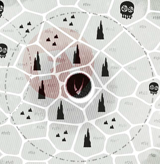

3\. d6 пиратов-изгнанников на украшенной ругательствами вёсельной гребке (п1).

4\. Корабельная дуэль двух клупов (п2у2) и d6 (5) хогов начального (п3) класса, полных зрителей.\
5. Караван (см. стр. XX) из 2d6 (9) хогов d6-го (3, п5) класса под охраной из d6 (6) клупов (п2у2) идёт на Фронтир.\
6. Караван из d6 (3) хогов первого класса идёт на Олъм Нде.\
7. Морское казино (п8), ярко освещено, музыка и выстрелы в воздух.

8\. Одинокий кривоброт (п4у4) (+d6 деталей).\
9. Одинокий хог d6-го (5, п8) класса,идёт на Кансе Ткути.

10\. Рекламный щит (п5) со следами вандализма (+d6 деталей).\
11. Корабельные огни и гудки, музыка и весёлая перебранка на торговых частотах.\
12. Пиратская ватага (+d6 деталей) из кривоброта (п4у4) и d6 (6) клупов (п2у2).\
13. Полузатопленная яхта (п2) со следами вандализма и недавней оргии.

14\. Обломки на волнах, следы недавнего боя.\
15. Корабельная мастерская (п8), всегда рада клиентам.\
16. Мародёрская ватага из 6d6 (22) клупов (п2у2), идёт на Бэттн (см. стр. XX).\
17. Какая-то флорафауна (+d6 деталей).\
18. Хог 5-го (п8) класса тащит на разбор проржавевшую плавучую крепость.

#### Генератор рекламных щитов

7.  «Вещественные радости» – фармацевтика от местных производителей.

8.  «Договор – это свобода!» – политическая агитация «Костяного пакта».

9.  «Кто не рискует – тот гребёт!» – реклама ближайшего морского казино (замени следующее событие на него).

10. «Страховка жизни, здоровья, имущества» – реклама услуг охраны.

11. «Твоё тело – наше дело» – реклама биржи долгосрочной аренды.

<table>
<tbody>
<tr>
<td style="text-align: left;"><strong>Флорафауна</strong></td>
</tr>
<tr>
<td style="text-align: left;">1. Одинокий долмар. 
2. 🚨 4d6 (12) клощтов. 
3. d6 × 100 (500) корр. 
4. d6 × 10 (30) пырехватов. 
5. 🚨 6d6 (22) голодных спруджей. 
6. 🚨 Заплутавший бодок</td>
</tr>
</tbody>
</table>

<table style="width:50%;">
<colgroup>
<col style="width: 50%" />
</colgroup>
<tbody>
<tr>
<td style="text-align: left;"><strong>Одинокий кривоброт (п4у4)</strong></td>
</tr>
<tr>
<td style="text-align: left;">
1‒2. Вовсю гуляет, слышны пьяные песни.

3‒4. Идёт к границе региона.

5. Латает пробитый корпус. 
6. 🚨 В засаде
</td>
</tr>
</tbody>
</table>

<table>
<tbody>
<tr>
<td style="text-align: left;"><strong>Пиратская ватага</strong></td>
</tr>
<tr>
<td style="text-align: left;">1‒2. 🚨 Охотится на коммерсантов. 
3‒4. Идёт к границе региона. 
6. Сражается друг с другом</td>
</tr>
</tbody>
</table>

### 4d6 \| В неизвестность Внутренний фронтир

> **ИЛЛЮСТРАЦИЯ: МЯТАЯ Ч/Б-КАРТА С ПОМЕТКАМИ, СТРЕЛКАМИ, КРУЖКАМИ, ВОПРОСИТЕЛЬНЫМИ ЗНАКАМИ**

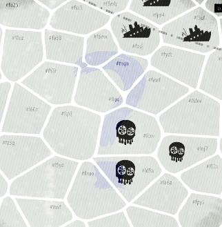

4\. Древняя станция батисфер, ведущая к подводным хумтским развалинам.

5\. Раздутая и гниющая туша неизвестного создания размером с плавучую крепость.

6\. Одинокое судно «Э1337» (п6у2) всплыло набрать воздуха и осмотреться.

7\. Караван (см. стр. XX) из 2d6 (8) хогов 2-го (п4) класса, d6 (3) хогов 3-го (п5) класса, конвоя из 2d6 (7) канонерок (п2у1) и d6 (2) «Норм»-ов (п7у4).

8\. Густой туман, искажающий звуки и сводящий видимость в ноль.

9\. Внезапные рифы и отмели. Движение дальше рискованно.

10\. Пираты на промысле (+2d6 деталей).

11\. Караван из d6 (1) хогов первого (п4) класса и конвой из d6 (4) канонерок (п2у1).

12\. Какая-то флорафауна (+d6 деталей).

13\. Призрачные огни и далёкие гудки, безумное бормотание на торговых частотах.

14\. Одинокий хог начального (п3) класса (+d6 деталей).

15\. Флотилия из d6 (2) промысловых тягунов (п4) преследует 4d6 × 1000 (170 000) зуд.

16\. Обломки кораблей, тонущие товары, следы недавней трагедии.

17\. Сильное течение незаметно меняет ваш курс, в +d6 сторону, брось по таблице ещё раз и определи, что произошло помимо того:

> 1‒3 — на сектор вправо,
>
> 4‒6 — на сектор влево.

18\. Заброшенная плавучая крепость (п100) в дрейфе (+d6 деталей).

19\. Гребка (п1) с 2d6 (9) диковатыми мореходами и некоторым количеством окровавленной одежды, в дрейфе.

20\. Густой туман, вызвывающий головокружение и фантомные боли.

21\. Ожесточённое противостояние (+d6 + d6 деталей).

22\. Спецсудно «Йарват» (п3у3) всплыло набрать воздуха и осмотреться.

23\. Патруль из d6 (3) канонерок (п2у1) и БС «Норм» (п7у4).

24\. Неизвестный ранее остров (брось по таблице на стр. XX или используй конструктор со стр. XX).

<table style="width:44%;">
<colgroup>
<col style="width: 43%" />
</colgroup>
<tbody>
<tr>
<td style="text-align: left;"><strong>Флорафауна</strong></td>
</tr>
<tr>
<td rowspan="2" style="text-align: left;">
2. 🚨 Крупный студенец.

3. 🚨 d6 (2) любопытных пучеглазок.

4. 🚨 4d6 (7) спруджей в период гона.

5. 🚨 d6 × 1 000 (2 000) шарошипов.

6. Огромный паровановый плывун.

7. Крупная за́рница.

8. 🚨 Полчища ржавок.

9. 🚨 2d6 (8) моровиков.

10. 🚨 2d6 (10) бодоков.

11. 🚨 Крупный корпусник.

12. 🚨 Глокая собность
</td>
</tr>
<tr>
</tr>
</tbody>
</table>

<table>
<colgroup>
<col style="width: 46%" />
<col style="width: 53%" />
</colgroup>
<tbody>
<tr>
<td colspan="2" style="text-align: left;"><strong>Ожесточённое противостояние</strong></td>
</tr>
<tr>
<td style="text-align: left;"><strong>Сторона А</strong></td>
<td style="text-align: left;"><strong>Сторона Б</strong></td>
</tr>
<tr>
<td style="text-align: left;">
1‒2. Одинокий хог d6 (2-го, п5) класса.

3. Кривоброт (п4у4) и d6 (1) клупов (п2у2).

4. 4d6 (16) слухобоев (п10, у2).

5. Плавучий посёлок (п50у3).

6. Непомерно огромный полоз
</td>
<td style="text-align: left;">
1. БС «Норм» (п7у4).

2. 4d6 (22) клупов (п2у2).

3. Одинокий хог d6-го (3) класса.

4. «Умное» минное поле (уd6, 4).

5. Вака-туа (п2) с тремя десятками пассажирок.

6. Титанический (у6) белый корпусник
</td>
</tr>
</tbody>
</table>

<table>
<tbody>
<tr>
<td style="text-align: left;"><strong>Пираты на промысле</strong></td>
</tr>
<tr>
<td rowspan="2" style="text-align: left;">1‒2. Одинокий клуп (п2у2). 
3‒4. Одинокий кривоброт (п4у4). 
5. d6 (4) клупов. 
6. Кривоброт и d6 (1) клупов</td>
</tr>
<tr>
</tr>
</tbody>
</table>

### ### \

#### Одинокий хог

1‒3. Общителен, хочет поторговать и обменяться информацией.

4\. Повреждён, на якоре и на ремонте, несёт следы недавнего боя.

5\. Заброшен и выглядит так, будто его экипаж просто вышел покурить.

6\. Заражён какими-то паразитами и отчаянно сигналит «Не приближаться!»

##### Плавучая крепость

1‒3. Населена тепелли, коррами, клощтами и щелканами, заросла нозочками и отрешками (стр. XX, XX, XX, XX, XX и XX), наполнена полусгнившим хламом, в целом безвредна.

4\. Каким-то образом прекрасно сохранилась и если бы не лёгкие следы износа, выглядела бы нетронутой временем. Населена блазнями (стр. XX).

5\. 🚨 Приплыла откуда-то из Ржавого пояса (стр. XX) и населена каннибалами.

6\. Служит домом для крупной колонии маклаков (стр. XX).

##### Генератор названий пиратских банд и ватаг

<table>
<colgroup>
<col style="width: 50%" />
<col style="width: 50%" />
</colgroup>
<tbody>
<tr>
<td style="text-align: left;">4d6 прилагательных</td>
<td style="text-align: left;">4d6 существительных</td>
</tr>
<tr>
<td style="text-align: left;">
4. Лютые

5. Кровавые

6. Тагатовые

7. Весёлые

8. Токсичные

9. Шумные

10. Дерзкие

11. Поганые

12. Железные

13. Жёсткие

14. Лихие

15. Кровавые

16. Дикие

17. Тяжкие

18. Тёртые

19. Горластые

20. Ссыльные

21. Гнилые

22. Ровные

23. Резкие

24. Вежливые
</td>
<td style="text-align: left;">
4. Музыканты

5. Циркачи

6. Освободители

7. Топленники

8. Мстители

9. Костоломы

10. Клацы

11. Решалы

12. Шершаки

13. Расчленители

14. Изуверы

15. Ловчие

16. Головорезы

17. Коллекторы

18. Налётчики

19. Реквизиторы

20. Отщепенцы

21. Распускатели

22. Оружейники

23. Технари

24. Барахольщики
</td>
</tr>
</tbody>
</table>

### Примеры создания путевых происшествий

Несколько коротких образцов, демонстрирующих как разные области, так и разные подходы в работе с предлагаемыми нами таблицами.

#### Дом, милый дом

Закупившись припасами и местными излишками производства, взяв несколько контрактов на грузоперевозки, поискав и заманив на борт попутных пассажиров (см. стр. XX, XX и XX, соответственно), а также составив маршрутный лист – показав на карте куда и через какие секторы хотят плыть, экипаж «Бежетки» говорит: «Всё, готовы отчаливать».

Услышав это, ведущая открывает свой заранее заготовленный список «сектор за сектором» (см. выше) и видит, что его следующий не потраченный пункт это «корабельные огни и гудки, переговоры на торговых частотах». После этого она включает путевой саундтрек ([https://www.youtube.com/watch?v=_IPMvOyjHT8](https://www.youtube.com/watch?v=_IPMvOyjHT8)), делает мечтательное лицо и нуарным тоном зачитывает так же заранее подготовленное через какого-то из GPT-ассистентов описание: *«В течение этой вахты корабельные огни вдалеке мигали, как заторможенные мысли уставшего навигатора – редкие, размеренные, чужие. Далёкие гудки лениво перекликались, будто проверяя: всё ли на месте, всё ли по расписанию. Сквозь шелест волн в эфире тянулись спокойные будничные переговоры – кто-то обсуждал цены на пеплосоль, кто-то предлагал гарпуны и промысловые снасти б/у, кто-то просил уточнить срок действия квитанций на швартовку в Глоккре. Время текло, как заваренный чай в старой кружке: терпко, медленно, по уставу».*

Игроки в ответ выражают надежду, что хотя бы треть пути будет такой же спокойной. Пока они учитывают и записывают затраты путевых расходников, ведущая вычёркивает из своего списка пункт «корабельные огни и гудки…», чтобы перейти к следующему – «шикарная прогулочная яхта, громкая музыка и пьяный смех». Она нажимает соответствующую кнопку на своём микшерском пульте и, наложив поверх путевой дорожки заранее заготовленные звуки ([https://www.youtube.com/watch?v=E26RNN6sKW0](https://www.youtube.com/watch?v=E26RNN6sKW0)) этого самого смеха, с озорным видом зачитывает очередное GPT-описание: *«В какой-то момент вдалеке, как рекламная мечта, возникает шикарная прогулочная яхта – с лакированными бортами, переливами гирлянд и музыкой, запущенной как минимум вдвое громче, чем позволяет вежливость. Звуки джеза из её недр льются жирно и самоуверенно, как подлива из блюда от шеф-повара претенциозного ресторана. Смех, пьяный и беспардонный, заполняет пространство вокруг, а по волнам эфира несётся игривое бормотание какой-то барышни, видимо споившей радиста – то ли призыв, то ли предупреждение. Яхта идёт на Корару – медленно, как будто позируя, не зная стыда, не ведая расписаний, с полной уверенностью, что море принадлежит ей по праву или хотя бы взято в аренду на время чьего-то юбилея».*

После короткого препирательства с группой, Джамиля от лица своего персонажа-капитана сообщает, что он «расслабляет галстук, утирает лоб и, с лёгкой тоской (а также FOMO – прим. тех. ред.) глядя на яхту, продолжает движение по маршруту». «А я в это время флиртую с барышней по радио!» – заявляет Светлана от лица своего доктора Билфы.

Повторяется подсчёт путевых затрат, игроки отмечают накопившуюся смуту, ведущая вычёркивает пункт с яхтой, смотрит на следующий и видит запись «Сильное течение незаметно меняет ваш курс, в +d6 сторону, брось по таблице ещё раз и определи, что произошло помимо того». Добросив d6 (2) и определив отклонение вектора движения как «на сектор вправо», она переходит к следующей строке списка «Рекламный щит (п5) с автоматической подсветкой (+d6 деталей)», для которого заранее определила, что это «”На пределе возможного” – имиджевая реклама ДиТо» и зачитывает: «*В какой-то момент вахты* *в переливчатой морской дымке и отблесках волн внезапно вспыхнул прямоугольник – сам по себе, будто подсвеченный изнутри. Автоматика рекламного щита лениво ожила, с треском и шуршанием запуская сквозь динамики торжественную мелодию, а поверх плёночного экрана высветились безупречные шрифтовые контуры: «НА ПРЕДЕЛЕ ВОЗМОЖНОГО». Под ними – строгий логотип Диллингем Торг, как удар по столу. Ни конкретного предложения, ни рекламы товара – только волны, прокатывающиеся мимо этой заякоренной конструкции, и ощущение, что она за вами тоже наблюдает, фиксируя поведение, записывая метрики и тихо шурша проволокой шоринофона. Щит не предлагает и не убеждает – он просто знает, что где-то в глубине души вы уже купились*».

Информацию про отклонение от курса ведущая, конечно же, не озвучивает – этот факт позднее будет так или иначе обнаружен экипажем самостоятельно.

#### Строго по трассе

В какой-то момент владельцы «Бежетки» решают отправиться в дальний рейс – пройти по Светличному пути до Манайи и свернуть оттуда на Сургу, чтобы доставить какую-то мульку какому-то богатею, попутно покупая, продавая и всяко развлекаясь.

Как только они в секторе \#hfu3 – почти сразу после о. Похуту – пересекают условную границу Ва'ро Рохе, ведущая смотрит на соответствующую таблицу «Дальние странствия», бросает 3d6 (13) и получает результат «Караван из d6 (3) хогов 1-го класса». Эта ведущая, в отличие от предыдущей, брезгует GPT-генерацией, да и в целом не любит рассусоливать художку, так что просто говорит: «Вдали вы видите караван из трёх хогов первого класса (почти как ваш, но на один повыше). Плывут по своим делам, вы им неинтересны». После короткого обсуждения группа решает, что «ну, раз им не интересно, то и нам не надо… цацы какие… бегать, что ли, теперь за ними?» А затем от лица капитанки Билфы заявляют: «Нахер этих козлов, плывём дальше». И караван с «Бежеткой» расходятся… как в море корабли.

Новая вахта, новый бросок по таблице – 3d6 (8) – означает, что игроки встретятся с «Автоматическая топливная канистра, всегда рада клиентам». С лицом ~~просящим кружки с чаем~~ снизошедшего до смертных бога ведущая сообщает игрокам: «Через 5 склянок от начала вахты вдали вы видите купол и габаритные огни топливной канистры. Это автоматическая заправочная станция. На данный момент её док свободен». Игроки решают, что путь предстоит далёкий, потому дополнительный запас топлива не будет лишним. «Бежетка» останавливается на дозаправку, а затем плывёт дальше.

Бросок в начале очередной вахты – 3d6 (17) – говорит «Какая-то флорафауна (+d6 деталей)», а ещё +d6 (3) уточняет, что это – «4d6 × 100 (1 200) мигрирующих зуд». Откидавшись и скорчив хитрую рожу, ведущая произносит: «Через склянку или две в море неподалёку вы видите выпрыгивающее из тумана множество зуд. Они явно хорошо кушали и в них много вкусного мяса». Возникшие у некоторых игроков мысли о том, чтобы заняться фуражировкой (см. стр. XX) и выловить несколько… десятков склизких тварей, чтобы разнообразить питание, пресекает многоопытная Светлана-Билфа: «Не-е-ет, мы игнорируем их и плывём дальше! А я (и твой персонаж, Вася, ага?) долго смотрим зудам вслед, задумчиво почёсываясь».

#### Глушь и дичь

После множества скитаний и разнообразных приключений, пережив немало опасностей и ужасов, в одну туманную и не предвещающего ничего хорошего вахту «Бежетка» оказывается на печально известных среди мореходов территориях Внутреннего фронтира.

Ведущая приглушает верхний свет до минимума, запускает любимую подборку от Cryo Chamber [https://www.youtube.com/@cryochamberlabel](https://www.youtube.com/@cryochamberlabel), незаметно включает толково отстроенную, снабжённую блоком охлаждения дым-машину и короткофокусный проектор за спинкой своего кресла, а затем открывает на ноутбуке документ региональной таблицы со множеством каких-то эзотерических заметок. «Итак… – говорит она, многозначительно оглядывая игроков. – Почти сразу после пересечения незримой границы этих диких и зловещих пространств, вы обнаруживаете неподалёку… Затем следует пауза, а за изрисованной зловещими (и тускло светящимися в полумраке) хумтскими символами ширмой слышатся звуки катящихся по столу 4d6 (17). Игроки переглядываются. «Вы обнаруживаете неподалёку… – повторяет ведущая, забивая в Sora [https://sora.chatgpt.com](https://sora.chatgpt.com) «Обломки кораблей, тонущие товары, следы недавней трагедии. Mood видео. Готично. Пугающе. Реалистичное», – … непроизвольно вызывающее у вас тревогу, тоску и самые дурные предчувствия…» Кружок прогресса в Sora наконец-то доползает до 100% и ведущая отправляет на проектор полученное видео: «…множество обломков корабельных корпусов, полузатонувших грузовых контейнеров и бочонков, колышущихся на волнах. Следы недавней трагедии. Наверняка это работа местных головорезов, таящихся во тьме и охотящихся на таких, как вы. Нигде не видно каких-либо выживших. А сами обломки уже разносятся течениями и скоро здесь не останется и следа от тех людей, что как и вы куда-то плыли, к чему-то стремились и считали, что смогут обуздать сам Фронтир своими амбициями. Что же, дамы и господа, с их стороны это было очень, очень самонадеянно».

На этом моменте [Kolhoosi 13](https://www.youtube.com/watch?v=Gt7E2gfwlc8&pp=ygUPQ3J5byBDYW1iZXIgc2Vh) [https://www.youtube.com/watch?v=Gt7E2gfwlc8](https://www.youtube.com/watch?v=Gt7E2gfwlc8) в колонках издаёт какой-то особенно зловещий скрип, а дымка начинает, медленно рассеиваясь, подниматься из-под стола. Джамиля нервно включает зелёную настольную лампу. Игроки переглядываются. «Ну, мы…» – начинает Василий, который сегодня за капитана. «Мы о-о-о-очень осторожно», – добавляет Светлана. «… Мы хотим осмотреть это место на предмет чего-нибудь полезного. И следов того, кто это сделал. И чтобы понять, куда они уплыли».

«Хорошо. Очень хорошо, – как-то по-особому поджав губы, улыбается ведущая, и делая броски по таблице ходовых товаров, добавляет: – Среди стремительно тонущих ящиков вы находите… (d150, 65) некоторое количество (4d6, 10)… десять стаунтов тонких компонентов для производства и ремонта различной электроники, общей стоимостью в двенадцать тысяч, четыреста и сорок огневиц. Помимо того вам удаётся выудить из моря (d150, 74)... какие-то официальные бланки в количестве (4d6, 14) полутора десятков мер, что куда меньшая сумма – всего тысяча, шестьсот и восемьдесят огневиц. А ещё… – здесь ведущей надоедает возня с мелочёвкой, так что она решает добавить что-нибудь более живописное, что-нибудь из «Диковинок Укрытого моря» и бросает d100 (36) – … в инкрустированном перламутром и почти ушедшем на дно, но чудом выловленном вашим пролом сундучке вы обнаруживаете таинственное металлическое яйцо с тончайшей орнаментальной гравировкой и небольшой выемкой снизу. Его назначение вам не ясно, но прикасаясь к нему, можно ощутить лёгкое успокаивающее покалывание, будто этот артефакт каким-то образом взаимодействует с вашим телом. На этом находки заканчиваются, так как все остальные товары окончательно скрываются в глубинах моря. Будто и не было их. Будто те, кто ими владел, никогда и не жили. Будто сами их имена и желания были стёрты безжалостным Фронтиром из книги судеб.»

«Эээ, ладно… – говорит Василий. – Значит, мы заработали 14 120 огневиц и нашли какое-то яйцо. Девчонки, есть идеи – что это?» Светлана задумчиво смотрит на всё повторяющееся и повторяющееся в дымке видео с проектора, тоже зажигает настольную лампу, а затем высказывает веское мнение: «Эту штуку мы ещё поизучаем. Потом. А пока, похоже, у нас есть проблемы посерьёзней – кто-то неподалёку охотится на морских торговцев». И ещё четверть часа после этого у игроков уходит на пропитанные паранойей споры о том, надо ли менять маршрут, не повернуть ли обратно, почему все такие самоубийцы и не засунуть ли кому-нибудь куда-нибудь это самое яйцо. А потом «Бежетка» отправляется дальше, из осторожности погасив все огни.

Ведущая окончательно выключает верхний свет. Теперь кроме проектора помещение освещено только тусклым торшером и двумя настольными лампами. Из утонувшей в тенях квадро-системы слышатся неуютные звуки God Body Disconnect [https://www.youtube.com/watch?v=0eoo0shDkGU](https://www.youtube.com/watch?v=0eoo0shDkGU). В мире игры наступает новая вахта и ведущая продолжает: «Всё дальше углубляясь в эти мрачные просторы, вы постепенно начинаете ощущать их инаковость, их непосредственное, на уровне чувств и подсознательных тревог, отличие от тех цивилизованных, изученных вами путей, которыми вы ходили ранее… – Здесь из-за ширмы слышатся звуки дополнительных 4d6 (13), что означает «Какая-то флорафауна (+d6 деталей)». – …Этот отдельный, будто бы даже не соединённый с вашими родными пространствами мир дышит какой-то собственной, чудной и слегка пугающей жизнью… – Ещё d6 (9) даёт вариант «🚨 2d6 (6) моровиков». – …Здесь даже воздух другой, – говорит ведущая, несколько раз нажимая ногой на выключатель торшера. А затем набирает в Sora: «Огромные вонючие разлагающиеся заживо, похожие на ктулхучерепах монстры медленно плывущие к вам по морским волнам из тьмы. Пугающе. Реалистичное». Игроки переглядываются. Светлана барабанит пальцами по столу. Джамиля кутается в плед. Василий делает очень уверенное лицо, которое обычно использует, когда его «фирма» после матча оказалась в меньшинстве и без аргументов.

«Они идут. Они уже близко, – зловещим шёпотом произносит ведущая, продолжая тянуть время. – Внезапно среди этой удушающей и гнилостной атмосферы в непроглядной тьме, окружающей корабль, вы начинаете слышать тихие, но постепенно усиливающиеся звуки, говорящие о присутствии (и приближении) каких-то огромных и глухо ухающих существ». Бегунок Sora доползает до 100 и ведущая отправляет полученное непотребство на проектор, заканчивая описание: «Облако нестерпимой, чудовищной, выворачивающей наизнанку вони окутывает вас. Вы вспоминаете этот запах и понимаете: где-то совсем рядом, незримые и огромные, к вашему судну движутся ужасающие воплощения болезни и гадкой, грязной, мучительной смерти – неумолимые чумные гиганты – моровики». Контуры плывучих ктулхочерепах призраками пляшут в наполненном дымкой воздухе, подспудно напоминая о временах викторианских волшебных фонарей и прочем месмеризме.

Игроки бурно выражают свои эмоции мимикой и почти хором говорят: «Да ну нахер!», после чего заявляют, что хотели бы избежать этой тёплой (и вонючей) путевой встречи. То есть выиграть (а точнее – выкупить) навязываемую ведущей коллизию. Они выбирают цену (см. стр. XX), тратят соответствующие ресурсы, описывают, как ловко избегают опасности превращения в чумной корабль. А затем плывут дальше, ~~в безысходность и безблагодатность~~ во мрак и неизвестность Фронтира.

## Флорафауна

Этот раздел предназначен для доставки в вашу игру некоторого количества антуражных декораций – живых, дышащих, урчащих, бултыхающихся за бортом и шуршащих по кустам декораций, которые ты можешь использовать с целью большего погружения игроков в реалии нашего странного-странного мира.

Список созданий далее условно разделён на две части – одна рассказывает про обитателей Веа Туароа, которых можно встретить в открытом море в отдалении от любых берегов. А вторая – о тех, кто не настолько хорош в свободном плавании и обитает как раз на островах, рифах и отмелях.

Всего здесь представлено 10d6 видов живых существ, что, конечно, мало для полноценного описания какой-либо экосистемы. Так что всех их тебе стоит воспринимать скорее как примеры. И как руководство к самостоятельному сочинению для тех мест, где твоей группе и твоей кампании это понадобится. А подспорьем в этом деле (и в процессе наполнения плодилищ, см. стр. XX) тебе может оказаться конструктор случайных созданий, размещённый нами в конце раздела, на стр. XX.

### Применение в коллизиях

Некоторые из описанных далее существ достаточно характерны, чтобы их видовые качества могли дать +2 осложнения (см. стр. XX) в той или иной коллизии. Такие потенциально опасные (ранящие, вызывающие чесотку или психоз, заразные и т.п.) виды мы выделили в заголовках пиктограммами 😨.

Помимо того, отдельная – особо докучливая – часть фауны имеет достаточную индивидуальность, чтобы ~~лезть на рожон~~ становиться зачинщиками вынужденной коллизии (см. стр. XX) и даже наносить урон вашим судну или персонажам. Таких особо опасных (+4 осложнения) обитателей моря и грибных джунглей мы отметили значком 🚨 и снабдили указаниями, сколько поломов или ран (см. стр. XX и XX соответственно) они способны нанести в полностью или частично проваленной протагонистами коллизии.

#### 10d6 всяческой флорафауны

<table>
<colgroup>
<col style="width: 50%" />
<col style="width: 50%" />
</colgroup>
<tbody>
<tr>
<td style="text-align: left;">Открытое море</td>
<td style="text-align: left;">Острова, островки, рифы и мелководье</td>
</tr>
<tr>
<td style="text-align: left;">
10. Светковицы

11. Пышнявки

12. Пупырчатки

13. Мячницы

14. Стрекалки

15. 🚨 Шарошипы

16. Живчики

17. Синюги

18. Усихи

19. Зуды

20. Долмары

21. Пырехваты

22. 🚨 Спруджи

23. 🚨 Моровики

24. 🚨 Пучеглазки

25. 🚨 Бодоки

26. Полозы

27. 🚨 Корпусники

28. 🚨 Студенцы

29. 🚨 Собности

30. За́рницы

31. Парованы

32. 🚨 Ржавки
</td>
<td style="text-align: left;">
33. Клощты

34. Плипки

35. Отрешки

36. Нозочки

37. Буравники

38. Кусаки

39. Снычики

40. Шрапники

41. Щелканы

42. Докучи

43. Трустики

44. Корры

45. Тепелли

46. Маклаки

47. Вжарь

48. Клишки

49. Катоножки

50. Клацы

51. Выпестрени

52. Надойники

53. Блазни

54. Хлопкины

55. Могрицы

56. Воклики

57. Керветки

58. Теплики

59. Мотыльки

60. Медоносики
</td>
</tr>
</tbody>
</table>

## Открытое море

### Светковицы / Маха-наму ▶️🌊

Мельчайший светящийся планктон, придающий поверхностным слоям морского киселя Веа Туароа его знаменитую зеленовато-пурпурную опалесценцию. Встречается практически повсеместно и служит кормовой базой для доброй половины обитателей моря. Согласно естествоиспытателям, представляет собой сотни, если не тысячи разных видов крохотных рачков, фузорий, грибков и водорослей, но какое до этого дело простому мореходу? Простой мореход видит в нём только повседневную успокаивающую красоту отблесков за бортом.

Как бы то ни было, жизнь светковиц подчиняется множеству собственных циклов рождения и смерти. Часть составляющих их видов, такие как пышнявки (см. стр. XX), подрастает и начинает питаться былыми товарками. Другие же, например мячницы (стр. XX), укореняются в грунте и продолжают свой рост в прикреплённом, не мигрирующем виде.

Промышленность народов моря традиционно производит из осаждённых и отфильтрованных светковиц удобрения и ценную прикормку для скота, так что светковичные фильтрационные фабрики можно встретить у побережий многих населённых островов Союза и Кансе Ткути.

**Пища для** парованов, нозочек, отрешков, плипок, за́рницы, пышнявки, шарошипа, пупырчатки, моровика, бодока.

**Питается** морским киселём.

### Пышнявка / Н’гва-реку ▶️🌊

Овальные кусачие медузы размером с кулак, главный компонент знаменитых пышневых булок (см. стр. XX) и основной промысел для доброй половины мрежников моря (см. стр. XX). Быстро плодятся, сбиваются в крупные стаи и, находясь в нижней части пищевой пирамиды, активно поедаются множеством морских обитателей.

Наиболее удачливые (не съеденные в течение пары окт) пышнявки в самоубийственном порыве бросаются на скалы, корабли и крупных морских обитателей, чтобы оставить на них длинные клейкие ленты своих оотек. В дальнейшем из этих налипших лент пробиваются ростки новой жизни.

В традиционном хозяйстве ва’ро оотеки пышнявок используются для производства прочного клейстера, а высушенные взрослые особи вида – при выпечке знаменитых нечерствеющих пышневых булок.

**Пища для** усих, пупырчаток, за́рниц, пучеглазок.

**Питается** светковицами.

### Пупырчатки / Те’хо-роми ▶️🌊

Юркие, мягкие и приятные на ощупь плавучие звёздочки, фильтрующие морской кисель и непрерывно выделяющие из множества отверстий слизистые пузырьки. Чем мельче и младше особи, тем в больших скоплениях они встречаются и тем ближе держатся к поверхности моря. По мере разрастания пупырчатки костенеют, опускаются на дно в прибрежных зонах и остаются там лежать, производя всё более редкие и всё более крупные «выдохи». Такие потоки пены даже способны перевернуть шлюпку каких-нибудь незадачливых мореплавателей, неудачно выбравших место для высадки. Всё выпавшее из лодки в таких случаях быстро поглощается этими придонными колоссами при обратном «вдохе».

Впрочем, как раз в силу такого поведения, внутренности многих зрелых пупырчаток могут представлять любопытную коллекцию различных непереваренных металлических, каменных и стеклянных предметов. А спилы их окостеневших панцирей служат отличным строительным и декоративно-облицовочным материалом.

Взрослые пупырчатки часто служат домом для молоди зуды (см. стр. XX), которая питается отфильтрованными своим «убежищем» кусочками других животных, а также собственными выделениями быстро прекращает сопротивление поглощаемых жертв.

**Кормилица для** молоди зуды. \| **Пища для** парованов, за́рниц, снычиков, шарошипов. \| **Питается** светковицами, пышнявками, шрапниками, кусаками, тепелли.

### Мячница / Поро-те’пене ❎🌊

Слабо мерцающая водоросль с длинными, вертикально расположенными и колышущимися в морском киселе лентами. Имеет служащий поплавком и мерцающий розовым светом «мячик» на верхнем конце. Плавучие поля из таких мячиков часто встречаются в море. Их свет приманивает различных травоядных и всеядных животных. Фауна островов тоже любит полакомиться выброшенной на берег мячницей. Однако эта сладковатая и мучнистая прикормка не так уж проста – её «мячики» на самом деле не что иное, как сумка с яйцами. Из этих яиц прямо внутри пищеварительного тракта жертвы вылупляются микроскопические червячки, проникают в кровеносную систему организма-хозяина и, питаясь извлекаемыми из крови веществами, проводят в ней от трёх до семи приливов. Затем они заставляют свою жертву выброситься берег и лежать там или – в случае сухопутных созданий – пожирать камни и песок до момента смерти. Питаясь разлагающейся тушкой бывшего хозяина и отпугивая падальщиков вонючими выделениями, будущие мячницы переживают несколько линек, а затем длинными и плоскими лентами ползут обратно к морю. Чтобы отрастить на хвосте шарик-поплавок и отправиться в плавание, начав новый цикл.

Вершники народов моря традиционно используют поплавки мячницы в качестве наживки и приманки при добыче усих (стр. XX). А молодые особи клощта (см. стр. XX) любят прятаться среди её лент в ожидании новых жертв.

**Кормилица для** клощта. \| **Приживала для** всех, кто её ест.

**Пища для** катоножки, корры, трустика, щелкана, моровика, усихи. \| **Питается** морским киселём (и теми на ком паразитирует).

### Стрекалка / Кангау-тепе ▶️🌊

Порхающая под самой поверхностью моря медуза размером с блюдце, раздвоенная мантия которой переливается яркими оттенками от оранжевого до фуксии. Пара длинных щупалец стрекалки выделяется перебегающими по ним огоньками и, несмотря на кажущуюся безобидность, способна генерировать сильные электрические разряды, вызывать сбой электрических приборов, а также головные боли и даже ожоги при близком контакте.

С помощью этих щупалец сбивающиеся в огромные стаи стрекалки оглушают свою добычу – различную плавучую мелочь, а также защищаются от хищников. Ради размножения созревшие, пережившие три окты особи выворачиваются наизнанку и уходят на глубину, чтобы стать там чем-то иным, пока неизвестным науке.

В разных частях моря стрекалки имеют отличающийся узор мантии, и эти подвиды обычно не пересекаются ареалами. Зоологи пока придерживаются гипотезы, что различия в окраске могут быть связаны с составом дна, в районе которого происходит размножение особей. Однако даже это не делает стрекалку хоть в какой-то мере более полезной для человека.

**Пища для** пучеглазок, бодоков. \| **Питается** пупырчатками и светковицами.

**Конкурирует с** шарошипом и зудой.

### Шарошип / Кохуму-хуму ▶️🌊

Дрейфующее в темноте шарообразное и шипастое нечто размером с голову. Иногда снабжено «бородой» из цветных колбасок-отростков. Постоянно бормочет что-то невразумительное. Время от времени издаёт резкие вскрики, до жути похожие на чьи-то страстные стоны. Нервно реагирует на свет – начинает бормотать громче и отстреливает в окружающее пространство все шипы разом, после чего пытается уйти на глубину с воплем «Брр-бррщкреее!». Само по себе шипометание не особенно опасно для современного судна, ведь заслышав вопль, всегда можно упасть на палубу и переждать под защитой металлического борта. Проблема кроется в количестве метателей – шарошипы никогда не встречаются поодиночке, скапливаясь в огромные бормочущие поля, состоящие из сотен и тысяч особей. А их потревоженное скопление способно забросить в окружающее пространство столько игл одновременно, что все неметаллические части проходящего мимо судна будут буквально утыканы этой органической шрапнелью, как подушечка для булавок. Вдобавок ударяясь о твёрдые предметы, смертошиповы колючки-диссы имеют свойство раскалываться, уделывая всё вокруг какой-то липкой гадостью, которую бывалые мореходы традиционно называют «флавой».

Отстрелявшиеся и отловленные до ухода на дно шарошипы (или как их ещё называют – «шарошки») могут стать отличным развлечением для прольской части экипажа. Почему-то пролы находят ритмичное, состоящее из обрывков где-то услышанных и клишированных фраз бормотание шарошипа очень занимательным и воодушевляющим. Однако слава таких звёзд командного досуга проходит быстро – буквально через пару вахт средний шарошип сильно теряет в популярности, ~~уезжает не Пхукет~~ начинает заметно пованивать и затихает.

**Пища для** кусак, пырехватов, пучеглазок, спруджей, долмаров. \| **Питается** светковицами, пупырчатками, стрекалками, пышнявками.

**Конкурирует с** зудой.

### Живчик / Пуранга-кики ▶️🌊

Комок цветных щупалец и стебельковых глазок, проявляющий огромный интерес к разумным существам. Всегда размером не более кулака, живчики безобидны, бесполезны и крайне забавны. Они охотно принимают пищу из рук, повторяют простые движения и звуки. Иногда безуспешно пытаются проглотить мелкие предметы.

Жизненный цикл живчиков не до конца понятен зоологам. И, возможно, даже самим живчикам. Согласно кабацким байкам бывалых мореходов, новые особи не рождаются, не делятся и не откладываются, а... случаются. Иногда – прямо на глазах: посреди рейса, рядом с отдыхающим на корме моряком, из воздуха или брызг, из складки парусины или пустой кружки вдруг появляется живчик. Он тут же оживает, хлопает глазками и начинает проявлять дружелюбный интерес к миру. Считается, что появление живчика – добрый знак, хотя и немного тревожный: будто само море наблюдает за тобой и решило вмешаться.

Попытка забрать живчиков с собой приводит к их быстрому угасанию. Чем дальше живчик от места, где его выловили, тем пассивнее и медленнее он становится, вплоть до полной остановки жизнедеятельности. После подобной «смерти» живчиков обычно выкидывают. И они остаются лежать где-нибудь, вероятно, выполняя для мироздания некую экзистенциальную роль, детали которой нам пока не ясны.

**Приживала для** зарников.

**Пища для** корр. \| **Питается** пупырчатками.

### Синюга / Каи-кири ▶️🌊

Странное подобие цеплючего шарообразного краба размером с хлебную корзину, которого частенько можно заметить на боках крупного животного, останках морского скитальца или выступающих из моря рифах. Светится неярким синим светом, за что и получил своё название. Питается усоногими рачками-орбастателями, которых скусывает с поверхности того, на чём живёт. И этим, конечно, приносит немалую пользу своему месту обитания. Попытки приручить синюг и принудить их к очистке судовых корпусов успехов пока не достигли – по каким-то причинам эти создания не выносят прибрежные области и норовят устроить забастовку, а то и сбежать с закреплённого за ними участка работ без каких-либо уведомлений.

Молодь синюги начинает свою жизнь в виде мелких ярко-голубых капель на панцире взрослой особи. Эти капли затем отращивают жгутики и в какой-то момент отправляются в море в поисках нового дома. Где-то в процессе путешествия вокруг выживших капель образуются пластины панциря, коленчатые усы и цепкие лапки. Взрослея, детёныши синюг проходят через три стадии, одна из которых неподвижна, другая слепа, третья слишком умна, чтобы питаться, и предпочитает сразу окуклиться. Наконец, после кризиса самосепарации, а также пары линек и ряда других приключений, синюга обретает привычный всем взрослый вид, устраивается на новом месте обитания и приступает к обкусыванию наросшего.

Синюги – создания нервные, вредные и крайне вонючие, если их потревожить. Почему-то после общения с ними часто хочется бросить всё, разругаться с коллегами и отправиться домой. Из-за этого среди мореходов бытуют легенды, что каждая синюга – это душа особенно докучливого капитана какого-нибудь погибшего судна.

**Приживала для** пучеглазок, спруджей, бодоков и корпусников.

**Пища для** корр. \| **Питается** нозочками, отрешками и подобным.

**Конкурирует с** щелканами.

### Усиха / Ранги-мари ▶️🌊

Умильный, покатый и слегка нелепый заднежаберный моллюск размером с человека. Получил своё название из-за пары толстых мохнатых усов, которые использует для навигации и общения с себе подобными. Ритмично перебирая гребными складками, усихи неспешно перемещаются среди зарослей мячниц (см. стр. XX) и других водорослей, поглощая их (а также подвернувшихся пышнявок, стр. XX) в огромных количествах.

Мирные, пухлые и глуповатые моллюски судя по всему являются дальними родственниками надойных слизней (стр. XX) и часто становятся жертвами долмаров, поднявшихся к поверхности корпусников и полозов, а также крупных стай кусак (стр. XX, XX, XX и XX соответственно). Избегать или хотя бы пытаться сторониться всех этих безжалостных хищников усихам позволяет короткий цикл размножения, живорождение, стайная защитная тактика, пугливость и разноцветные облака едких светящихся чернил, которыми они отстреливаются в случае опасности.

Стараясь не приближаться к прохладным шельфовым водам, усихи, тем не менее, любят выбираться на торчащие из воды рифы и мелкие островки открытого моря, чтобы укореняться там, образуя массивные заросли бутылчатых плодовых тел. Промышленное разведение усих пока только набирает обороты, однако уже показало отличные результаты и в будущем наверняка станет крупным подспорьем сельскому хозяйству.

**Пища для** корпусников, полозов, долмаров. \| **Питается** мячницей, пышнявками, молодью снычиков.

**Конкурирует с** шарошипами и стрекалками.

### Зуда / Нуи-пати ▶️🌊😨

Некрупный – размером с бутыль ежового пойла – головоногий моллюск с тремя очень длинными, до пяти ваев в размере, плоскими щупальцами. Как правило, фиолетовый в крапинку, но легко может менять цвет в зависимости от настроения. Единственный вид, откладывающий яйца и по молодости прекрасно себя чувствующий в пищевых полостях матёрых пупырчаток.

Питается чем попало, при этом за счёт длины и повышенной осклизлости щупалец способен без риска для себя поймать, отделить и употребить в пищу даже куски колонии нозочек (стр. XX). Не брезгует молодью снычиков и клощтов (стр. XX и XX), хотя и не в состоянии справиться со взрослыми особями этих видов. Прожорлив, плодовит и потому в составе крупных стай часто мигрирует в поисках новой пищи. Умеет, разогнавшись и расправив по бокам складки мантии, выпрыгивать из моря, чтобы, например, убежать от более крупного хищника. Чрезвычайно питателен и вкусен, из-за чего является объектом морского промысла по всей территории Cоюза.

Брать его голыми руками не рекомендуется – едкая слизь, толстым слоем покрывающая моллюска, вызывает у человека чудовищную, сводящую с ума чесотку. Сила воздействия слизи настолько велика, что известно немало людей, наносивших себе чудовищные раны, лишь бы избавиться от поражённых участков тела. Так что если вы хотите бесплатно и без обязательств покрыться чьими-нибудь липкими выделениями, то лучше поискать другой их источник.

**Пища для** долмаров. \| **Питается** снычиками, клощтами, нозочками.

**Приживала для** матёрых пупырчаток.

**Конкурирует с** шарошипами и стрекалками.

### Долмар / Така-ронга ▶️🌊

Вытянутое головастое создание раза в четыре крупнее человека с длинными бахромчатыми плавниками по бокам, широким складчатым ртом и смешной россыпью выпученных глазок на лбу. Стайный хищник, охотящийся на среднего размера морскую живность. Очень любопытен. Умеет менять окраску в целях маскировки.

Жизненный цикл долмара не вполне очевиден – живорождённые молодые особи почти сразу покидают своих родителей и отправляются куда-то в глубины, где проводят не менее прилива в уединении. В процессе они существенно меняются – избавляются от полупрозрачных вуалей и длинных усиков, их шкуры теряют пористость, а на месте спирального хоботка формируется складчатая пасть. И только затем, вернувшись к верхним слоям моря, эти подросшие дички вливаются в стаи, начиная усваивать необходимые для жизни в долмарьем обществе навыки.

Долмары сообразительны, дружелюбны, хорошо поддаются дрессировке и часто выступают в цирках. Умеют петь – издавать длинные мелодичные рулады различных тонов. Реакция долмаров на критику пения изучена слабо, поэтому его принято хвалить. В море встречаются исключительно группами. Нередко заплывают на мелкоморье и охотно идут на контакт с людьми. В зависимости от возраста, размера стаи и близости следующего прилива могут быть как чрезвычайно дружелюбны (вплоть до спасения тонущих), так и чересчур игривы, что приводит к человеческим жертвам.

**Кормилица для** синюги.

**Пища для** корпусников, студенцов и полозов. \| **Питается** усихами, зудами, молодью моровиков, коррами, тепелли.

**Конкурирует с** пучеглазками и спруджами.

### Пырехват / Нгата-ута ▶️🌊😨

Чем-то напоминающий живчиков массивный (размером в пять-семь стаунтов) ком беспорядочно извивающихся щупалец и раздутых ярко-розовых поплавков. Обычно медленно дрейфует на небольшой глубине в семь-восемь ваев,, изредка выныривая и хватая попавшуюся на пути живность. Всё схваченное затем высасывается через трубчатые шипы, которыми завершается каждая конечность этого оппортунистического вампира.

Новые пырехваты появляются из щупалец взрослых особей, потерянных в результате нападений или ударов о рифы. В таких случаях фертильная конечность оседает на дно и формирует там полупрозрачный клубок, напоминающий морскую губку. Ещё пару приливов будущий пырехват питается иловыми отложениями и накапливает массу. А затем в какой-то момент немногие выжившие и никем за это время не съеденные особи выкапываются, раздувают поплавки и всплывают к поверхности уже в новом, взрослом облике.

Пырехваты по своей натуре одиноки и крайне скептически смотрят на общение с кем-либо за пределами их пищевой ниши, включая ваш экипаж. К тому же они несъедобны и в целом бесполезны, однако часто запутываются в сетях, принося морским промысловикам немало проблем и порой заставляя задуматься о смене профессии.

**Приживала для** корпусника.

**Пища для** спруджей, студенцов. \| **Питается** шарошипами, кусаками, коррами, тепелли.

### Спрудж / Хуру-хуру ▶️🌊😨

Устрашающего вида головоногий моллюск до гранкилда живого веса. Покрытый множеством уродливых наростов-шишек, треугольных ороговевших выступов и маленьких красных глазков, окрашенный в чёрные и зелёные полоски, постоянно меняющиеся местами, для неподготовленного зрителя он выглядит как оживший кошмар. Как воплощение той самой «морской жути», о которой много треплются в пабах бывалые моряки. Однако при всей своей неприятной внешности спруджи скорее надоедливы и побочно вредоносны, чем по-настоящему опасны.

Изначально более падальщики, чем охотники, эти тяжеловесы моря всеядны, неразборчивы, устойчивы к ядам и повреждениям любого сорта, громогласны и довольно трусливы. С развитием морских грузоперевозок маломерными судами спруджи начали воспринимать такие кораблики чем-то типа самодвижущейся тарелки с объедками. Зайдя в кильватер, они норовят перебросить два своих наиболее длинных щупальца поверх борта, подтянуться на палубу и начать загребать всё находящееся на ней (не делая разницы между живым и неживым) в огромную, усеянную перетирающими зубьями глотку. Встретив заметное сопротивление (хотя бы в виде орущего капитана и завхоза со шваброй), спрудж обычно окатывает всё вокруг мощной струёй ярко-зелёных чернил, а затем отваливает обратно в море с воплем «Ур-ур-ур!», на чём инцидент и заканчивается.

Отдельное развлечение представляют собой периоды спаривания спруджей. Они происходят до двух раз за прилив и позволяют любому досужему наблюдателю (зачем-то оказавшемуся в глубине морских просторов) насладиться незабываемым зрелищем угрожающе вопящих друг на друга или неуклюже барахтающихся и борющихся среди волн в попытке впечатлить своих самок морских гигантов, на время забывающих про собственную трусливую натуру. Приближаться к ним в такие моменты, конечно, не стоит – в психозе любовного угара, да ещё и в крупных группах, эти создания могут быть очень разрушительны. Хотя как раз в это время они представляют интерес для ловкого добытчика – вызревший и насыщенный половыми гормонами спермацет спруджей редок, ценен для косметической промышленности и на рынке идёт по цене джиразоля.

**Кормилица для** синюги, нозочек и отрешков.

**Пища для** корпусников и полозов. \| **Питается** коррами, тепелли, пырехватами, шарошипами и вообще любой мёртвой органикой.

**Конкурирует с** долмарами и пучеглазками**.**

### Моровик / Пиро-нуи ▶️ 🌊😨

Огромные, с десяток гранкилдов, покрытые множеством отрешковых и нозочоковых (см. стр. XX и XX) колоний, гниющих язв, кишащие клощтами (стр. XX), молодью кусак (стр. XX) и бесчисленным количеством мелких паразитов, бурые туши в прочных складчатых панцирях, чьё приближение легко учуять по невыносимому смраду разложения. Малоподвижные и миролюбивые, эти гигантские бокоплавы всё же очень опасны для человека. Обычно встречающиеся только в открытом море, моровики широко известны тем, что распространяют болезни и паразитов – любой контакт с ними имеет все шансы принести на борт какую-нибудь неприятную заразу от повальной чесотки до чего-нибудь, надолго оккупирующего кровеносные сосуды вашего мозга.

Моровики стремительно растут всю свою недолгую жизнь, достигают половой зрелости после семи приливов и размножаются почкованием. Известно, что чем больше шевелящихся полуоформившихся юных особей – так называемых «яиц моровика» – виднеется на основной туше, тем ближе к гибели их мать. А после смерти от интоксикации отходами жизнедеятельности отпрысков ей и вовсе суждено стать пищей для них же. Молодые моровики активны, всё также заразны, любопытны и дружелюбны. Известны случаи, когда эти милахи подолгу следуют за кораблями с самыми позитивными, пускай и не очень гигиеничными намерениями.

Несмотря на очевидную опасность добычи, общеизвестной ценностью обладают те самые «яйца», обычно засаливаемые в бочках-тапо и подаваемые на стол в качестве изысканного деликатеса.

**Кормилица для** нозочек, отрешков, синюг, клощтов, люток.

**Пища для** полозов, корпусников, спруджей. \| **Питается** светковицами, пышнявками, стрекалками, шарошипами.

**Конкурирует с** бодоками, парованами и за́рницами.

### Пучеглазка / Канохи-пури ▶️🌊😨

Крупная, до пары килдов, одинокая и редкая каракатица с очень печальными и выразительными глазами. Любит подолгу следовать за кораблями, созерцая жизнь их экипажа. Могла бы считаться безобидной, если бы не способность одним своим видом вызывать у людей сильную тоску и непроизвольное желание выйти за борт (вероятно, чтобы обнять и утешить эту морскую горемыку). Выпавшими за борт при этом пучеглазка не питается. Даже наоборот, после нескольких (d6) таких выпавших очень смущается и уходит тосковать на глубину.

Обычно одинока, хотя изредка встречается с одним или двумя более мелкими особями, возможно – опекаемыми отпрысками. Однако из-за способности поставлять вкусных и питательных моряков прямо в море пучеглазку часто сопровождает свита мелких хищников и падальщиков.

Общеизвестно, что пучеглазки падки на джиразоль (см. стр. XX), который часто находят в их желудках. Возможно, он играет какую-то роль в пищеварительном процессе, а может у них просто хороший вкус. Пазушные слёзки пучеглазок придают напиткам, особенно алкогольным, нотку ностальгической меланхолии и помогают развязать язык самым несговорчивым. А пропитанная этой субстанцией курительная смесь приводит к помешательству, галлюцинациям и настойчивым попыткам убить себя каким-нибудь очень глупым способом.

**Пища для** корпусников, полозов. \| **Питается** усихами, шарошипами.

**Конкурирует с** долмарами и спруджами.

### Бодок / Хакеке-поа ▶️🌊😨🚨

Массивный, до двух десятков гранваев длиной и до гранвая в диаметре, бледный червь, скользящий под поверхностью моря на множестве тонких ресничек. Молочно-белые бока бодока покрыты светящимися точками, а глаза и челюсти отсутствуют – на переднем его конце есть только щели множества маленьких ртов, втягивающих морской кисель и отфильтровывающих планктон.

Бодоки очень глупы, упрямы и раздражительны, но учитывая их размер и чрезвычайно прочные шкуры, это скорее проблема окружающих. Двигаясь по своим бесконечным маршрутам в морской толще и каким-то образом умудряясь не натыкаться на острова, они время от времени сталкиваются с кораблями и другими крупными плавучими объектами. Причём после столкновения норовят бесконечно таранить препятствие, пока оно само не убирается с пути. Сделать что-либо с бодоком сложно – он силён, массивен, абсолютно глух к доводам разума и имеет сопоставимую по прочности с лучшими сортами корабельной обшивки шкуру.

Размножаются бодоки почкованием, набухая, распрямляясь и затем судорожно разваливаясь напополам. Они очень нервно относятся к этому процессу и часто теряют к нему аппетит, норовя обмякнуть и прекратить акт размножения по совершенно любому поводу. Например, из-за «не того» цвета моря. Или шума ваших двигателей. Или обилия морской растительности. Или потому, что кто-то смотрит.

Каждый бодок является чрезвычайно ценным промышленным сырьём – его сверхпрочная кожа используется в производстве особо стойких покрытий и средств персональной защиты. А сочная ячеистая плоть перерабатывается на промышленные жиры и нейтральные филлеры для пластической хирургии.

**Наносит поломов:** 2.

**Кормилица для** нозочек, отрешков и синюг.

**Пища для** студенцов, полозов и корпусников. \| **Питается** светковицами, пышнявками и стрекалками.

**Конкурирует с** моровиками, парованами и за́рницами.

### Полоз / Накахи-хуру ▶️🌊😨🚨

Титанических размеров извивающееся и косматое длинное тело, целиком покрытое какой-то порослью, иногда поднимается из нагретых придонных областей к поверхности. Полозы настолько горячи, что постоянно окружены облаками пара. Обычно они встречаются кораблям в начале нового прилива и считаются хорошей приметой.

Сразу после всплытия полозы начинают ворочаться с боку на бок, избавляясь от своей «гривы», которая немедленно расходится по волнам, превращаясь в неисчислимые стаи более мелких особей того же вида, начинающих пожирать друг-дружку. Таким образом полоз может потерять до половины объёма, хотя даже так сохраняет впечатляющие размеры. В процессе полозы издают глухое и довольное воркование, которое с некоторой натяжкой можно даже счесть музыкальным.

Людьми и кораблями полозы обычно не интересуются, пока те к ним не лезут. Наукой они изучены слабо, так что народам моря ещё только предстоит узнать подробности их таинственной жизни в придонных глубинах. В которой, судя по устрашающего размера шрамам, заметным на толстых латах полозовых панцирей, хватает и приключений, и драмы.

**Наносит поломов:** 2.

**Питается** долмарами, спруджами, студенцами.

**Часть цикла для** люток.

**Конкурирует с** корпусниками.

### Корпусник / Хаана-теа ▶️🌊😨🚨

Суперхищник и один из самых известных крупных обитателей моря. Колоссального размера головоногий моллюск, использующий найденные корпуса кораблей в качестве защитного панцирного покрова. Как правило, делит своё убежище со множеством приживал – кусак, нозочек, пырехватов (стр. XX, XX, XX) и т.п. Растёт всю жизнь, в течение примерно сотни приливов. Существуют неподтверждённые сведения о встречах с одним и тем же атипичным корпусником-альбиносом в течение по крайней мере вдвое большего периода времени.

Основную часть жизненного цикла корпусники проводят в глубинах моря, охотясь на крупную живность и жестоко конкурируя с себе подобными. Поднимаются к поверхности они только в период линьки, когда старый панцирь начинает поджимать или когда собираются отложить кладку яиц в какой-нибудь пока не оприходованный корабельный корпус.

Корпусники склонны выслеживать морские суда и атаковать их внезапно, из-под поверхности моря, стараясь перевернуть и потопить, одновременно отрывая и скусывая своими мощными челюстями корпусные поплавки. Если корпусник хочет отложить кладку, этот процесс сопровождается введением внутрь корпуса от трёх до пяти высокопрочных гектокотилей и последующим – в случае успеха – заполнением доступных полостей десятью-пятнадцатью килдами желеобразных, быстро твердеющих оотек. При этом люди корпусников не интересуют – по счастью, они не рассматриваются морскими гигантами в качестве пищи.

Науке пока неизвестно, как влияет качество подсветки, обвеса и покраса листов обшивки, а также отзывы других корпусников на привлекательность вашего судна для этих великих похитителей корпусов, но работы по выяснению деталей Министерством уже ведутся.

**Наносит поломов:** 4.

**Кормилица для** нозочек, отрешков, синюг, кусак, пырехватов.

**Пища для** студенца. \| **Питается** всем, что мельче его самого.

**Конкурирует с** полозами.

### Студенец / Нгау-паре ❎🌊😨🚨

Колышущаяся, сливающаяся с поверхностью и почти невидимая на тёмных волнах туша размером с небольшой остров, всплывшая из глубин и дрейфующая по воле течений. Её сложно увидеть, невозможно забыть и тяжело потерять, т.к. она очень вязкая и движение любого угодившего в неё судна или живого существа быстро останавливается. После этого начинается процесс переваривания добычи – невероятно медленный, длящийся целыми октами.

Участь попавшего в студенец экипажа незавидна – ему предстоит погибнуть от голода, шагнуть за борт или, если хватит припасов, дождаться, пока через десять или пятнадцать окт изъеденный корпус корабля не развалится окончательно. Но, как известно, на любое хитрое отверстие в арсенале механика найдётся свой болт – поговаривают, что недавно команда торгового судна нашла некое сочетание промышленных химикалий, способное частично растворить, а потом и разделить на части самого студенца! Кто были эти люди и почему они до сих пор не озолотились, газеты, впрочем, умалчивают.

С промышленной точки зрения студенцы могут представлять ценность как естественный источник агрессивных и едких соединений. Однако относительная редкость этих бесформенных гигантов и сложность их систематической добычи, к счастью, оставляют эту ценность теоретической.

**Наносит поломов:** 6.

**Пища для** полозов. \| **Питается** всеми, кто в него угодит.

**Конкурирует со** спруджами.

### Собность / Кауа-кети ▶️🌊😨

Крайне редкое и скорее мифическое, чем практическое и профанное существо совершенно невнятной природы – непостижимо слепленные и переплетённые воедино гротескные людские и животные туши, трепыхающаяся плоть моллюсков и членистоногих. Беснующиеся, неописуемые, не воспринимаемые сознанием, не поддающиеся осмыслению, невысказываемые не-формы с сотнями глаз и тысячами конечностей. В недобрую вахту они могут возникнуть из кипящих морских бездн, чтобы вольготно раскинуться по обозримым просторам у вас за бортом, колыхаясь там с томными придыханиями, игривым хихиканьем, вкрадчивым шёпотом и щемяще-сладким зовом, в котором отчётливо слышатся голоса давно ушедших любимых.

Пристальный взгляд на это воплощённое безумие способен пошатнуть даже самые крепкие умы (даёт недостаток «вызревшая шизофрения»), а одно присутствие рядом с кораблём подобной жути поднимает уровень смуты (см. стр. ХХ) сразу на 10 единиц. Нет никаких объяснений и оправданий для его существования. Оно кажется бредом воспалённого сознания, но оно существует, простирается, подёргивается, томно постанывает, насмехаясь над всеми известными вам законами миропорядка. А потом снова погружается в неведомые глубины и, оставив внутри вашей головы нечто пульсирующее и тревожное, пропадает из этого мира навсегда.

Не откликайся. Не смотри. Заткни уши. Не думай. Сделай свет ярче и повторяй, что твой стакан всегда наполовину полон. Всегда.

**Кормилица для** ??? \| **Приживала для** ???

**Пища для** ??? \| **Питается** ???

### За́рница / Муаи-тепо ❎🌊

Куда-то медленно двигающаяся, погружённая основанием в море коралловая колонна от пяти до десяти ваев в диаметре и до тридцати ваев в высоту. Попеременно переливается целой гаммой ярких цветов за счёт множества покрывающих её поверхность отростков-анемонов. Нижняя часть, скрытая от взгляда и поросшая пучками длинных конечностей, куда больше верхней. Зарница служит передвижным домом для многих мелких созданий – в кавернах, проймах и проушинах её ажурной толщи обитает большое количество различной поросли и живности, как широко распространённой, так и подчас эндемичной.

Интересной способностью за́рниц является их свойство сифона. Заглатывая морской кисель и его мелких обитателей на глубине через множество устьев, этот живой монумент проталкивает их выше, по всей высоте светящегося тела, а затем, растворив пищу во множестве желудочков, распределяет полученный бульон по всем своим обитателям и компонентам.

Срок жизни за́рниц составляет предположительно около семидесяти приливов. Когда этот срок подходит к концу, каждая особь отправляется на какую-нибудь из отмелей, где заваливается на бок и раскалывается вдоль на несколько сегментов, выпуская изнутри множество быстро зарывающихся в песок мелководья отпрысков-голотурий. А останки материнской особи затем погружаются в придонные отложения, где в течение нескольких сотен приливов становятся очень плотным и полупрозрачным, пронизанным сеткой канальцев резонитом (см. стр. XX) – ценным поделочным и облицовочным материалом, славящимся своими акустическими свойствами.

**Кормилица для** плипок, трустиков, медоносиков, щелканов, синюг, нозочек, отрешков, снычиков и прочей ползучей мелочи.

**Питается** светковицами, пупырчатками, пышнявками, стрекалками.

**Конкурирует с** моровиками, бодоками и парованами.

### Парованы / Кохату-коро ❎🌊

Массивные колонии отблескивающих металлом кораллов, выступающие из моря, время от времени образующие небольшие острова и активно нагревающие всё вокруг себя.

Попытки приблизиться (и уж тем более – прикоснуться) к паровановому массиву провоцируют выброс раскалённого кипятка из множества мелких сопел, усеивающих его поверхность. Подводная часть кораллов покрыта мягкой и толстой шкурой из множества термофильных анемонов, среди которых роятся облака безымянных рачков-симбиотов, постоянно укрепляющих и расширяющих сеть своих гнёзд – металлизированную основу всей конструкции. В обмен на подобный сервис анемоны снабжают рачков процеженным и термически обработанным планктоном, а вся колония слой за слоем продолжает надстраивать сама себя.

Ещё одна важная составляющая колонии – теплики, те самые плюющиеся и норовящие мёртвой хваткой вцепиться в любого чужака кипятильные черви (см. стр. XX). Они обеспечивают паровановой экосистеме защиту от хищников, одновременно поедая отмирающие части анемонов.

Глубинные, безжизненные, полные накопленного металла массивы паровановых колоний – прекрасный поделочный материал и отличное сырьё для переплавки, широко используемое на Фронтире. А ещё каждый ребёнок Союза хоть раз да слышал о парованах благодаря сказке о домовитом мальчике, которому за доброту был подарен особый паровановый горшочек. И стоило лишь сказать «горшочек вари!», как тот тут же начинал готовить очень вкусный суп.

**Кормилица для** щелканов, хлопкинов.

**Пища для** маклаков. \| **Питается** светковицами, пупырчатками.

**Часть цикла для** тепликов, ржавок.

**Конкурирует с** моровиками, бодоками и за́рницами.

### Ржавки / Пахуа-те’теа ▶️🌊😨🚨

Белёсые жучки, с фалангу пальца размером, большую часть жизни занятые рытьём нор и рыхлением почвы. В целом они не доставляют проблем окружающим, даже наоборот – делают полезное дело, улучшая аэрацию прикорневых слоёв и ускоряя созревание разной сельскохозяйственной продукции. Однако несколько раз за прилив эти крохи расправляют крылья, собираются в огромные рои и начинают мигрировать от острова к острову, танцуя в воздухе, спариваясь и с огромной скоростью превращая в труху любые сплавы железа, до каких только могут добраться.

Цикл размножения ржавок напрямую зависит от накопления в организме определённой дозы металлов. Когда эти внутренние запасы достигают порогового значения, а рой добирается до какого-нибудь парованового островка, ржавки спариваются и тут же теряют интерес к жизни. Они опадают, усеивая шельф и песок пляжей собственными телами, содержащими микроскопические металлизированные оотеки. Съеденные пришедшими на пир падальщиками, эти неперевариваемые зародыши затем разносятся по всему острову.

Из-за своей любви к металлам в пределах окультуренных островов ржавки считаются крайне вредным и даже «инвазивным» видом. И потому их безжалостно уничтожают, вытесняя в отдалённые и глухие уголки моря.

**Наносят поломов:** 2.

**Пища для** блазней, трустиков. \| **Питаются** растительными останками.

**Часть цикла для** парованов.

## Острова, островки, рифы и мелководье

### Клощт / Нгару-ока ▶️🌊😨🚨

Взрослая особь клощта обычно размером с половину стаунта. Это тарелкообразное создание, которое норовит при случае стать непрошеным пассажиром – напрыгнуть из темноты и прицепиться к борту вашего судна чуть выше линии осадки. Естественный клей, выделяемый брюшными железами клощтов, по прочности сравним со сваркой. Толстый панцирь защищает их от повреждений, а попытки отделить «безбилетника» в условиях плавания чаще всего оканчиваются дырой в корпусе. Впрочем, отсоединять его и не обязательно – рано или поздно (через 2d6 гексов от места посадки) по какому-то своему разумению он отвалится сам.

Отдельно проблемой, впрочем, может стать избыточная социальность клощтов – из темноты с какого-нибудь плавучего островка, бока за́рницы (см. стр. XX) или парованового (стр. XX) рифа они напрыгивают далеко не в одиночку, а группами по 4d6 особей. Причём каждые десять таких особей, отваливаясь, оставляют на корпусе судна один полом (см. стр. ХХ), с которым так или иначе приходится иметь дело уже экипажу. Современные зоологи предполагают, что подобное поведение изначально оформилось для того, чтобы вцепившись в ороговевшие бока взрослых моровиков (см. стр. XX), переносить себя и своё потомство из одного конца моря в другой. Однако вместе с уменьшением количества зловонных гигантов и увеличением количества проходящих мимо кораблей клощтам пришлось поменять вкусы.

Молодь этого вида куда как менее зловредна, поэтому не представляет для нас существенного интереса. Прорастая из песка островных пляжей и проводя первую половину прилива после рождения в желудочно-кишечном тракте трустиков (см. стр. XX), она затем отправляется в море, дрейфуя в виде планктона, набираясь сил среди водорослей, заселяя рифы и плавучие островки, чтобы однажды, отрастив сильные прыгучие ноги и кладку яиц под брюхом, найти свой собственный корабль.

**Наносит поломов:** 1.

**Приживала для** трустиков и моровиков.

**Пища для** зуды, тепелли. \| **Питается** пупырчатками и снычиками.

**Жертва и пища для** зудильшика, студенца (стр. XX).

### Плипки / Таринга-ре ❎🏝️

Кожистые и мясистые (не обладающие жёсткой раковиной) рачки-обрасталы размером с ладонь, которых часто можно найти в расположенных неглубоко от поверхности моря расщелинах скал. Прицепившись к поверхности камня цепкими спиральными гифами, плипки образуют крупные, насчитывающие до нескольких десятков тысяч особей, долговременные колонии. В случае стресса, например, чувствуя приближение хищника, норовят взорваться, разбрасывая вокруг едкий секрет и острые осколки спикул.

До пяти раз за прилив каждая плипковая колония синхронно выделяет в окружающее пространство густую, пахнущую какими-то аптечными химикалиями и насыщенную зародышами взвесь. Та оседает на поверхности ближайших скал, боках крупных животных, корпусах судов и даже на незадачливых ныряльщицах, быстро превращаясь в крошечные полупрозрачные полипы. В первые несколько вахт эти новые жильцы чрезвычайно подвижны – ползают туда-сюда, пока никто не смотрит. А затем, сбившись в кучки, дают начало друзам новых плипковых колоний.

Плипки обладают высокой питательной ценностью, отличными (в приготовленном виде) органолептическими качествами и являются ценной сельскохозяйственной культурой. Хорошо размножаются в неволе. Входят в кухни всех народов моря как в свежем, так и в консервированном (маринованном и засоленном) видах.

**Приживала для** за́рниц.

**Пища для** щелканов, тепелли. \| **Питается** светковицами.

**Часть цикла для** стрекалок.

**Конкурирует с** нозочками, отрешками, шрапниками.

### Отрешки / Танги-ре ❎🏝️

Мелкие, с фалангу пальца, усоногие рачки в сферических скорлупках, гроздьями нарастающие поверх затонувших в шельфовых зонах судов и некоторых скальных пород. Ценят покой, и потому даже не пытаются цепляться к движущимся объектам. Прячут внутри своих раковин совершенно невкусную и крайне огорчительную мякоть.

В сезоны размножения – обычно каждую третью или пятую окту, – зрелые особи отрешков наполняются переливающейся перламутровой слизью. Несколько вахт слизь вытекает из родительских раковин, густеет и застывает, образуя единый куполообразный нарост, напоминающий крошечный вулкан. Созрев, купол лопается с тихим хлопком, выбрасывая наружу пучки длинных и тонких волокон, к которым прикреплены цепочки спящих молодых особей. Нити, цепляясь за проплывающих мимо созданий, отрываются и уносят новое поколение рачков к их будущим местам обитания.

В руках умелого повара отрешки легко превращаются в отличную лёгкую закуску: обработанные должным образом и очищенные от содержимого, их хрустящие скорлупки приобретают пикантный вкус, прекрасно подходящий к самым изысканным напиткам.

**Пища для** щелканов, тепелли. \| **Питается** светковицами.

**Часть цикла для** светковиц.

**Конкурирует с** нозочками, плипками, шрапниками.

### Нозочки / Таке-ваи ❎🏝️

Дальние родственники вокликов и трустиков, а также непосредственные – отрешков и плипок (стр. XX, XX, XX и XX). Массивные, восьмистворчатые, вырастающие до размеров человеческой головы тагатового цвета раковины на втягивающихся мясистых «шейках». При помощи множества длинных ворсистых «язычков» постоянно процеживают морской кисель, загребая внутрь питательный планктон. Растут скоплениями-кустами. Могут громко шипеть и больно щипать потенциальных обидчиков всем коллективом. Как и ближайшие родственники, любят ~~обгаживать~~ обсаживать скалы, крупную фауну и корпус вашего корабля, как только вы отвлечётесь. Время от времени выращивают внутри крайне уродливого вида разноцветные жемчужины, которыми потом плюются в окружающих.

До дюжины раз за прилив ножки нозочек обильно покрываются светящимися голубыми волосками, среди которых всего за пару вахт вызревает множество подрагивающих икринок. После вылупления эта молодь пополняет общую массу рассеянных в морском киселе светковиц, что, конечно, немедленно приводит к случаям нозочкового каннибализма.

Мясо нозочек жёстко и неприятно на вкус, так что их счищенные с кораблей скопления обычно просто перерабатывают на удобрения и пищевую прикормку, с которой, как известно, воклики совершенно дуреют и набирают массу как не в себя.

**Приживала для** вашего судна, пучеглазок, спруджей, бодоков, моровиков, за́рниц.

**Пища для** щелканов, тепелли, маклаков. \| **Питается** светковицами.

**Часть цикла для** светковиц.

**Конкурирует с** отрешками, плипками, шрапниками.

### Буравники / Руаи-торо ▶️🏝️🌊😨

Синеватые червячки длиной в два-три пальца, известные тем, что точат ветвящиеся проходы в мягких скальных породах молодых рифов. Большую часть жизни никому (кроме охотящихся на них щелканов, стр. XX) не интересны и ни для кого не опасны.

Однако время от времени в море можно наткнуться на плавучие комки пены, полные какой-то кочевой разновидности этих созданий. Кишащие в такой пене ярко-розовые особи очень агрессивны и могут проделать множество мелких отверстий как в корпусе столкнувшегося с ними корабля, так и в слишком близко подошедшем человеке. Причина подобной неуместной настойчивости туманна, ведь вгрызаясь в листы обшивки или в человеческую плоть, эти червячки не получают видимых выгод и быстро погибают вне зависимости от успешности нападения. В любом случае столь целеустремлённые создания не могут не вызывать уважения у бывалых мореходов, что и отражают расхожие выражения «пробуравить дельце» и «буравный тип».

Практического применения – кроме рыхления иловых отложений – для этого вида живности пока не обнаружено. Хотя их продырявливающие качества, без всякого сомнения, вызывают некоторый научный интерес.

**Пища для** тепелли. \| **Питается** коралловыми кадавритами, илистыми отложениями и низинными копролитами.

### Кусака / Тау-мае ▶️🏝️😨

Длинные, размером с руку, толстенькие и очень вёрткие черви с мощными челюстями – проклятие ныряльщиц и регулярные поставщики пациенток для врачей любого порта. Крупная стая кусак может легко растерзать среднего человека. Но основная их опасность далеко не в этом.

Укус такого создания не смертелен, хотя и наносит глубокие раны. Но в особо неудачном случае (четыре единицы, «глаза паука» на 4d6) после покуса вы можете обнаружить, что повреждённая часть тела начала медленно терять чувствительность и разлагаться. Всего за несколько приливов «кусачья гниль» распространится по всему организму, превратив жертву в шатающийся, ужасно выглядящий и пахнущий «живой труп», иррационально агрессивный и мечтающий о смерти.

Избежать этого можно только удалив поражённые ткани с большим запасом, что портовые хирурги делают регулярно. И вот почему практически все опытные ныряльщицы щеголяют внушительной коллекцией шрамов, обычно списывая их на рукопашные схватки с кровожадными спруджами (стр. XX) и другими показательными представителями морской жути.

Иногда на мелководье можно заметить кусачью икру – светящийся комок с длинными и неприятными «усиками», держащимися за камни. Выглядит эта штука неаппетитно, да и на вкус абсолютно отвратительна. Так что пробовать её мы вам не рекомендуем.

**Приживала для** корпусников.

**Пища для** долмаров, пучеглазок, пырехватов. \| **Питается** шарошипами, шрапниками, живчиками, стрекалками.

**Конкурирует с** щелканами, коррами.

### Снычик / Ватики-торо ❎🏝️

Многолучевое иглокожее с ротовым отверстием на нижней стороне, семью глуповато выглядящими глазками – на верхней и дюжиной расходящихся во все стороны треугольных конечностей. Обычно имеет размер от блюдца до чайного подноса. Внутри рта создания можно заметить блестящий «язычок», напоминающий провалившуюся туда монетку, таловый самородок или чей-то потерянный медальон. Попытка достать находку обычно приводит к опрыскиванию едкой жидкостью, способной надолго лишить вас зрения, обоняния, равновесия, интереса к окружающим, уверенности в себе и других важных чувств. При этом тот самый блестящий предмет – всего лишь один из органов самого создания, металла не содержит и никакой ценности не представляет.

Снычики обитают в прибойной зоне – на кромке моря или совсем небольшой глубине, где хаотично перемещаются в поисках пищи. В первую очередь они падальщики, но не брезгуют и различной мелкой живностью типа молоди кусак, щелканов (стр. XX, XX) и т.п. Три-четыре раза за прилив наиболее отъевшиеся и разросшиеся снычики отбрасывают до половины своих конечностей. Отсоединившиеся части затем уплывают на глубину, укореняются там и какое-то время растут, образуя поля колышущихся снычиковых зарослей, чрезвычайно любимых усихами (стр. XX). В глубинах пищеварительного тракта последних на свет появляются зародыши новых снычиков, там же обменивающихся генетическим материалом, подрастающих, путешествующих в другие части моря, а затем выходящих наружу, чтобы найти свою собственную прибойную зону и повторить цикл снова.

Выпотрошенные и высушенные снычики прекрасно подходят в качестве абразивного материала, а также традиционно используются для обёртывания ухватистых рукоятей ручного инструмента.

**Приживала для** усих.

**Пища для** усих, зуды, клощтов, тепелли, щелканов и маклаков. \| **Питается** молодью щелканов, кусак, пупырчатками и падалью.

**Конкурирует с** кусаками.

### Шрапник / Пока-роа ▶️🏝️

Какой-то родственник отрешков – перекатываемое волнами по мелководью сферичное существо, всё будто бы состоящее из расположенных крест-накрест кольцеобразных наростов с засечками, отдалённо напоминающими передаточные зубцы шестерни. Питается планктоном, который втягивает через крупное, закрываемое створкой устье. Выплёвывает отфильтрованный кисель через него же. При желании, которое случается редко, может куда-нибудь ползти, выбрасывая из устья длинную треугольную ногу.

Туда-сюда перемещающиеся по дну группы шрапников – характерное зрелище для любого мелководья, включая регионы морских отмелей. Благодаря прочному панцирю, естественных врагов у них немного – хоть какой-то подход к употреблению в пищу этих бронированных лежебок нашли только щелканы и тепелли (стр. XX, XX). Первые медленно и методично расклинивают устье клешнями, а вторые разбивают панцири шрапников о найденные в окрестностях камни. В период размножения, впрочем, шрапники куда более уязвимы: два раза за прилив зрелые особи своей ногой укореняются в грунте и раскрываются – расцветают фрактальными розетками, выпуская в окружающий кисель густые облака самодвижущихся спор. Такие моменты, конечно, – настоящий пир для тех, кто ранее не мог полакомиться шрапниковой мякотью, например, кусак и зуды (стр. XX, XX).

Приготовленная мякоть незрелого, не раскрывшегося шрапника славится сладостью и ароматом, но извлечь её, не испугав животное и не испортив вкус, очень непросто. Так что в ресторанных меню шрапники присутствуют редко и, как правило, стоят приличных денег.

**Пища для** щелканов и тепелли. \| **Питается** светковицами, пупырчатками.

**Конкурирует с** нозочками, отрешками, плипками.

### Щелкан / Муаи-куру ▶️🏝️

Шустрый цветастый (жёлтый или оранжевый с синими или ярко-голубыми спиралями) краб размером от чайной чашки до крупной супницы. Обитает на мелководье, в прибрежной и рифовых зонах, может надолго выбираться на сушу, если найдёт там что-нибудь интересное. Обладает четырьмя (одна побольше, три – поменьше) отлично развитыми клешнями и длинным извивающимся хвостом, который использует во время быстрого, но недолгого плавания, больше похожего на прыжки. Питается всем, что найдёт и заборет. В случае опасности (реальной или кажущейся) принимает забавную позу и начинает угрожающе щёлкать. Умеет быстро закапываться в песок и отбрасывать хвост, жертвуя им, чтобы отвлечь хищников.

Механизм размножения щелканов до сих пор остаётся предметом ожесточённых споров среди натуралистов. Известно лишь, что в определённое время прилива все взрослые особи просто исчезают с мелководья, а потом их место занимает молодёжь. Согласно наиболее правдоподобной гипотезе, взрослые особи уходят на глубину и закапываются там в грунт. Затем из их хвоста вылупляются личинки, съедают родителя и ползут обратно к берегу. Ещё есть «очевидцы», которые утверждают, будто щелканы, достигшие глубокой старости, просто забираются куда-нибудь повыше, а затем рассыхаются и рассыпаются там, как старые моряцкие амулеты.

Мясо этих крабов вкусно и полезно, т.к. содержит ряд веществ, уменьшающих усталость и ускоряющих восстановление организма после стресса. Однако попытки разводить их в неволе пока не имели успеха.

**Приживала для** за́рницы.

**Пища для** тепелли, маклаков, корр, кусак. \| **Питается** шрапниками, пышнявками, докучами, стрекалками, буравниками, плипками, отрешками, снычиками, молодью моровиков, кусак, зуды, усих и клощтов.

**Конкурирует с** кусаками, коррами, тепелли.

### Докуч / Анга-рипи ▶️🏝️

Крупный, до трёх ладоней в размере коричневый жук, обитающий на прогалинах и пляжах неподалёку от какой-нибудь растительности. Выделяет своим хоботком клейкую и прочную нить, которой скрепляет любой попавшийся мусор в объёмные конические гнёзда до трёх человеческих ростов в высоту и до двух ваев в диаметре. Примечательно, что каждый подобный конус строит одна и только одна женская особь докуча, чтобы потом заманить внутрь от трёх до десяти мелкоразмерных самцов и перейти к выведению многочисленного потомства.

Собранную из подобных гнёзд нить можно потом превратить в тонкую и прочную термостойкую ткань, что делает докучевы выделения перспективным сырьём для разработки промышленных материалов. Однако никому пока не удалось научиться собирать это сырьё в хоть сколько-то, на практике, значимых количествах.

Отдельная заслуживающая внимания особенностью маленьких, но сильных докучей – их привычка тащить в гнездо любые оставленные без присмотра предметы – ложки, гаечные ключи, планшеты с картами, шляпы и перчатки, консервные банки, коробки с тортами и тому подобное. Так что если вы решили устроить пикник и куда-то пропала половина сервиза, обязательно проверьте ближайшие заросли на предмет строящейся докучевой кучи.

**Пища для** люток, щелканов, корр, тепелли. \| **Питается** грибной порослью и мёртвой органикой.

**Конкурирует с** трустиками, могрицами.

### Трустик / Рангу-вае ▶️🏝️

Маленький, целиком помещающийся в ладонь и ужасно стеснительный зверёк, похожий на чешуйчатый шарик с твёрдыми шевелящимися пластинками, тонкими ножками и глазками-стебельками, а также длинным, плоским и распушенным хвостом. Трустиков часто можно встретить в подлеске и на опушке грибных джунглей. К берегу моря они выбираются редко, в основном, чтобы порыться в кучах вынесенной течением отмершей мячницы (стр. XX). Хороший слух помогает трустикам всегда быть настороже и скрываться от посторонних глаз (как маскируясь, так и убегая длинными прыжками), а крайне неприятный треск, который они издают в случае тревоги, конфузит часть хищников.

Раз в три-четыре прилива, когда в подлеске выпадает особенно плотная роса, взрослые особи трустиков собираются в негромко шуршащие хороводы и обмениваются разбухшими спинными пластинками, каждая из которых становится инкубационной капсулой. Эти обменные чешуйки трустики прикапывают в рыхлой лесной подстилке, где потом вылупляется их крошечное полупрозрачное потомство. Первую дюжину окт своей жизни малыши трустиков не покидают верхнего слоя почвы и растут в симбиозе с ризомами нескольких видов подлесковых грибов. Затем они выкапываются на поверхность и приобретают всем знакомый пугливый, трескучий и шарообразный облик.

Выжав трустика, можно получить стойкий пурпурный пигмент. А его остатки после экзекуции вполне сгодятся на сладкий и наваристый суп. Из чешуек с трустиковых спин народы моря традиционно делают простые украшения и пуговицы.

**Пища для** тепелли, макалков и щелканов. \| **Питается** грибной порослью, медоносиками и мячницей.

**Часть цикла для** синюги и зарницы.

**Конкурирует с** докучами, могрицами.

### Корра / Пара-пара ▶️🏝️😨

Белёсые комки перепончатых крыльев, зазубренных челюстей и когтистых лапок, массово гнездящиеся на уступах скал, вершинах за́рниц (стр. XX) и надводных рифах. Крайне уродливы, агрессивны, ядовиты и назойливы. Любят крупными стаями рассекать над морем и вашей палубой, резко пикировать, нырять, хватать что-нибудь, а затем с клёкотом уноситься во тьму.

Когда в их гнёздах скапливается достаточно хлама (обычно раз в два или три прилива), вся колония, объединившись по три-четыре особи, сбрасывает крылья, обмазывается быстро затвердевающей слюной и срастается в шалашики, из вершин которых пробиваются ажурные плодовые тела со складками гименофор. Засеяв окружающее пространство хлопьями крупных спор, преображённая колония быстро становится пищей различных щелканов, снычиков (стр. XX, XX, XX) и подобных мелких подъедал. В свою очередь корровы споры разносятся течениями, укореняются на мелководьях и становятся одним из многочисленных видов ленточных водорослей, через некоторое время порождая новых маленьких корр, выползающих на прибрежные скалы.

В период затишья между сменой поколений развитые корровы колонии могут стать источником большого количества наворованного ими мелкого мусора. Так что если у вас есть желание провести много склянок, роясь среди объедков и копролитов в поисках, например, чьего-то обручального кольца – это ваш шанс! Дерзайте!

**Приживала для** за́рниц.

**Пища для** блазней, люток, щелканов, снычиков, усих, маклаков. \| **Питается** стрекалками, пышнявками, кусаками, живчиками, медоносиками, мячницей, зудой, снычиками.

**Конкурирует с** кусаками, щелканами, выпестренями.

### Тепелли / Тепе-рири ▶️🏝️😨

Пахнущие мускусом и грязным бельём прямоходящие одутловатые высшие голотурии ростом с человека, медленно шаркающие, громко хрюкочущие и хворкающиеся по прибрежным скалам. Всеядны, куда более ловки в море, чем на суше. Умеют раскалывать панцири моллюсков и ракообразных подобранными где-нибудь булыжниками. Под толстой складчатой шкурой копят запасы питательного жира. Своими кожистыми, обрамлёнными короткими щупальцами хоботками, больше похожими на клюв, тепелли издают громкие страстные звуки, способные оглушить и вызвать приступ несварения у непривычного к такому эмоциональному накалу человека.

Стайные и всеядные тепелли имеют слабость к жгутице и пеплосоли. Обычно не бузят, но если чувствуют угрозу себе или своей молоди (которую носят на животе, укрывая складками тела), могут мобилизоваться и буквально «заглушить» потенциального нападающего хоровым клёкотом на сверхвысоких частотах. А также одновременно не больно, но унизительно закидать экскрементами, объедками и мусором.

Поговаривают, что плоть тепелли, отведавших человека, приобретает особый вкус и ценится среди любительниц высокой кухни. Кто именно поговаривает и получили ли они уже справедливое наказание – неизвестно. Но простым морским работягам обычно не до высокой кухни. Им до отвращения хорошо знаком только вкус жира тепелли, из которого на 6/10 состоят брикеты типовых морских рационов.

**Приживала для** зàрниц.

**Пища для** люток, долмаров. \| **Питается** докучами, трустиками, буравниками, шрапниками, плипками, клощтами, снычиками, мелкими щелканами.

**Конкурирует с** маклаками, щелканами, клишками.

### Маклак / Пуку-пуку ▶️🏝️😨🚨

Крупное – взрослому олъмцу по пояс – ракообразное с очень прочным шипастым панцирем и клешнями, способными резать металл. Любит сбиваться в стаи и чересчур серьёзно относится к охране собственной (а иногда и «собственной») территории, напоминая этим ветеранов Войны. Двуполый и живородящий. Пахнет тухлятиной. Может быть практически любого, но обязательно яркого цвета. Украшает себя чужими останками. Быстро обживает любое брошенное и дрейфующее или севшее на мель судно, превращая его в бесформенный, постоянно достраиваемый улей, полный хлама и расчленённых останков незваных гостей.

Когда дрейфующая маклачья колония садится на мель рядом с каким-нибудь островом (что, по счастью, происходит редко), для местных экосистем наступают интересные времена. Конечно, если остров имеет разумных обитателей, те всеми силами пробуют избавиться от колонии, вытравливая её обитателей или просто буксируя её обратно в море. Но когда позаботиться о маклаках некому, те буквально выедают всю прибрежную зону и разбирают доступную растительность на строительные материалы. А затем сооружают крайне уродливые плоты с раками-колонистами и отправляют их обратно в море.

Согласно ряду теорий конспирологов-маринистов, наиболее старые и крупные особи макалаков способны к примитивным формам коммуникации и даже использованию орудий труда, однако это, так же как истории о т.н. «рачьих скрижалях», не может вызвать у образованного человека ничего, кроме смеха.

**Наносит ран:** d6 (всем противникам в коллизии).

**Пища для** клацы. \| **Питается** всеми, кого поймает.

**Конкурирует с** тепелли.

### Вжарь / Пера-паве ❎🏝️

Целое семейство теплолюбивых оранжевых или красных слизевиков, селящихся в областях вулканической активности. Они укореняются в трещинах, остывающих лавовых трубках, вокруг гейзеров и кальдер. При этом максимальный объём как подземных, так и наземных частей активных колоний вжари по самым грубым оценкам может составлять до сотен тысяч и даже миллионов тапо, что делает их самыми крупными живыми организмами Веа Туароа.

Вжарь известна тем, что одновременно связывает неустойчивые вулканические породы и каким-то образом уменьшает частоту землетрясений в области своего обитания. Что автоматически делает её очень ценным для человека видом живых организмов. Помимо этого избытки вжари, поедаемой и редуцируемой различными сапрофитами, становятся основой для удобрения почвы в областях, где в силу возвышенного рельефа этого не происходит через обогащение морскими приливами.

Жизненные циклы вжари пока не до конца ясны современной науке. Однако учитывая роль, которую она играет в экологических системах вулканических островов, её исследование ещё станет перспективным направлением в ближайшем будущем зоологии.

**Пища для** тепликов, трустиков, всяческой насекомой мелочи.

### Клишка / Паи-паки ▶️🏝️😨

Неприятного вида длинное создание с круглой зубастой пастью на одном из концов. Растёт на скалах в областях геотермальной активности, размножается почкованием, селится колониями. Может достигать внушительного диаметра и до десятка ваев в длину. Охотится на всё, что движется. Способна плеваться перегретым кипятком – для обездвиживания жертвы и в качестве самозащиты.

Раз в несколько приливов взрослые клишки впадают в бурлящее возбуждение: их тела раздуваются и пульсируют, испуская облака горячего пара. Сквозь поверхность этих тел пробивается множество треугольных почек, которые превращаются в сотни крошечных, похожих на пиявок отпрысков. Каждый из них самостоятельно отползает искать укромную трещину или расщелину в скале. Закрепившись там, клишкины потомки медленно врастают гифами в породу. Любопытно, что при недостатке пищи молодые клишки способны временно объединяться между собой в единую кормовую сеть, а потом вновь распадаться на отдельные особи.

Срезанные особи взрослых клишек после некоторой обработки можно использовать в качестве водопроводных труб и масляных шлангов. Хотя, конечно, такие конструкции и менее долговечны по сравнению с аналогами из металла или современных синтетических материалов.

**Пища для** клацы. \| **Питается** мотыльками, трустиками, могрицами, тепликами, докучами и подобным.

**Конкурирует с** тепелли.

### Катоножка / тере-тере ▶️🏝️

Гигантская грибоядная многоножка, типичная обитательница грибных джунглей. Может достигать до двух десятков стаунтов живого веса. Знаменита своим способом спуска с высоких склонов – время от времени скручиваясь в подобие мяча, катоножка скатывается от вершин к подножию сопок, попутно оставляя в подлеске характерные «катоножкины тропки».

Регулярные подъёмы и спуски к побережью – часть жизненного цикла этого животного. На вершинах холмов, выше пояса джунглей, катоножки всю свою жизнь – около пяти приливов – строят шарообразные гнёзда, каждый второй прилив откладывая в них массивные кладки угловатых яиц. Материалы и запасы пищи для таких «детских ясель» приходится долго и сложно доставлять снизу, зато большинство тех, кто мог бы полакомиться катоножкиными яйцами, на высоту не забираются.

Катоножки полезны в традиционном хозяйстве – их кладки идут на прочный и водостойкий клей, из панцирей делают утварь, внутренности становятся надёжной упаковкой для долговременных запасов, а постное волокнистое мясо используется в ритуальных трапезах.

**Пища для** клац, клишек, маклаков. \| **Питается** всевозможно растительностью.

### Клаца / Киа-куауа ▶️🏝️😨🚨

Не менее крупная, чем ближайшая родственница – катоножка, но более поджарая, стремительная (пока молодая) и хищная разновидность гигантских сколопендр. Растёт всю жизнь. Гибнет обычно из-за того, что выросла слишком большой и где-нибудь застряла. Самая большая известная особь, замеченная в лесах острова Райма (см. стр. XX), согласно свидетельствам была длиной в три десятка ваев и весила несколько гранкилдов (что и позволило ей невозбранно разгромить лагерь научной экспедиции).

Суперхищник джунглей. Питается всеми, кого найдёт и догонит (что с возрастом становится всё сложнее). До определённого размера ловко лазает по деревьям и атакует проходящих под ними. Двупола. Размножается живорождением раз в прилив. Не образует постоянных семей и не ухаживает за потомством. Умеренно боится огня и может быть отогнана ритмичными звуками, например (по опыту всё той же экспедиции) включенными на полную современными шлягерами.

Панцири и челюсти клац в традиционном хозяйстве ва’ро используются для выделки доспехов, инструментов и оружия. Мясо и требуха – в ритуалах инициации. Рассказы о ней – в притчах и героических поэмах.

**Наносит ран:** 2d6 (всем противникам в коллизии).

**Питается** всеми, кого поймает.

### Выпестрень / Темаха-ма ▶️🏝️

Какой-то нелетающий (зато далеко прыгающий и перепархивающий) родственник корры (стр. XX). Крупный, размером в три кулака, мохнатый комок с полупрозрачными крылышками, зазубренным четверным клювом, гибким и липким языком, набором хватательных конечностей и самой дикой раскраской из тех, что можно увидеть за пределами выставки современного искусства. Умеет подражать человеческой речи и даже повторять за окружающими целые фразы. Может воспроизвести звук разбитого стекла, скрип доски и дислексическую ругань вашего капитана. Что-то бормочет даже в дрёме. Явно не понимает смысл повторяемого. Питается чем попало, но чаще всего – каким-нибудь мусором и животной мелочью типа мотыльков и ржавок. Склонен к пранкам. Любит отдирать, отковыривать, разбирать на части, сортировать, составлять в ряды и грызть всё подряд просто для забавы.

В период размножения – раз в пару приливов – половозрелые выпестрени начинают непрерывно издавать абсурдный звуковой поток, состоящий из щёлканья, шорохов, чужих фраз, случайных звуков и даже имитации радиопомех. Эта какофония, по мнению зоологов, служит и ритуалом ухаживания, и формой психоакустической стимуляции для запуска гормональных процессов. Через несколько вахт такого поведения наиболее активные особи начинают спариваться, обмениваясь генетическим материалом во время так называемых «поцелуев». Затем часть из них распухает, увеличиваясь в размерах чуть ли не втрое. А потом эти «несушки» начинают распадаться – крошатся, сбрасывают слои мохнатой оболочки, выталкивают наружу мелкие яйца, покрытые разноцветным ворсом. Эти яйца выпестрени приклеивают к любой твёрдой поверхности, и если те не будут случайно съедены своими же родителями или случившимися рядом керветками, через несколько недель порождают очень глупых и болтливых миниатюрных птенцов.

Одно время выпестрени были модными питомцами. Но как выяснилось, заводить такого приживалу стоит, только если вы полностью уверены в своём психическом здоровье или у вас присутствуют следующие жизненные осложнения: боязнь тишины, темноты, жгутеров или же общительные коллеги, которых необходимо чем-нибудь отвлечь.

**Приживала для** народов моря.

**Пища для** керветок. \| **Питается** мотыльками, ржавками, могрицами и растительным мусором.

**Конкурирует с** керветками.

### Надойник / Итунго-хете ▶️🏝️

Надойный слизень или надойник – одна из наиболее важных пород сельскохозяйственных животных и источник в высшей степени полезного молока, из которого производится огромное количество разнообразных пищевых продуктов. Крупных пунцовых мягких и неторопливых сухопутных увальней можно встретить практически на любом обжитом острове. Единственной сложностью в обращении с ними является неутолимый голод – без внешнего контроля они едят хотя и очень медленно, однако практически безостановочно, лишь ненадолго прерываясь на обмен генетическим материалом и последующий отёл.

Отдельная порода этого вида – брутальные и агрессивные бойцовые слизни – используется для традиционных схваток на ринге. Однако даже эти массивные, снабжённые устрашающими бивнями и боевыми радулами увальни сохраняют семейственную медлительность. Так что каждая схватка с их участием может занять не одну склянку.

Размножаются надойные слизни неспешно, но с чувством – примерно раз в три прилива взрослые особи, почувствовав насыщенность и безопасность своей жизни, начинают сближаться, громко урча, издавая характерное «Бара-бара!», медленно наползая и потираясь боками. У бойцовых пород процесс спаривания сопровождается символической борьбой и взаимной демонстрацией мускулов. Спустя несколько вахт таких брачных танцев они расходятся: с этого момента каждый из участников вынашивает от двух до трёх мягких студенистых детёнышей, которые после сорока-шестидесяти окт выходят наружу в кругу родни. Родившиеся слизнята очень самостоятельны и прожорливы, сразу начинают искать пищу, быстро растут, а первое молоко у них появляется уже к пятой окте жизни.

**Приживала для** народов моря.

**Пища для** народов моря. \| **Питается** растительным сырьём.

### Блазень / Таве-таве ▶️🏝️😨

Парящая в воздухе на высоте одного-двух ростов человека слегка светящаяся масса какого-то «движущегося тряпья», издающая тихое потрескивание, пахнущая электричеством, вызывающая головную боль и частичный дальтонизм, притягивающая или отталкивающая металлические предметы, а также время от времени разражающаяся зловещим шипением – именно так выглядит блазень на первый, второй и третий взгляд.

Неудивительно, что с учётом перечисленного долгое время суеверные люди склонны были считать блазней то ли злобными духами камня, то ли не нашедшими покой остаточными следами как-то не так похороненных предков. Однако наука давно уже выяснила, что никакими «духами» здесь и не пахнет – каждый блазень это всего лишь колония специфической высшей плесени, обладающая сильными электрическими и магнитными свойствами, что и объясняет способность всех блазней испускать т.н. «молнии», заставлять предметы парить в воздухе, влиять на человеческий мозг и т.п.

Более того, в эпоху Благословенного прилива так называемые «кладбища блазней» на отдалённых островах для промышленности Союза стали ещё и ценным источником сырья – блазневых смол (см. стр. XX). Что, конечно, уже привело кое-где к так называемой «блазневой лихорадке». А также к предложениям по окультуриванию и системному разведению этих древних символов будущих неприятностей.

**Питается** медоносиками, ржавками, мотыльками, прочей летучей мелочью.

### Хлопкин / Анга-таве (металец) ▶️🏝️

Размером примерно с чайник во взрослом виде, этот моллюск-амфибия обладает спиральной угольно-черной раковиной, клювом, ярко-красной плотью и шестью коленчатыми лапами, используемыми как для передвижения, так и для захвата пищи. Обитает на паровановых рифах, питается тепликами (стр. XX). Отлично переносит высокие температуры. Из-за диеты и места обитания роговой клюв и раковина хлопкинов во многом состоят из металлических оксидов. Иногда моллюск становится добычей щелканов (см. стр. XX), но обычно защищён от хищников высокими температурами среды обитания и собственной повышенной возбудимостью (см. далее).

Размножение хлопкинов начинается с резкого изменения окраски плоти – она вспыхивает ядовито-зелёными пятнами, сигнализируя окружающим о начале «гона». В этот период от четырёх до семи особей сползаются, образуя вытянутые «гусеницы», и начинают ритмично стучать клювами друг о друга, создавая мелодические вибрации, заканчивающиеся взаимным – в порядке очереди – оплодотворением всех поучаствовавших особей. Затем хлопкины делают кладки в паровановые сопла и котлы – оставляют там длинные ленты тёмных яиц, из которых вскоре вылупится множество быстро растущих и формирующих первые завитки своей будущей раковины личинок.

Польза хлопкиных для человека пока не установлена. В руки они не даются, предпочитая детонировать с мощностью боевой гранаты. Видимо, придерживаются мнения, что лучше умереть в родной среде, чем жить объектом научных изысканий. Так что дальнейшее изучение этого вида ещё только ждёт своих героев в заляпанной броне.

**Пища для** щелканов, люток. \| **Питается** тепликами, ржавками, мотыльками.

### Могрицы / Мепе-йату ▶️🏝️

Наиболее многочисленные и наименее любимые повсеместные спутники человека. Всеядные, наглые, быстро плодящиеся, гнездящиеся в технических проёмах, канализационных тоннелях и стенах домов, эти овальные многоногие создания размером не более ладони традиционно считаются символом живучести, хитрости и трусости. Не даром опытные моряки говорят, что первыми с тонущего корабля бегут именно могрицы. А последними, как известно, пролы, которым приказали затыкать дыры.

Впрочем, вышесказанное относится в основном к городской разновидности могриц, адаптировавшейся на роли приживал. В природе эти сегментированные милахи просто живут в тени более крупных созданий, едят, что придётся, пасутся организованными семейками из 7‒15 особей, трогательно защищают своих детишек и время от времени упражняются в хоровом пении (по невыясненным пока наукой причинам).

**Приживала для** народов моря.

**Пища для** керветок, клац, щелканов, корр. \| **Питается** трустиками, буравниками, мячницей, медоносиками, фруктами, падалью.

**Конкурируют с** трустиками, докучами.

### Воклики / Кайи-река ▶️🏝️

Суетливые, постоянно что-то лопочущие щетинистые, кожистые и длинношеие создания ростом чуть пониже колена. Всеядны, живучи, неуклюжи, неприхотливы, социальны, феноменально глупы. Чем-то похожи на подвыпивших таможенников. Основной источник мясных продуктов на столе обитателей Веа Туароа. В зависимости от диеты могут менять пол, окраску, размер или даже количество конечностей. В силу неприхотливости часто выступают социальными компаньонами у различных рабочих-вахтовиков – смотрителей маяков, ремонтников ихорных и почтовых станций. Делают кладки в густой растительности или специальных лотках, однако отложенные яйца тошнотворны и совершенно не годятся в пищу для человека.

Согласно современным исследованиям, некогда обитавшие на островах Союза дикие предки вокликов выглядели несколько иначе: достигали трёх человеческих ростов, конкурировали с клацами за вершину пищевой пирамиды, держали в ужасе предков олъмцев и ва’ро. Однако те времена прошли без следа и, как часто бывает, былые властители экосистем стали всего лишь ароматным украшением вашего стола.

**Приживала и пища для** народов моря.

**Питается** мусором, объедками, комбикормом и насекомой мелочью.

### Керветки / Пеке-пеке ▶️🏝️

Очаровательные грациозные зверьки идеального для сворачивания клубочком на чьих-нибудь коленках размера. Природные враги могриц, вокликов и подобных созданий. Безжалостные хищницы, внезапно набрасывающиеся на своих жертв (например, на вашу ногу) из засады. Отлично карабкаются, прекрасно плавают, раздувая щёчные мешки, и с характерным тихим стрекотанием напрыгивают сверху. Встречаются повсеместно как в диком (осторожном и пугливом), так и в одомашненном (декоративном и уютном) виде.

В дикой среде керветки размножаются сезонно, после пеплопадов (см. стр. XX), когда в подлеске появляется множество укромных тёплых куч. В этот период самки начинают испускать пряный аромат, привлекающий самцов, что приводит к игре в «найди и перепрячь», а также танцевальным поединкам между потенциальными партнёрами. После спаривания самка вынашивает потомство в особом зобе, где крошечные детёныши развиваются, питаясь срыгиваемым бульоном, пока не созревают и не начинают стрекотать в ответ на звуки внешнего мира. Тогда мать выпускает их наружу, обычно в каких-нибудь зарослях, полных мелкой живности. В условиях домашнего содержания керветки крайне избирательны к партнёрам и для успешного размножения им необходимы как минимум десять окт психологического привыкания, а также полное отсутствие постороннего шума.

Некогда широко и повсеместно распространённые в дикой природе, ныне не одомашненные керветки встречаются только на островах Фронтира, где охотятся на могриц, трустиков, мотыльков и других мелких обитателей верхних ярусов джунглей.

**Приживала для** народов моря.

**Питаются** могрицами, вокликами, трустиками и мотыльками.

**Конкурируют с** выпестренями.

### Теплики / Нокеве-руа (струйка) ▶️🏝️

Крайне термофильные и одновременно жаростойкие кольчатые черви, на суше живущие рядом со вжарью (см. стр. XX), а в море – с парованами (см. стр. XX). Питаются тем, на чём живут. Регулятором их популяций в первом случае выступают хлопкины, а во втором – молодые особи клишки.

Размножение тепликов зависит от температурной стимуляции: в определённые моменты, когда жар окружающей среды достигает нужного значения, зрелые особи начинают выделять липкие сфероспоры, которые прикрепляются к ближайшим поверхностям. Спустя несколько вахт из спор вылупляются полупрозрачные, слабо светящиеся личинки и сразу пытаются вгрызться в носителя – парована, вжарь или ваш ботинок. При недостатке тепла личинки погружаются в спячку. Именно эта черта позволяет им сохраняться в неожиданных местах, включая одежду или снаряжение, случайно оставленное у прогретой скалы.

В традиционной культуре народов моря теплики служат элементом развлечения – с ними устраивают азартные гонки, в которых побеждает тот червь, что остыл и перестал двигаться последним.

**Пища для** хлопкинов и клишки \| **Питается** вжарью и парованами.

### Мотыльки / Мека-тоа ▶️🏝️

Сводное определение большого количества летающих созданий, в зависимости от породы сильно различных по размеру, интеллекту и повадкам. Все представители семейства обладают мохнатостью, сложными узорами по всему телу, палевой окраской пушистых крыльев и, конечно же, любовью к музыке, которую они выражают танцами. Различные виды мотыльков могут жить в городах, соперничая с могрицами (стр. XX) за объедки, а также, забавы ради, наперегонки с выпестренями (стр. XX) разбирая облицовку зданий и обгаживая памятники. Или в сельской местности, где играют важную роль – борются с вредителями и избытками урожая.

Наиболее ценимая вольными торговцами порода мотыльков была выведена для морской разведки. Эти крупные – не меньше откормленной керветки (стр. XX) – и сообразительные создания способны обнаруживать стационарные объекты на дистанции до одного сектора. И даже сообщать о категории найденного при помощи танцевальных па на особой символьной доске.

**Пища для** корр, блазней, выпестреней, керветок \| **Питается** фруктами и объедками.

### Медоносики / Хике-река (долгоносый медоносик ) ▶️🏝️

Колонии тихо стрекочущих чёрно-зелёных жучков, любящих гнездиться в скальных трещинах, дуплах крупных растений и проймах за́рниц (стр. XX). Играют важную роль в переносе спор различных растений. Формируют прочные гнёзда из собственной слюны. Умеют запасать углеводы и сахариды в раздутых брюшках особой, охраняемой части обитателей колонии, формирующей своеобразные «гроздья» шариков с жучиным мёдом. От желающих полакомиться этим мёдом колония отбивается коллективно – все не занятые жучки бросаются на обидчиков и опрыскивают их крайне неприятными на вкус и запах выделениями, вызывающими у человека жжение, дезориентацию, тошноту и глупый смех.

Размножаются медоносики циклично, в зависимости от влажности и сытости: два раза за прилив внутри колонии появляется несколько «зачатков» – особей с особенно густыми усиками и изогнутыми передними конечностями. Их тщательно вылизывают, кормят излишками мёда и защищают до тех пор, пока они не отращивают крылья и не улетают прочь. В полёте эти зачатки спариваются, после чего скапливаются в подходящей трещине или полости, где замирают на несколько вахт, а потом буквально взрываются, оставляя после себя липкие и пахучие комки слизи. Из которой потом проклёвываются десятки крошечных личинок, начинающих пожирать любую доступную органику для того чтобы, пережив несколько линек, образовать новую медоносиковую колонию.

Разведение (изначально – бортничество) одомашненных сортов медоносиков – важная часть сельского хозяйства Союза. Помимо жучиного мёда на основе этой сельхозкультуры производятся различные кондитерские изделия, пищевые добавки и алкогольные напитки.

**Приживала для** за́рниц, народов моря.

**Пища для** трустиков, блазней.

**Питается** фруктами и плодовыми телами.

–

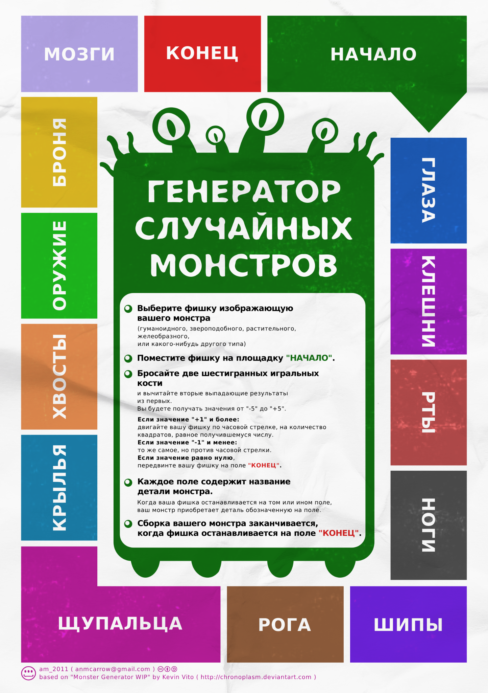

## Путевые происшествия

[\[БУДУТ ТУТ\]](https://docs.google.com/document/d/1z_8kGkiM23g83vxiKbbOfIRnhzh2iZVFbXm7fWnIAUk/edit?tab=t.0)
