# Проходные обыватели

## Проходные обыватели

В этом разделе мы решили привести 10d6 примеров статистов – обитателей городов и деревень Веа Туароа, с которыми ваши протагонисты могут перекинуться парой слов на пути к своим очень важным делам. Безо всякого сомнения, все эти воображаемые типы – не самые интересные личности. Но ведь так и задумано – в нашем опыте слишком интересные персонажи третьего плана размывают фокус повествования и потому не нужны.

### 10. Ийола Ауколи

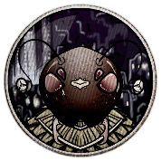

**Народ:** ва'ро.

**Достоинство:** чрезвычайная дотошность.

**Недостаток:** чрезмерная азартность.

**Детали:** наёмница, татуировки, резные украшения, лукавый взгляд.

**Секрет:** связная Сурга Луар, покупает данные у одного там атташе.

### 11. Коами Геккене

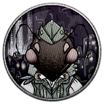

**Народ:** ва'ро.

**Достоинство:** полезные связи.

**Недостаток:** вопиющий сексизм.

**Детали:** керамистка и активистка НацПроба, пахнет глиной, заляпанный фартук.

**Секрет:** заколола кое-кого по пьяни, теперь он – статуя.

### 12. Макона Малуа

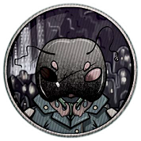

**Народ:** ва'ро.

**Достоинство:** впечатляющая эрудиция.

**Недостаток:** излишняя сентиментальность.

**Детали:** мастерица Кайханги, грустный взгляд и блёклый наряд.

**Секрет:** смертельно больна и доживает последние окты.

### 13. Энада Марика

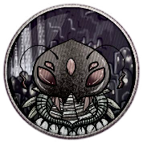

**Народ:** ва'ро.

**Достоинство:** идеальная память.

**Недостаток:** параноидальная конспирология.

**Детали:** маячная певчая, настороже и в тревоге, маленькие руки.

**Секрет:** крутит тайный роман с собственным руководством.

### 14. Некоа Керехана

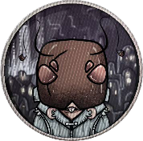

**Народ:** ва'ро.

**Достоинство:** молниеносная реакция.

**Недостаток:** самоубийственное любопытство.

**Детали:** бандитка, обольстительная улыбка, одежда с разрезами, откровенный наряд.

**Секрет:** имеет карту пиратского клада.

### 15. Упене Хуринай

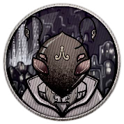

**Народ:** ва'ро.

**Достоинство:** устойчивая непреклонность.

**Недостаток:** болезненная злопамятность.

**Детали:** прядильщица, массивное тело, крупный браслет, высокий голос.

**Секрет:** носит как маску чужую личность.

### 16. Хайан Отере

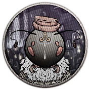

**Народ:** ва'ро.

**Достоинство:** чрезвычайная сексапильность.

**Недостаток:** предельная наивность.

**Детали:** попрошайка, ловкие руки, бесформенная хламида.

**Секрет:** сбежал из гарема, теперь в (не официальном) розыске.

### 17. Краппа Оурили

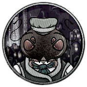

**Народ:** ва'ро.

**Достоинство:** впечатляющая эмпатия.

**Недостаток:** компульсивное скопидомство.

**Детали:** приказчица, жёсткий взгляд, мягкий голос, потрёпанность.

**Секрет:** подделывает и перепродаёт накладные.

### 18. Риихи Роронга

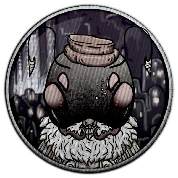

**Народ:** ва'ро.

**Достоинство:** выдающаяся проницательность.

**Недостаток:** закоснелый консерватизм.

**Детали:** ключница, много украшений и замочков, постоянно что-то напевает.

**Секрет:** оставляет себе копии ключей от чужих домов.

### 19. Тангира Помана

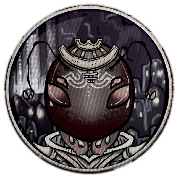

**Народ:** ва'ро.

**Достоинство:** непробиваемая невозмутимость.

**Недостаток:** шутливая жестокость.

**Детали:** страховщица, много курит, изящные пальцы, мешковатая одежда.

**Секрет:** работает сразу на две конторы и обоюдно сливает клиентские базы.

### 20. Хекевата Китака

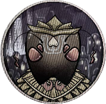

**Народ:** ва'ро.

**Достоинство:** чрезвычайная выносливость.

**Недостаток:** адреналиновая зависимость.

**Детали:** бандитка, дорогие часы, шикарные галстуки, сбитые кулаки.

**Секрет:** состоит в ячейке пролбольных (см. стр. XX) ультрас.

### 21. Ломоа Хийола

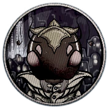

**Народ:** ва'ро.

**Достоинство:** безупречная организованность.

**Недостаток:** полная безответственность.

**Детали:** инженерка, запахи топлива, одежда с пятнами, сиплый голос.

**Секрет:** коллекция компромата.

### 22. Эбл Звэссн

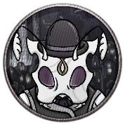

**Народ:** олъм.

**Достоинство:** творческое мышление.

**Недостаток:** отталкивающая самовлюблённость.

**Детали:** офицер в отставке, вычищенная одежда, снисходительный взгляд.

**Секрет:** никакой не герой, носит корсет и ортез после падения с лестницы.

### 23. Дллт Сэррк

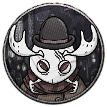

**Народ:** олъм.

**Достоинство:** примечательная дальновидность.

**Недостаток:** парализующая неуверенность.

**Детали:** фермерка, высокая и длинная, маленькие очки, грубый голос.

**Секрет:** бытовой каннибализм в качестве семейной традиции.

### 24. Рртисс Мэджвл

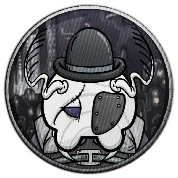

**Народ:** олъм.

**Достоинство:** чарующий голос.

**Недостаток:** отталкивающие манеры.

**Детали:** музыкантка, рваная одежда, следы побоев.

**Секрет:** затянувшийся инцест, оставивший её без наследства.

### 25. Умбрр Мэджвл

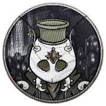

**Народ:** олъм.

**Достоинство:** безжалостная дипломатичность.

**Недостаток:** чрезвычайная завистливость.

**Детали:** безработный, чужой наряд, истощённый вид, скрипучий голос.

**Секрет:** затянувшийся инцест, оставивший его без наследства.

### 26. Льлл Кллмб

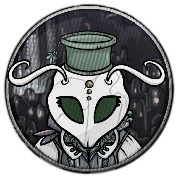

**Народ:** олъм.

**Достоинство:** фотографическая память.

**Недостаток:** зудящий сексоголизм.

**Детали:** инженер, дорогая одежда и безвкусные аксессуары, гетерохромия.

**Секрет:** составление и публикация низкопробных слэшфиков.

### 27. Йък Вэбнн

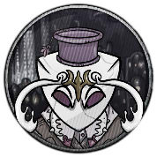

**Народ:** олъм.

**Достоинство:** сверхъестественная осведомлённость.

**Недостаток:** повышенная обидчивость.

**Детали:** секретарь, нудная речь, вонючий парфюм, аккуратная одежда.

**Секрет:** бойцовский клуб (и собственная мыловарня).

### 28. Эффн Пъррс

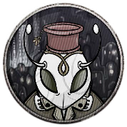

**Народ:** олъм.

**Достоинство:** обманчивая безобидность.

**Недостаток:** мучительная неопытность.

**Детали:** сыщик, низкий рост, дурацкая шляпа, аляповатый костюм.

**Секрет:** амбициозный глава маленького деструктивного культа.

### 29. Лундд Глъв

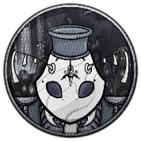

**Народ:** олъм.

**Достоинство:** торговая хватка.

**Недостаток:** компульсивное транжирство.

**Детали:** вершник, лоскутная одежда, постоянно сплёвывает.

**Секрет:** преступное отравление кое-кого морепродуктами.

### 30. Эрра Сълнн

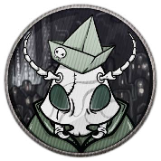

**Народ:** олъм.

**Достоинство:** развитое притворство.

**Недостаток:** страстное обжорство.

**Детали:** атташе, строгий голос, выглаженная форма, блестящие туфли.

**Секрет:** связная «Танцующих вееров», продавшая им немало секретов.

### 31. Пллъс Вннго

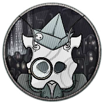

**Народ:** олъм.

**Достоинство:** беспримерное трудолюбие.

**Недостаток:** выдающееся невежество.

**Детали:** зазывала, весёлый голос, грустный взгляд, сумка с буклетами.

**Секрет:** тайный ребёнок, рождённый в нарушение всех общественных норм.

### 32. Йэлл Хъмннд

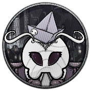

**Народ:** олъм.

**Достоинство:** эмоциональная чуткость.

**Недостаток:** излишняя поэтичность.

**Детали:** газетчица, постоянно рифмует (и битбоксит), смешная кепка.

**Секрет:** ворует питомцев с целью выкупа и перепродажи.

### 33. Път Нинбррн

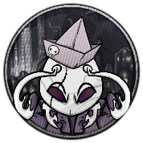

**Народ:** олъм.

**Достоинство:** впечатляющая реакция.

**Недостаток:** символическая выносливость.

**Детали:** как бы археолог, сонливый и пыльный, коллекция лопаточек.

**Секрет:** высокопрофессиональная подделка документов.

### 34. Пръгр Экк

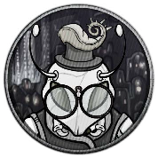

**Народ:** олъм.

**Достоинство:** выдающаяся харизма.

**Недостаток:** агрессивная ксенофобия.

**Детали:** капитан, помятость, горделивая походка, шепелявость.

**Секрет:** межрасовые кинки самого живописного свойства.

### 35. Крун Мэттн

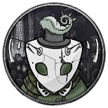

**Народ:** олъм.

**Достоинство:** инстинктивная скрытность.

**Недостаток:** отвратительное зрение.

**Детали:** искусствоведка, нахмуренность, связки книг, деловитый вид.

**Секрет:** несчастливый брак с не чутким профаном.

### 36. Джнн Мрът

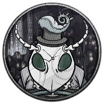

**Народ:** олъм.

**Достоинство:** безусловная решительность.

**Недостаток:** отталкивающая внешность.

**Детали:** субкультурная журналистка, траурный наряд и контрастный макияж, хитрый взгляд.

**Секрет:** официально мертва, так что не платит по кредитам.

### 37. Ррстн Скэббр

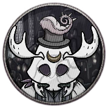

**Народ:** олъм.

**Достоинство:** безупречная логика.

**Недостаток:** ужасная бестактность.

**Детали:** плотник, бегающий взгляд, мощные руки, набитые карманы.

**Секрет:** компрометирующая переписка с одним там слесарем.

### 38. Мннлр Хълс

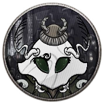

**Народ:** олъм.

**Достоинство:** действенный идеализм.

**Недостаток:** предельная наивность.

**Детали:** художник, богатый наряд, пятна краски, тяжёлые вздохи.

**Секрет:** множественный плагиат и творческий паразитизм.

### 39. Тррнтс Блэддн

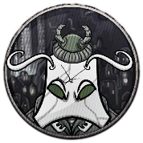

**Народ:** олъм.

**Достоинство:** выверенная ответственность.

**Недостаток:** развитая трусливость.

**Детали:** букмекерка, что-то записывает, фляжка с бренди, хриплый голос.

**Секрет:** сбежала из секты вместе с казной.

### 40. Лррс Мънчэр

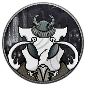

**Народ:** олъм.

**Достоинство:** безупречный вкус.

**Недостаток:** патологическая лживость.

**Детали:** повар на полставки, облегающие штаны, почёсывается, пахнет специями.

**Секрет:** длительная и плодотворная работа в эскорте.

### 41. Гвннллн Глъв

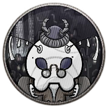

**Народ:** олъм.

**Достоинство:** редкостная убедительность.

**Недостаток:** эмоциональная сухость.

**Детали:** коллектор, стильная одежда, тяжёлый взгляд, крепкая трость.

**Секрет:** на самом деле никого не калечил.

### 42. Йън Флэнн

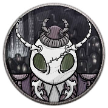

**Народ:** олъм.

**Достоинство:** отточенная внимательность.

**Недостаток:** припадочная обморочность.

**Детали:** клерк, отряхивается, оглядывается, чихает.

**Секрет:** «спящий» связной «Чёрного кабинета».

### 43. Афарья Дагбари

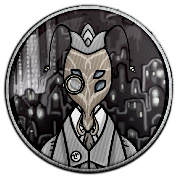

**Народ:** кансе.

**Достоинство:** совершенная неутомимость.

**Недостаток:** предельная непоследовательность.

**Детали:** шахтёр, куча заплаток, частый кашель, грязный платок.

**Секрет:** карманные кражи у своих же коллег.

### 44. Айрух Сийун

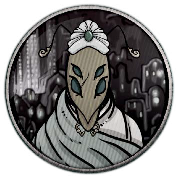

**Народ:** кансе.

**Достоинство:** чрезвычайная терпеливость.

**Недостаток:** раздражающая медлительность.

**Детали:** механик, экстремальный пирсинг, много шрамов, акцент.

**Секрет:** популярная фетиш-модель.

### 45. Нера Ранхут

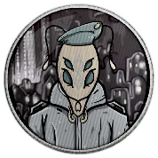

**Народ:** кансе.

**Достоинство:** наработанная неприметность.

**Недостаток:** феноменальная сварливость.

**Детали:** торговка открытками, блёклость, постоянно бубнит.

**Секрет:** распространение порнографии.

### 46. Мадсат Ракхими

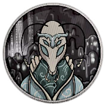

**Народ:** кансе.

**Достоинство:** весомая репутация.

**Недостаток:** абсолютная бесхребетность.

**Детали:** преподаватель, галантен, очень худой, тремор.

**Секрет:** стеснительно ищет себе «госпожу».

### 47. Сунара Ватани

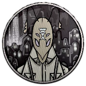

**Народ:** кансе.

**Достоинство:** чрезвычайная изобретательность.

**Недостаток:** неприятная травма (атрофия руки).

**Детали:** студентка, «починенные» очки, облегающая одежда, флирт.

**Секрет:** дурная кровь, наследие войны.

### 48. Кхасин Утья

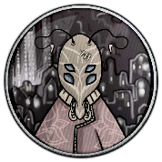

**Народ:** кансе.

**Достоинство:** впечатляющая внезапность.

**Недостаток:** совершенная ненадеёжность.

**Детали:** бандит и поэт, элегантный костюм, вызывающий взгляд.

**Секрет:** бойцовский клуб (и собственная мыловарня).

### 49. Йрана Вигарья

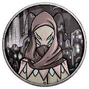

**Народ:** кансе.

**Достоинство:** поразительная быстрота.

**Недостаток:** чрезвычайная кровожадность.

**Детали:** бандитка и поэтесса, вычурное платье, цокколи, цепкий взгляд.

**Секрет:** подпольная торговля чужими детьми.

### 50. Ийка Пафри

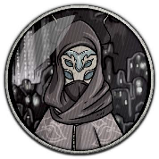

**Народ:** кансе.

**Достоинство:** сверхъестественная ловкость.

**Недостаток:** запущенная лудомания.

**Детали:** воровка-карманница, массивная фамильная серьга, бормочет и заговаривается.

**Секрет:** крупный долг перед опасными людьми.

### 51. Вейок Обра

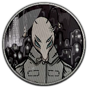

**Народ:** кансе.

**Достоинство:** инстинктивная скрытность.

**Недостаток:** удивительное легковерие.

**Детали:** хулиган, бузотёр и шпана, щербатое лицо, замызганный шарф и ручная могрица.

**Секрет:** секретный сотрудник городской стражи.

### 52. Стйок Гвнн

**Народ:** олъм.

**Достоинство:** галантные манеры.

**Недостаток:** патологическая жестокость.

**Детали:** офицер олъмского военного флота, напомаженные усы, изящные перчатки, щегольская трость и безупречная вежливость.

**Секрет:** нежно любимая сестра-пиратка.

### 53. Кррт Виннус

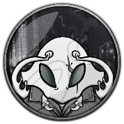

**Народ:** олъм.

**Достоинство:** подкупающая харизма.

**Недостаток:** неприятна травма (нет ног)

**Детали:** бывалый моряк и сказочник, татуировка на всё лицо и лёгкая забывчивость.

**Секрет:** проклятие бессмертия.

### 54. Гатрр Крркс

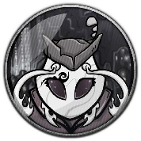

**Народ:** олъм.

**Достоинство:** успокаивающие прикосновения.

**Недостаток:** стойкая брезгливость.

**Детали:** профессиональный массажист, сладковатый парфюм, яркий платок в нагрудном кармане и напевная речь.

**Секрет:** в юности грабил банки.

### 55. Тоцка Вннкел

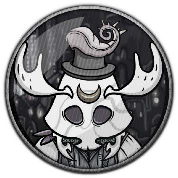

**Народ:** олъм.

**Достоинство:** отточенная манипулятивность.

**Недостаток:** невероятная болтливость.

**Детали:** частная журналистка, вызывающий макияж, шляпа с веткой коралла, постоянной что-то записывает.

**Секрет:** оккультистка и участница тайного общества.

### 56. Ррнкел Бдвинн

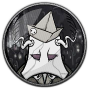

**Народ:** олъм.

**Достоинство:** быстрая обучаемость.

**Недостаток:** беспутная расточительность.

**Детали:** профессиональный музыкант, грязный плащ и мятая шляпа, постоянное настукивание ритмов.

**Секрет:** чудовищный поклонник.

### 57. Локста Дннсон\

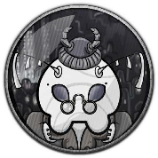

**Народ:** олъм.

**Достоинство:** выдающаяся эрудиция.

**Недостаток:** агрессивная самоуверенность.

**Детали:** натурфилософ, зоолог и гербалист, переполненные карманы, хрюкает, кряхтит, постоянно поправляет очки.

**Секрет:** поставщик и тестировщик ядов.

### 58. Вллтер Соммс

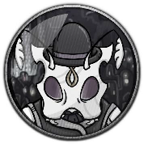

**Народ:** олъм.

**Достоинство:** обширные связи.

**Недостаток:** всепроникающая паранойя.

**Детали:** букинист, потрёпанный галстук, пыльная одежда и перхоть, суетливость и плохая осанка.

**Секрет:** торгует запрещёнными памфлетами и книгами.

### 59. Локквд Трнндрр

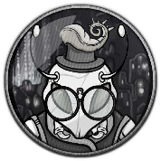

**Народ:** олъм.

**Достоинство:** безошибочная расчётливость.

**Недостаток:** фатальная нерешительность.

**Детали:** конторский служащий, многажды чиненные очки, чернильные пятна, монотонные интонации.

**Секрет:** почтовый шантажист, получающий информацию о чёрной бухгалтерии во время аудитов.

### 60. Вайара Хокто

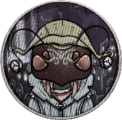

**Народ:** ва'ро.

**Достоинство:** развитая интуиция.

**Недостаток:** тотальная рассеянность.

**Детали:** профессиональный механик, кольца-шестерёнки в носу, разноцветные очки, пятна смазки и краски повсюду.

**Секрет:** подменяет при ремонте запчасти на менее качественные.
