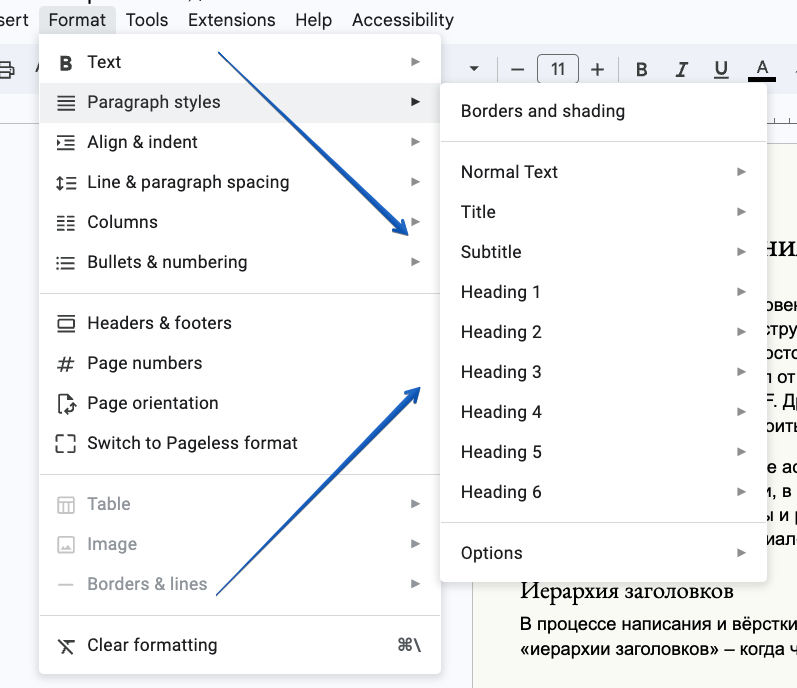
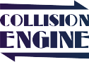
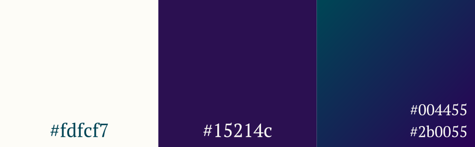
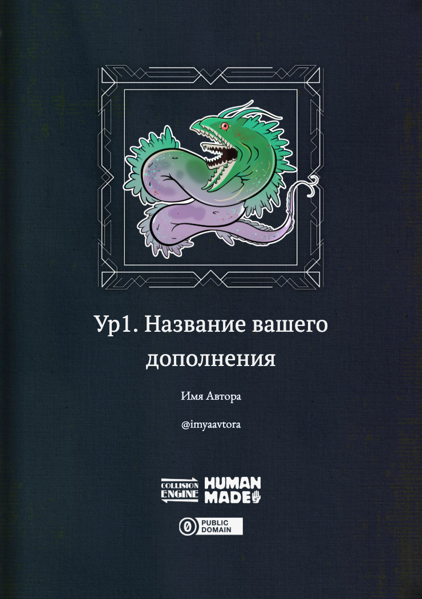
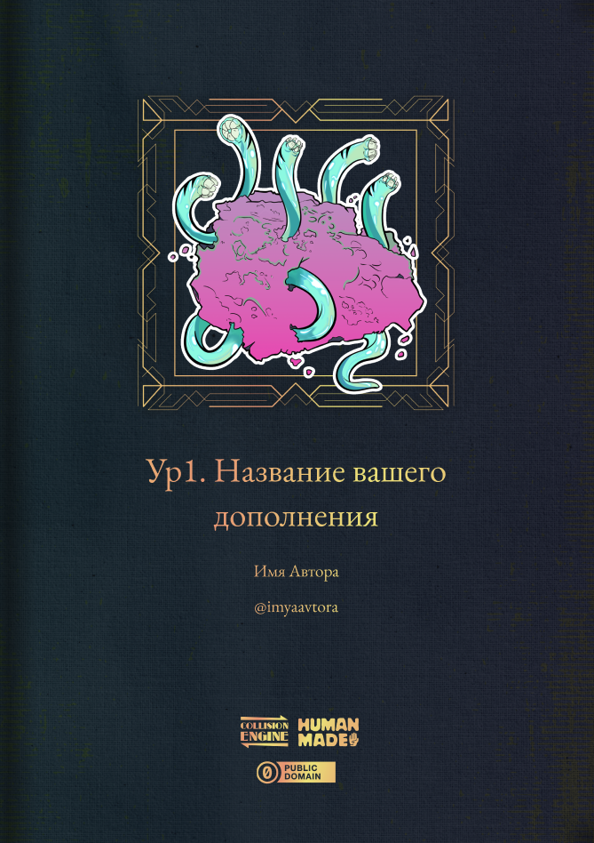
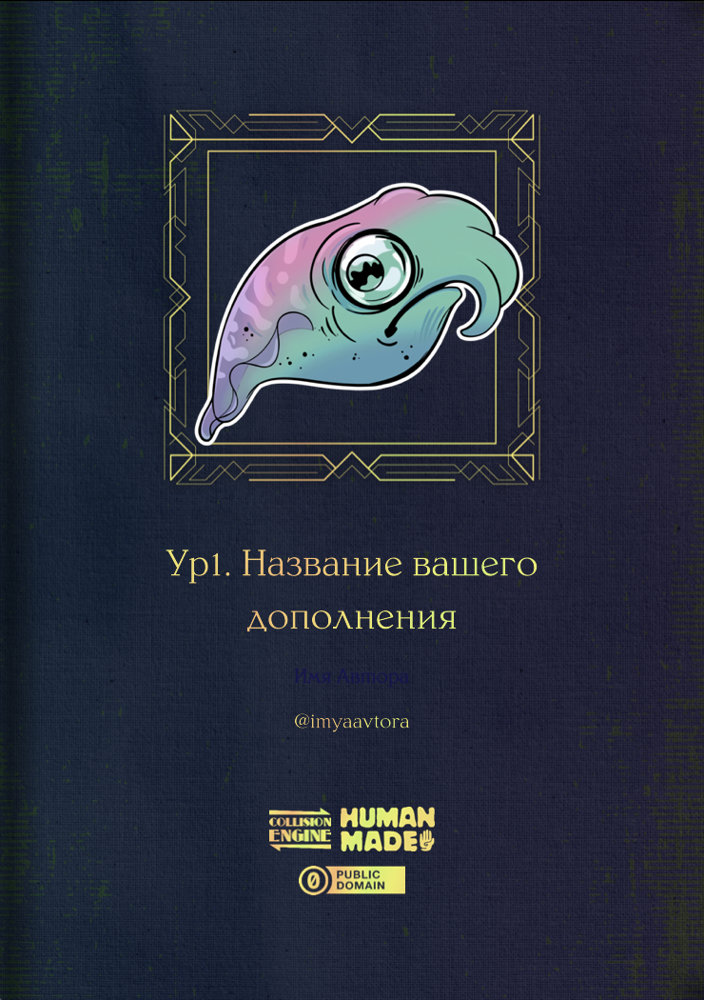

# О производных материалах

## Общие соображения

«Укрытое море, ч.1: Благословенный прилив» с самого начала писалось как открытая к изменениям, доработкам и дополнениям структура. Как раз этим обусловлена и максимально свободная лицензия на тексты – CC0, «Публичное достояние», без каких-либо условий и ограничений, – и слабая зависимость различных подсистем правил от условного «ядра», и отсутствие каких-либо мер по затруднению копирования контента из PDF. Другими словами, нам изначально хотелось чтобы вам было удобно, насколько это возможно, строить на базе этого продукта что-то своё.

Оставив в стороне различные аспекты геймдизайна, более или менее подробно раскрытые в основных трёх книгах (и, в особенности, в «Методическом Рекомендаторе»), здесь мы попробуем предоставить вам инструменты, материалы и рекомендации, облегчающие визуальное оформление производных и дополняющих УкМ:БП материалов. Будем надеятся, что вне зависимости от характера этих материалов и программного пакета в котором вы их будете готовить к публикации, приведённые далее сведения окажутся вам полезны.

### Иерархия заголовков

В процессе написания и вёрстки книги мы строго придерживались так концепции так называемой «иерархии заголовков» – когда часть строк текста выделяется одним из шести уровней специальным образом оформленного и содержащим особые, невидимые человеческим глазом, заголовочные метаданные стилем оформления. В силу чего, становится и логическим и визуальным разделителем для абзацев, частей, глав, подглавок, разделов и подразделов.

Стоит заметить, что оформленные таким образом – например, через специальное меню или горячие клавиши в Google Docs, заголовки буде куда предпочтительнее, логичнее, визуально разнообразней и в ваших произведениях. В силу чего, мы однозначно рекомендуем их использование.

Подробнее про оформление заголовков, на примере Google Docs вы можете прочитать в этой статье – https://dzen.ru/a/YZ43n2_Gkmc6hV-r Аналогичным образом, заголовки вы сможете использовать и в любом другом текстовом процессоре – MS Word, Apple Pages, Libre Office и т.п.

Ну а если вы собираетесь оформить ваш труд в каком-либо профессиональном пакете для вёрстки и подготовки к печати – Adobe Indesign, Affinity Publisher, Scribus и подобных – в поставляемой с ними документации вы легко найдёте аналогичные способы для работы с этим замечательным структурным инструментом. И, наконец, не забывайте главное правило – то, что согласно нормам Русского языка, точка в конце заголовка не ставится.

#### Игромеханические термины

Как известно, вопрос (не)выделения терминов игровой механики в тексте НРИ-книг это очень больное место и точка столкновения интересов различных культур. Мы, в ExN, считаем, что специальные термины – любые слова, которые несут какое-то особое, механическое значение, не совпадающие с таковым за пределами книги – выделять нужно. А также, что а) выделение **зажирнением** смотрится уродливо, б) выделение Капитализацией это вообще не русскоязычная норма и тоже эстетически сомнительно и, наконец в) выделения *курсивом –* согласно той самой русскоязычной норме – неплохо, но курсив лучше зарезервировать для других целей, например выдаления иносказаний или моментов эмоционального напряжения.

Что же мы, в таком случае, предлагаем? Экспериментировать – использовать цвет, отличающуюся шрифтовую гарнитуру, имитацию маркера и подобные визуальные приёмы, те или иные, в зависимости от конкретного места и оформления конкретного куска книги. Наиболее универсальным, при этом, выглядит использование отдельного шрифта. Или, в программах позволяющих это сделать – разнарядку, увеличение дистанции между буквами внутри слова, в сочетании с полупрозрачным цветным фоном.

## Эмблематика

Несколько символических картинок, как нам кажется, важных для этой игры – которые вы, возможно захотите включить и в ваш производный материал тоже.

### Collision Engine

Эмблема с официальным названием «игрового движка» вокруг которого построена подсистема разрешения конфликтов УкМ:БП. Согласно одному из наших коллег по хобби, она может вам для чего-нибудь пригодится.

- [Скачать её вы можете здесь](https://links.exnihilum.info/rkk1ojxj5)

### Public domain / CC0

Эмблема обозначающая лицензию, под которой распространяются все тексты этой книги – никаких гарантий, никаких обязательств, можете делать с ними что угодно, отныне и впредь они – публичное достояние. Вам необязательно использовать именно этот вид лицензирования. Но если вы захотите, то…

- [Скачать эту эмблему можно здесь](https://links.exnihilum.info/2fdck5vud)

### Human made

Эмблема авторства Hinkodo, выражающая позицию нашего издательства и проекта относительно использования генеративных компонентов в НРИ. Не являясь ярыми противниками, без всякой агитации, мы на текущий момент предпочитаем людей и их творчество, что и продемонстрировали таким вот незамысловатым способом. Возможно, подобный приём будет полезен и вам.

- Скачать эту эмблему, в различных вариациях вы со страницы авторов – [https://hinokodo.itch.io/human-made](https://hinokodo.itch.io/human-made)

- Скачать эмблему, выражающую альтернативный\
  подход и практики [вы можете отсюда](https://links.exnihilum.info/hlhn54p6a)

## Палитра

- Усреднённый тон фона страниц книги примерно соответствует WebRGB \#fdfcf7

- Цвет заголовков, основных блоков, рамок и т.п. – \#15214c

- Цвет выделений, спецтерминов, буллитов задан градиентом от \#004455 до \#2b0055

- Обложки также тяготеют к вариациям на тему \#004455 и \#2b0055, с добавлением тёплых «металлических» акцентов и геометрических ардеко-орнаментов с [Freepik.com](http://freepik.com)

## Клипарт

- Фоны страниц [вы можете скачать здесь](https://links.exnihilum.info/hlhn54p6a)

- Опциональные [рамки для оформления врезок – здесь](https://links.exnihilum.info/j8pl5nefd)

## Шрифтовая графика

- Логотип УкМ:БП выполнен нашей собственной гарнитурой Beltheder Ex Marina Deco, бесплатной для любого некоммерческого использования в любом дополнении к УкМ:БП;

- Заголовки внутри основного блока книги используют гарнитуру Beltheder Ex Marina, доступную на тех же ограниченно-некоммерческих условиях;

  - Обе эти гарнитуры, при необходимости могут быть заменены на любой другой, достаточно винтажно выглядящие Serif с Google Fonts.

- Основные блоки и параграфы выполнены гарнитурой Paratype PTSerif;

- Буллиты оформлены также нашей и доступной вам на условиях ограниченного некоммерческого применения гарнитурой AWKNG Glyphs 1.

Все перечисленные гарнитуры [вы можете скачать здесь](https://links.exnihilum.info/qk568n17h).

## Готовые шаблоны

Насколько нам известно, последнее о чём вам хочется думать в процессе оформления своей стремящейся на привольные просторы морей RPGbook, Itch, DTRPG, VK и йааррр-чатиков работы – это сборка дизайн-макета с нуля, да ещё и с учётом вышеперечисленного. Поэтому мы взяли на себя смелость составить и предложить вам готовые шаблонные макеты, содержащие все нужные элементы. Ну, насколько это возможно – тот же Google Docs не особенно хорош в вопросе добавления сторонних шрифтов или градиентов, Figma не умеет в автонумерацию страниц…

- [Онлайн-шаблон для Google Docs](https://links.exnihilum.info/coif6sx7w)

- [Онлайн-шаблон для Figma](https://links.exnihilum.info/0f8kjhnkl)

- [Оффлайн-шаблон для MS Word/Pages/LibreOffice](https://links.exnihilum.info/spe70ztms)\
  (заранее [установите шрифты](https://links.exnihilum.info/qk568n17h)!)

С этими шаблонами вы легко сможете оформить ваш контент в достойном и единообразном стиле, а затем экспортировать его в PDF и опубликовать на той или иной площадке.

## Поддержка и промо

Мы всегда будем рады оповестить подписчиков о новых материалах совместимых с «Укрытым морем», так что если вы нас оповестите о том или ином своём произведении – свяжитесь с нами через [официальный чат](https://t.me/+ktMBt75xiKwzY2Yy) или [email](mailto:mb@exnihilum.info). Если в процессе разработки у вас возникнут какие-либо вопросы о нюансах этого процесса, вы также можете задать их указанными способами и рассчитывать на наш честный ответ.

## Официальные дополнение

Наконец, если вы захотите ответственно выпустить какую-либо официальную, под эгидой и с участием нашего коллектива штуку – декорации для приключений, сборник объектов, контрактов, островов, контрагентов и тому подобное – пишите, обсудим.

TODO:

- Добавить видео про заполнение шаблона (как минимум, обложки) в реальном времени
